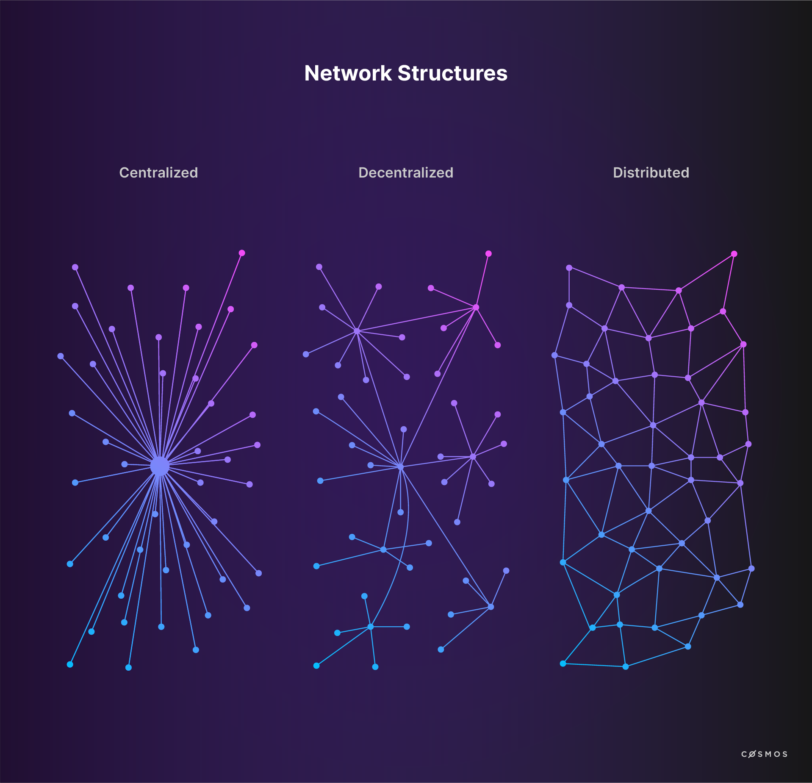
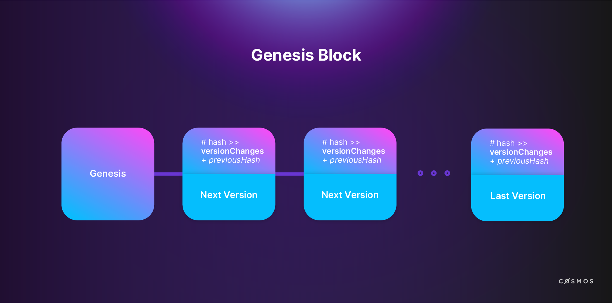
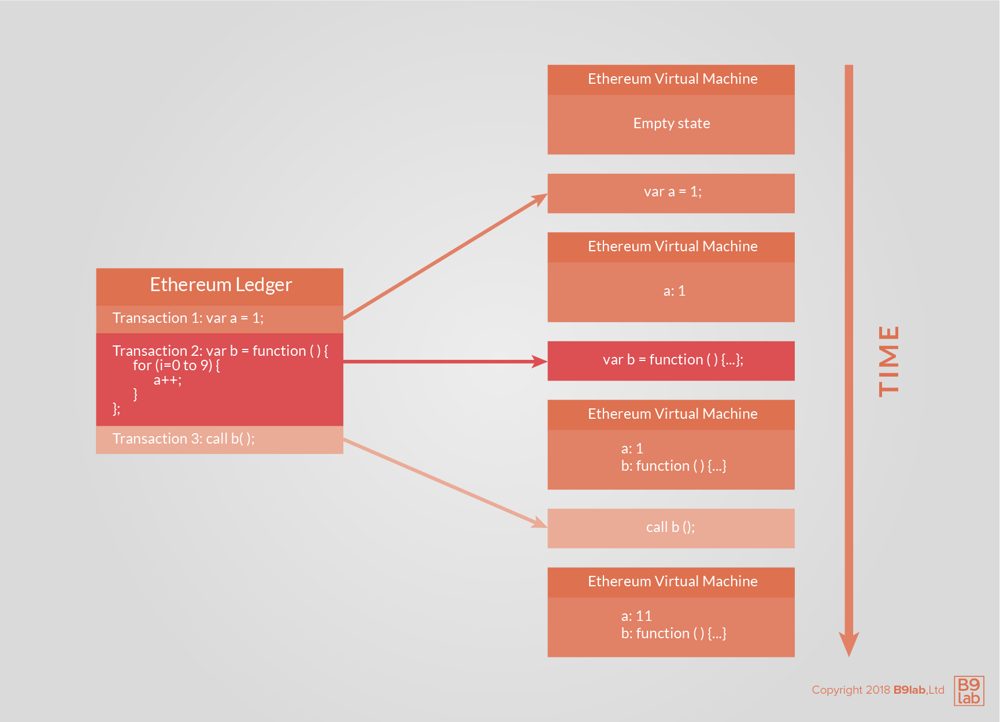
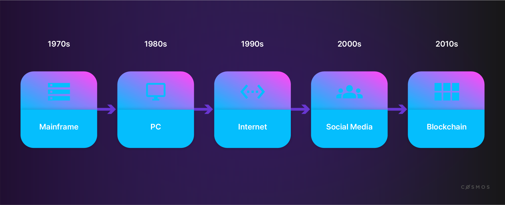

This first module demystifies the foundations of blockchain technology. This background information will be important as you progress through the course. 

The modules include learning materials for your studies, as well as examples and exercises for you to practice. You will also find freely accessible resources from other sites to help you dive deeper into the subject matter at hand.

To understand Cosmos, we must first understand blockchain technology.

Let's start.

## What is a blockchain? And, what does it solve?

Blockchain technology is rapidly evolving and may be difficult for newcomers to understand. It took many bright minds many years of development, plus a combination of advances in cryptography, distributed computing, and economics to create this nascent technology. Grasping blockchain technology requires both time and effort.

Blockchain is a solution to a particular problem ... the **double-spending problem**.

<--TODO: Version of this image with "Alice does not have enough funds. Executing both transactions would lead to double-spending of the same funds. -->


We're all familiar with digital artifacts (a file) and the ease with which they can be copied. This presents obvious problems if we want digital artifacts to represent assets with value. But a more pressing issue is the possibility of spending a digital token more than once, also known as double-spending. What prevents someone from making copies and spending the same money twice?

The double-spending problem refers to the challenge of designing a digital cash system that is at once a digital artifact but can't be spent more than once.

Satoshi Nakamoto (whose identity remains shrouded in mystery) published his seminal white paper in October 2008. His paper presented a solution to the "double-spending" problem for digital currencies. In doing so, he revealed the underlying technology known as blockchain and an example of blockchain's possible application in the form of a simple blockchain implementation called "Bitcoin".

<HighlightBox type="reading">

  [Satoshi Nakamoto: Bitcoin: A Peer-to-Peer Electronic Cash System](https://bitcoin.org/bitcoin.pdf) - It is a fairly straightforward paper. Having a look at it is recommended.

</HighlightBox>

Bitcoin has gained widespread attention since then. The underlying technology, blockchain, has also gained recognition and has found applications in diverse contexts. Indeed, the world has discovered blockchain's usefulness in many environments and a great variety of possible implementations and applications. Cosmos is one such implementation.

### Securing Peer-to-Peer networks ###

Security is challenging in P2P networking for two reasons:

* P2P software has to be downloaded in order to join a network, making it especially vulnerable to remote exploits;
* Because of interconnectivity, malicious participants can send incorrect requests or responses, as well as malware and corrupted data, that may propagate throughout the network. Other security risks include denial of service (DDoS) attacks, routing attacks, and routing network partitions. 

A "secure" P2P needs to repell malicious and erroneous input. 

### P2P networking & distributed networks

Networks can be decentralized, distributed, centralized, or decentalized *and* distributed. 



A blockchain is a distributed ledger that records all transactions on the network. Nodes in such a distributed ledger need a copy of said ledger. The network and ledger needs to run continuously while nodes join and leave unpredictably. Nodes that join the network must be able sync up with the latest ledger state. The ledger state must be secure, with strong defenses to prevent malicious nodes from inserting invalid information. 

Therefore, a blockchain is a highly-available network that ensures that a stateful protocol always operates as designed and never permits a departure from well-defined rules. 

### How does blockchain prevent double-spending?

In the current financial system, double-spending is avoided via the involvement of the legacy financial sector, i.e. centralized third parties that manage and control financial transactions. A third party such as a bank, credit card company, or payment service is used as a trusted ledger keeper. They all keep digital ledgers and they don't allow funds to be spent twice.

Consequently, it is generally not possible for two parties to exchange value online without involving a trusted third party to handle the settlement process and update their ledgers, as well as account balances.

At a high level, Bitcoin solves the double-spending problem by replacing the trusted central ledger-keepers with a decentralized and distributed network of ledger-keepers. Each member of the network has an exact replica of the ledger. In addition, no one can update the ledger without a establishing consensus with the other ledger-keepers. 


It is as though each transaction is observed by a *large crowd of witnesses* who reach consensus about proposed changes. The crowd prohibits events that should not occur, such as spending the same funds twice (i.e. double-spending).

Bitcoin and its underlying technology convincingly demonstrate that a network of participants that don't necessarily trust each other can achieve consensus about the validity of a transaction, its history, and the resulting state of the ledger. This is interesting because simple ledgers of account balances and simple protocols for moving funds are far from the only use cases for distributed consensus.

### How does it work?

Imagine one wants to *retain and monitor changes* to a file, for example, a logfile. Now, imagine one also wants to verify an unbroken history of all changes ever made to the file. How can one proceed?

A well-understood solution uses **cryptographic** [**hash functions**](https://en.wikipedia.org/wiki/Cryptographic_hash_function).

Let us briefly introduce the concept of cryptographic hash functions in case you are unfamiliar with them.

The ideal cryptographic hash function has **five main properties**:

* **Deterministic**: the same message always results in the same hash;
* **Fast**: the hash value for any given message is computed quickly;
* **Resistant**: it is not feasible to generate a message from its hash value except by trying all possible messages;
* **Uncorrelated**: a small change to a message changes the hash value so extensively that the new hash value appears uncorrelated with the old value;
* **Collision-Resistant**: it is infeasible to find two different messages with the same hash value.

<HighlightBox type="tip">

  You can see hashing in action to get the feel for it here: [http://onlinemd5.com/"](http://onlinemd5.com/). As you type into the text box, the hash updates automatically. Even a minuscule change to the input creates a completely different hash. Try it out!

</HighlightBox>

Notice that there are many different hashing algorithms that aim for similar results and fulfill the properties described above. Each algorithm consistently produces hashes of the same size regardless of the input's size. 

A hash can be used to prove an input exactly matches the original, but the original cannot be reconstructed from a hash. So, a hash function can demonstrate that a copy of the file is an authentic replica of the original in every detail.

But what about subsequent changes to the file? Suppose we want to demonstrate that a series of changes is authentic, complete and correctly ordered?

Accountants have known the advantages of "append-only" ledgers for centuries, so let us suppose that we will only append new entries, i.e. changes, to the end of the file. We will start with an empty file and then append a series of changes that when replayed in order will produce the current state of the file. Git users will be familiar with this concept. How can a hash function help us be certain that a series of entries is the unbroken chain of inputs?

We can make a rule that states that in addition to the new content, the previous hash will also be an input of the next hash.

The (pseudo-)code would look like this:

```javascript
version2Hash = hash({
  changes: version2Changes,
  previousVersion: version1Hash
})
```

This way, one can examine *candidate* changes, confirm that the proposed changes belong to then known, authentic, previous version of the file. This method ensures that changes to the file are accurately disclosed. 

This process repeats for all subsequent versions. Any version of the file contents can be shown to be part of an **unbroken chain of changes** all the way back to the file's inception. This is pure mathematics.

Any departure from the system, e.g. a hash does not compute as expected, proves a break in the history and is therefore invalid. 



Interestingly, since knowledge of the current hash of the latest valid version is an input to the next version's hash function, it is not possible to generate a new valid version without knowledge of the valid version that precedes it. This process forces changes to be **appended** to a previous valid version.

Blockchains function similarly. Blocks of transactions are appended using hashes of previous blocks as inputs into hashes of subsequent blocks. Any participant can quickly verify an unbroken chain of blocks, i.e. the correct order.

**Transaction blocks** are logical units that wrap up a set of transactions in a specific order. While the implementation details are somewhat more subtle, for now, let's think of this as a set of transactions that occurred during a time interval and in a specific order.

**Transaction ordering** is surprisingly challenging in a distributed system due to design goals and constraints.

We will use the example of Bitcoin and its novel solution to understand how this can be addressed.

There are some important constraints to keep in mind when talking about transaction ordering in distributed networks like Bitcoin:

* As it is a distributed network, **everyone** has a little bit of **authority**. For example, all nodes can propose transactions and then announce that information to other nodes. Theoretically, anyone can listen to transaction proposals and organise a valid block containing an *opinion* about the correct order of events.
* In a truly distributed network, no one's clock is considered more authoritative than anyone else's clock. Therefore, **a blockchain is a distributed timestamp server without a central network time**.
* Because of **physics and network latency**, even if we assume that all members of a network mean well and participate honestly, everyone in the network will learn about transaction proposals in a slightly different order and each node will arrive at a slightly different opinion about the ordering of transactions. This is simply a result of network latency.

So, how is the correct **order of transactions** determined?

Although there is no obvious way to settle it, **transaction order must be resolved** because processing transactions out of order would produce non-trivial differences in outcomes. Such a non-trivial difference would be for example an instance of double-spending. Without agreement about the transaction order, there can be no agreement about the balance of accounts.

Bitcoin uses a process, i.e. **consensus algorithm**, called **proof-of-work** (PoW) which can be (simplistically) thought of as a lottery. In this process, the lucky winner gets the privilege of being authoritative for one block of transactions. The winning lottery ticket, called the **nonce**, is used as an input for a hash function, the result of which needs to have the properties of a **winning** lottery ticket, or nonce. This is arbitrarily difficult to achieve - more on this later. "Winning" can be easily verified by other participants. The verified lottery winner's opinion about the order of transactions within the block becomes the network's de facto official result, provided that all proposed transactions are valid, including the necessary signatures from the transaction originators. 

In case the foregoing isn't clear:

* a valid block is a well-ordered **set of transactions**, 
* the block contains the **hash** of the previous block, and
* the block includes a "winning lottery ticket", the **nonce**.
* The hash of the block is special. It has properties that are especially difficult to generate. In Bitcoin, the block hash must start with certain number of zeroes. The only way to achieve that is to find a number, the nonce, that can be inserted into the hash function's input so the hash created meets the criteria. There is no more efficient method of finding a suitable nonce than a brute force search of random numbers. 

Other participants recognise this unlikely combination - unlikely because of the winning lottery ticket, the nonce. This unlikely combination is evidence of considerable computational work because brute force is the only known method of finding it.

The network accepts the block as a de facto correct opinion about the order of transactions. There are, of course, further details such as the method of dispute resolution. This overview will suffice for now.

The process disambiguates the order of the transactions even though well-meaning nodes independently arrive at slightly different opinions about the matter. The process does so **without reliance on an authoritative time source**.

**A well-ordered set of blocks that each contain well-ordered transactions is a well-ordered set of all transactions that have ever occurred.**

Cryptographic hash functions are instrumental in that they empower all participants to ensure that they possess an undistorted history of everything. Since all nodes can verify the chain independently, they can proceed on the assumption that all other nodes will eventually come into agreement about the history of everything. This is known as **eventual consensus**.

What are the implications of blockchain's way of ordering transactions and blocks on its overall state?

A blockchain starts with a known state. This is a simple matter of an initialized universe in which nothing has happened. It is often referred to as the genesis block.

It proceeds by constructing a verifiable and widely agreed history of everything that has ever happened on an append-only basis. Nodes independently construct a present state of the universe by reviewing the ordered history of every change (i.e. the transactions) that has ever occurred. The history of everything that has ever occurred moves forward in time as "lottery winners" announce new transaction blocks and these are accepted as valid by a consensus of network participants.

Thus, transactions being included in blocks and those becoming part of the chain leads to the state changing and being amended.

## Deterministic, Atomic Operations - All or Nothing

In computer science, an event is said to be "Atomic" if it can't be split into smaller parts. For example, the statement ```x = y``` is atomic if the language guarantees that ```y``` cannot be partially copied to ```x```. 

In the world of databases atomicity is often specified by the developer by grouping multiple operations in a wrapper such as a COMMIT and ROLLBACK block to ensure that all of the steps complete or none of the steps execute at all. This method is often used to ensure database integrity. 

In the context of a blockchain, a "transaction" is a single instruction that is allowed by the protocol, signed as required by the protocol and sent to the blockchain through a local node that is connected to the network. Transactions are either completely successful or they fail completely. Generally, the actual result cannot be known with certainty until the transaction is included in a block to establish execution order compared to other transactions. For example, a transaction to send funds from Alice to Bob depends on Alice's balance at execution time. 

All nodes must arrive at the same conclusion. Given a transaction in a certain sequence, all nodes must agree on the result which means the protocols must be deterministic. Either the transaction was successful, or failed, and the effect must be indisputable. 

Therefore, blockchain transactions are both deterministic and atomic. 


## Blockchain as a new computing paradigm

Imagine a computer. How do you describe its process?

It takes commands, and then executes them in an ordered and deterministic fashion. The sequence of execution determines the state the computer is in.

Now apply this thought to blockchain technology.

Ethereum was the first blockchain to implement [Turing-complete](https://csrc.nist.gov/glossary/term/turing_complete) smart contracts. Each transaction is, in effect, a command, and the "execution" of those commands results in a new state, the Ethereum computer's state. An Ethereum blockchain defines a distributed state machine, with a state all nodes agree on.

With this introduction, a smart contract is a program on the world computer, as Ethereum has been called. A distributed application (or DApp) is one too. As is a coordinated collection of smart contracts.



Major computing paradigms in the past have been:

* the **mainframe** in the 1970s,
* the **personal computer** in the 1980s,
* the **internet** in the 1990s, and
* **mobile and social networking**, often referred to as "social media", in the 2000s.



It is argued that the development of blockchain technology is initiating a new computational paradigm.

In some opinions, mobile and social networking and the internet have been exploited in regard to their commercial use. For some, the ideal of an interconnected community, in which information and knowledge is available and shared and where egalitarian values like equality, transparency, and freedom are encouraged, has led to disappointment over what could have been but never was.

Blockchain technology is often seen as presenting the possibility of more private, fair, transparent, and equal forms of interaction and community.

<YoutubePlayer videoId="Za5lPKNV_Mk"/>

<HighlightBox type="reading">

    * Double-spending: [https://en.wikipedia.org/wiki/Double-spending](https://en.wikipedia.org/wiki/Double-spending)
    * Satoshi Nakamoto: Bitcoin: A Peer-to-Peer Electronic Cash System: [https://bitcoin.org/bitcoin.pdf](https://bitcoin.org/bitcoin.pdf)

</HighlightBox>
