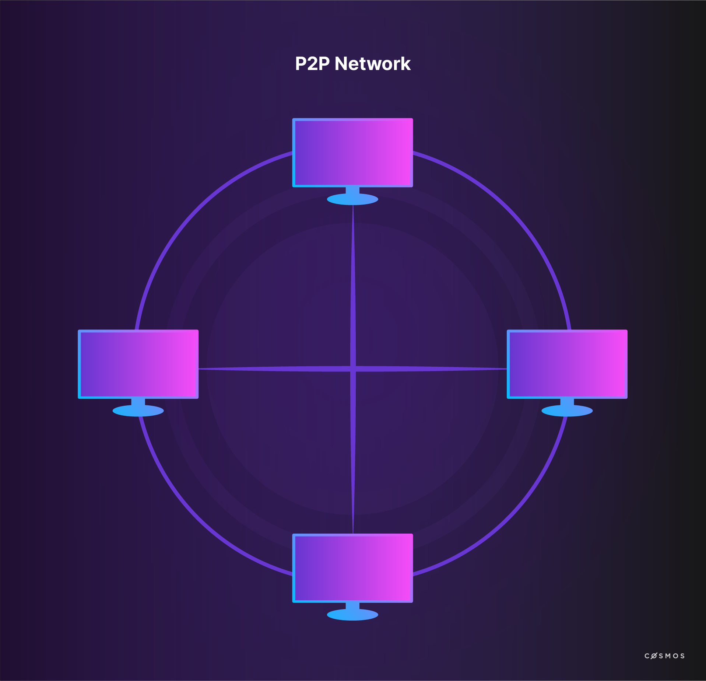

# A Brief History of Blockchain

In order to understand whether blockchain technology is a good fit for your project it is important to understand where it comes from and who is driving it.

Important groundwork was laid in the 1980's and 1990's for what will later be known as blockchain technology. Although the technology itself was not created until 2008, researchers from different fields in computer science and cryptography proposed solutions to many problems regarding security, transparency, and trust. All of them contributed in the development of the first large scale, successful public blockchain network, Bitcoin.

<!-- TODO: Revise Timeline with Tendermint, 2014 --->

The Tendermint Consensus solution was announced in 2014.

## 1990s

In 1991, two research scientists, Stuart Haber and W. Scott Stornetta, identified a problem: How can it be ensured that digital documents are authentic and changes to them are tracked in an immutable time-stamped manner? In *How to time-stamp a digital document*, they worked on the concept of append-only, cryptographically secured logs. With their work, the foundations of what much later becomes blockchain technology were laid.

Haber and Stornetta’s work was later followed and elaborated on by Ross J. Anderson in 1996 when he described the creation of [*The Eternity Service*](https://www.cl.cam.ac.uk/~rja14/Papers/eternity.pdf), a storage medium resistant to DoS attacks using redundancy and scattering techniques, as well as anonymity mechanisms.

In 1998 [Bruce Schneier](https://www.schneier.com/crypto-gram/) and [John Kelsey](https://www.nist.gov/people/john-m-kelsey) proposed a computationally cheap way to safeguard sensitive information and allow for computer forensics with secure audit logs by using hashing, authentication keys, and encryption keys (See: [Schneier, B. & Kelsey, J. (1998): *Secure Audit Logs to Support Computer Forensics*](https://www.schneier.com/academic/paperfiles/paper-auditlogs.pdf)).

Another significant work arose in 1994, when computer scientist Nick Szabo first described the concept of [smart contracts](http://www.fon.hum.uva.nl/rob/Courses/InformationInSpeech/CDROM/Literature/LOTwinterschool2006/szabo.best.vwh.net/smart.contracts.html). It is important to recognize that Szabo's intent was to minimize the need for trusted intermediaries. In 1998 he proposed BitGold, a conceptual predecessor to Bitcoin as he argued for a decentralised digital currency. In both, PoW is used as a consensus algorithm to solve cryptographic puzzles in a P2P network with Byzantine Fault Tolerance. The solutions are also linked together by a "hash chain" (See: [Moskoy, Phillip (2018): *What Is Bit Gold? The Brainchild of Blockchain Pioneer Nick Szabo*](https://coincentral.com/what-is-bit-gold-the-brainchild-of-blockchain-pioneer-nick-szabo/)). Although BitGold was never implemented, many perceive it as being the direct ancestor to BitCoin.

As we can see, these intellectual predecessors identified elements that are essential to blockchain technology.

## 2000s

On October 31, 2008, Satoshi Nakamoto called for a peer-to-peer system for a digital currency in the Bitcoin white paper that would allow online payments to be sent directly from one party to another without going through a financial institution or requiring any other third party involvement. This sounds familiar for a reason: Nick Szabo had already mentioned a currency that would depend minimally on third parties, BitGold. However, Satoshi’s paper differed significantly - not only because of the name difference between BitGold and Bitcoin. The Bitcoin white paper also proposed a data structure for the Bitcoin blockchain and laid out the decentralised consensus mechanism. It became the first large scale, successful public blockchain network.

<!-- check if you prefer expandable box format for this information -->

  

    The disruptive origins of blockchain
  

  

  
To this day, we do not know who is behind the white paper or the first implementation of the client. Satoshi Nakamoto is the pseudonym used by the person or group that published the white paper. As you might have seen in the news, the identity of Nakomoto has sparked plenty of conspiracy theories as several individuals have claimed to be the creator of Bitcoin. But to this date, none of the claims have been verified.

  
What is certain is that the community initially working on the network and the client can be characterised as generally pro-capitalist, anti-regulation and monopoly, as well as pro-free-trade. Many of those developing and driving the technology have also heralded its potential to reduce corruption and perceived human failures by pushing processes out of human reach.

  
All this may not seem important but it is. Blockchain technology was built with disruption in mind. It was envisaged as the antithesis of the central control of banks, governments, and incumbent holders of monopolies. This has an influence on the direction of the technology and remains a strong influence on its development.

  
Given its anti-establishment roots, blockchain technology has been seized upon by other groups interested in circumventing government, law enforcement, or regulatory control, both on the radical right and left fringes, as well as among activists persecuted by their governments.

  

## 2010s

As soon as it became clear that the technology presents a very attractive base infrastructure for payments, other groups and organisations adapted the technology for their purposes or developed new approaches using the same basic principles but adapting them to more traditional use cases.

In 2014 Vitalik Buterin started what is now known as the second wave of blockchain technology by publishing the paper underlying the Ethereum blockchain protocol, [A Next Generation Smart Contract & Decentralised Application Platform (Vitalik Buterin, Ethereum’s creator)](https://github.com/ethereum/wiki/wiki/White-Paper). Beyond a distributed ledger, the Ethereum white paper proposed the development of a distributed computation platform.

  
Have a closer look at the <a href="https://github.com/ethereum/wiki/wiki/White-Paper">Ethereum white paper</a>.

The Ethereum project raised roughly $20 million in one of the most successful crowdfunding campaigns up to that point. The first public network was up and running in 2015. In the same time, it spawned the first managed blockchain network approach when the company Eris forked a version of Ethereum and expanded it to implement a layer of permissions, as well as making it easier to deploy custom, access controlled networks.

Late 2015 saw the establishment of the [Hyperledger Foundation](https://www.hyperledger.org/), an industry consortium with a focus on enterprise blockchain technology for managed networks and business applications.

In 2017 the [Ethereum Enterprise Alliance](https://entethalliance.org/) was formed as an industry consortium to adapt Ethereum for enterprise use.

This brief background introduces the vibrant community and fast-paced evolution of the space from which Cosmos would emerge. 

Today we can see two broader trends in the development and adoption of blockchain technology: public blockchains and managed/private blockchains. Understanding this distinction will be important to your understanding of Cosmos.

Let us start by diving into public blockchains and their most known examples, Bitcoin and Ethereum.

## Public Blockchains

The most obvious way of operating blockchain protocols comes in the form of a public network. This is what blockchain technology was originally invented for and remains arguably its most powerful use.

A proof-of-work based public blockchain network, such as Bitcoin or Ethereum, has a few specific attributes:

* **Accessibility**: All you need to connect to Bitcoin or Ethereum is the client software and an internet connection. No AML, KYC, identity checks, or subscription payment is required;
* **No hierarchy**: All nodes are equal, meaning no individual node has more authority over another. All miners are also equal;
* **Crypto-economic incentives**: The lack of a central authority means there is no absolute defence against malicious behaviour. Instead, the network usually incentivises benevolent behaviour and dis-incentivises behaviour that endangers the network functioning to de facto implement prohibitive expenses to attack the network and others, and thus ensure security and proper functioning;
* **Full decentralisation**: Most public networks are completely decentralised because they are non-hierarchical and fully accessible. The playing field for market participants is therefore relatively level, so traditional business models may not work as well.

The two most popular examples of functioning public networks are Bitcoin and Ethereum.

### Introduction to Bitcoin

Since 2009 the most successful and popular decentralised public blockchain network has been Bitcoin. 
Nowadays, Bitcoin is the cryptocurrency with the highest market capitalisation.

  
For an estimate of the Bitcoin network size take a look at <a href="https://bitnodes.earn.com/"><i>Bitnodes</i></a>.

  
Also if you are more of a visual and statistics person, we could recommend these <a href="https://www.blockchain.com/en/charts">Bitcoin charts</a>.

Bitcoin was first introduced with the publication of the original paper [*Bitcoin: A peer-to-peer electronic cash system*](https://bitcoin.org/bitcoin.pdf) (2008) by Satoshi Nakamoto. In this paper, Nakamoto describes Bitcoin as a **peer-to-peer (P2P)** version of electronic cash.

He suggested that **proof-of-work (PoW)** can be used to find the truth in a partially synchronous system without involving trusted parties. Using this method, the set of participants controlling the majority of the computing power determine the truth.

Let us look at this in more detail. Nakamoto does not use the term blockchain in his paper, but he describes the concept by explaining transactions in Bitcoin. The transaction process requires the signing of the transaction with the hash of the previous transaction and the public key of the receiver. This is called the chain of ownership. Transactions can contain several inputs and outputs.

**Figure 1**: Each block includes the previous hash and a nonce (a random set of `1`s and `0`s). The protocol calls for a hash beginning with a specific number of binary `0`s, when hashing the block. An attacker trying to change a transaction in a block must then mine this and the following blocks. Reproduced from Bitcoin paper.

To prevent double-spending, Bitcoin uses a timestamp server. The miner is looking for a nonce, which results in a block hash beginning with the right number of binary `0`s (See **Figure 1**). It is difficult to find a nonce that fulfils this condition and it is easy to verify that it does. It becomes exponentially more difficult to alter history as more blocks are appended.

In order to promote an alternative version of history, an attacker must find a nonce for the block to change, and for every subsequent block thereafter because the network recognises that the longest valid chain contains the proof of the most work. The longest chain is deemed the truth. In summary, to rewrite history and attacker must alter a block and every block thereafter in order to generate the longest chain. This pits the attacker against the combined brute force of the rest of the network. 

There is a residual possibility that a slower attacker can catch up, since discovering a nonce works by brute force. This probability decreases exponentially with the number of blocks, a.k.a. confirmations.

This process of creating a valid block is called mining in PoW networks. The protocol includes a reward for mining, which is the first special transaction in the block. It can be expected that the majority of the nodes will use their CPU power honestly because it is the most financially feasible course of action. Signed transactions are announced publicly, so the public keys of the parties are not private.

### Introduction to Ethereum

Ethereum is a public, blockchain-based distributed computing platform and operating system with smart contract features. Ethereum emerged from a range of proposals rejected by the Bitcoin community.

Ethereum has a much faster block time, i.e. the time it takes to generate a new block, than Bitcoin (currently around 15s, made practical thanks to its implementation of the GHOST protocol [[1]](http://www.cs.huji.ac.il/~yoni_sompo/pubs/15/inclusive_full.pdf). Ethereum implements a variation of Bitcoin's proof-of-work consensus algorithm called Ethash, which is intended to be ASIC-resistant and GPU friendly[[2]](https://github.com/ethereum/wiki/wiki/Ethash-Design-Rationale). Core developers of the Ethereum project are planning to switch to the proof-of-stake consensus algorithm in the future.

Let us now have a look at the Ethereum protocol to understand how Ethereum is different from Bitcoin.

Our reference to analyse the Ethereum protocol is the [*Yellow Paper*](http://gavwood.com/paper.pdf) by Gavin Wood.

The most important difference, compared to Bitcoin, is the implementation of distributed code execution through the **Ethereum Virtual Machine (EVM)**. The Ethereum network is a virtual state machine, the EVM. The EVM enables the deployment of so-called **smart contracts** as part of the data of a transaction.

The code execution platform is [Turing-complete](https://en.wikipedia.org/wiki/Turing_completeness). The implementation of such a state machine with blockchain is revolutionary in itself. As part of Turing-completeness, frameworks must overcome the [halting problem](https://www.scientificamerican.com/article/why-is-turings-halting-pr/) which is especially difficult in distributed, hierarchy-free computing platforms. In simple terms, the halting problem is about what to do if a program loops forever, particularly on a distributed computer with no reset button. 

Ethereum’s solution is to introduce **Gas** as a fee for each computational step. Every block has a maximum Gas limit which limits the number of computational steps that can be executed per block. The user is free to specify any **GasPrice**. Ethereum requires this value to convert **Ether to Gas**, which is only existent during the execution of a transaction. The protocol defines the **Gas cost** for each operation in the EVM. The halting problem is resolved by attaching financial costs to every step in a program and by limiting the funds available. Transactions that don't compute successfully and on budget are rejected.

In Ethereum, **smart contracts** are stored on every single node; smart contracts are public. A smart contract in the EVM is practically an autonomous agent with an internal account. The most popular language for writing such a contract is **Solidity**.

**Figure 2**: A well-understood challenge related to reduced block time stems from network latency. Since nodes do not know about discovered blocks at the same time, at any given time a portion of the miners will be working on already solved, i.e. old, blocks. If these miners find a solution, they might not be rewarded. The rate at which such transient "forks" occur increases predictably with shorter block times. While Bitcoin addresses this efficiency issue with a relatively long block time (ten minutes), Ethereum addresses this concern with a partial reward strategy. Valid blocks that aren't ultimately included in the canonical chain (another chain is longer) are still included on the side and known as "uncles". Miners of uncles receive a smaller reward than regular block miners. 

The precise mechanism employed by Ethereum is called GHOST. GHOST includes so-called uncles that are propagated into the network, too late to rise to the level of network consensus (see Figure 2). This increases the total difficulty of the chain, makes smaller block times (about 14-18 seconds) possible and rewards miners of uncles for contributing to the overall strength of the network. 

<!-- Video "The Blockchain Computer" https://www.youtube.com/watch?v=Za5lPKNV_Mk -->
