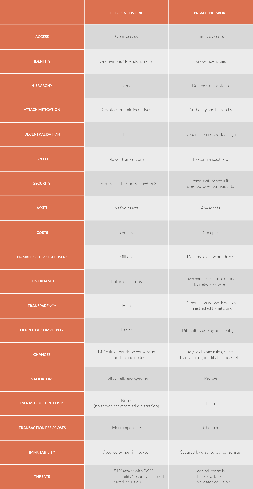

# Introduction to Managed Networks

Managed networks, just like public networks, rely on blockchain data structures. But unlike public blockchain networks they do not *necessarily* need to mitigate the Byzantine General's Problem because they operate in a predictable environment with elements of authority, hierarchy and accountability.

# Managed Blockchain Networks

Public networks are based on game theory and economic incentives, which means that every action is probabilistic. We have no guarantee that our transactions will be picked up and even the integrity of the network is merely very likely, not 100% guaranteed.

This is often unacceptable, for example, for traditional financial institutions. Still, one of the biggest expenses financial and other institutions face is the operation and maintenance of infrastructure as well as the cost resulting from leaks, hacks, errors and data incompatibility. Blockchain seems like a promising solution. 

Unlike public networks where the interaction between participants is governed by the protocol and crypto-economic incentives, in managed networks the blockchain protocol is a technical enforcement of pre-existing relationships and legally enforceable agreements.

**Private blockchains**:

- **can be designed for a limited number of vetted and approved participants.** Accommodation of performance-challenged and poorly connected nodes is of lesser importance.

- **can be designed for optimised performance.** Most participants in an Enterprise network will be well-capable of standing up well-connected high-performance and high-availability nodes. A group of participants can agree to raise the bar defining minimum system requirements significantly. For example, participation might be limited to sizable Enterprise-class servers with redundant low-latency, high-bandwidth network connections.

- **can be governed by a well-defined agreement between the participants.** Such an agreement may codify the decision-making processes that will be used to decide such matters as protocol upgrades, admission requirements, and remedial action. In a private or consortium setting, “who decides?” can (likely must) be determined well in advance of an incident.

    <ul>
    <li><a href="https://blog.ethereum.org/2016/05/09/on-settlement-finality/">Vitalik Buterin on private chains</a></li>
    <li><a href="https://www.multichain.com/blog/2017/11/three-non-pointless-blockchains-production/">Permissioned blockchains in production</a></li>
    </ul>

