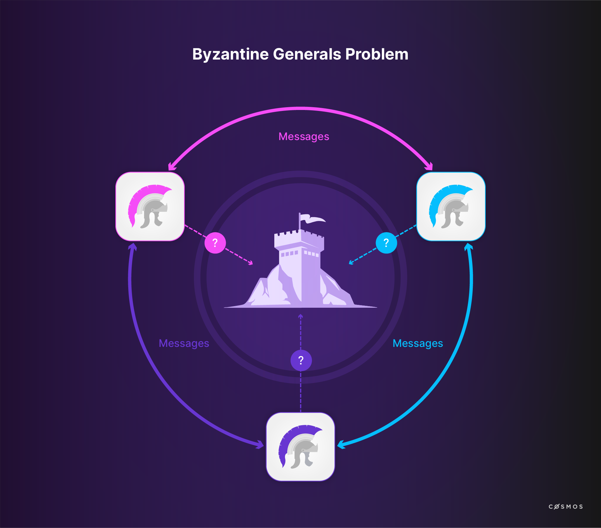
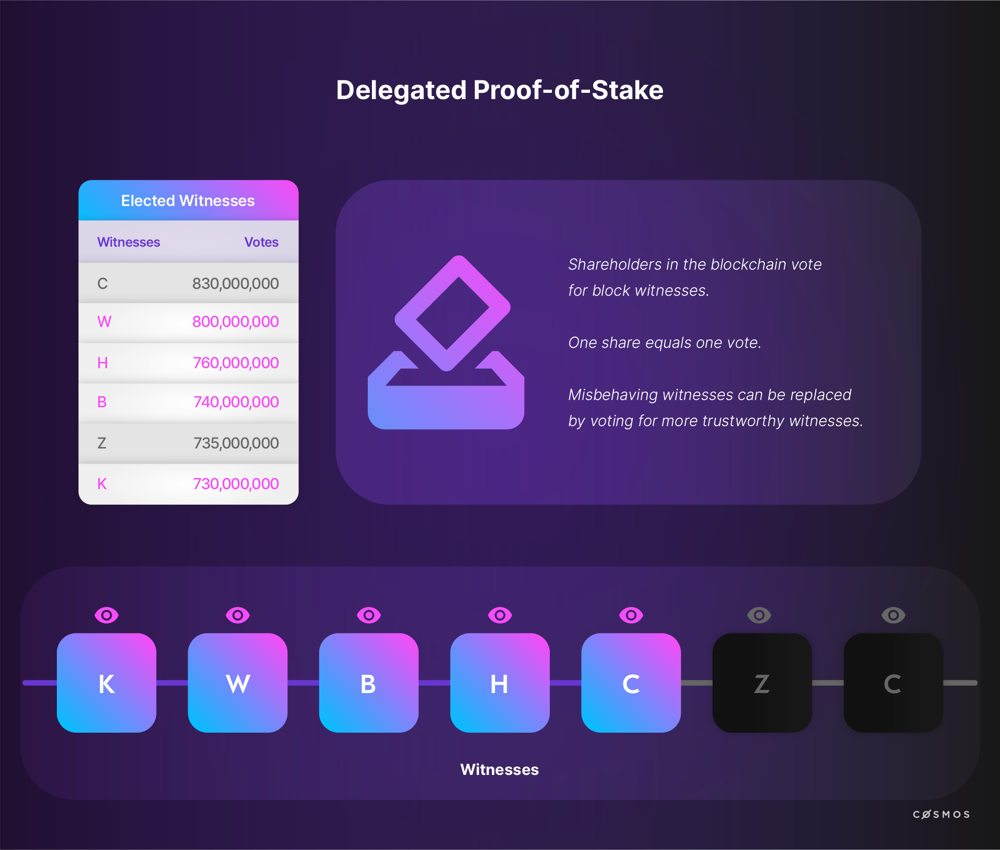

# Consensus

A known challenge in distributed computing, which is provably unsolvable but can nonetheless be mitigated, is how to reach **consensus** in a hierarchy-free, permissionless and failure-prone network. In a distributed network without authorities, we need a process to reach consensus about what is to be considered the **truth**. This is referred to as distributed consensus.

This problem is commonly known as the **Byzantine Generals' Problem** and mitigation strategies for it are subsumed under the term **Byzantine Fault Tolerance** (BFT).

An overview of the well-known blockchain solutions provides perspective and insight into the options Cosmos offers, because Cosmos allows a network designer to choose the consensus algorithm that is best suited to the developer's purpose. 

In the traditional description of the problem, generals, whose armies are spread around a target city, need to reach consensus on a time to attack. To achieve this, they can only rely on **unsecured communication channels**, whereby, for instance, a lack of acknowledgement can either be caused by a failure to deliver a message, by a dead general or by a failure to deliver the acknowledgment. While there are variations of the problem description in order to adopt to varying real-world fault-tolerance situations, most descriptions include a element of catastrophe if the generals fail to coordinate their actions. 

Similar to the generals who must decide when to attack, in a distributed ledger the agreed transaction list has to be identified and consensus on the correct order of transactions has to be reached.

Remember, individual transactions are sent to the network from individual nodes (distributed technology). Each node must pass (or fail to pass) transactions to other nodes. Because of the time delay required for data to physically travel across the network (i.e. physical latencies), not all nodes will see the same transactions at the same time. Each node must therefore build its own order of transactions. Since all nodes participate equally, there is **no authoritative order of transactions**. Still, the network must decide which node's version, or any version, of the truth will rise to become the authoritative truth, also known as the canonical chain. 

One of the innovations introduced by Bitcoin in addition to the chain of blocks was to use **proof-of-work** (PoW) to obtain consensus. Since then many other consensus algorithms for new blocks have been proposed and employed. One should note that there were consensus algorithms presented in the academic community before Bitcoin. 

Let us look at some of the most popular consensus algorithms.

## Proof-of-Work (PoW)

<!-- TODO  -->

A user completes a task of **arbitrary difficulty**. This is generally implemented as a search for a random number which when combined with ordered transactions in a block yields a hash function result that matches a criteria such as minimum number of leading zeroes. Finding such a solution is taken as evidence of considerable effort (or proof that considerable work *must* have been invested in the search).

<!-- TODO: Check this markdown format -->
<!-- TODO: THIS VIDEO IS CURRENTLY PRIVATE ON YOUTUBE -->

<YoutubePlayer videoId="iCYj6BfxxJE"/>

**Nodes**, also known as miners, in the network conduct their searches independently. The successful node that announces a solution first receives an economic reward that encourages participation in the process. The idea of substantiating a claim through an arbitrary amount of work was previously suggested as a way to combat spam in other contexts.

If a node wishes to distort the ledger in a PoW system, it must first acquire an **authoritative position**, otherwise it will be unable to influence the ledger. Acquiring an authoritative position implies overcoming the *combined* problem-solving capacity of the network and maintaining that lead over time. This known attack vector is called the 51%-attack. As the name suggests: if a single party acquires more than 50% of the total problem-solving capacity of the network, that party is theoretically able to alter the consensus. 

The control mechanism for the amount of work is called **difficulty** and it guarantees a given average block creation time. PoW networks set a target average time for a solution to be found by *any* node on the network. Difficulty adjusts to compensate for increasing/decreasing total network problem-solving capacity. Thus, PoW networks do not get faster as more compute capacity is added. They become more resilient by increasing difficulty, which raises the threshold a 51% attacker will need to overcome.

## Proof-of-Stake (PoS)

<!-- TODO  -->

**Proof-of-stake (PoS)** is another method of selecting the authoritative node for a given block. PoS is based on the assumption that those with the most to lose are the most incentivised to safeguard network integrity.

A successful proof-of-stake system must address the problem of "nothing at stake". That is, randomly-selected validators must face a disincentive for bad behaviour as well as a high probability that bad behaviour will be detected. The burden of detection usually falls on the rest of the network that can either accept or reject the validator's opinion. A solution to the disincentive aspect is to extract a penalty for emitting opinions that are ultimately rejected by the network; validators face economic penalties when they generate blocks that are rejected by sizable numbers of other nodes. A validator is thus incentivised to generate blocks that are likely to be accepted by the network and faces economic punishment when it fails to do so.

Validators place funds at risk (i.e. **the stake**). For any given block, a validator is selected in pseudo-random fashion with a validator with a larger stake having a higher probability of being selected to generate a block. While PoS systems generally reward validators with new coins for honest behavior (i.e. block rewards), validators also receive transaction fees in return for generating blocks the rest of the network accepts. 

## Delegated-Proof-of-Stake (DPoS)

An extension of proof-of-stake algorithms is called delegated-proof-of-stake (DPoS). It is used for example in BitShares, EOS, Steem, Lisk and Tron.

<HighlightBox type="info">
    [Bitshares](https://bitshares.org/) is an open-source, blockchain-based financial platform launched in 2014 and the name of the corresponding cryptocurrency. It provides a decentralised asset exchange – comparable to a stock exchange like the New York Stock Exchange (NYSE) but focused on cryptocurrencies.
</HighlightBox>

The algorithm is called DPoS because as in PoS the value of a vote is determined by the stake, i.e. tokens held by a user. However, in DPoS systems, there is a fixed validator set. For example, in EOS, there are only 21 validators that participate in consensus. In pure PoS systems, there is no fixed validator set and the number of potential validators that can participate in consensus is dependent on the total supply of tokens in circulation.

In this type of consensus mechanism, so-called **"witnesses"** are elected by the stakeholders of the network. Witnesses secure the network. Afterwards, several witnesses are chosen for the block creation so that they represent at least 50% of the stakeholders' votes.

Witnesses are paid for their services: They are paid fees for creating and validating blocks. This economic incentive to become a witness also leads to competition potentially increasing with each new member because the number of witnesses is limited.

In case a witness misbehaves, the network's community is able to withdraw their votes for a single witness, i.e. fire the witness. Witnesses that no longer hold enough votes lose their income basis.

Alongside ascribing the role of witnesses to some participants, DPoS networks also elect **"delegates"**. Delegates are a group of participants that supervise network governance and performance, and propose changes that are then voted on by the entire network.

Many consider DPoS algorithms superior to PoW and PoS because of their fast block creation, a high degree of security, energy efficiency, level of integrity, and democratic structure. However, DPoS systems are less decentralized than PoW and PoS systems because they have fixed validator sets and higher barriers to entry.

## Practical Byzantine Fault Tolerance (PBFT)

PBFT was published in 1999 and arose from academia. It is a three-phase protocol, in which the client sends a request to a so-called primary. 

In the first phase, the primary broadcasts the request with a sequence number to the replicas. Then the replicas agree on the sequence number and create a message. 

When a threshold of agreement is reached by the replicas, which is akin to sufficient co-signers, the message is verified. The replicas agree on the overall order of transactions within a view. The broader network is informed about transaction blocks when they are finalized. That is to say, signed by sufficient replicas to be sure that the block is finalized. 

This of course is a very simplified presentation.

<HighlightBox type="reading">

    You can access the paper by Miguel Castro and Barabara Liskov [here](http://pmg.csail.mit.edu/papers/osdi99.pdf). There is also an intuitive [presentation](http://www.comp.nus.edu.sg/~rahul/allfiles/cs6234-16-pbft.pdf).

</HighlightBox>

## Tendermint ##

While most consensus implementations are tightly coupled with a particular blockchain project, Tendermint is a toolkit that focuses on simplifying the process of creating blockchains with different properties and it includes Tendermint consensus. As the reader might guess, Cosmos relies on Tendermint consensus which offers the most mature Byzantine Fault Tolerance, transaction finality as well as a great deal of flexibility - flexibility that is passed through to the creators of custom blockchains built with the Cosmos SDK. 

[Tendermint](./1-what-is-cosmos/blockchain-and-cosmos.md) will be explored in detail later on. 

## Many others ##

Many teams have experimented with distributed consensus using many algorithms deployed to various chains. In the context of blockchain technology, "consensus" refers to a method of ordering transactions. The many algorithms that exist can be compared in terms of the distribution of authority, expected performance and transaction finality. Transaction finality can be categorized as "probablistic" and "deterministic", i.e. is it exponentially more improbable that a seen transaction will be reversed, or does the protocol prevent alterations to history in a definite way. 

The above are the most popular by usage as well as the most important to keep in mind when diving into consensus in Cosmos. 

<HighlightBox type="reading">

* Proof of Authority: <i>consensus model with Identity at Stake</i> [https://medium.com/oracles-network/proof-of-authority-consensus-model-with-identity-at-stake-d5bd15463256](https://medium.com/oracles-network/proof-of-authority-consensus-model-with-identity-at-stake-d5bd15463256)
* Tendermint is a decentralised consensus engine that runs its own public blockchain and also supports decentralised computing. It differs from Ethereum on its consensus protocol, which uses the concept of validators who need to bind funds to validate and who validate blocks over the course of a certain number of rounds. [http://tendermint.com/docs/tendermint.pdf](http://tendermint.com/docs/tendermint.pdf)
* [Counterparty](http://counterparty.io/platform/) aims to extend the Bitcoin blockchain and allows for a limited degree of smart contract execution. They also created their initial coins in an innovative way, by [proof-of-burn](http://counterparty.io/news/why-proof-of-burn/) of Bitcoins.
* [Stellar](https://www.stellar.org/developers/learn/get-started) was originally forked from Ripple, has now completely diverged from it, and introduced what they called a "Federated Byzantine Agreement", whereby consensus is reached by quorum slices.

</HighlightBox>
