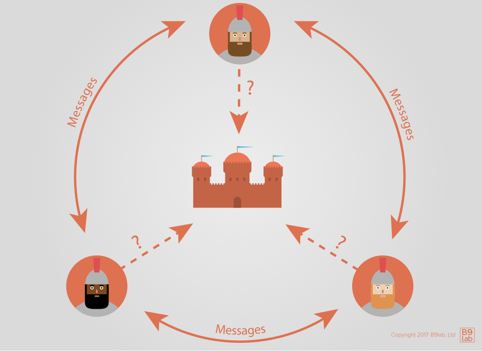

# Consensus

An identified problem in distributed computing, which is provably unsolvable but can nonetheless be mitigated, is how to reach **consensus** in a hierarchy-free, permission-less and failure-prone network. In a distributed network without authorities, we need a process to reach consensus about what is to be considered the **truth**. This is referred to as distributed consensus.

This problem is commonly known as the **Byzantine Generals' Problem** and mitigation strategies for it are subsumed under the term **Byzantine Fault Tolerance** (BFT).

In the traditional description of the problem, generals, whose armies are spread around a target city, need to reach consensus on a time to attack. To achieve this, they can only rely on **unsecured communication channels**, whereby, for instance, a lack of acknowledgement can either be caused by a failure to deliver a message, by a dead general or by a failure to deliver the acknowledgment.

Similar to the generals who must decide when to attack, in a distributed ledger the agreed transaction list has to be identified and consensus on the correct order of transactions has to be reached.

Remember, individual transactions are sent to the network from individual nodes (distributed technology). Each node must pass (or fail to pass) transactions to other nodes. Because of the time delay required for data to physically travel across the network (i.e. physical latencies), not all nodes will see the same transactions at the same time. Each node must therefore build its own order of transactions. Since all nodes participate equally, there is **no authoritative order of transactions**. Still, the network must decide which node's version, or any version, of the truth will rise to become the authoritative truth.

One of the innovations introduced by Bitcoin in addition to the chain of blocks was to use **proof-of-work** (PoW) to obtain consensus. Since then many other consensus algorithms for new blocks were proposed. One should note that there were consensus algorithms presented in the academic community before Bitcoin. 

Let us look at some of the most popular consensus algorithms.

## Proof-of-Work (PoW)

<!-- TODO  -->

A user completes a task of **arbitrary difficulty**. This is generally implemented as a search for a random number which when combined with ordered transactions in a block yields a hash function result that matches a criteria such as minimum number of leading zeroes. Finding such a solution is taken as evidence of considerable effort (or proof that considerable work *must* have been invested in the search).

<!-- Title: Proof-of-Work, URL: https://www.youtube.com/watch?v=iCYj6BfxxJE -->
