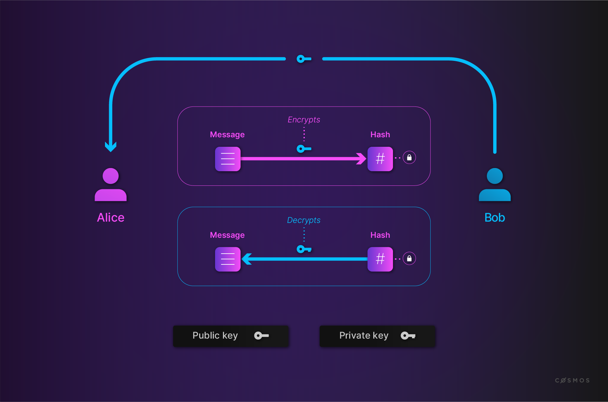
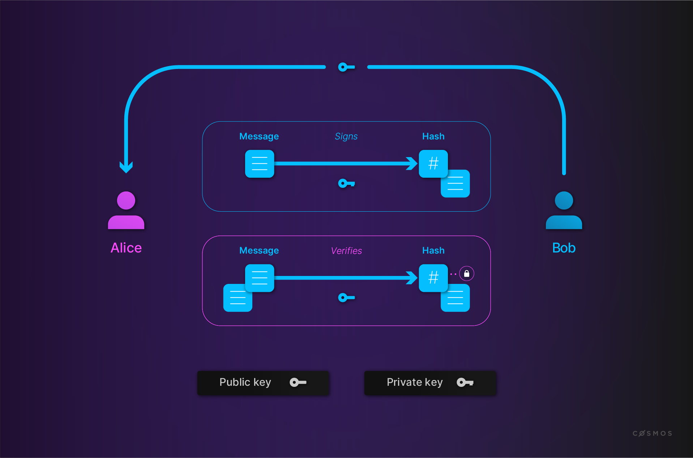
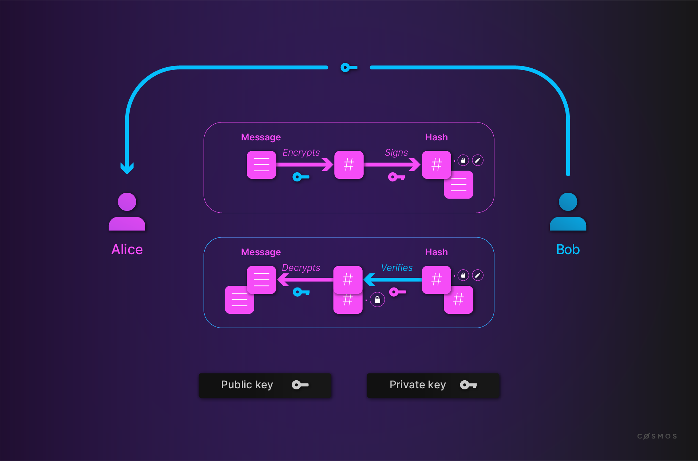

# Fundamentals

## Public key cryptosystems

Modern cryptographic systems leverage computer capabilities to make the power of certain mathematical functions available for practical use. 

Anyone new to blockchains will discover frequent references to message signatures and other concepts related to crytography. While this is not an extensive exploration of the topic and we will not be diving deeply into the mathematics, this section will demystify important concepts if they are new to you. 

### Public / private key

Such keys always come in pairs and offer various capabilities. Those capabilities are based on cryptographic mathematics. As their name suggest, the public key is meant to be distributed to whoever is relevant, while the private key is to be jealously guarded, akin to having your house address public, but keeping the key to your house private.

Let's have a look at examples, which you may know under the names:

* RSA
* PGP, GnuPG

Example (Linux):

```
// Create SECP256K1 private key with explicit parameters for backward compatibility
$ openssl ecparam -name secp256k1 -genkey -noout -out secp256k1-key.pem -param_enc explicit
// Create public key
$ openssl ec -in secp256k1-key.pem -pubout -out secp256k1-key-pub.pem
// Show public key
$ openssl ec -in secp256k1-key-pub.pem -pubin -text -noout

// Create RSA private key
$ openssl genrsa -des3 -out rsa-key.pem 2048
Generating RSA private key, 2048 bit long modulus
.....................................................+++
...........+++
e is 65537 (0x10001)
Enter pass phrase for rsa-key.pem:
Verifying - Enter pass phrase for rsa-key.pem:
// Create public key
$ openssl rsa -in rsa-key.pem -outform PEM -pubout -out rsa-key-pub.pem
Enter pass phrase for rsa-key.pem:
writing RSA key
```

This is like a password that is used to encrypt your private key on disk. If the private key was not encrypted, it would be at greater risk of theft. Since you are just testing here, you can put nothing or a simple word. But remember that whenever you create keys in the future, you need to protect them with a proper password.

Note that you may need openssl version 1.0 or newer.

#### Encrypt and decrypt

Alice wants to send a message to Bob, and for Bob's eyes only:

* Bob gives Alice his public key
* Alice uses Bob's public key to encrypt the message
* Alice sends Bob the encrypted message
* Bob decrypts the message with his private key



Example:

```bash
// Encrypt file
$ openssl pkeyutl -encrypt -pubin -inkey rsa-key-pub.pem -in helloworld.txt -out helloworld.enc
// Decrypt file
$ openssl pkeyutl -decrypt -inkey rsa-key.pem -in helloworld.enc -out helloworld2.txt
```

If you receive an error, try with `openssl rsautl` instead.

#### Sign and verify

Alice wants to make sure that Bob's public announcement is indeed from Bob:

* Bob gives Alice his public key
* Bob signs his announcement with his private key
* Bob sends Alice his announcement and its signature
* Alice verifies the signature with Bob's public key



Example:

```bash
// Sign file hash
$ openssl dgst -sha256 -sign secp256k1-key.pem -out helloworld-bin.sha256 helloworld.txt
// Encode signature in Base64
$ openssl base64 -in helloworld-bin.sha256 -out helloworld.sha256

// Decode signature form Base64
$ openssl base64 -d -in helloworld.sha256 -out helloworld-bin-decoded.sha256
// Verify signature
$ openssl dgst -sha256 -verify secp256k1-key-pub.pem -signature helloworld-bin-decoded.sha256 helloworld.txt
Verified OK
```

#### Mix and match

It is possible to mix both ideas, whereby Alice encrypts her message with Bob's public key, then signs the encrypted file with her private key. Upon reception, Bob verifies the signature with Alice's public key, to be sure it came from Alice, then decrypts the file with his private key.

#### What is this sorcery?

If these examples seem counter-intuitive it means you sense the mathematical wizardry of public key encryption. It's not especially important that you understand the math at a deep level, but it is important that you understand the properties of it. 

Given four keys: A,B,C and D, we can encrypt a message with A, B and C such that D is required to decrypt it and D is very hard to guess or discover. So, if Alice knows her private key and her public key and she also knows Bob's public key, she can encrypt a message that can only be understood by someone with knowledge of Bob's private key. 

Similarly, given knowledge of one's public and private keys, one can generate a signature (a character string) such that someone with a copy of the message and the signature can independely determine the public key of the entity that signed the message and know that the signer has knowledge of the corresponding private key. 

We can proceed with the understanding that signed messages from Alice could only come from someone with knowledge of Alice's private key and messages that are encrypted for Bob can only be deciphered by Bob. 



### Key management, PKI

If you look again at the Alice and Bob examples, you will notice that there is a vulnerability in "Bob gives Alice his public key". A malicious Charlie could intercept Bob's public key and pass on his own public key to Alice.

Key management and public key infrastructure (PKI) is an important aspect of cryptography that helps mitigate this risk.

#### Cryptographic hash functions

Such a hash function:

* converts an input, a.k.a. the message, into an output, a.k.a the hash
* does the conversion in a reasonable amount of time
* is such that it is practically impossible to re-generate the message out of the hash
* is such that the tiniest change in the message, changes the hash beyond recognition
* is such that it is practically impossible to find 2 different messages with the same hash

With such a function, you can:

*  prove that you have a message without disclosing the content of the message, for instance:
    * to prove you know your password
    * to prove you previously wrote a message
* rest assured the message was not altered
* index your messages

MD5 is such a function:

```bash
$ echo "The quick brown fox jumps over the lazy dog" | md5
37c4b87edffc5d198ff5a185cee7ee09
```

On Linux, it is `md5sum`. Now let's introduce a typo:

```bash
$ echo "The quick brown fox jump over the lazy dog" | md5
4ba496f4eec6ca17253cf8b7129e43be
```

Notice how the 2 hashes have nothing in common, other than the length, but the length is identical for all MD5 hashes so it reveals nothing about the input. 

`MD5` is no longer considered a hard-to-crack hash function. Bitcoin uses `SHA-256`. Ethereum uses `Keccak-256`and `Keccak-512`.

It is possible to index content by its hash, in essence creating a hashtable. If you have used IPFS or BitTorrent's magnet links, among others, then you have used a hashtable.

### Digital Certificates

Digital certificates are used (among other things) to prove an identity. They are given by a recognised Certification Authority(CA).  A widespread procedure is the public key certificate. It proves the ownership of a public key. We will describe below the standard X.509.

The standard X.509 is defined by the Telecommunication Standardization Sector(ITU-T) of the International Telecommunication Union(ITU).[[1]](https://en.wikipedia.org/wiki/X.509) It offers format and semantics for public key certificates. [X.509](https://www.ietf.org/rfc/rfc5280.txt) is profiled in the formal language ASN.1. Common use cases are validation of documents and securing of communication. For an example, X.509 is used in TLS/SSL. Its origin is in the X.500 standard from year 1988. Since version 3, X.509 enables flexible topologies, like bridges and meshes. Invalid certificates are listed in certificate revocation lists. (CRLs) CRL is vulnerable against DOS attacks.

A X.509 certificate contains information such as version number, serial number, signature algorithm, validity period, subject name, public key algorithm, subject public key, certificate signature algorithm, certificate signature and extensions. An extension has a type, a corresponding value and a critical flag. Non-critical extensions are only informational.

#### Signature

The concept of digital signatures is simple. If a given message is first hashed and then encrypted by a private key, one can verify the signature by decryption with corresponding public key. We need to hash the message to avoid the creation of signatures by mixing the messages and corresponding signatures. (See RSA chapter) This way, we know, that the sender has the private key to the given public key. 

<HighlightBox type="reading">

		* Zero-knowledge proof [https://en.wikipedia.org/wiki/Zero-knowledge_proof](https://en.wikipedia.org/wiki/Zero-knowledge_proof)
		* The Mathematics of the RSA Public-Key Cryptosystem [http://www.mathaware.org/mam/06/Kaliski.pdf](http://www.mathaware.org/mam/06/Kaliski.pdf)
		* Encrypt and Decrypt [http://osxdaily.com/2012/01/30/encrypt-and-decrypt-files-with-openssl/](http://osxdaily.com/2012/01/30/encrypt-and-decrypt-files-with-openssl/)
		* Sign and verify [https://gist.github.com/ezimuel/3cb601853db6ebc4ee49](https://gist.github.com/ezimuel/3cb601853db6ebc4ee49)

</HighlightBox>
