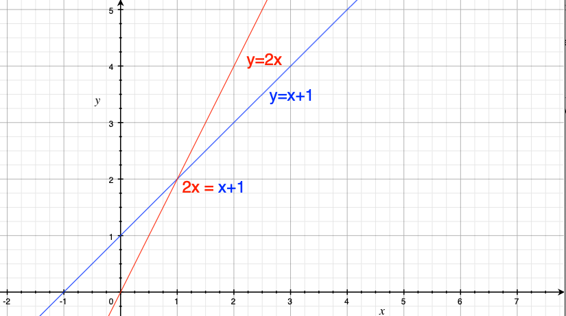
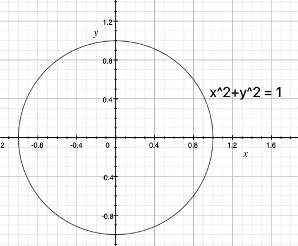
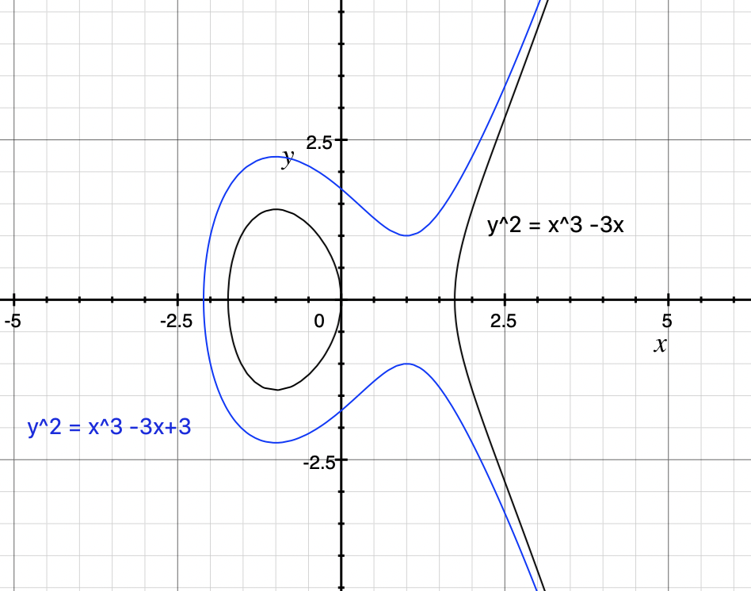
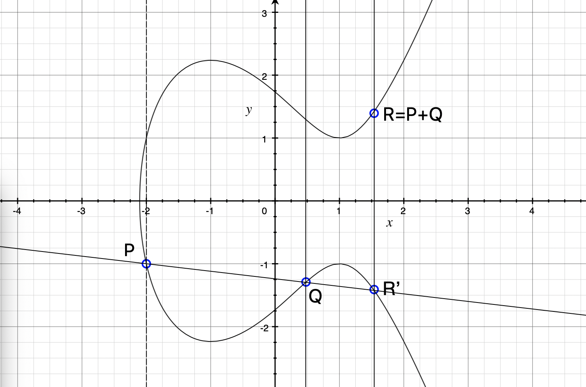

### Elliptic-curve cryptography

Another popular tool for creating public-private key pairs are elliptic curves. This topic is a bit more complicated than RSA.

Let us begin with some simple geometry. A straight line can be described as a function with:

`$ y = m \cdot x + c $`

In the following diagram, we show two such lines:

You will notice that they intersect at one point. The point where they do is the solution to the equation:

`$ 2 \cdot x = x + 1 $`

To heavily belabour the point, we can express straight lines and points as equations. In our case, the blue line is expressed as:

`$ y = x + 1 $`

but nothing stops us from rewriting it as:

`$ y - x = 1 $`

From there we can also understand the line as the set of all `$(x, y)$` points that satisfy this equation.

In the same vein, we can also describe a circle thusly:

`$ x^2 + y^2 = 1 $`

What are the `$ (x, y) $` points that solve this equation? Since we know that `$ x $` and `$ y $` can only be between `$ -1 $` and `$ 1 $`, we can parameterise these points thusly:

`$ (x, y) = (\cos t, \sin t) $`

where `$ t $` ranges from `$ 0 $` to `$ 2 \cdot \pi $`. Similarly we can parameterise an ellipse with:

`$ (x, y) = (a \cdot \cos t, b \cdot \sin t) $`

The story from here to elliptic curves is a little complicated and loose. Let us say we want to calculate the circumference of an ellipse. For this, we need an integral:

`$ \int_{0}^{2 \cdot \pi} {\sqrt {( \frac {dx} {dt})^2 + (\frac {dy} {dt})^2} \cdot dt} $`

Which can be rewritten :

`$ \int_{0}^{2 \cdot \pi} {\sqrt {({\frac {d (a \cos t)} {dt}})^2 + ({\frac {d (b \sin t)} {dt}})^2} dt} $`

If we use the [eccentricity] (https://en.wikipedia.org/wiki/Eccentricity_(mathematics)), defined by `$ \epsilon = \sqrt{1 - \frac {b^2} {a^2}} $`, we get (with a few steps in between):

`$ 4 \cdot a \cdot \int_{0}^{\pi/2} {\sqrt{1-\epsilon^2(\sin t)^2} dt} $`

In it we see for the first time the so-called elliptic integral (of the second kind):

`$ \int_{0}^{T} {\sqrt {(1-\epsilon^2(\sin t)^2)} dt} $`

Let us just leave it that way. Such integrals are not easy to calculate. 

If we want to calculate the inverse of an elliptic integral - [given circumference but unknown boundaries](https://en.wikipedia.org/wiki/Jacobi_elliptic_functions#Definition_as_inverses_of_elliptic_integrals) - we face a group of functions called [elliptic functions](https://en.wikipedia.org/wiki/Elliptic_function). It turns out that those functions are very useful for variety of topics and there is a simple form called [Weierstrass's elliptic functions](https://en.wikipedia.org/wiki/Weierstrass%27s_elliptic_functions). 

As a central result of the theory of elliptic functions we face the equation

`$ Y^2 = 4 \cdot X^3 + a \cdot X + b $`

with X as the Weierstrass's elliptic function and Y as derivative of X. 

The curve with points `$ (x, y) $` which satisfy:

`$ y^2 = x^3 + ax + b $`

- with some additional conditions, which we will not elaborate on - is therefore called elliptic curve.

Just as we were able to represent straight lines, circles and ellipses, we can also draw such curves:

As mentioned, elliptic curves are not ellipses.

One special property of elliptic curves is that we can create a new commutative and associative operator, which will allow us to create an [abelian group](https://en.wikipedia.org/wiki/abelian_group). By way of comparison, the `$ + $` number operator is commutative:

`$ a + b = b + a $`

and associative:

`$ a + (b + c) = (a + b) + c $`

As a matter of fact, we choose to call our new operator `$ + $`. It will operate, not on numbers, but on `$ (x, y) $` points of the elliptic curve. All points of the elliptic curve are in the abelian group; the abelian group **is** the elliptic curve. That is the special property we talked about.

The difficulty, now, is to devise this operator such that it fulfills the characteristics that make it a [group](https://en.wikipedia.org/wiki/Group_(mathematics)).

Let us define the addition:

`$ P + Q = R $`

of the points `$ P $` and `$ Q $` like in the following diagram:

where we draw a line from `$ P $` to `$ Q $` to get `$ R^\prime $`. We are not done yet. The result of the addition is the [inverse](https://en.wikipedia.org/wiki/Inverse_element) of `$ R^\prime $`, the point `$ R $` flipped across the x axis from `$ R^\prime $`.

An inverse `$ -R $` of `$ R $` is defined by:

`$ R +(-R) = R + R^\prime = O $`

so one gets the [neutral element](https://en.wikipedia.org/wiki/Identity_element) as result. The neutral element `$ O $` is a point in infinite without coordinates `$ (x, y) $`. So if we draw a line from `$ R \text{\textquoteright} $` to `$ R $` the result will be an intersection at infinity. 

What happens if select ` $ P $ ` and ` $ Q $` in such a way that there is no `$ R \text{\textquoteright} $`(third intersection)? Well this does not happen over [an finite field](https://en.wikipedia.org/wiki/Elliptic_curve#Elliptic_curves_over_finite_fields), notice that our diagramm shows an elliptic curve over the real numbers. 

We can think about the case if we want to calculate `$ P+P $`. In this case we use the [tangent line](https://en.wikipedia.org/wiki/Tangent#Tangent_line_to_a_curve) at `$ P $`.

If we write down the way we add the points `$ P=(x_1,y_1) $` and `$ R=(x_2,y_2) $`, we get:

`$ x_3 \equiv s^2 -x_1 - x_2 \mod p $`

`$ y_3 \equiv s(x_1-x_3)- y_1 \mod p $`

with

`$ s \equiv (y2-y1)/(x2-x1) \mod p $` if `$ P \neq Q $`

`$ s \equiv (3x^2_1+a)/(2y_1) \mod p $` if `$ P = Q $`

and

`$ Q=(x_3,y_3) $`

Well we have a `$ \mod p $` beacuse we want to use this addition with an [elliptic curve over a finite field](http://www.graui.de/code/elliptic2/) `$ \mathbb{F}_p $`.
In this case we do not have a continuous curve. Instead the elliptic curve is a set of points now.

Because we have addition, we can also do multiplication:

`$ n \cdot P = P + P + ... + P $`

where we add `$ P $` `$ n $` times to `$ O $`. This calculation can be done [easy](https://en.wikipedia.org/wiki/P_(complexity)) but if we want to divide,

`$ R = n \cdot P $`

to get `$ n $`, there is no [easy](https://en.wikipedia.org/wiki/NP_(complexity)#Why_some_NP_problems_are_hard_to_solve) way to do so for **some elliptic curves**. 

This means we can use `$ n $` as a private key and `$ R $` as the public key and there will be no easy way to find `$ n $` using `$ R $` and `$ P $`(called **generator point**, can be any element of the curve if `$ p $` is prime).

Now we can encrypt with [Elliptic-curve Diffie–Hellman (ECDH)](https://en.wikipedia.org/wiki/Elliptic-curve_Diffie%E2%80%93Hellman) or sign with [Elliptic Curve Digital Signature Algorithm (ECDSA)](https://en.wikipedia.org/wiki/Elliptic_Curve_Digital_Signature_Algorithm). 

