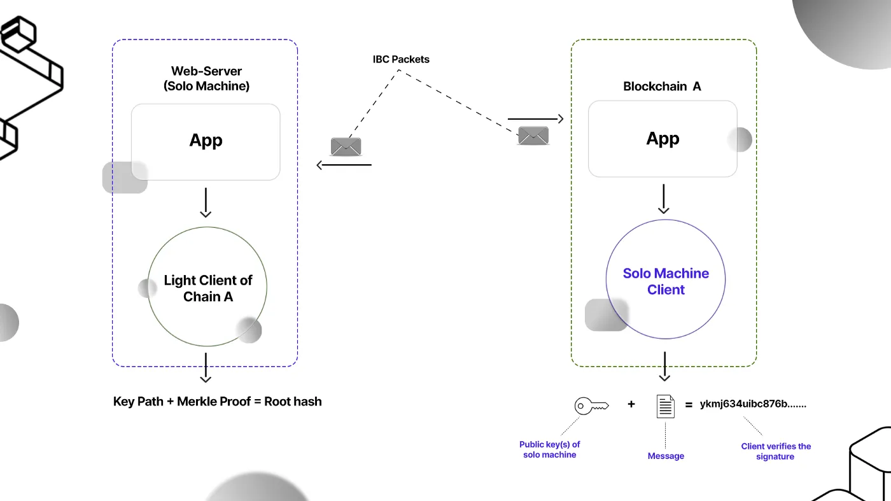

# Solomachine Client

IBC is the Inter-Blockchain Communication protocol, so it's scope must be limited for use within blockchains right? Well, not quite... . You see, IBC was indeed conceived as a solution for interoperability between blockchains or more generally, distributed ledgers. However, at the same time the design of the protocol aimed to be as universal and extensible as possible. It aims to **set a minimal set of requirements or interfaces a state machine must satisfy to communicate with remote counterparties**. This includes replicated state machines, i.e. blockchains but the interfaces can also be satisfied by other data systems such as _solomachines_.

A solomachine is a standalone process that can interact with blockchains through IBC. It can store key information like signed messages and private keys but has no consensus algorithm of its own. The _solomachine client_ can be seen as a verification algorithm capable of authenticating messages sent from a solomachine. With solomachines, one can access the IBC transport layer and blockchains (including features built on them) within the Interchain without developing one's own blockchain. 

Anything from a web application hosted on a server, to a browser, to the mobile in your pocket is a solo machine. And these systems are capable of speaking IBC!

This is made possible using the IBC solo machine client.

<HighlightBox type=note>

Note that we have a solomachine on the one hand. This is the actual standalone machine (see the examples above) that is used to sign messages to interact with IBC-enabled chains.

On the other hand, we have the _solomachine client_, which is the on-chain client allowing to verify the messages _sent by_ the solo machine on a remote counterparty chain.

The solomachine itself also still stores a light client representing the chain it wants to communicate with through IBC.

Make sure not to mix these up when talking about solomachines!

</HighlightBox>

## How does it work?

Unlike a typical [IBC light client](4-clients.md) which uses Merkle proofs to verify the validity of messages sent from a counterparty, a solomachine client keeps track of state by simply checking the authenticity of digital signatures.

Even though solomachines don’t have a provable consensus algorithm, they are still capable of **storing a public/private key pair and can also support multi-signature keys**.

<!-- placeholder -->
 

As an example, when blockchain A communicates with a solomachine over IBC, it registers the solomachine’s public key(s) in its (blockchain A’s) state machine through the _solo machine client_. Verifying the validity of a message sent from the solomachine is as simple as ensuring that the message was signed by its public key (as shown in Figure 1 above).

This is a significantly simpler and more cost-efficient mechanism of state verification compared to the full-fledged light client based model.

<HighlightBox type="info">

A solomachine with a single key pair can be suitable for a PoA-like/trusted setup — applicable for various enterprise solutions. The client is also capable of updating keys, so a single key pair can be rotated on a regular basis for security. Using a threshold signature or multi-signature design offers the same security guarantees as an externally verified bridging solution, but with the additional capability of interacting and communicating over IBC.

</HighlightBox>

## Why use a solo machine client?

There are three key benefits to using an IBC solo machine client:

1. Access to the IBC transport layer — and as a result, all the chains and ecosystems connected to it (as well as the features and applications built on top). 
2. Removing the economic and operational overhead that comes with developing an entire blockchain in order to use IBC.
3. Suitable to directly interoperate with chains where implementing a regular IBC light client can be complex (for example on Ethereum due to its probabilistic finality).

The transport layer of IBC — responsible for the transport, authentication, and ordering of data packets — is a powerful standard for blockchain interoperability. It offers access to a variety of IBC applications such as token transfers, cross-chain oracle data feeds, cross-chain governance, fee middleware, as well as features like Interchain Accounts, Interchain Queries, and more.
The use of a solomachine not only grants access to this trust-minimized, general-purpose, and ever growing interoperability framework, but one can do so without even having to develop a blockchain.

Another exciting feature of using a solomachine is that it can leverage Interchain Accounts (ICA). In short, ICA allows a (controller) chain/solo machine to control an account on another (host) chain/solomachine. This opens up a plethora of interesting use-cases. For example, a solomachine acting as the controller can delegate funds to be staked on a host chain. The benefit here is that the private keys associated with the controller account (on the solomachine in this example), can be rotated without having to undelegate on the host side, update the private key on the controller, and then redelegate.

The solomachine can also be used to mint/burn tokens, request and receive oracle data (by using BandChain for example), use ICA for cross-chain/machine composability, and more. Hence given that any IBC-level application can be leveraged by a solomachine, the possibilities are virtually endless and up to the imagination of developers making use of this client.

<HighlightBox type="reading">

Crypto.com is the quintessential example of a centralized exchange bringing the IBC solomachine to production by issuing tokens on their public blockchain–Crypto.org. This allows Crypto.com to issue pegged DOT and XLM (Polkadot and Stellar’s native tokens respectively) which are of the ICS-20 (fungible token transfer) level. Hence the tokens can be sent to any chain that’s IBC-enabled and used within DeFi protocols.

As mentioned in [Crypto.org’s blog post](https://medium.com/crypto-org-chain/crypto-org-chain-issues-dot-token-via-ibc-solo-machine-b0f58e605b0e), without an IBC solo machine, an entity looking to issue tokens would be required to develop a standalone blockchain, connect it to IBC, and maintain/procure the relayer infrastructure required for system liveness. This naturally demands greater resources relative to deploying a solo machine.

Read more about Crypto.org's use of solomachines in [their docs](https://crypto.org/docs/resources/solo-machine.html).

</HighlightBox>

## Crypto.org solomachine implementation

Developers and users who are interested can clone our Stag repository to quickly go through these steps and try the approaches out.

## Conclusion

IBC offers a unique and powerful framework for trust-minimized interoperability. And the impressive growth since its genesis is a testament to its security, composability, and extensibility.

While implementing light clients has been the standard design to plug into IBC, the options are not limited to this one method. And it turns out that the solo machine client offers an alternative to implementing IBC light clients. Given its simple proof verification method, the solo machine client is considerably easier to deploy from an engineering standpoint, and an effective solution in deployment scenarios where other potential concerns (eg. security) are mitigated by design.

In conclusion, having access to IBC offers a host of benefits. But it is equally important to facilitate ease of access to IBC as much as possible. And to this latter point, the solo machine client offers one of the best solutions today.

