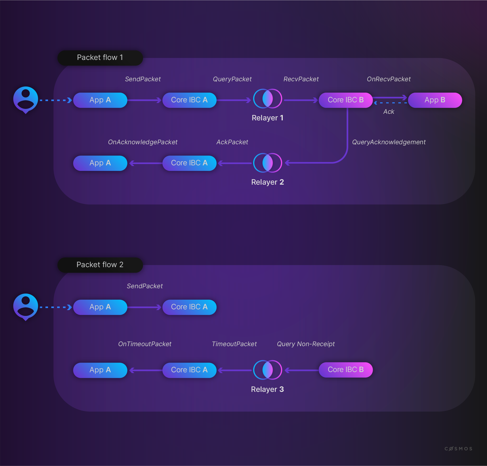

# Make a module IBC-enabled

In this section, you'll build a conceptual SDK blockchain with one module. The first time, a regular module and the second time an IBC module. This will introduce us to what makes a module IBC-enabled.

## Scaffold a Leaderboard chain

By now, you are familiar with scaffolding a chain with Ignite CLI (if not, check out the [Create Your Own Chain](insert_link) section).

Let's scaffold a `leaderboard` chain:

```bash
ignite scaffold chain github.com/cosmonaut/leaderboard
```

This creates a chain with `x/leaderboard` a regular SDK module.

Next, scaffold another chain (for example in another git branch) but decide to add the `--no-module` flag:

```bash
ignite scaffold chain github.com/cosmonaut/leaderboard --no-module
```

Now we add the `x/leaderboard` module as an IBC module with the `--ibc` flag:

```bash
ignite scaffold module leaderboard --ibc
```

The output you see on the terminal when the module has finished scaffolding already gives a sense of what has to be implemented to create an IBC module:

```bash
modify app/app.go
modify proto/leaderboard/genesis.proto
create proto/leaderboard/packet.proto
modify testutil/keeper/leaderboard.go
modify x/leaderboard/genesis.go
create x/leaderboard/module_ibc.go
create x/leaderboard/types/events_ibc.go
modify x/leaderboard/types/genesis.go
modify x/leaderboard/types/keys.go
```

To have a more detailed view, we can now compare both versions with a git diff.

## IBC application module requirements

What does Ignite CLI do behind the scenes when creating an IBC module for us? What do we need to implement if we want to upgrade a regular custom application module to an IBC enabled module?

The required steps to implement can be found in the [IBC go docs](https://ibc.cosmos.network/main/ibc/apps/apps.html). We find there:

<Highlightbox type="info">

**To have your module interact over IBC you must:**

- implement the `IBCModule` interface, i.e.:
  - channel (opening) handshake callbacks
  - channel closing handshake callbacks
  - packet callbacks
- bind to a port(s)
- add keeper methods
- define your own packet data and acknowledgement structs as well as how to encode/decode them
- add a route to the IBC router

</Highlightbox>

Now let's take a look at the *git diff* and see if we are able to recognize the steps listed above.

### Implementing the `IBCModule` interface

**NOTE:** For a full explanation, please visit the [IBC go docs](https://ibc.cosmos.network/main/ibc/apps/ibcmodule.html).

The Cosmos SDK expects all IBC modules to implement the [`IBCModule`
interface](https://github.com/cosmos/ibc-go/tree/main/modules/core/05-port/types/module.go). This interface contains all of the callbacks IBC expects modules to implement. This includes callbacks related to: 
- channel handshake (`OnChanOpenInit`, `OnChanOpenTry`, `OncChanOpenAck`, `OnChanOpenConfirm`)
- channel closing (`OnChanCloseInit`, `OnChanCloseConfirm`)
- packets (`OnRecvPacket`, `OnAcknowledgementPacket` and `OnTimeoutPacket`).

Ignite CLI implements this in the file `x/leaderboard/module_ibc.go`.

//TODO: add collapsible window??

Additionally, in the `module.go` file, add the following line (and the corresponding import):

```diff
var (
    _ module.AppModule      = AppModule{}
    _ module.AppModuleBasic = AppModuleBasic{}
    // Add this line
+    _ porttypes.IBCModule   = IBCModule{}
)
```

#### Channel handshake version negotiation

Application modules are expected to verify versioning used during the channel handshake procedure.

- `OnChanOpenInit` will verify that the relayer-chosen parameters
  are valid and perform any custom `INIT` logic.
  It may return an error if the chosen parameters are invalid
  in which case the handshake is aborted.
  If the provided version string is non-empty, `OnChanOpenInit` should return
  the version string if valid or an error if the provided version is invalid.
  **If the version string is empty, `OnChanOpenInit` is expected to
  return a default version string representing the version(s)
  it supports.**
  If there is no default version string for the application,
  it should return an error if the provided version is an empty string.
- `OnChanOpenTry` will verify the relayer-chosen parameters along with the
  counterparty-chosen version string and perform custom `TRY` logic.
  If the relayer-chosen parameters
  are invalid, the callback must return an error to abort the handshake.
  If the counterparty-chosen version is not compatible with this module's
  supported versions, the callback must return an error to abort the handshake.
  If the versions are compatible, the try callback must select the final version
  string and return it to core IBC.
  `OnChanOpenTry` may also perform custom initialization logic.
- `OnChanOpenAck` will error if the counterparty selected version string
  is invalid and abort the handshake. It may also perform custom ACK logic.

#### Packet callbacks

The general application packet flow was discussed in [a previous section](https://tutorials.cosmos.network/academy/4-ibc/channels.html#application-packet-flow). 

As a refresher, let's take a look at the diagram: 


We can now identify the packet callbacks in the packet flow by investigating the `IBCModule` interface.

##### Sending packets

Modules **do not send packets through callbacks**, since the modules initiate the action of sending packets to the IBC module, as opposed to other parts of the packet flow where messages sent to the IBC module must trigger execution on the port-bound module through the use of callbacks. Thus, to send a packet a module simply needs to call `SendPacket` on the `IBCChannelKeeper`.

::: warning
In order to prevent modules from sending packets on channels they do not own, IBC expects modules to pass in the correct channel capability for the packet's source channel.
:::

##### Receiving packets

To handle receiving packets, the module must implement the `OnRecvPacket` callback. This gets invoked by the IBC module after the packet has been proved valid and correctly processed by the IBC keepers. Thus, the `OnRecvPacket` callback only needs to worry about making the appropriate state changes given the packet data without worrying about whether the packet is valid or not.

Modules may return to the IBC handler an acknowledgement which implements the `Acknowledgement` interface.
The IBC handler will then commit this acknowledgement of the packet so that a relayer may relay the acknowledgement back to the sender module.

The state changes that occurred during this callback will only be written if:

- the acknowledgement was successful as indicated by the `Success()` function of the acknowledgement
- if the acknowledgement returned is nil indicating that an asynchronous process is occurring

**NOTE:** Applications which process asynchronous acknowledgements must handle reverting state changes when appropriate. Any state changes that occurred during the `OnRecvPacket` callback will be written for asynchronous acknowledgements.

In `x/leaderboard/module_ibc.go` scaffolded by Ignite CLI we find `OnRecvPacket`:

```go
// OnRecvPacket implements the IBCModule interface
func (am AppModule) OnRecvPacket(
	ctx sdk.Context,
	modulePacket channeltypes.Packet,
	relayer sdk.AccAddress,
) ibcexported.Acknowledgement {
	var ack channeltypes.Acknowledgement

	// this line is used by starport scaffolding # oracle/packet/module/recv

	var modulePacketData types.LeaderboardPacketData
	...

	// Dispatch packet
	switch packet := modulePacketData.Packet.(type) {
	// this line is used by starport scaffolding # ibc/packet/module/recv
	default:
		errMsg := fmt.Sprintf("unrecognized %s packet type: %T", types.ModuleName, packet)
		return channeltypes.NewErrorAcknowledgement(errMsg)
	}

	// NOTE: acknowledgement will be written synchronously during IBC handler execution.
	return ack
}
```
The *dispatch packet* switch statement is added by Ignite CLI, as it is stated in the docs we strictly speaking only need to decode the packet data (which we'll discuss in a next section) and return the acknowledgement after processing the packet. The structure provided by Ignite CLI is however useful to get us set up, but can be changed according to the preference of the developer.

As a reminder, the `Acknowledgement` interface:

```go
// Acknowledgement defines the interface used to return
// acknowledgements in the OnRecvPacket callback.
type Acknowledgement interface {
	Success() bool
	Acknowledgement() []byte
}
```

##### Acknowledging packets

The last step of the packet flow depends on whether we have a happy path when the packet has been successfully relayed or a timeout when something went wrong.

After a module writes an acknowledgement, a relayer can relay back the acknowledgement to the sender module. The sender module can
then process the acknowledgement using the `OnAcknowledgementPacket` callback. The contents of the acknowledgement is entirely up to the modules on the channel (just like the packet data); however, it may often contain information on whether the packet was successfully processed along with some additional data that could be useful for remediation if the packet processing failed.

Since the modules are responsible for agreeing on an encoding/decoding standard for packet data and acknowledgements, IBC will pass in the acknowledgements as `[]byte` to this callback. The callback is responsible for decoding the acknowledgement and processing it.

In `x/leaderboard/module_ibc.go` scaffolded by Ignite CLI we find `OnAcknowledgementPacket`:

```go
// OnAcknowledgementPacket implements the IBCModule interface
func (am AppModule) OnAcknowledgementPacket(
	ctx sdk.Context,
	modulePacket channeltypes.Packet,
	acknowledgement []byte,
	relayer sdk.AccAddress,
) error {
	var ack channeltypes.Acknowledgement
	... //validation

	// this line is used by starport scaffolding # oracle/packet/module/ack

	var modulePacketData types.LeaderboardPacketData
	... //validation

	var eventType string

	// Dispatch packet
	switch packet := modulePacketData.Packet.(type) {
	// this line is used by starport scaffolding # ibc/packet/module/ack
	default:
		... //errMsg
	}

	ctx.EventManager().EmitEvent(
		sdk.NewEvent(
			...
		),
	)

	switch resp := ack.Response.(type) {
	case *channeltypes.Acknowledgement_Result:
		ctx.EventManager().EmitEvent(
			sdk.NewEvent(
				...
			),
		)
	case *channeltypes.Acknowledgement_Error:
		ctx.EventManager().EmitEvent(
			sdk.NewEvent(
				...
			),
		)
	}

	return nil
}
```
Again, the structure to dispatch the packet with the switch statement as well as the switch statement for the ack (success case or error case) have been structured by Ignite CLI where the [docs](https://ibc.cosmos.network/main/ibc/apps/ibcmodule.html#acknowledging-packets) offer more freedom to the developer to implement decoding and processing of the ack.

<Highlightbox type="info">

The events that are being emitted are defined in `x/leaderboard/types/events_ibc.go`.

</Highlightbox>

##### Timing out packets

If the timeout for a packet is reached before the packet is successfully received or the counterparty channel end is closed before the packet is successfully received, then the receiving chain can no longer process it. Thus, the sending chain must process the timeout using `OnTimeoutPacket` to handle this situation. Again the IBC module will verify that the timeout is indeed valid, so our module only needs to implement the state machine logic for what to do once a timeout is reached and the packet can no longer be received.

In `x/leaderboard/module_ibc.go` scaffolded by Ignite CLI we find `OnAcknowledgementPacket`:

```go
// OnTimeoutPacket implements the IBCModule interface
func (am AppModule) OnTimeoutPacket(
	ctx sdk.Context,
	modulePacket channeltypes.Packet,
	relayer sdk.AccAddress,
) error {
	var modulePacketData types.LeaderboardPacketData
	... // validation

	// Dispatch packet
	switch packet := modulePacketData.Packet.(type) {
	// this line is used by starport scaffolding # ibc/packet/module/timeout
	default:
		... // errMsg
	}

	return nil
}
```

#### Binding to a port

Every IBC module binds to a port, with a unique `portID` which denotes the type of application.

<Highlightbox type="note">

Note that `portID` does not refer to a certain numerical ID, like `localhost:8080` with a `portID` 8080. Rather it refers to the application module the port binds. For IBC Modules built with the Cosmos SDK, it defaults to the module's name and for Cosmwasm contracts it defaults to the contract address.

</Highlightbox>

Currently, ports must be bound on app initialization. In order to bind modules to their respective ports on initialization, the following needs to be implemented:

1. Add port ID to the `GenesisState` proto definition:

    ```diff
        @@ proto/leaderboard/genesis.proto
        // GenesisState defines the leaderboard module's genesis state.
        message GenesisState {
            Params params = 1 [(gogoproto.nullable) = false];
    +       string port_id = 2;
            // this line is used by starport scaffolding # genesis/proto/state
    }
    ```
1. Add port ID as a key to the module store in `x/leaderboard/types/keys.go`:
    ```diff
        @@ const in x/leaderboard/types.go
        // MemStoreKey defines the in-memory store key
        MemStoreKey = "mem_leaderboard"

    +    // Version defines the current version the IBC module supports
    +    Version = "leaderboard-1"

    +    // PortID is the default port id that module binds to
    +    PortID = "leaderboard"
    +    )

    +    var (
    +        // PortKey defines the key to store the port ID in store
    +        PortKey = KeyPrefix("leaderboard-port-")
        )
    ```
    Note that by default indeed the portID is set to the module name, and the application version is set to `<modulename>-n` with `n` an incrementing value.

1. Add port ID to `x/leaderboard/types/genesis.go`:
    ```diff
        // DefaultGenesisState returns a GenesisState with "transfer" as the default PortID.
        func DefaultGenesisState() *GenesisState {
            return &GenesisState{
    +            PortId:      PortID,
                // additional k-v fields
            }
        }

        // Validate performs basic genesis state validation returning an error upon any
        // failure.
        func (gs GenesisState) Validate() error {
    +       if err := host.PortIdentifierValidator(gs.PortId); err != nil {
    +            return err
    +        }
            //addtional validations

            return gs.Params.Validate()
        }
   ```
1. Bind the IBC module to the port in `x/leaderboard/genesis.go`:
    ```diff
        @@ InitGenesis
        func InitGenesis(ctx sdk.Context, k keeper.Keeper, genState types.GenesisState) {
            // this line is used by starport scaffolding # genesis/module/init
    +       k.SetPort(ctx, genState.PortId)
    +       // Only try to bind to port if it is not already bound, since we may already own
    +       // port capability from capability InitGenesis
    +       if !k.IsBound(ctx, genState.PortId) {
    +           // module binds to the port on InitChain
    +           // and claims the returned capability
    +           err := k.BindPort(ctx, genState.PortId)
    +           if err != nil {
    +               panic("could not claim port capability: " + err.Error())
    +           }
            }
            k.SetParams(ctx, genState.Params)
        }

        @@ ExportGenesis
        func ExportGenesis(ctx sdk.Context, k keeper.Keeper) *types.GenesisState {
            genesis := types.DefaultGenesis()
            genesis.Params = k.GetParams(ctx)

    +        genesis.PortId = k.GetPort(ctx)
            // this line is used by starport scaffolding # genesis/module/export

            return genesis
        }
    ```
    Where:

   ```go
   // IsBound checks if the  module is already bound to the desired port
   func (k Keeper) IsBound(ctx sdk.Context, portID string) bool {
       _, ok := k.scopedKeeper.GetCapability(ctx, host.PortPath(portID))
       return ok
   }

   // BindPort defines a wrapper function for the port Keeper's function in
   // order to expose it to module's InitGenesis function
   func (k Keeper) BindPort(ctx sdk.Context, portID string) error {
       cap := k.portKeeper.BindPort(ctx, portID)
       return k.ClaimCapability(ctx, cap, host.PortPath(portID))
   }
   ```

   The module binds to the desired port(s) and returns the capabilities.

#### Keeper

Previous steps at some points referenced some keeper methods that deal with binding to and getting and setting a port, claiming and authenticating capabilities. These methods need to be added to the keeper.

For a full overview, check out the [IBC go docs](https://ibc.cosmos.network/main/ibc/apps/keeper.html) and compare with the `x/leaderboard/keeper/keeper.go` file.

You will notice that Ignite CLI uses a custom `cosmosibckeeper` package you can find [here](https://github.com/ignite/cli/tree/develop/ignite/pkg/cosmosibckeeper).

#### Routing and app.go

When looking at `app.go` we see some minor additions, the most prominent of which is adding a route to the `Leaderboard` module on the `IBC Router`. 

```diff
    @@ func New in app/app.go
    ibcRouter := ibcporttypes.NewRouter()
	ibcRouter.AddRoute(ibctransfertypes.ModuleName, transferIBCModule)
	ibcRouter.AddRoute(monitoringptypes.ModuleName, monitoringModule)
+	ibcRouter.AddRoute(leaderboardmoduletypes.ModuleName, leaderboardModule)
	// this line is used by starport scaffolding # ibc/app/router
	app.IBCKeeper.SetRouter(ibcRouter)
```

#### Next up

The step we skipped until now is to define packet and acknowledgement data. In the next section we will first scaffold the packet with Ignite CLI and agains compare the additions with a git diff.

