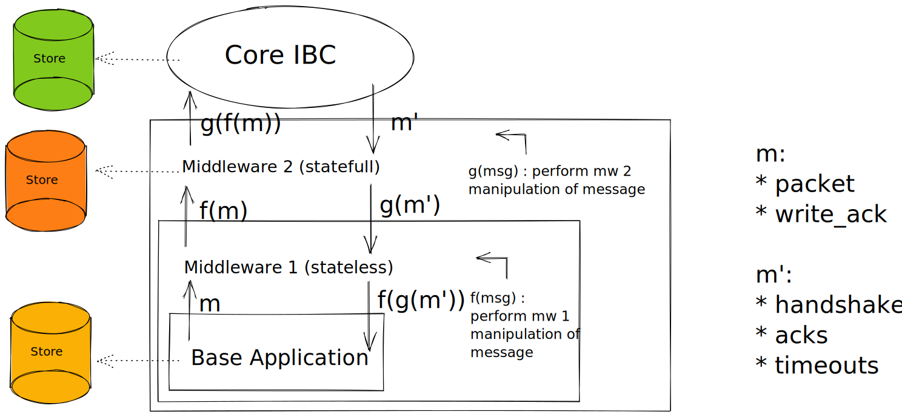

# IBC Middleware

<!-- Add intro outlining use of middleware in web2 -->

<HighlightBox type="learning">

In this section you will learn how to:

- write your own custom middleware to wrap an IBC application
- understand how to hook different middleware to IBC base applications to form different IBC application stacks

This document serves as a guide for middleware developers who want to write their own middleware and for chain developers who want to use IBC middleware on their chains.

</HighlightBox>

## When to use middleware?

IBC applications are designed to be self-contained modules that implement their own application-specific logic through a set of interfaces with the core IBC handlers. This is what is discussed in the [previous section](insert-link.com).

These core IBC handlers, in turn, are designed to enforce the correctness properties of [IBC (transport, authentication, ordering)](insert-link.com) while delegating all application-specific handling to the IBC application modules. **However, there are cases where some functionality may be desired by many applications, yet not appropriate to place in core IBC**... this is where middleware enters the picture.

Middleware allows developers to define the extensions to the application and core IBC logic as separate modules that can wrap over the base application. This middleware can perform its own custom logic, and pass data into the application so that it may run its logic without being aware of the middleware's existence.

<HighlightBox type="info">

This design allows both the application and the middleware to implement their own isolated logic while still being able to run as part of a single packet flow.

In addition, as multiple middlewares can be stacked, it enables modularity where chain developers can build the required business logic using _plug-and-play_ components consisting of a base IBC application module and a stack of middleware.

</HighlightBox>

## Definitions

Before we continue, let's make sure to define the semantics:

- `Middleware`: A self-contained module that sits between core IBC and an underlying IBC application during packet execution. All messages between core IBC and underlying application must flow through middleware, which may perform its own custom logic.

- `Underlying Application`: An underlying application is the application that is directly connected to the middleware in question. This underlying application may itself be middleware that is chained to a base application.

- `Base Application`: A base application is an IBC application that does not contain any middleware. It may be nested by 0 or multiple middleware to form an application stack.

- `Application Stack (or stack)`: A stack is the complete set of application logic (middleware(s) + base application) that gets connected to core IBC. A stack may be just a base application, or it may be a series of middlewares that nest a base application.

The diagram below gives an overview of a middleware stack consisting of two middlewares (one stateless, the other stateful).

<HighlightBox type="note">

Keep in mind that:

- **The order of the middleware matters** (more on how to correctly define your stack in the code will follow in the [integration section](insert-link.com)).
- Depending on what type of message, it will either be passed on from the base application up the the middleware stack to core IBC or down the stack in the reverse situation (handshake and packet callbacks).
- IBC middleware will wrap over an underlying IBC application and sits between core IBC and the application. It has complete control in modifying any message coming from IBC to the application, and any message coming from the application to core IBC. **Thus, middleware must be completely trusted by chain developers who wish to integrate them**, however this gives them complete flexibility in modifying the application(s) they wrap.

</HighlightBox>

## Next up

In the next sections we'll first see how to develop an IBC middleware after which we'll see how to integrate a piece of middleware or stack on the chain.

Note that unlike the IBC application module section, we will not be scaffolding the middleware module with Ignite CLI because this is currently not yet supported.

<!-- OPTIONAL if there's time: include ICS29 as example -->

<!-- OPTIONAL: refer to checkers extenstion tutorial if mw is added there -->
