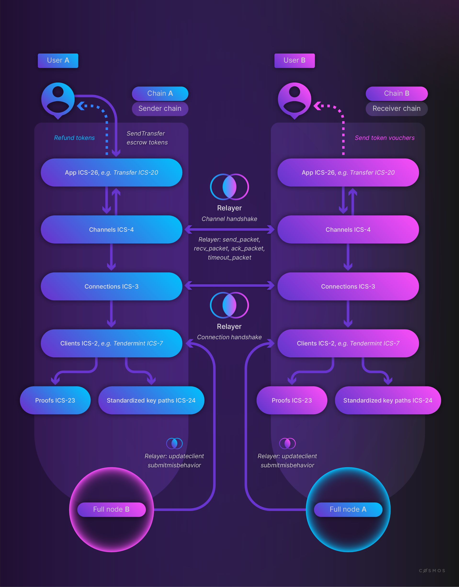
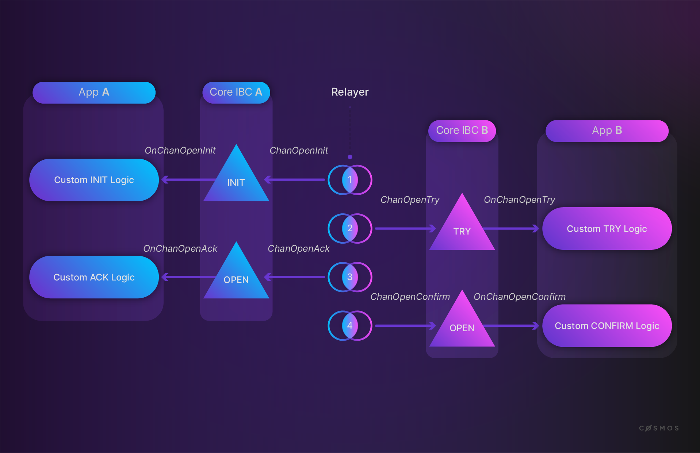
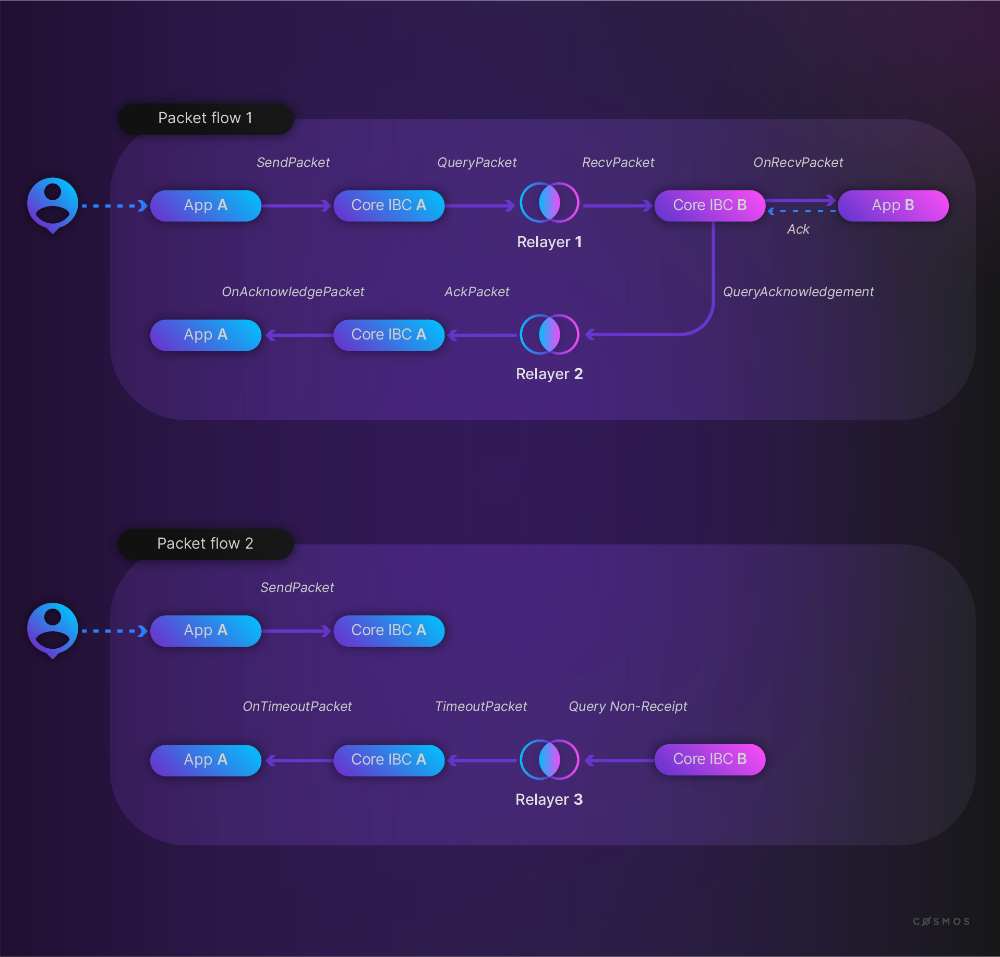

# Transport, Authentication, and Ordering Layer

Now that you covered the introduction and have a better understanding of how different Inter-Blockchain Communication (IBC) Protocol components and Interchain Standards (ICS) relate to each other, take a deep dive into IBC/TAO (transport, authentication, and ordering) and the [IBC module](https://github.com/cosmos/ibc-go).

## Light client

In the IBC Protocol, an actor - an end user, an off-chain process, or a machine - needs to be able to verify updates to another machine's state that the other machine's consensus algorithm has agreed to and reject any possible updates that the other machine's consensus algorithm has not agreed upon.



Different abstraction layers are described in the ICS.

<HighlightBox type="info">

In case you want to take a refresher of ICS and the different layers, take a look at the section [What is IBC?](./what-is-ibc.md).

</HighlightBox>

**Light clients** confirm that received packets are verified. With this approch, an IBC chain does not require to maintain a **full node** for the verification of state changes of another chain. A **relayer** has access to both full nodes and passes headers from full nodes to the light clients.

Before a **connection** can be established - a connection handshake starts - chain A will create a light client for chain B and chain B will create a light client for chain A.

Start with [`msg_serve.go`](https://github.com/cosmos/ibc-go/blob/main/modules/core/keeper/msg_server.go), this is where the messages come in. In it, we first see a `CreateClient` function:

```golang
// CreateClient defines a rpc handler method for MsgCreateClient.
func (k Keeper) CreateClient(goCtx context.Context, msg *clienttypes.MsgCreateClient) (*clienttypes.MsgCreateClientResponse, error) {
  ctx := sdk.UnwrapSDKContext(goCtx)

  clientState, err := clienttypes.UnpackClientState(msg.ClientState)
  if err != nil {
    return nil, err
  }

  consensusState, err := clienttypes.UnpackConsensusState(msg.ConsensusState)
  if err != nil {
    return nil, err
  }

  if _, err = k.ClientKeeper.CreateClient(ctx, clientState, consensusState); err != nil {
    return nil, err
  }

  return &clienttypes.MsgCreateClientResponse{}, nil
}
```

It creates a light client by calling [`ClientKeeper.CreateClient`](https://github.com/cosmos/ibc-go/blob/main/modules/core/02-client/keeper/client.go):

```golang
// CreateClient creates a new client state and populates it with a given consensus
// state as defined in https://github.com/cosmos/ibc/tree/master/spec/core/ics-002-client-semantics#create
func (k Keeper) CreateClient(
  ctx sdk.Context, clientState exported.ClientState, consensusState exported.ConsensusState,
) (string, error) {
  params := k.GetParams(ctx)
  if !params.IsAllowedClient(clientState.ClientType()) {
    return "", sdkerrors.Wrapf(
      types.ErrInvalidClientType,
      "client state type %s is not registered in the allowlist", clientState.ClientType(),
    )
  }

  clientID := k.GenerateClientIdentifier(ctx, clientState.ClientType())

  k.SetClientState(ctx, clientID, clientState)
  k.Logger(ctx).Info("client created at height", "client-id", clientID, "height", clientState.GetLatestHeight().String())

  // verifies initial consensus state against client state and initializes client store with any client-specific metadata
  // e.g. set ProcessedTime in Tendermint clients
  if err := clientState.Initialize(ctx, k.cdc, k.ClientStore(ctx, clientID), consensusState); err != nil {
    return "", err
  }

  // check if consensus state is nil in case the created client is Localhost
  if consensusState != nil {
    k.SetClientConsensusState(ctx, clientID, clientState.GetLatestHeight(), consensusState)
  }

  k.Logger(ctx).Info("client created at height", "client-id", clientID, "height", clientState.GetLatestHeight().String())

  defer func() {
    telemetry.IncrCounterWithLabels(
      []string{"ibc", "client", "create"},
      1,
      []metrics.Label{telemetry.NewLabel(types.LabelClientType, clientState.ClientType())},
    )
  }()

  EmitCreateClientEvent(ctx, clientID, clientState)

  return clientID, nil
}
```

Each client for a chain has a unique `clientID`. In addition, you can see that the function expects a [`clientState`](https://github.com/cosmos/ibc-go/blob/main/modules/light-clients/07-tendermint/types/client_state.go):

 ```golang
// NewClientState creates a new ClientState instance
func NewClientState(
  chainID string, trustLevel Fraction,
  trustingPeriod, ubdPeriod, maxClockDrift time.Duration,
  latestHeight clienttypes.Height, specs []*ics23.ProofSpec,
  upgradePath []string, allowUpdateAfterExpiry, allowUpdateAfterMisbehaviour bool,
) *ClientState {
  return &ClientState{
    ChainId:                      chainID,
    TrustLevel:                   trustLevel,
    TrustingPeriod:               trustingPeriod,
    UnbondingPeriod:              ubdPeriod,
    MaxClockDrift:                maxClockDrift,
    LatestHeight:                 latestHeight,
    FrozenHeight:                 clienttypes.ZeroHeight(),
    ProofSpecs:                   specs,
    UpgradePath:                  upgradePath,
    AllowUpdateAfterExpiry:       allowUpdateAfterExpiry,
    AllowUpdateAfterMisbehaviour: allowUpdateAfterMisbehaviour,
  }
}

```

`TrustLevel` in the `NewClientState` lets you set the security conditions. It determines, for example, how often the relayer will pass a header to the light client. Also it determines the portion of the validator set you want to have signing for the block confirmation.

`CreateClient` additionally expects a [`consensusState`](https://github.com/cosmos/ibc-go/blob/main/modules/light-clients/07-tendermint/types/consensus_state.go):

```golang
// NewConsensusState creates a new ConsensusState instance.
func NewConsensusState(
  timestamp time.Time, root commitmenttypes.MerkleRoot, nextValsHash tmbytes.HexBytes,
) *ConsensusState {
  return &ConsensusState{
    Timestamp:          timestamp,
    Root:               root,
    NextValidatorsHash: nextValsHash,
  }
}
```

This is the code from the Tendermint client. The Tendermint client tracks the timestamp (block time), validator set, and commitment root for all previously verified consensus states.

<HighlightBox type="">

If you want to see where `ConsensusState` is stored, take a look at the [Interchain Standard (ICS) 24](https://github.com/cosmos/ibc/tree/master/spec/core/ics-024-host-requirements), which describes the paths also for other keys to be stored and used by IBC.

</HighlightBox>

The IBC module uses [Merkle trees](https://en.wikipedia.org/wiki/Merkle_tree) for the `root` [verifications](https://github.com/cosmos/ibc-go/blob/main/modules/core/23-commitment/types/merkle.go):

```golang
// VerifyMembership verifies the membership pf a merkle proof against the given root, path, and value.
func (proof MerkleProof) VerifyMembership(specs []*ics23.ProofSpec, root exported.Root, path exported.Path, value []byte) error {
  if err := proof.validateVerificationArgs(specs, root); err != nil {
    return err
  }

  // VerifyMembership specific argument validation
  mpath, ok := path.(MerklePath)
  if !ok {
    return sdkerrors.Wrapf(ErrInvalidProof, "path %v is not of type MerklePath", path)
  }
  if len(mpath.KeyPath) != len(specs) {
    return sdkerrors.Wrapf(ErrInvalidProof, "path length %d not same as proof %d",
      len(mpath.KeyPath), len(specs))
  }
  if len(value) == 0 {
    return sdkerrors.Wrap(ErrInvalidProof, "empty value in membership proof")
  }

  // Since every proof in chain is a membership proof we can use verifyChainedMembershipProof from index 0
  // to validate entire proof
  if err := verifyChainedMembershipProof(root.GetHash(), specs, proof.Proofs, mpath, value, 0); err != nil {
    return err
  }
  return nil
}
```

As mentioned before, you have different security guarantees for an update depending on the trust level you set. Take a look at [`CheckHeaderAndUpdateState`](https://github.com/cosmos/ibc-go/blob/main/modules/light-clients/07-tendermint/types/update.go) and read through the comments. Notice that `consensusState` is not updated, instead another `consensusState` with a different height is stored on the chain:

```golang
// CheckHeaderAndUpdateState checks if the provided header is valid, and if valid it will:
// create the consensus state for the header.Height
// and update the client state if the header height is greater than the latest client state height
// It returns an error if:
// - the client or header provided are not parseable to tendermint types
// - the header is invalid
// - header height is less than or equal to the trusted header height
// - header revision is not equal to trusted header revision
// - header valset commit verification fails
// - header timestamp is past the trusting period in relation to the consensus state
// - header timestamp is less than or equal to the consensus state timestamp
//
// UpdateClient may be used to either create a consensus state for:
// - a future height greater than the latest client state height
// - a past height that was skipped during bisection
// If we are updating to a past height, a consensus state is created for that height to be persisted in client store
// If we are updating to a future height, the consensus state is created and the client state is updated to reflect
// the new latest height
// UpdateClient must only be used to update within a single revision, thus header revision number and trusted height's revision
// number must be the same. To update to a new revision, use a separate upgrade path
// Tendermint client validity checking uses the bisection algorithm described
// in the [Tendermint spec](https://github.com/tendermint/spec/blob/master/spec/consensus/light-client.md).
//
// Misbehaviour Detection:
// UpdateClient will detect implicit misbehaviour by enforcing certain invariants on any new update call and will return a frozen client.
// 1. Any valid update that creates a different consensus state for an already existing height is evidence of misbehaviour and will freeze client.
// 2. Any valid update that breaks time monotonicity with respect to its neighboring consensus states is evidence of misbehaviour and will freeze client.
// Misbehaviour sets frozen height to {0, 1} since it is only used as a boolean value (zero or non-zero).
//
// Pruning:
// UpdateClient will additionally retrieve the earliest consensus state for this clientID and check if it is expired. If it is,
// that consensus state will be pruned from store along with all associated metadata. This will prevent the client store from
// becoming bloated with expired consensus states that can no longer be used for updates and packet verification.
func (cs ClientState) CheckHeaderAndUpdateState(
  ctx sdk.Context, cdc codec.BinaryCodec, clientStore sdk.KVStore,
  header exported.Header,
) (exported.ClientState, exported.ConsensusState, error) {
  tmHeader, ok := header.(*Header)
  if !ok {
    return nil, nil, sdkerrors.Wrapf(
      clienttypes.ErrInvalidHeader, "expected type %T, got %T", &Header{}, header,
    )
  }

  // Check if the Client store already has a consensus state for the header's height
  // If the consensus state exists, and it matches the header then we return early
  // since header has already been submitted in a previous UpdateClient.
  var conflictingHeader bool
  prevConsState, _ := GetConsensusState(clientStore, cdc, header.GetHeight())
  if prevConsState != nil {
    // This header has already been submitted and the necessary state is already stored
    // in client store, thus we can return early without further validation.
    if reflect.DeepEqual(prevConsState, tmHeader.ConsensusState()) {
      return &cs, prevConsState, nil
    }
    // A consensus state already exists for this height, but it does not match the provided header.
    // Thus, we must check that this header is valid, and if so we will freeze the client.
    conflictingHeader = true
  }

  // get consensus state from clientStore
  trustedConsState, err := GetConsensusState(clientStore, cdc, tmHeader.TrustedHeight)
  if err != nil {
    return nil, nil, sdkerrors.Wrapf(
      err, "could not get consensus state from clientstore at TrustedHeight: %s", tmHeader.TrustedHeight,
    )
  }

  if err := checkValidity(&cs, trustedConsState, tmHeader, ctx.BlockTime()); err != nil {
    return nil, nil, err
  }

  consState := tmHeader.ConsensusState()
  // Header is different from existing consensus state and also valid, so freeze the client and return
  if conflictingHeader {
    cs.FrozenHeight = FrozenHeight
    return &cs, consState, nil
  }
  // Check that consensus state timestamps are monotonic
  prevCons, prevOk := GetPreviousConsensusState(clientStore, cdc, header.GetHeight())
  nextCons, nextOk := GetNextConsensusState(clientStore, cdc, header.GetHeight())
  // if previous consensus state exists, check consensus state time is greater than previous consensus state time
  // if previous consensus state is not before current consensus state, freeze the client and return.
  if prevOk && !prevCons.Timestamp.Before(consState.Timestamp) {
    cs.FrozenHeight = FrozenHeight
    return &cs, consState, nil
  }
  // if next consensus state exists, check consensus state time is less than next consensus state time
  // if next consensus state is not after current consensus state, freeze the client and return.
  if nextOk && !nextCons.Timestamp.After(consState.Timestamp) {
    cs.FrozenHeight = FrozenHeight
    return &cs, consState, nil
  }

  // Check the earliest consensus state to see if it is expired, if so then set the prune height
  // so that we can delete consensus state and all associated metadata.
  var (
    pruneHeight exported.Height
    pruneError  error
  )
  pruneCb := func(height exported.Height) bool {
    consState, err := GetConsensusState(clientStore, cdc, height)
    // this error should never occur
    if err != nil {
      pruneError = err
      return true
    }
    if cs.IsExpired(consState.Timestamp, ctx.BlockTime()) {
      pruneHeight = height
    }
    return true
  }
  IterateConsensusStateAscending(clientStore, pruneCb)
  if pruneError != nil {
    return nil, nil, pruneError
  }
  // if pruneHeight is set, delete consensus state and metadata
  if pruneHeight != nil {
    deleteConsensusState(clientStore, pruneHeight)
    deleteConsensusMetadata(clientStore, pruneHeight)
  }

  newClientState, consensusState := update(ctx, clientStore, &cs, tmHeader)
  return newClientState, consensusState, nil
}

```

`header` has not been mentioned yet, so take a look at the [header definition](https://github.com/cosmos/ibc-go/blob/main/modules/light-clients/07-tendermint/types/tendermint.pb.go):

```golang
// Header defines the Tendermint client consensus Header.
// It encapsulates all the information necessary to update from a trusted
// Tendermint ConsensusState. The inclusion of TrustedHeight and
// TrustedValidators allows this update to process correctly, so long as the
// ConsensusState for the TrustedHeight exists, this removes race conditions
// among relayers The SignedHeader and ValidatorSet are the new untrusted update
// fields for the client. The TrustedHeight is the height of a stored
// ConsensusState on the client that will be used to verify the new untrusted
// header. The Trusted ConsensusState must be within the unbonding period of
// current time in order to correctly verify, and the TrustedValidators must
// hash to TrustedConsensusState.NextValidatorsHash since that is the last
// trusted validator set at the TrustedHeight.
type Header struct {
  *types2.SignedHeader `protobuf:"bytes,1,opt,name=signed_header,json=signedHeader,proto3,embedded=signed_header" json:"signed_header,omitempty" yaml:"signed_header"`
  ValidatorSet         *types2.ValidatorSet `protobuf:"bytes,2,opt,name=validator_set,json=validatorSet,proto3" json:"validator_set,omitempty" yaml:"validator_set"`
  TrustedHeight        types.Height         `protobuf:"bytes,3,opt,name=trusted_height,json=trustedHeight,proto3" json:"trusted_height" yaml:"trusted_height"`
  TrustedValidators    *types2.ValidatorSet `protobuf:"bytes,4,opt,name=trusted_validators,json=trustedValidators,proto3" json:"trusted_validators,omitempty" yaml:"trusted_validators"`
}
```

The header is passed by the relayer to the light client. You can see that the the header is confirmed with:

```golang
  if err := checkValidity(&cs, trustedConsState, tmHeader, ctx.BlockTime()); err != nil {
    return nil, nil, err
  }
```

So take a closer look to see the different verifications made in this call:

```golang
// checkValidity checks if the Tendermint header is valid.
// CONTRACT: consState.Height == header.TrustedHeight
func checkValidity(
  clientState *ClientState, consState *ConsensusState,
  header *Header, currentTimestamp time.Time,
) error {
  if err := checkTrustedHeader(header, consState); err != nil {
    return err
  }

  // UpdateClient only accepts updates with a header at the same revision
  // as the trusted consensus state
  if header.GetHeight().GetRevisionNumber() != header.TrustedHeight.RevisionNumber {
    return sdkerrors.Wrapf(
      ErrInvalidHeaderHeight,
      "header height revision %d does not match trusted header revision %d",
      header.GetHeight().GetRevisionNumber(), header.TrustedHeight.RevisionNumber,
    )
  }

  tmTrustedValidators, err := tmtypes.ValidatorSetFromProto(header.TrustedValidators)
  if err != nil {
    return sdkerrors.Wrap(err, "trusted validator set in not tendermint validator set type")
  }

  tmSignedHeader, err := tmtypes.SignedHeaderFromProto(header.SignedHeader)
  if err != nil {
    return sdkerrors.Wrap(err, "signed header in not tendermint signed header type")
  }

  tmValidatorSet, err := tmtypes.ValidatorSetFromProto(header.ValidatorSet)
  if err != nil {
    return sdkerrors.Wrap(err, "validator set in not tendermint validator set type")
  }

  // assert header height is newer than consensus state
  if header.GetHeight().LTE(header.TrustedHeight) {
    return sdkerrors.Wrapf(
      clienttypes.ErrInvalidHeader,
      "header height ≤ consensus state height (%s ≤ %s)", header.GetHeight(), header.TrustedHeight,
    )
  }

  chainID := clientState.GetChainID()
  // If chainID is in revision format, then set revision number of chainID with the revision number
  // of the header we are verifying
  // This is useful if the update is at a previous revision rather than an update to the latest revision
  // of the client.
  // The chainID must be set correctly for the previous revision before attempting verification.
  // Updates for previous revisions are not supported if the chainID is not in revision format.
  if clienttypes.IsRevisionFormat(chainID) {
    chainID, _ = clienttypes.SetRevisionNumber(chainID, header.GetHeight().GetRevisionNumber())
  }

  // Construct a trusted header using the fields in consensus state
  // Only Height, Time, and NextValidatorsHash are necessary for verification
  trustedHeader := tmtypes.Header{
    ChainID:            chainID,
    Height:             int64(header.TrustedHeight.RevisionHeight),
    Time:               consState.Timestamp,
    NextValidatorsHash: consState.NextValidatorsHash,
  }
  signedHeader := tmtypes.SignedHeader{
    Header: &trustedHeader,
  }

  // Verify next header with the passed-in trustedVals
  // - asserts trusting period not passed
  // - assert header timestamp is not past the trusting period
  // - assert header timestamp is past latest stored consensus state timestamp
  // - assert that a TrustLevel proportion of TrustedValidators signed new Commit
  err = light.Verify(
    &signedHeader,
    tmTrustedValidators, tmSignedHeader, tmValidatorSet,
    clientState.TrustingPeriod, currentTimestamp, clientState.MaxClockDrift, clientState.TrustLevel.ToTendermint(),
  )
  if err != nil {
    return sdkerrors.Wrap(err, "failed to verify header")
  }
  return nil
}
```

The client is also used to [verify an incoming packet](https://github.com/cosmos/ibc-go/blob/main/modules/light-clients/07-tendermint/types/client_state.go):

```golang
// VerifyPacketCommitment verifies a proof of an outgoing packet commitment at
// the specified port, specified channel, and specified sequence.
func (cs ClientState) VerifyPacketCommitment(
  ctx sdk.Context,
  store sdk.KVStore,
  cdc codec.BinaryCodec,
  height exported.Height,
  delayTimePeriod uint64,
  delayBlockPeriod uint64,
  prefix exported.Prefix,
  proof []byte,
  portID,
  channelID string,
  sequence uint64,
  commitmentBytes []byte,
) error {
  merkleProof, consensusState, err := produceVerificationArgs(store, cdc, cs, height, prefix, proof)
  if err != nil {
    return err
  }

  // check delay period has passed
  if err := verifyDelayPeriodPassed(ctx, store, height, delayTimePeriod, delayBlockPeriod); err != nil {
    return err
  }

  commitmentPath := commitmenttypes.NewMerklePath(host.PacketCommitmentPath(portID, channelID, sequence))
  path, err := commitmenttypes.ApplyPrefix(prefix, commitmentPath)
  if err != nil {
    return err
  }

  if err := merkleProof.VerifyMembership(cs.ProofSpecs, consensusState.GetRoot(), path, commitmentBytes); err != nil {
    return err
  }

  return nil
}
```

Now you can see how the [client is updated](https://github.com/cosmos/ibc-go/blob/main/modules/core/02-client/keeper/client.go):

```golang
// UpdateClient updates the consensus state and the state root from a provided header.
func (k Keeper) UpdateClient(ctx sdk.Context, clientID string, header exported.Header) error {
  clientState, found := k.GetClientState(ctx, clientID)
  if !found {
    return sdkerrors.Wrapf(types.ErrClientNotFound, "cannot update client with ID %s", clientID)
  }

  clientStore := k.ClientStore(ctx, clientID)

  if status := clientState.Status(ctx, clientStore, k.cdc); status != exported.Active {
    return sdkerrors.Wrapf(types.ErrClientNotActive, "cannot update client (%s) with status %s", clientID, status)
  }

  // Any writes made in CheckHeaderAndUpdateState are persisted on both valid updates and misbehaviour updates.
  // Light client implementations are responsible for writing the correct metadata (if any) in either case.
  newClientState, newConsensusState, err := clientState.CheckHeaderAndUpdateState(ctx, k.cdc, clientStore, header)
  if err != nil {
    return sdkerrors.Wrapf(err, "cannot update client with ID %s", clientID)
  }

  // emit the full header in events
  var (
    headerStr       string
    consensusHeight exported.Height
  )
  if header != nil {
    // Marshal the Header as an Any and encode the resulting bytes to hex.
    // This prevents the event value from containing invalid UTF-8 characters
    // which may cause data to be lost when JSON encoding/decoding.
    headerStr = hex.EncodeToString(types.MustMarshalHeader(k.cdc, header))
    // set default consensus height with header height
    consensusHeight = header.GetHeight()

  }

  // set new client state regardless of if update is valid update or misbehaviour
  k.SetClientState(ctx, clientID, newClientState)
  // If client state is not frozen after clientState CheckHeaderAndUpdateState,
  // then update was valid. Write the update state changes, and set new consensus state.
  // Else the update was proof of misbehaviour and we must emit appropriate misbehaviour events.
  if status := newClientState.Status(ctx, clientStore, k.cdc); status != exported.Frozen {
    // if update is not misbehaviour then update the consensus state
    // we don't set consensus state for localhost client
    if header != nil && clientID != exported.Localhost {
      k.SetClientConsensusState(ctx, clientID, header.GetHeight(), newConsensusState)
    } else {
      consensusHeight = types.GetSelfHeight(ctx)
    }

    k.Logger(ctx).Info("client state updated", "client-id", clientID, "height", consensusHeight.String())

    defer func() {
      telemetry.IncrCounterWithLabels(
        []string{"ibc", "client", "update"},
        1,
        []metrics.Label{
          telemetry.NewLabel(types.LabelClientType, clientState.ClientType()),
          telemetry.NewLabel(types.LabelClientID, clientID),
          telemetry.NewLabel(types.LabelUpdateType, "msg"),
        },
      )
    }()

    // emitting events in the keeper emits for both begin block and handler client updates
    EmitUpdateClientEvent(ctx, clientID, newClientState, consensusHeight, headerStr)
  } else {

    k.Logger(ctx).Info("client frozen due to misbehaviour", "client-id", clientID)

    defer func() {
      telemetry.IncrCounterWithLabels(
        []string{"ibc", "client", "misbehaviour"},
        1,
        []metrics.Label{
          telemetry.NewLabel(types.LabelClientType, clientState.ClientType()),
          telemetry.NewLabel(types.LabelClientID, clientID),
          telemetry.NewLabel(types.LabelMsgType, "update"),
        },
      )
    }()

    EmitSubmitMisbehaviourEventOnUpdate(ctx, clientID, newClientState, consensusHeight, headerStr)
  }

  return nil
}

```


## Connections

<HighlightBox type="">

The connection semantics are described in the [Interchain Standard (ICS) 3](https://github.com/cosmos/ibc/tree/master/spec/core/ics-003-connection-semantics).

</HighlightBox>

The opening handshake protocol allows each chain to verify the identifier used to reference the connection on the other chain, enabling modules on each chain to reason about the reference of the other chain.

Take a look at the [connection Protobuf](https://github.com/cosmos/ibc-go/blob/main/proto/ibc/core/connection/v1/connection.proto) for the `ConnectionEnd`:

```
// ConnectionEnd defines a stateful object on a chain connected to another
// separate one.
// NOTE: there must only be 2 defined ConnectionEnds to establish
// a connection between two chains.
message ConnectionEnd {
  option (gogoproto.goproto_getters) = false;
  // client associated with this connection.
  string client_id = 1 [(gogoproto.moretags) = "yaml:\"client_id\""];
  // IBC version which can be utilised to determine encodings or protocols for
  // channels or packets utilising this connection.
  repeated Version versions = 2;
  // current state of the connection end.
  State state = 3;
  // counterparty chain associated with this connection.
  Counterparty counterparty = 4 [(gogoproto.nullable) = false];
  // delay period that must pass before a consensus state can be used for
  // packet-verification NOTE: delay period logic is only implemented by some
  // clients.
  uint64 delay_period = 5 [(gogoproto.moretags) = "yaml:\"delay_period\""];
}
```

There you can also find `Counterparty`:

```
// Counterparty defines the counterparty chain associated with a connection end.
message Counterparty {
  option (gogoproto.goproto_getters) = false;

  // identifies the client on the counterparty chain associated with a given
  // connection.
  string client_id = 1 [(gogoproto.moretags) = "yaml:\"client_id\""];
  // identifies the connection end on the counterparty chain associated with a
  // given connection.
  string connection_id = 2 [(gogoproto.moretags) = "yaml:\"connection_id\""];
  // commitment merkle prefix of the counterparty chain.
  ibc.core.commitment.v1.MerklePrefix prefix = 3 [(gogoproto.nullable) = false];
}
```

So the connections are mapped and stored as `ConnectionEnd` on the chain.

The connection handshake has different states:


You can find the reference implementation for the connection handshake in the [IBC module repository](https://github.com/cosmos/ibc-go/blob/main/modules/core/03-connection/keeper/handshake.go). In it take a look at `ConnOpenInit`:

```golang
func (k Keeper) ConnOpenInit(
  ctx sdk.Context,
  clientID string,
  counterparty types.Counterparty, // counterpartyPrefix, counterpartyClientIdentifier
  version *types.Version,
  delayPeriod uint64,
) (string, error) {
  versions := types.GetCompatibleVersions()
  if version != nil {
    if !types.IsSupportedVersion(version) {
      return "", sdkerrors.Wrap(types.ErrInvalidVersion, "version is not supported")
    }

    versions = []exported.Version{version}
  }

  // connection defines chain A's ConnectionEnd
  connectionID := k.GenerateConnectionIdentifier(ctx)
  connection := types.NewConnectionEnd(types.INIT, clientID, counterparty, types.ExportedVersionsToProto(versions), delayPeriod)
  k.SetConnection(ctx, connectionID, connection)

  if err := k.addConnectionToClient(ctx, clientID, connectionID); err != nil {
    return "", err
  }

  k.Logger(ctx).Info("connection state updated", "connection-id", connectionID, "previous-state", "NONE", "new-state", "INIT")

  defer func() {
    telemetry.IncrCounter(1, "ibc", "connection", "open-init")
  }()

  EmitConnectionOpenInitEvent(ctx, connectionID, clientID, counterparty)

  return connectionID, nil
}

```

This function creates an unique `connectionID`. You can see that it adds the connection to a list, which represents the connections associated with a specific client. 
Also you can see how it creates a new `ConnectionEnd`:

```golang
connection := types.NewConnectionEnd(types.INIT, clientID, counterparty, types.ExportedVersionsToProto(versions), delayPeriod)
````

**Note:** you will never see a connection related to two clients - the other way around is possible but not likely. In the end, you want to have one connection per blockchain you connect to. This function is triggered by the **relayer**, which constructs the message and hands it over to the SDK that uses the [`msg_server.go`](https://github.com/cosmos/ibc-go/blob/main/modules/core/keeper/msg_server.go) you saw before to call `ConnOpenInit`:

```golang
// ConnectionOpenInit defines a rpc handler method for MsgConnectionOpenInit.
func (k Keeper) ConnectionOpenInit(goCtx context.Context, msg *connectiontypes.MsgConnectionOpenInit) (*connectiontypes.MsgConnectionOpenInitResponse, error) {
  ctx := sdk.UnwrapSDKContext(goCtx)

  if _, err := k.ConnectionKeeper.ConnOpenInit(ctx, msg.ClientId, msg.Counterparty, msg.Version, msg.DelayPeriod); err != nil {
    return nil, sdkerrors.Wrap(err, "connection handshake open init failed")
  }

  return &connectiontypes.MsgConnectionOpenInitResponse{}, nil
}
```

Now take a look at the `ConnOpenTry`:

```golang
// ConnOpenTry relays notice of a connection attempt on chain A to chain B (this
// code is executed on chain B).
//
// NOTE:
//  - Here chain A acts as the counterparty
//  - Identifiers are checked on msg validation
func (k Keeper) ConnOpenTry(
  ctx sdk.Context,
  previousConnectionID string, // previousIdentifier
  counterparty types.Counterparty, // counterpartyConnectionIdentifier, counterpartyPrefix and counterpartyClientIdentifier
  delayPeriod uint64,
  clientID string, // clientID of chainA
  clientState exported.ClientState, // clientState that chainA has for chainB
  counterpartyVersions []exported.Version, // supported versions of chain A
  proofInit []byte, // proof that chainA stored connectionEnd in state (on ConnOpenInit)
  proofClient []byte, // proof that chainA stored a light client of chainB
  proofConsensus []byte, // proof that chainA stored chainB's consensus state at consensus height
  proofHeight exported.Height, // height at which relayer constructs proof of A storing connectionEnd in state
  consensusHeight exported.Height, // latest height of chain B which chain A has stored in its chain B client
) ...
```

and `ConnOpenAck`:

```golang
func (k Keeper) ConnOpenAck(
  ctx sdk.Context,
  connectionID string,
  clientState exported.ClientState, // client state for chainA on chainB
  version *types.Version, // version that ChainB chose in ConnOpenTry
  counterpartyConnectionID string,
  proofTry []byte, // proof that connectionEnd was added to ChainB state in ConnOpenTry
  proofClient []byte, // proof of client state on chainB for chainA
  proofConsensus []byte, // proof that chainB has stored ConsensusState of chainA on its client
  proofHeight exported.Height, // height that relayer constructed proofTry
  consensusHeight exported.Height, // latest height of chainA that chainB has stored on its chainA client
) ...
```

both will do the same check:

```golang

  // Check that ChainA committed expectedConnectionEnd to its state
  if err := k.VerifyConnectionState(
    ctx, connection, proofHeight, proofInit, counterparty.ConnectionId,
    expectedConnection,
  ); err != nil {
    return "", err
  }

  // Check that ChainA stored the clientState provided in the msg
  if err := k.VerifyClientState(ctx, connection, proofHeight, proofClient, clientState); err != nil {
    return "", err
  }

  // Check that ChainA stored the correct ConsensusState of chainB at the given consensusHeight
  if err := k.VerifyClientConsensusState(
    ctx, connection, proofHeight, consensusHeight, proofConsensus, expectedConsensusState,
  ); err != nil {
    return "", err
  }
```

so both will verify the `ConnectionState`, the `clientState` and the `ConsensusState` of the other chain.

## Channels

After a connection is established, an application needs to bind to a port and a channel. Let us first understand what a channel is before diving further.

A channel serves as a **conduit for packets** passing between a module on one chain and a module on another one to ensure that packets are executed only once, delivered in the order in which they were sent (if necessary), and delivered only to the corresponding module owning the other end of the channel on the destination chain. Each channel is associated with a particular connection. A connection may have any number of associated channels, allowing the use of common identifiers and amortizing the cost of header verification across all the channels utilizing a connection and a light client.

Channels are payload-agnostic: the modules sending and receiving IBC packets decide how to construct packet data and how to act upon the incoming packet data, and must use their own application logic to determine which state transactions to apply according to what data the packet contains.

An **ordered channel** is _a channel where packets are delivered exactly in the order in which they were sent_. 
An **unordered channel** is _a channel where packets can be delivered in any order_, which may differ from the order in which they were sent.



You can see that a IBC channel handshake is smiliar to a connection handshake:

1. `ChanOpenInit`: will set the chain A into `INIT` state. This will call `OnChanOpenInit` so application A can apply its `INIT`logic, e.g. check if the port is set correctly. 
2. `ChanOpenTry`: will set chain B into `TRY` state. It will call `OnChanOpenConfirm` so application B can apply its `TRY` logic. 
3. `ChanOpenAck`: will set the chain A into `OPEN` state. This will call `OnChanOpenAck` which will be implemented by the application.
4. `ChanOpenConfirm`: will set chain B into `OPEN` state so application B can apply its `CONFIRM` logic. 

If an application returns an error in this process, the handshake will fail. If the channel is etablished, the application can start sending and receiving packets: 



In the diagram above we have two flows(successful and not successful) to explain:

1. Application A will send a packet(call `sendPacket`) to the application B. This can be triggerd by a user but applications can also act without a user. Core IBC A will commit the packet to its own state and the relayer can query this packet and send a receive message to the Core IBC B. The verifications will be done by the Core IBC and the application B will get the packet if it is valid. Note that the applications on both ends will need to marshal and unmarshal the data. The application B then will send an acknowledgment message to the Core IBC B, which will again commit it to its own state so it can be send by a relayer to Core IBC A.
2. In second scenario the packet is not received in time. In this case, Core IBC A will receive a `TimeoutPacket` message from the relayer and will call `OnTimeoutPacket` on applicatoin A.

Notice that if you use a channel between two applications, you have to trust that the applications on both ends are not malicious.

You can find the implementation of `ChannelOpenInit` in the the [`msg_server.go`](https://github.com/cosmos/ibc-go/blob/main/modules/core/keeper/msg_server.go):

```golang
// ChannelOpenInit defines a rpc handler method for MsgChannelOpenInit.
// ChannelOpenInit will perform 04-channel checks, route to the application
// callback, and write an OpenInit channel into state upon successful execution.
func (k Keeper) ChannelOpenInit(goCtx context.Context, msg *channeltypes.MsgChannelOpenInit) (*channeltypes.MsgChannelOpenInitResponse, error) {
  ctx := sdk.UnwrapSDKContext(goCtx)

  // Lookup module by port capability
  module, portCap, err := k.PortKeeper.LookupModuleByPort(ctx, msg.PortId)
  if err != nil {
    return nil, sdkerrors.Wrap(err, "could not retrieve module from port-id")
  }

  // Retrieve application callbacks from router
  cbs, ok := k.Router.GetRoute(module)
  if !ok {
    return nil, sdkerrors.Wrapf(porttypes.ErrInvalidRoute, "route not found to module: %s", module)
  }

  // Perform 04-channel verification
  channelID, cap, err := k.ChannelKeeper.ChanOpenInit(
    ctx, msg.Channel.Ordering, msg.Channel.ConnectionHops, msg.PortId,
    portCap, msg.Channel.Counterparty, msg.Channel.Version,
  )
  if err != nil {
    return nil, sdkerrors.Wrap(err, "channel handshake open init failed")
  }

  // Perform application logic callback
  if err = cbs.OnChanOpenInit(ctx, msg.Channel.Ordering, msg.Channel.ConnectionHops, msg.PortId, channelID, cap, msg.Channel.Counterparty, msg.Channel.Version); err != nil {
    return nil, sdkerrors.Wrap(err, "channel open init callback failed")
  }

  // Write channel into state
  k.ChannelKeeper.WriteOpenInitChannel(ctx, msg.PortId, channelID, msg.Channel.Ordering, msg.Channel.ConnectionHops, msg.Channel.Counterparty, msg.Channel.Version)

  return &channeltypes.MsgChannelOpenInitResponse{
    ChannelId: channelID,
  }, nil
}
```

You can see that the application callbacks are coming from a [router](https://github.com/cosmos/ibc-go/blob/main/modules/core/05-port/types/router.go):

```golang
// GetRoute returns a IBCModule for a given module.
func (rtr *Router) GetRoute(module string) (IBCModule, bool) {
  if !rtr.HasRoute(module) {
    return nil, false
  }
  return rtr.routes[module], true
}
```

which returns an implementation of the [IBC Module Interface](https://github.com/cosmos/ibc-go/blob/main/modules/core/05-port/types/module.go):

```golang
// IBCModule defines an interface that implements all the callbacks
// that modules must define as specified in ICS-26
type IBCModule interface {
  // OnChanOpenInit will verify that the relayer-chosen parameters are
  // valid and perform any custom INIT logic.It may return an error if
  // the chosen parameters are invalid in which case the handshake is aborted.
  // OnChanOpenInit should return an error if the provided version is invalid.
  OnChanOpenInit(
    ctx sdk.Context,
    order channeltypes.Order,
    connectionHops []string,
    portID string,
    channelID string,
    channelCap *capabilitytypes.Capability,
    counterparty channeltypes.Counterparty,
    version string,
  ) error

  // OnChanOpenTry will verify the relayer-chosen parameters along with the
  // counterparty-chosen version string and perform custom TRY logic.
  // If the relayer-chosen parameters are invalid, the callback must return
  // an error to abort the handshake. If the counterparty-chosen version is not
  // compatible with this modules supported versions, the callback must return
  // an error to abort the handshake. If the versions are compatible, the try callback
  // must select the final version string and return it to core IBC.
  // OnChanOpenTry may also perform custom initialization logic
  OnChanOpenTry(
    ctx sdk.Context,
    order channeltypes.Order,
    connectionHops []string,
    portID,
    channelID string,
    channelCap *capabilitytypes.Capability,
    counterparty channeltypes.Counterparty,
    counterpartyVersion string,
  ) (version string, err error)

  // OnChanOpenAck will error if the counterparty selected version string
  // is invalid to abort the handshake. It may also perform custom ACK logic.
  OnChanOpenAck(
    ctx sdk.Context,
    portID,
    channelID string,
    counterpartyChannelID string,
    counterpartyVersion string,
  ) error

  // OnChanOpenConfirm will perform custom CONFIRM logic and may error to abort the handshake.
  OnChanOpenConfirm(
    ctx sdk.Context,
    portID,
    channelID string,
  ) error

  OnChanCloseInit(
    ctx sdk.Context,
    portID,
    channelID string,
  ) error

  OnChanCloseConfirm(
    ctx sdk.Context,
    portID,
    channelID string,
  ) error

  // OnRecvPacket must return an acknowledgement that implements the Acknowledgement interface.
  // In the case of an asynchronous acknowledgement, nil should be returned.
  // If the acknowledgement returned is successful, the state changes on callback are written,
  // otherwise the application state changes are discarded. In either case the packet is received
  // and the acknowledgement is written (in synchronous cases).
  OnRecvPacket(
    ctx sdk.Context,
    packet channeltypes.Packet,
    relayer sdk.AccAddress,
  ) exported.Acknowledgement

  OnAcknowledgementPacket(
    ctx sdk.Context,
    packet channeltypes.Packet,
    acknowledgement []byte,
    relayer sdk.AccAddress,
  ) error

  OnTimeoutPacket(
    ctx sdk.Context,
    packet channeltypes.Packet,
    relayer sdk.AccAddress,
  ) error
}
```

There you can find all the callbacks your application will need to implement. So in the `msg_serve.go` you can find in the `ChannelOpenInit`:

```golang
  // Perform application logic callback
  if err = cbs.OnChanOpenInit(ctx, msg.Channel.Ordering, msg.Channel.ConnectionHops, msg.PortId, channelID, cap, msg.Channel.Counterparty, msg.Channel.Version); err != nil {
    return nil, sdkerrors.Wrap(err, "channel open init callback failed")
  }
```

will call custom logic of the application. The situation is similar for `OnChanOpenTry`, `OnChanOpenAck`, `OnChanOpenConfirm` etc. We will talk about applications soon but the take away here is that an application developer will need to implement the IBCModule Interface.

Notice that an application has capabilities for channels and ports and an application can only use a channel and port if the application owns the capability for that channel and port. 

Take a look at the [packet definition](https://github.com/cosmos/ibc-go/blob/main/modules/core/04-channel/types/packet.go) to see the packet structure:

```golang
// NewPacket creates a new Packet instance. It panics if the provided
// packet data interface is not registered.
func NewPacket(
  data []byte,
  sequence uint64, sourcePort, sourceChannel,
  destinationPort, destinationChannel string,
  timeoutHeight clienttypes.Height, timeoutTimestamp uint64,
) Packet {
  return Packet{
    Data:               data,
    Sequence:           sequence,
    SourcePort:         sourcePort,
    SourceChannel:      sourceChannel,
    DestinationPort:    destinationPort,
    DestinationChannel: destinationChannel,
    TimeoutHeight:      timeoutHeight,
    TimeoutTimestamp:   timeoutTimestamp,
  }
}
```

Take also a look at the `SendPacket` and `RecvPacket` in the [packet keeper](https://github.com/cosmos/ibc-go/blob/main/modules/core/04-channel/keeper/packet.go) to see how the IBC core ensures the capabilities and detects time outs.
