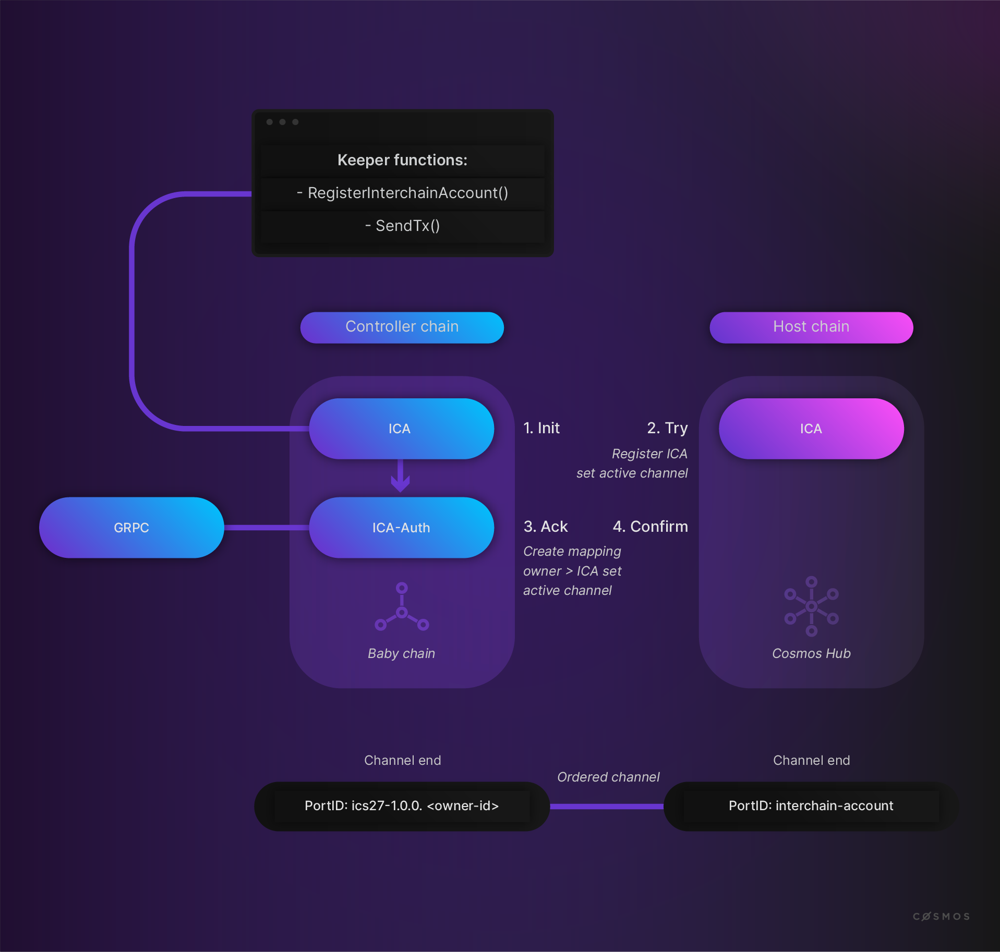
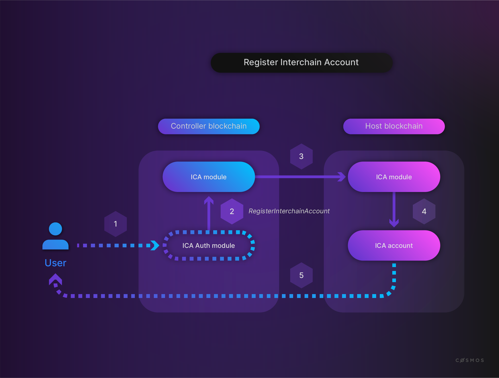
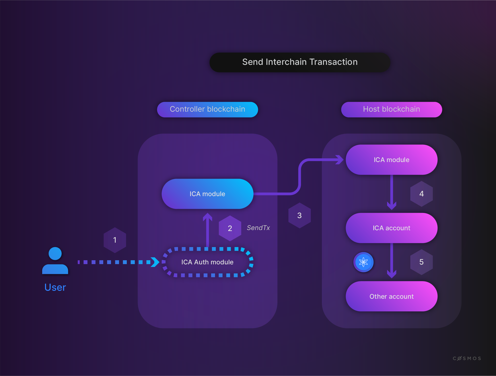

# Interchain Accounts

Another application module implemented in the [IBC-go repository](https://github.com/cosmos/ibc-go/tree/main/modules/apps/27-interchain-accounts) is [Interchain Accounts (ICS-27)](https://github.com/cosmos/ibc/blob/master/spec/app/ics-027-interchain-accounts/README.md)). **Interchain Accounts (ICA)** allow to control an account on a **host chain** from a **controller chain**.



The ICA module itself provides an API to register an account and send inter-chain transactions. A developer can use this module by implementing the **ICA Auth Module** and can expose GRPC endpoints for an application or user.

Have a look at the code and then the handshake and the port binding.

First, have a look at how an account is registered:



To register an account on the host chain, the function [`RegisterInterchainAccount`](https://github.com/cosmos/ibc-go/blob/main/modules/apps/27-interchain-accounts/controller/keeper/account.go) is called on the controller chain:

```go
// RegisterInterchainAccount is the entry point to registering an interchain account.
// It generates a new port identifier using the owner address. It will bind to the 
// port identifier and call 04-channel 'ChanOpenInit'. An error is returned if the port
// identifier is already in use. Gaining access to interchain accounts whose channels
// have closed cannot be done with this function. A regular MsgChanOpenInit must be used.
func (k Keeper) RegisterInterchainAccount(ctx sdk.Context, connectionID, owner string) error {
  portID, err := icatypes.NewControllerPortID(owner)

  ...

  // if there is an active channel for this portID / connectionID return an error
  activeChannelID, found := k.GetOpenActiveChannel(ctx, connectionID, portID)
  if found {
    return sdkerrors.Wrapf(icatypes.ErrActiveChannelAlreadySet, "existing active channel %s for portID %s on connection %s for owner %s", activeChannelID, portID, connectionID, owner)
  }

  ...

  connectionEnd, err := k.channelKeeper.GetConnection(ctx, connectionID)

  ...

  msg := channeltypes.NewMsgChannelOpenInit(portID, string(versionBytes), channeltypes.ORDERED, []string{connectionID}, icatypes.PortID, icatypes.ModuleName)

  ...
}
```

As you can see in the code above, the `portID` is the **Interchain Account owner's** address. The ICA module assumes that there is an established IBC connection between the host and controller chain. As part of `RegisterInterchainAccount`, it opens an `ORDERED` channel.

If the message gets to the host chain with the `NewMsgChannelOpenInit` call above, the ICA module on the host chain also calls [`RegisterInterchainAccount`](https://github.com/cosmos/ibc-go/blob/main/modules/apps/27-interchain-accounts/host/keeper/account.go):

```go
// RegisterInterchainAccount attempts to create a new account using the provided address and
// stores it in state keyed by the provided connection and port identifiers
// If an account for the provided address already exists this function returns early (no-op)
func (k Keeper) RegisterInterchainAccount(ctx sdk.Context, connectionID, controllerPortID string, accAddress sdk.AccAddress) {
  if acc := k.accountKeeper.GetAccount(ctx, accAddress); acc != nil {
    return
  }

  interchainAccount := icatypes.NewInterchainAccount(
    authtypes.NewBaseAccountWithAddress(accAddress),
    controllerPortID,
  )

  k.accountKeeper.NewAccount(ctx, interchainAccount)
  k.accountKeeper.SetAccount(ctx, interchainAccount)

  k.SetInterchainAccountAddress(ctx, connectionID, controllerPortID, interchainAccount.Address)
}
```

Through the `OnChanOpenTry` implementation in the [`handshake.go`](https://github.com/cosmos/ibc-go/blob/main/modules/apps/27-interchain-accounts/host/keeper/handshake.go) on the host chain:

```go
// OnChanOpenTry performs basic validation of the ICA channel
// and registers a new interchain account (if it doesn't exist).
// The version returned will include the registered interchain
// account address.
func (k Keeper) OnChanOpenTry(
  ...
) (string, error) {
  
  ...

  // Register interchain account if it does not already exist
  k.RegisterInterchainAccount(ctx, metadata.HostConnectionId, counterparty.PortId, accAddress)
  
  ...
}
```

A fresh **Interchain Account** is created on the host chain. You can find the implementations of `OnChanOpenInit` and ` OnChanOpenAck` in the [`handshake.go`](https://github.com/cosmos/ibc-go/blob/main/modules/apps/27-interchain-accounts/controller/keeper/handshake.go):

```go
// OnChanOpenInit performs basic validation of channel initialization.
// The channel order must be ORDERED, the counterparty port identifier
// must be the host chain representation as defined in the types package,
// the channel version must be equal to the version in the types package,
// there must not be an active channel for the specified port identifier,
// and the interchain accounts module must be able to claim the channel
// capability.
func (k Keeper) OnChanOpenInit(
  ctx sdk.Context,
  order channeltypes.Order,
  connectionHops []string,
  portID string,
  channelID string,
  chanCap *capabilitytypes.Capability,
  counterparty channeltypes.Counterparty,
  version string,
) error {

  ...

  activeChannelID, found := k.GetActiveChannelID(ctx, connectionHops[0], portID)
  if found {
    channel, found := k.channelKeeper.GetChannel(ctx, portID, activeChannelID)
    if !found {
      panic(fmt.Sprintf("active channel mapping set for %s but channel does not exist in channel store", activeChannelID))
    }

    if channel.State == channeltypes.OPEN {
      return sdkerrors.Wrapf(icatypes.ErrActiveChannelAlreadySet, "existing active channel %s for portID %s is already OPEN", activeChannelID, portID)
    }

    if !icatypes.IsPreviousMetadataEqual(channel.Version, metadata) {
      return sdkerrors.Wrap(icatypes.ErrInvalidVersion, "previous active channel metadata does not match provided version")
    }
  }

  return nil
}

```

**Notice:** there is a one-to-one mapping between an interchain account and a channel.

In the `OnChanOpenAck`, you can see that the channel ID and account address are set in the state:

```go
// OnChanOpenAck sets the active channel for the interchain account/owner pair
// and stores the associated interchain account address in the state keyed by its corresponding port identifier
func (k Keeper) OnChanOpenAck(
  ctx sdk.Context,
  portID,
  channelID string,
  counterpartyVersion string,
) error {

  ...

  k.SetActiveChannelID(ctx, metadata.ControllerConnectionId, portID, channelID)
  k.SetInterchainAccountAddress(ctx, metadata.ControllerConnectionId, portID, metadata.Address)

  return nil
}
```

After registration, the registered account can be used to sign transactions on the host chain:



You can find `SendTx` in the [`relay.go`](https://github.com/cosmos/ibc-go/blob/main/modules/apps/27-interchain-accounts/controller/keeper/relay.go):

```go
// SendTx takes pre-built packet data containing messages to be executed on the host chain from an authentication module and attempts to send the packet.
// The packet sequence for the outgoing packet is returned as a result.
// If the base application has the capability to send on the provided portID. An appropriate
// absolute timeoutTimestamp must be provided. If the packet is timed out, the channel will be closed.
// In the case of channel closure, a new channel may be reopened to reconnect to the host chain.
func (k Keeper) SendTx(ctx sdk.Context, chanCap *capabilitytypes.Capability, connectionID, portID string, icaPacketData icatypes.InterchainAccountPacketData, timeoutTimestamp uint64) (uint64, error) {
  activeChannelID, found := k.GetOpenActiveChannel(ctx, connectionID, portID)

  ...

  sourceChannelEnd, found := k.channelKeeper.GetChannel(ctx, portID, activeChannelID)

  ...

  destinationPort := sourceChannelEnd.GetCounterparty().GetPortID()
  destinationChannel := sourceChannelEnd.GetCounterparty().GetChannelID()

  ...

  return k.createOutgoingPacket(ctx, portID, activeChannelID, destinationPort, destinationChannel, chanCap, icaPacketData, timeoutTimestamp)
}
```

As you can see, it validates the source and destination IDs and uses `createOutgoingPacket` to send a transaction, which calls `SendPacket` of the IBC core module.

On the host chain, `OnRecvPacket` in the [`relay.go`](https://github.com/cosmos/ibc-go/blob/main/modules/apps/27-interchain-accounts/host/keeper/relay.go) is called if a packet arrives:

```go
// OnRecvPacket handles a given interchain accounts packet on a destination host chain.
// If the transaction is successfully executed, the transaction response bytes will be returned.
func (k Keeper) OnRecvPacket(ctx sdk.Context, packet channeltypes.Packet) ([]byte, error) {
  var data icatypes.InterchainAccountPacketData

  if err := icatypes.ModuleCdc.UnmarshalJSON(packet.GetData(), &data); err != nil {
    // UnmarshalJSON errors are indeterminate and therefore are not wrapped and included in failed acks
    return nil, sdkerrors.Wrapf(icatypes.ErrUnknownDataType, "cannot unmarshal ICS-27 interchain account packet data")
  }

  switch data.Type {
  case icatypes.EXECUTE_TX:
    msgs, err := icatypes.DeserializeCosmosTx(k.cdc, data.Data)
    if err != nil {
      return nil, err
    }

    txResponse, err := k.executeTx(ctx, packet.SourcePort, packet.DestinationPort, packet.DestinationChannel, msgs)
    if err != nil {
      return nil, err
    }

    return txResponse, nil
  default:
    return nil, icatypes.ErrUnknownDataType
  }
}
```

Which calls `executeTx` to apply the received transaction on the host chain:

```go
// executeTx attempts to execute the provided transaction. It begins by authenticating the transaction signer.
// If authentication succeeds, it does basic validation of the messages before attempting to deliver each message
// into state. The state changes will only be committed if all messages in the transaction succeed. Thus the
// execution of the transaction is atomic, all state changes are reverted if a single message fails.
func (k Keeper) executeTx(ctx sdk.Context, sourcePort, destPort, destChannel string, msgs []sdk.Msg) ([]byte, error) {
  channel, found := k.channelKeeper.GetChannel(ctx, destPort, destChannel)
  
  ...

  if err := k.authenticateTx(ctx, msgs, channel.ConnectionHops[0], sourcePort); 

  ...

  // CacheContext returns a new context with the multi-store branched into a cached storage object
  // writeCache is called only if all msgs succeed, performing state transitions atomically
  cacheCtx, writeCache := ctx.CacheContext()
  for i, msg := range msgs {
    if err := msg.ValidateBasic(); err != nil {
      return nil, err
    }

    msgResponse, err := k.executeMsg(cacheCtx, msg)
    if err != nil {
      return nil, err
    }

    txMsgData.Data[i] = &sdk.MsgData{
      MsgType: sdk.MsgTypeURL(msg),
      Data:    msgResponse,
    }

  }

  ...
}
```

`authenticateTx` ensures that the provided message contains the correct Interchain Account owner address. `executeMsg` calls the message handler and therefore, executes the message.
