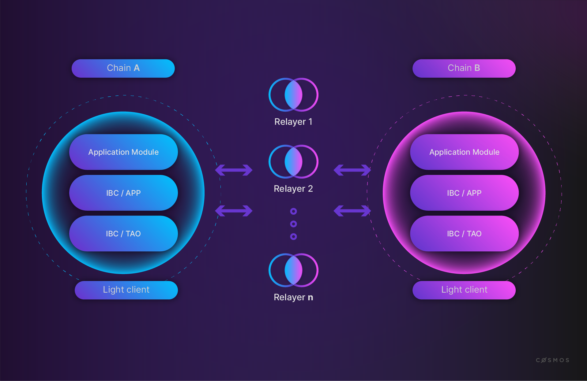

# Relaying in General

In IBC, blockchains do not directly pass messages to each other over the network. To communicate, blockchains commit the state to a precisely defined path reserved for a specific message type and a specific counterparty. Relayers monitor for updates on these paths and relay messages by submitting the data stored under the path along with proof of that data to the counterparty chain.

Events are emitted for every transaction processed by the base application to indicate the execution of some logic clients may want to be aware of. This is extremely useful when relaying IBC packets. Any message that uses IBC will emit events for the corresponding TAO logic executed as defined in the IBC events document.

In the SDK, it can be assumed that for every message there is an event emitted with the type `message`, attribute key `action`, and an attribute value representing the type of message sent. If a relayer queries for transaction events, it can split message events using this event Type/Attribute Key pair.

The Event Type `message` with the Attribute Key `module` may be emitted multiple times for a single message due to application callbacks. It can be assumed that any TAO logic executed will result in a module event emission with the attribute value `ibc_<submodulename>`.

Calling the Tendermint RPC method `Subscribe` via Tendermint's Websocket (opens new window)will return events using Tendermint's internal representation of them. Instead of receiving back a list of events as they were emitted, Tendermint will return the type `map[string][]string` which maps a string in the form `<event_type>.<attribute_key>` to `attribute_value`. This causes extraction of the event ordering to be non-trivial, but still possible.

A relayer should use the `message.action` key to extract the number of messages in the transaction and the type of IBC transactions sent. For every IBC transaction within the string array for `message.action`, the necessary information should be extracted from the other event fields. If `send_packet` appears at index 2 in the value for `message.action`, a relayer will need to use the value at index 2 of the key `send_packet.packet_sequence`. This process should be repeated for each piece of information needed to relay a packet.
