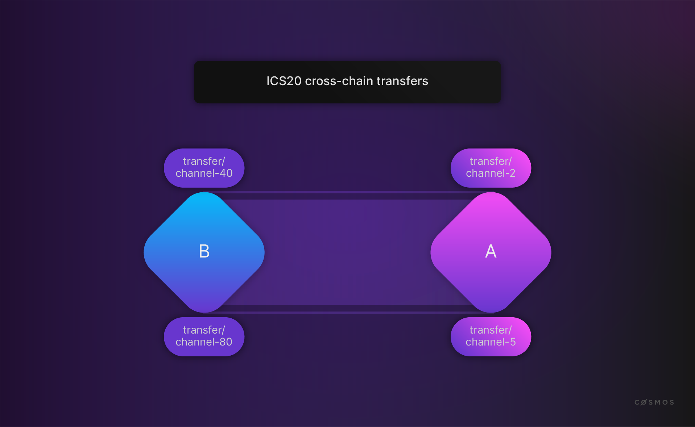
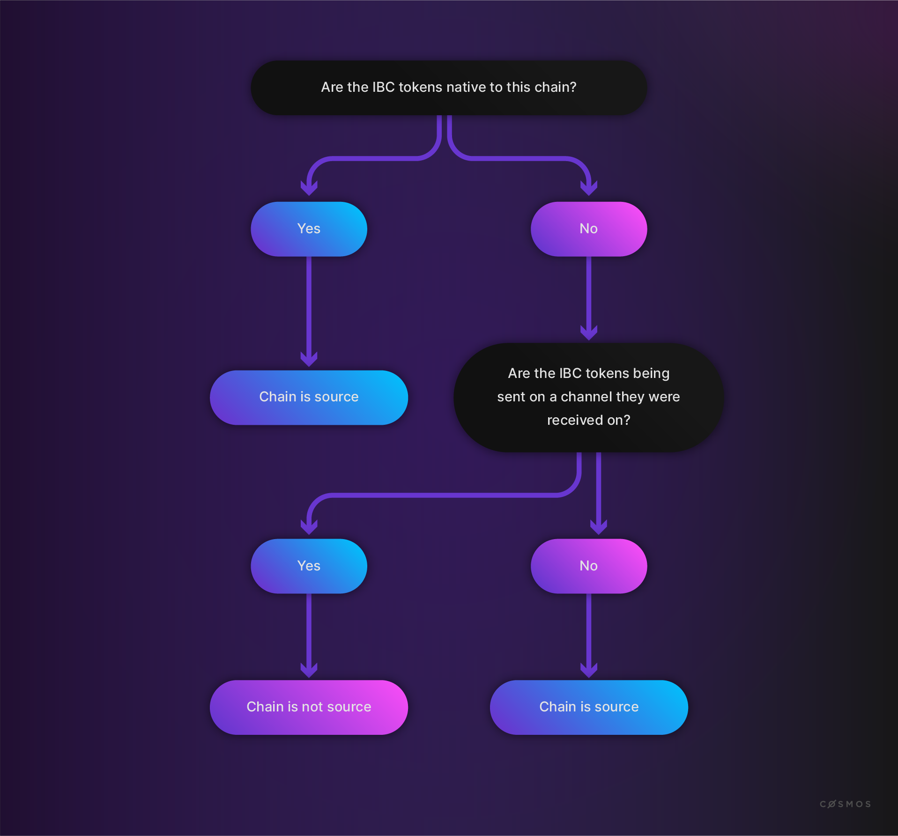
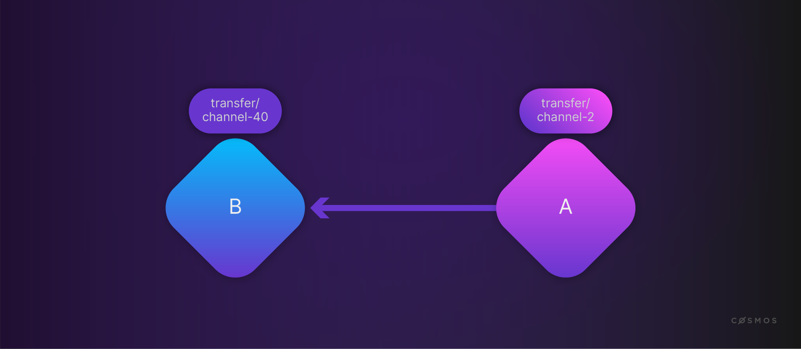
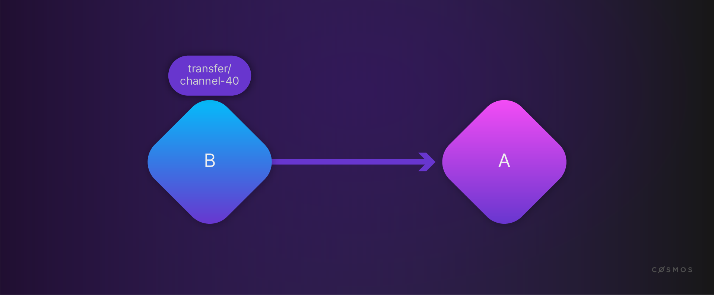
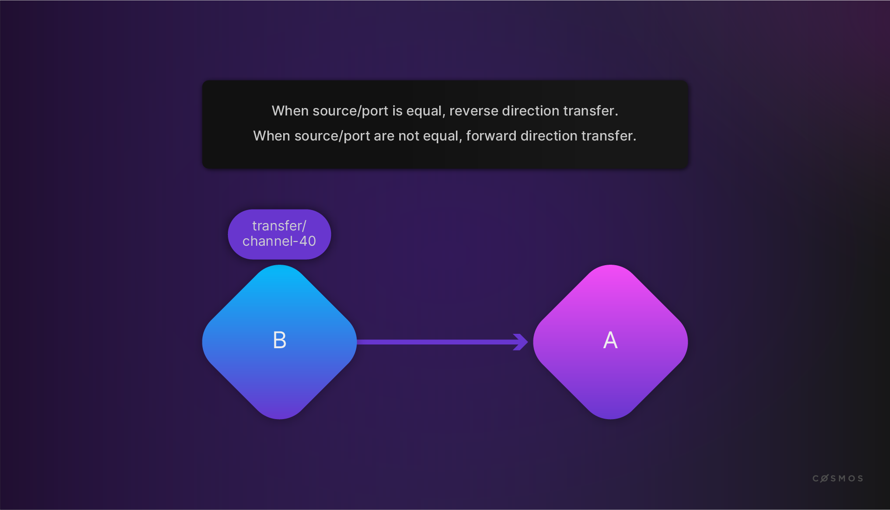

# IBC Fungible Token Transfer

Having looked at the IBC/TAO, you can now take a look at the [ICS-20](https://github.com/cosmos/ibc/blob/master/spec/app/ics-020-fungible-token-transfer/README.md). This describes fungible token transfers. The corresponding [implementation](https://github.com/cosmos/ibc-go/tree/main/modules/apps/transfer) is a module on the application level.



The previous picture shows three chains: A, B, and C. It also shows several channels.

How can tokens be transferred between chains and channels?

**Note:** you can have different channels between two chains, but you cannot transfer the same token across different channels back and forth.

To understand the application logic for a token transfer, first you have to determine the **source** chain:



The application logic can be summarized as follows:

![Application logic]

Before you explore the corresponding code, look at a transfer from **source** to **sink**:



Here, the **source** is chain A. The source channel is **channel-2** and the destination channel is **channel-40**. You see **transfer/channel-...** because the transfer module will bind to a port, which we name "transfer". If chain A sends 100 ATOM tokens, chain B will receive 100 ATOM tokens and append the destination prefix **port/channel-id**. So chain B will mint those 100 ATOM tokens as **transfer/channel-40/atoms**. 

What if the tokens are sent back through the **same channel** from which they were received?



In this case, chain A will "un-escrow" 100 **ATOM tokens**, thus the prefix will be removed. Chain B will burn **transfer/channel-40/atoms**.

**Note:** the prefix determines the **source** chain. If the module sends the token from another channel, chain B will be the source chain and chain A will mint new tokens with a prefix instead of un-escrowing ATOM tokens.



You already know that an application needs to implement the [IBC Module Interface](https://github.com/cosmos/ibc-go/blob/main/modules/core/05-port/types/module.go). Look at the [implementation for the token transfer](https://github.com/cosmos/ibc-go/blob/main/modules/apps/transfer/ibc_module.go), e.g. for `OnChanOpenInit`:

```go
// OnChanOpenInit implements the IBCModule interface
func (im IBCModule) OnChanOpenInit(
  ctx sdk.Context,
  order channeltypes.Order,
  connectionHops []string,
  portID string,
  channelID string,
  chanCap *capabilitytypes.Capability,
  counterparty channeltypes.Counterparty,
  version string,
) error {
  if err := ValidateTransferChannelParams(ctx, im.keeper, order, portID, channelID); err != nil {
    return err
  }

  if version != types.Version {
    return sdkerrors.Wrapf(types.ErrInvalidVersion, "got %s, expected %s", version, types.Version)
  }

  // Claim channel capability passed back by IBC module
  if err := im.keeper.ClaimCapability(ctx, chanCap, host.ChannelCapabilityPath(portID, channelID)); err != nil {
    return err
  }

  return nil
}
```

`OnChanOpenAck`, `OnChanOpenConfirm`, `OnChanCloseInit`, and `OnChanCloseConfirm` will do (almost) no checks.

By contrast, `OnRecvPacket` will decode a packet and apply the transfer token application logic:

```go
// OnRecvPacket implements the IBCModule interface. A successful acknowledgement
// is returned if the packet data is successfully decoded and the receive application
// logic returns without error.
func (im IBCModule) OnRecvPacket(
  ctx sdk.Context,
  packet channeltypes.Packet,
  relayer sdk.AccAddress,
) ibcexported.Acknowledgement {
  ack := channeltypes.NewResultAcknowledgement([]byte{byte(1)})

  var data types.FungibleTokenPacketData
  if err := types.ModuleCdc.UnmarshalJSON(packet.GetData(), &data); err != nil {
    ack = channeltypes.NewErrorAcknowledgement("cannot unmarshal ICS-20 transfer packet data")
  }

  // only attempt the application logic if the packet data
  // was successfully decoded
  if ack.Success() {
    err := im.keeper.OnRecvPacket(ctx, packet, data)
    if err != nil {
      ack = types.NewErrorAcknowledgement(err)
    }
  }

  ctx.EventManager().EmitEvent(
    sdk.NewEvent(
      types.EventTypePacket,
      sdk.NewAttribute(sdk.AttributeKeyModule, types.ModuleName),
      sdk.NewAttribute(types.AttributeKeyReceiver, data.Receiver),
      sdk.NewAttribute(types.AttributeKeyDenom, data.Denom),
      sdk.NewAttribute(types.AttributeKeyAmount, data.Amount),
      sdk.NewAttribute(types.AttributeKeyAckSuccess, fmt.Sprintf("%t", ack.Success())),
    ),
  )

  // NOTE: acknowledgment will be written synchronously during IBC handler execution.
  return ack
}
```

Look at the type [definition of a token packet](https://github.com/cosmos/ibc-go/blob/main/proto/ibc/applications/transfer/v2/packet.proto) before diving further into the code:

```protobuff
syntax = "proto3";

package ibc.applications.transfer.v2;

option go_package = "github.com/cosmos/ibc-go/v3/modules/apps/transfer/types";

// FungibleTokenPacketData defines a struct for the packet payload
// See FungibleTokenPacketData spec:
// https://github.com/cosmos/ibc/tree/master/spec/app/ics-020-fungible-token-transfer#data-structures
message FungibleTokenPacketData {
  // the token denomination to be transferred
  string denom = 1;
  // the token amount to be transferred
  string amount = 2;
  // the sender address
  string sender = 3;
  // the recipient address on the destination chain
  string receiver = 4;
}
```

Where does the module send a token? Look at the [msg_serve.go](https://github.com/cosmos/ibc-go/blob/main/modules/apps/transfer/keeper/msg_server.go) of the token transfer module:

```go
// Transfer defines a rpc handler method for MsgTransfer.
func (k Keeper) Transfer(goCtx context.Context, msg *types.MsgTransfer) (*types.MsgTransferResponse, error) {

  ...

  if err := k.SendTransfer(
    ctx, msg.SourcePort, msg.SourceChannel, msg.Token, sender, msg.Receiver, msg.TimeoutHeight, msg.TimeoutTimestamp,
  ); err != nil {
    return nil, err
  }
  ...

}
```

There you see `SendTransfer`, which implements the application logic after [cheking if the sender is a source or sink chain](https://github.com/cosmos/ibc-go/blob/main/modules/apps/transfer/types/coin.go):

```go
func (k Keeper) SendTransfer(
  ctx sdk.Context,
  sourcePort,
  sourceChannel string,
  token sdk.Coin,
  sender sdk.AccAddress,
  receiver string,
  timeoutHeight clienttypes.Height,
  timeoutTimestamp uint64,
) 

  ...

  // deconstruct the token denomination into the denomination trace info
  // to determine if the sender is the source chain
  if strings.HasPrefix(token.Denom, "ibc/") {
    fullDenomPath, err = k.DenomPathFromHash(ctx, token.Denom)
    if err != nil {
      return err
    }
  }

  ...

  // NOTE: SendTransfer simply sends the denomination as it exists on its own
  // chain inside the packet data. The receiving chain will perform denom
  // prefixing as necessary.

  if types.SenderChainIsSource(sourcePort, sourceChannel, fullDenomPath) {

    ...

    // create the escrow address for the tokens
    escrowAddress := types.GetEscrowAddress(sourcePort, sourceChannel)

    // escrow source tokens. It fails if balance insufficient.
    if err := k.bankKeeper.SendCoins(...)

  } else {
   
   ...

    if err := k.bankKeeper.SendCoinsFromAccountToModule(...); 

    ...

    if err := k.bankKeeper.BurnCoins(...); 

    ...
  }

  packetData := types.NewFungibleTokenPacketData(
    fullDenomPath, token.Amount.String(), sender.String(), receiver,
  )
...

}
```
