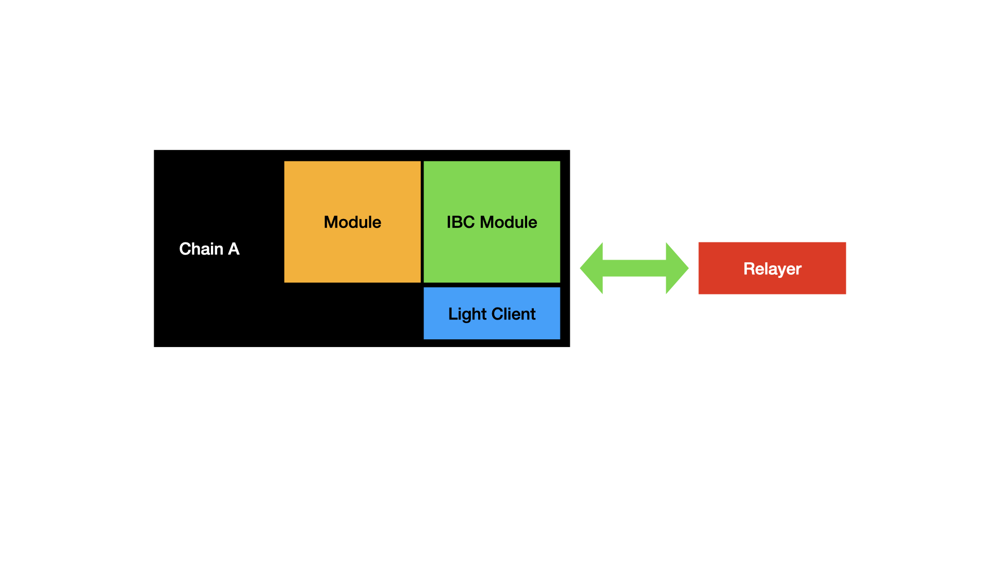
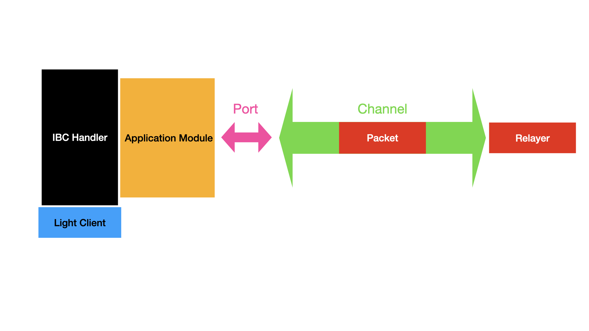
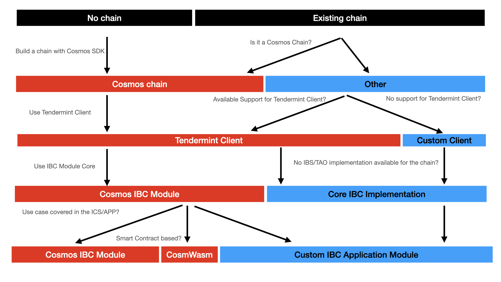

# Introduction: What is IBC?

The [(Inter-Blockchain Communication (IBC)](https://ibcprotocol.org/) Protocol is _a protocol to handle authentication and transport of data between two blockchains_. IBC **requires a minimal set of functions**, specified in the [Interchain Standards (ICS)](https://github.com/cosmos/ibc/tree/master/spec/ics-001-ics-standard). Notice that those specifications do not limit the network topology or consensus algorithm, so IBC can be used with a wide range of blockchains or state machines. IBC is intended to work in execution environments where participants do not necessarily trust each other.

<HighlightBox type="info">

IBC solves a widespread problem, namely cross-chain communication. This problem exists on public blockchains when exchanges wish to perform swaps. The problem emerges earlier in the case of application-specific blockchains where every asset is likely to emerge from its own purpose-built chain. Cross-chain communication is also a challenge in the world of private blockchains in cases where communication with a public chain or other private chains is desirable. There are already [IBC implementations for private blockchains such as Hyperledger Fabric and Corda](https://www.hyperledger.org/blog/2021/06/09/meet-yui-one-the-new-hyperledger-labs-projects-taking-on-cross-chain-and-off-chain-operations).

</HighlighBox>

## Internet of blockchains

IBC is essential for application-specific blockchains like Cosmos. It offers a standard communication channel for applications on two different chains that need to communicate with each other.

More details on the specifications will follow in the next section, but notice that IBC is not limited to Cosmos blockchains. Solutions can even be found for cases where some requirements are not initially met. An example of such cases is the use of IBC for Proof-of-Work (PoW) blockchains like Ethereum, as a PoW consensus algorithm which does not ensure finality. Ethereum-compatibility is enabled by creating a peg-zone where probabilistic finality is considered deterministic (i.e. irreversible) after a given threshold of block confirmations.

Although application-specific blockchains offer superior scalability compared to general-purpose blockchain platforms, smart contract development for general-purpose chains and generic virtual machines (VMs), e.g. Ethereum, offer their own benefits. IBC provides a method of incorporating the strengths of general-purpose and application-specific blockchains into unified overall designs. It allows, for example, a Cosmos chain tailored towards performance and scaleability to use funds that originate on Ethereum and possibly record events in a Corda distributed ledger or, in the reverse, a Corda ledger initiating the transfer of underlying assets defined in Cosmos or Ethereum.

New concepts such as Interchain Accounts will continue to further increase adoption times and the possibilities IBC offers: a blockchain will be able to control an account on another blockchain with Interchain Accounts.

## Architecture

Assume we have two chains: **chain *A* and chain *B***. Both will implement the ICS for IBC.

Notice three crucial elements in the diagram above:

* The chains use relayers to communicate;
* Chains can use different relayers to send messages to each other;
* Each side of the relay uses the light client of the other chain to quickly verify incoming messages.

In fact, the relayer listens and picks up messages from a channel to forward them. Both chains implement IBC and first initiate a connection to then establish channels. Notice that relayers ensure that both chains know that a package has been transmitted.

The interface exposed by the standard IBC implementation is referred to as the [IBC handler](https://github.com/cosmos/ibc/tree/master/spec/core/ics-025-handler-interface). Modules can use the IBC handler for client, connection, and channel lifecycle management, and to send and receive packets.

For each connection between two blockchains, different channels can be established. **Channels** provide the ordered exactly-once delivery of packets and handle module permissioning through **ports**. A **module** is bound to a port and channels are end-to-end between two ports. The relevant abstraction layer for IBC application developers is that of channels and ports. IBC modules can bind to any number of ports.

IBC clients are **light clients** that are identified by a unique client ID. IBC clients track the consensus state of other blockchains and the proof specs of those blockchains required to properly verify proofs against the client's consensus state. A client can be associated with any number of connections to the counterparty chain.

## Implemantations

IBC is not just a specification on a whitepaper, it is used for hundreds of thousands of transactions per day across various chains.

<HighlightBox type="tip">

Have a look at the [Map of Zones](https://mapofzones.com/?testnet=false&period=24&tableOrderBy=totalIbcTxs&tableOrderSort=desc) to get an overview of blockchains with IBC implementation. In it, you can see some blockchains like the Cosmos Hub or Osmosis connected to a lot of other blockchains - they are used by many applications.

</HighlightBox>

Some **IBC-related implementations** to highlight are:

* **The [IBC module](https://github.com/cosmos/ibc-go):** The implementation of the IBC protocol for the Cosmos SDK;
* **[Hermes](https://hermes.informal.systems/relayer.html):** A widely-used relayer written in Rust;
* **The [Gravity Bridge](https://github.com/cosmos/gravity-bridge):** A great example of a peg-zone, which allows the transfer of ERC-20 tokens to Cosmos-based blockchains and back.

Some **IBC clients** described in the ICS and implemented in the IBC module are:

* **`solomachine` light client:** Devices such as phones, browsers, or laptops;
* **Tendermint light client:** The default for Cosmos SDK chains;
* **Localhost (loopback) client:** Useful for testing, simulation, and relaying packets to modules on the same application.

## Your path

As mentioned before, IBC is such a generic protocol that it can be used to connect all kinds of blockchains. Still, there are different paths that create different workloads depending on the reference implementations available.

The fastest way to use IBC is to rely on the Tendermint light client and Cosmos reference implementations for IBC. Notice that if the IBC protocol is implemented and you are at the end of a path, you can use any relayer to connect two blockchains.

ICS also offers specifications for the application layer, e.g. for the [transfer of fungible tokens](https://github.com/cosmos/ibc/tree/master/spec/app/ics-020-fungible-token-transfer) between two modules on separate chains, which is also implemented in the [reference IBC implementation](https://github.com/cosmos/ibc-go/tree/main/modules/apps/transfer). In addition, you can find an [Interchain Accounts](https://github.com/cosmos/ibc-go/tree/main/modules/apps/27-interchain-accounts) implementation, which can be extremely useful to develop your application logic if no ISC regarding the use case already exists.
