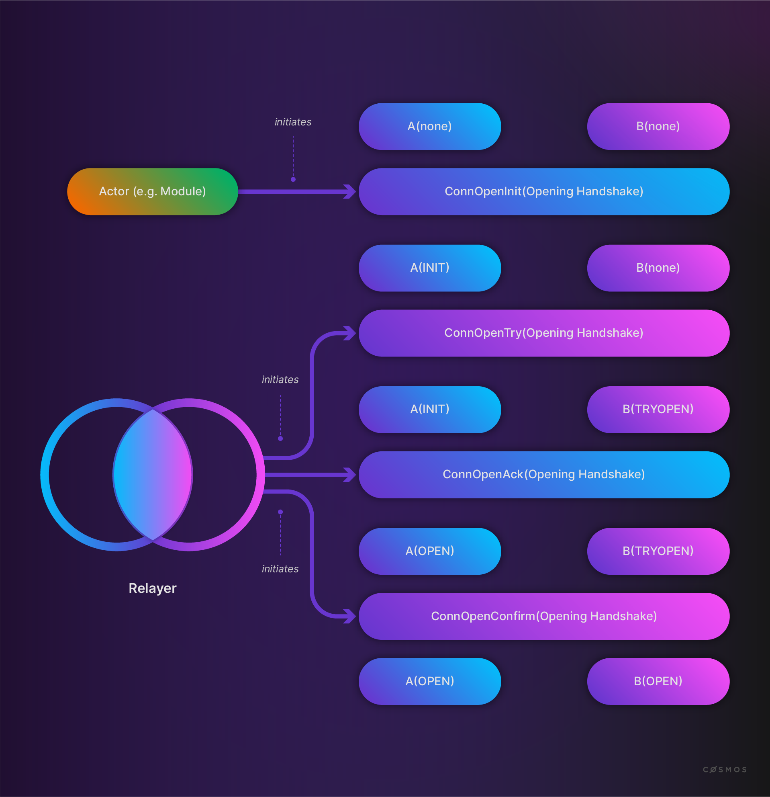
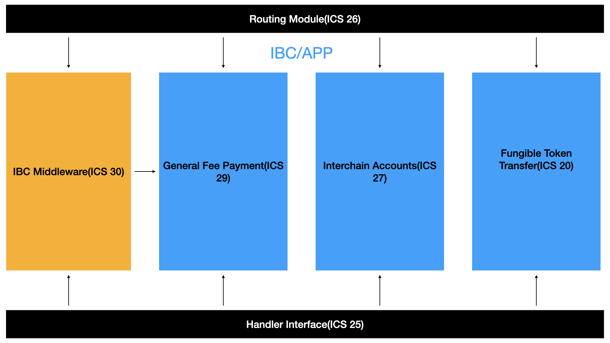

# What is IBC?

The **[(Inter-Blockchain Communication (IBC)](https://ibcprotocol.org/) Protocol** is _a protocol to handle authentication and transport of data between two blockchains_. IBC **requires a minimal set of functions**, specified in the [Interchain Standards (ICS)](https://github.com/cosmos/ibc/tree/master/spec/ics-001-ics-standard). Notice that those specifications do not limit the network topology or consensus algorithm, so IBC can be used with a wide range of blockchains or state machines. The IBC protocol provides a permissionless way for relaying data packets between blockchains, unlike most trusted bridging technologies. The security of IBC reduces to the security of the participating chains.

IBC solves a widespread problem: cross-chain communication. This problem exists on public blockchains when exchanges wish to perform swaps. The problem arises early on in the case of application-specific blockchains where every asset is likely to emerge from its own purpose-built chain. Cross-chain communication is also a challenge in the world of private blockchains in cases where communication with a public chain or other private chains is desirable. There are already [IBC implementations for private blockchains such as Hyperledger Fabric and Corda](https://www.hyperledger.org/blog/2021/06/09/meet-yui-one-the-new-hyperledger-labs-projects-taking-on-cross-chain-and-off-chain-operations).

Cross-chain communication in Cosmos enables parallelism and scaleability with transaction finality. This transaction finality solves well-known problems that plague other platforms: transaction costs, network capacity, and transaction confirmation finality.

## Internet of blockchains

IBC is essential for application-specific blockchains like the ones in the Cosmos network. It offers a standard communication channel for applications on two different chains that need to communicate with each other.

Most Cosmos applications execute on their own purpose-built blockchain running their own validator set. These are the application-specific blockchains built with the Cosmos SDK. Applications on one chain may need to communicate with applications on another blockchain. For example, an application could accept tokens from another blockchain as a form of payment. Interoperability at this level calls for a method of exchanging data about the state or the transactions on another blockchain. While such bridges between blockchains can be built and do exist, they are generally constructed ad-hoc. IBC provides all Cosmos SDK applications with a common protocol and framework for implementing standardized inter-blockchain communication.

IBC is an end-to-end, connection-oriented, stateful protocol for reliable, ordered, and authenticated communication between heterogeneous blockchains arranged in an unknown and dynamic topology. It is possible by specifying a set of data structures, abstractions, and semantics that can be implemented by any distributed ledger provided they satisfy a small set of requirements.

<HighlightBox type="info">

More details on the specifications will follow in the next section, but notice that IBC is not limited to Cosmos blockchains. Solutions can even be found for cases where some requirements are not initially met. An example of such a case is the use of IBC for Proof-of-Work (PoW) blockchains like Ethereum. As a PoW consensus algorithm does not ensure finality, one of the main requirements to use IBC is not met. Still, Ethereum-compatibility is enabled by creating a peg-zone where probabilistic finality is considered deterministic (irreversible) after a given threshold of block confirmations.

</HighlightBox>

Although application-specific blockchains offer superior scalability compared to general-purpose blockchain platforms, smart contract development for general-purpose chains and generic virtual machines (VMs) like in Ethereum offer their own benefits. IBC provides a method of incorporating the strengths of general-purpose and application-specific blockchains into unified overall designs. For example, it allows a Cosmos chain tailored towards performance and scalability to use funds that originate on Ethereum and possibly record events in a Corda distributed ledger or, in the reverse, a Corda ledger initiating the transfer of underlying assets defined in Cosmos or Ethereum.

With cross-chain communication via IBC, a decentralized network of independent and interoperable chains exchanging information and assets is possible. This "internet of blockchains" brings the promise of increased and seamless scalability. In Cosmos, the vision being implemented is to have a universe of independent chains that are all connected using peg-zones as bridges between the Cosmos network and chains outside of it and connecting all chains via hubs. All of these make up the internet of blockchains.

## Interchain Standards (ICS)

There are two categories (aside from __meta__) that define ICS in the [general ICS definition](https://github.com/cosmos/ibc/blob/master/spec/ics-001-ics-standard/README.md):

* **IBC/TAO:** a standard defining an inter-blockchain communication system core transport, authentication, and ordering-layer protocol.
* **IBC/APP:** a standard defining an inter-blockchain communication system application-layer protocol.

Assume we have two chains: **chain *A* and chain *B***. Both will implement the ICS/TAO for IBC.

Notice three crucial elements in the diagram:

* The chains depend on relayers to communicate.
* Many relayers can serve one or more channels to send messages between the chains.
* Each side of the relay uses the light client of the other chain to quickly verify incoming messages.

### IBC/TAO - transport layer

The transport layer (TAO) provides the necessary infrastructure to establish secure connections and authenticate data packets between chains. The application layer defines exactly how data packets should be packaged and interpreted by the sending and receiving chains.

The great promise of IBC is the possibility of optimizing not only on the transport layer but also on the layers above it: a powerful and secure but ultimately generic and permissionless transport layer, which supports any number of diverse and innovative applications from asset transfers and oracle data provision to decentralized identities and cross-chain, synchronous transaction validation built on top of it.

In the diagram, the relationship between the ICS definitions in the category TAO are illustrated - the arrows illustrating the requirements.

Simply put, the transport layer includes:

* Clients - ICS [2](https://github.com/cosmos/ibc/tree/master/spec/core/ics-002-client-semantics), [6](https://github.com/cosmos/ibc/tree/master/spec/client/ics-006-solo-machine-client), [7](https://github.com/cosmos/ibc/tree/master/spec/client/ics-007-tendermint-client), [5](https://github.com/cosmos/ibc/tree/master/spec/client/ics-008-wasm-client), [9](https://github.com/cosmos/ibc/tree/master/spec/client/ics-009-loopback-client), [10](https://github.com/cosmos/ibc/tree/master/spec/client/ics-010-grandpa-client)
  In IBC, the algorithm utilized to verify the consensus transcript and state sub-components of another machine is referred to as a "validity predicate". Pairing the validity predicate with a state the verifier assumes to be correct forms the _light client_ (often shortened to _client_). In the IBC protocol, an actor, which may be an end-user, an off-chain process, or a machine, needs to be able to verify updates to the state of another machine to which the other machine's consensus algorithm has agreed to, and reject any possible updates which the other machine's consensus algorithm has not agreed to. A light client is an algorithm with which a machine can do so. The standard formalizes the light client model and requirements in a way that the IBC protocol can easily integrate with new machines running new consensus algorithms - as long as the associated light client algorithms fulfill the listed requirements.
* Connection semantics - [ICS 3](https://github.com/cosmos/ibc/tree/master/spec/core/ics-003-connection-semantics)
  Connections encapsulate two `ConnectionEnd` objects on two separate blockchains. Each `ConnectionEnd` is associated with a light client of the other blockchain - for example, the counterparty blockchain. The connection handshake is responsible for verifying that the light clients on each chain are the correct ones for their respective counterparties. Connections, once established, are responsible for facilitating all cross-chain verifications of an IBC state. A connection can be associated with any number of channels. 
  How is a connection established with a handshake?

  

* Channel semantics - [ICS 4](https://github.com/cosmos/ibc/tree/master/spec/core/ics-004-channel-and-packet-semantics)
  A module on one blockchain can communicate with other modules on other blockchains by sending, receiving, and acknowledging packets through channels that are uniquely identified by the (`channelID`, `portID`) tuple. Establishing a channel with a handshake: 

  

* Port allocation - [ICS 5](https://github.com/cosmos/ibc/tree/master/spec/core/ics-005-port-allocation)
  An IBC module can bind to any number of ports. Each port must be identified by a unique `portID`. Since IBC is designed to be secure with mutually distrusted modules operating on the same ledger, binding a port returns a dynamic object capability. To take action on a particular port (for example, an open channel with its portID), a module must provide the dynamic object capability to the IBC handler. This requirement prevents a malicious module from opening channels with ports it does not own. Thus, IBC modules are responsible for claiming the capability that is returned on `BindPort`.
  
  

* Vector commitments -[ICS 23](https://github.com/cosmos/ibc/tree/master/spec/core/ics-023-vector-commitments)
  The proof format that all implementations must be able to produce and verify.
* Host requirements - [ICS 24](https://github.com/cosmos/ibc/tree/master/spec/core/ics-024-host-requirements)
  The paths that all IBC implementations must use to commit IBC messages.
* Relayer - [ICS 18](https://github.com/cosmos/ibc/tree/master/spec/relayer/ics-018-relayer-algorithms)
  Relayer algorithms are the "physical" connection layer of IBC — off-chain processes responsible for relaying data between two chains running the IBC protocol by scanning the state of each chain, constructing appropriate datagrams, and executing them on the opposite chain as is allowed by the protocol.

While this background information is useful, IBC modules do not need to interact at all with these lower-level abstractions.

### IBC/APP - application layer

IBC also offers ICS definitions for applications:

* Fungible token transfer - [ICS 20](https://github.com/cosmos/ibc/tree/master/spec/app/ics-020-fungible-token-transfer)
  This logic constitutes a "fungible token transfer bridge module" interfacing between the IBC routing module and an existing asset tracking module on the host state machine.
* Interchain Accounts - [ICS 27](https://github.com/cosmos/ibc/tree/master/spec/app/ics-027-interchain-accounts)
  ICS-27 Interchain Accounts outlines a cross-chain account management protocol built on IBC. ICS-27-enabled chains can programmatically create accounts on other ICS-27-enabled chains and control these accounts via IBC transactions, instead of having to sign with a private key. Interchain Accounts contain all of the capabilities of a normal account (i.e. stake, send, vote) but instead are managed by a separate chain via IBC in a way such that the owner account on the controller chain retains full control over any interchain account(s) it registers on host chain(s).
* General relayer incentivization mechanism - [ICS 29](https://github.com/cosmos/ibc/tree/master/spec/app/ics-029-fee-payment)
  Incentivize relayers for scaling.
* IBC application middleware - [ICS 30](https://github.com/cosmos/ibc/tree/master/spec/app/ics-030-middleware)
  The middleware allows developers to define the extensions as separate modules that can wrap over the base application.

<HighlightBox type="info">

This list can be and will be extended with time. New concepts such as Interchain Accounts will continue to further decrease adoption times and provide new possibilities to what IBC offers - a blockchain can control an account on another blockchain with Interchain Accounts.

</HighlightBox>

## Custom application

The interface exposed by the standard IBC implementation is referred to as the **[IBC handler](https://github.com/cosmos/ibc/tree/master/spec/core/ics-025-handler-interface)**. Modules can use the IBC handler for client, connection, and channel lifecycle management, and to send and receive packets.

A packet is first received by the handler of the application module before getting passed down to callbacks on the IBC core handler. In addition, an acknowledgment is sent back to the packet sender.

For each connection between two blockchains, different channels can be established. **Channels** provide the (possibly ordered) exactly-once delivery of packets and handle module permissioning through **ports**. A **module** is bound to a port, and channels are end-to-end between two ports.

## Implementations

IBC is not just a specification in a whitepaper, it is used for hundreds of thousands of transactions per day across various chains.

<HighlightBox type="tip">

Have a look at the [Map of Zones](https://mapofzones.com/?testnet=false&period=24&tableOrderBy=totalIbcTxs&tableOrderSort=desc) to get an overview of blockchains with IBC implementation. In it, you can find blockchains like the Cosmos Hub or Osmosis and see how they are connected to a lot of other blockchains - they are used by many applications.

</HighlightBox>

Some **IBC-related implementations** to highlight are:

* **[IBC module](https://github.com/cosmos/ibc-go).** The implementation of the IBC protocol for the Cosmos SDK.
* **[Hermes](https://hermes.informal.systems/relayer.html).** A widely-used relayer written in Rust.
* **[Osmosis](https://github.com/osmosis-labs/osmosis).** A decentralized exchange, also called automated market maker, for Cosmos.
* **[Gravity Bridge](https://github.com/cosmos/gravity-bridge).** An example that allows the transfer of ERC-20 tokens to Cosmos-based blockchains and back.

Some **IBC clients** described in the ICS and implemented in the IBC module are:

* **`solomachine` light client.** Devices such as phones, browsers, or laptops.
* **Tendermint light client.** The default for Cosmos SDK chains.

<HighlightBox type="tip">

The status of the light client development is listed on the [IBC website](https://ibcprotocol.org/lightClients/).

You can find documentation on the supported IBC clients here:

* [Cosmos SDK documentation: `solomachine` light client](https://github.com/cosmos/ibc-go/blob/main/modules/light-clients/06-solomachine)
* [Cosmos SDK documentation: Tendermint light client](https://github.com/cosmos/ibc-go/blob/main/modules/light-clients/07-tendermint)

</HighlightBox>

## Your path

As mentioned before, IBC is such a generic protocol that it can be used to connect all kinds of blockchains. When it comes to developing a blockchain (application), different paths create different workloads depending on the reference implementations available and your design choices.

The most straightforward way to use IBC is to build a chain with the Cosmos SDK, which already includes the IBC module - as you can see when taking a look at the [IBC-Go repository](https://github.com/cosmos/ibc-go). The IBC module supports an out-of-the-box Tendermint light client. Other implementations are possible but may require further development of the necessary components. Once IBC is implemented, any relayer can start relaying between the chains.

Remember ICS also offers specifications for the application layer, for example, for the [transfer of fungible tokens](https://github.com/cosmos/ibc/tree/master/spec/app/ics-020-fungible-token-transfer) between two modules on separate chains, which is also implemented in the [reference IBC implementation](https://github.com/cosmos/ibc-go/tree/main/modules/apps/transfer). In addition, there is also an [Interchain Accounts implementation](https://github.com/cosmos/ibc-go/tree/main/modules/apps/27-interchain-accounts), which can be extremely useful to develop your application logic if no ISC regarding the use case already exists.

## Next up

On your way to becoming a Cosmos SDK developer expert in IBC? In the next section, you can dive even deeper into IBC and discover information on how to develop with IBC.
