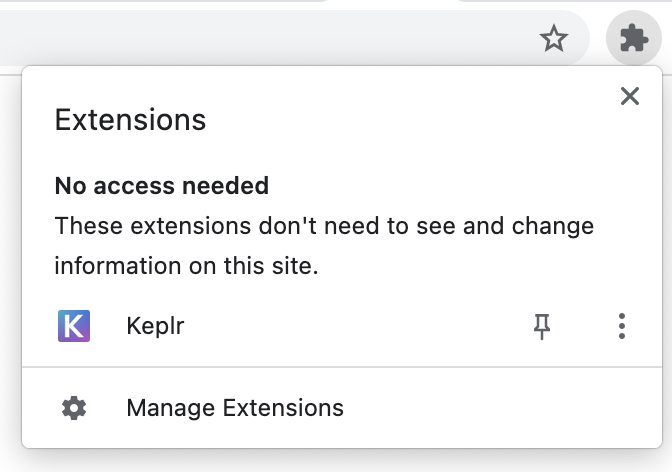
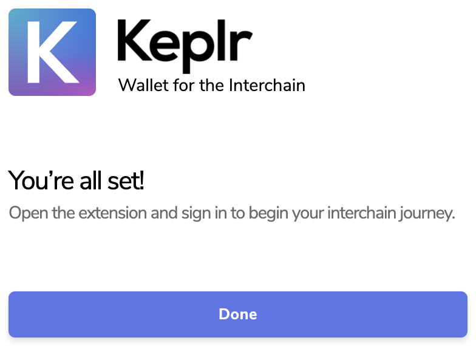
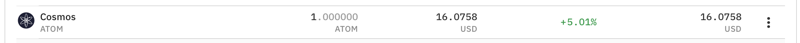
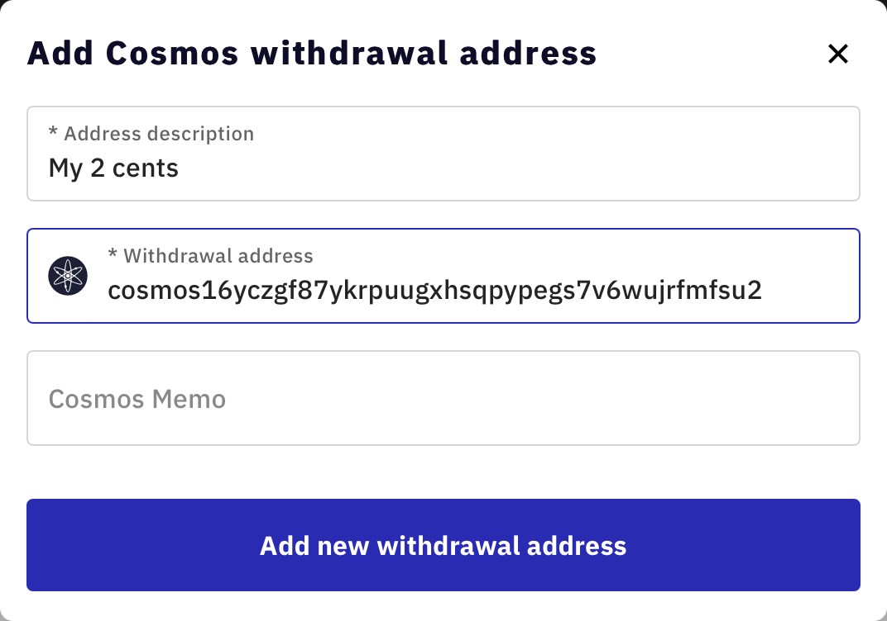
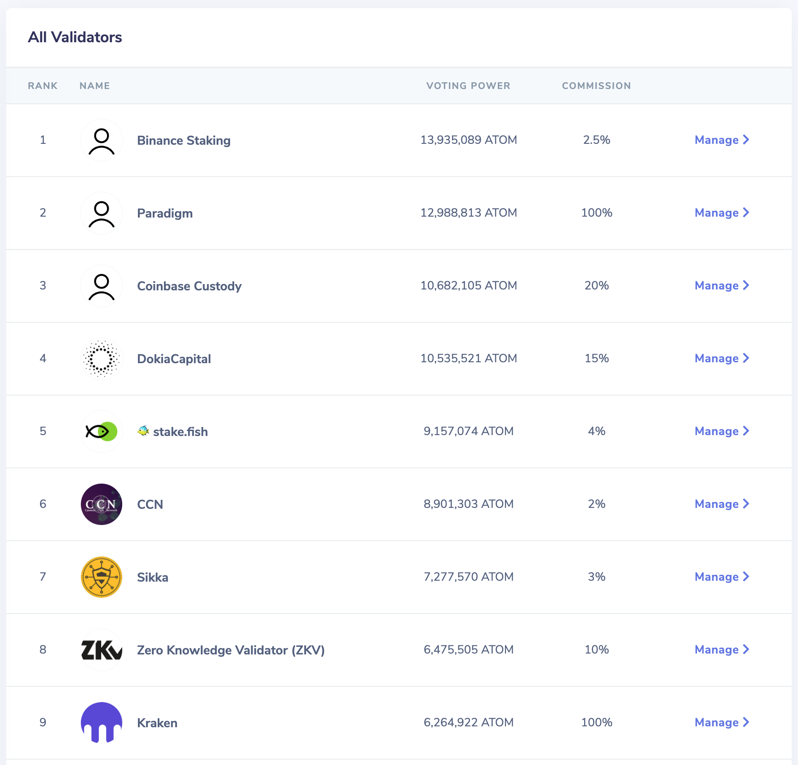
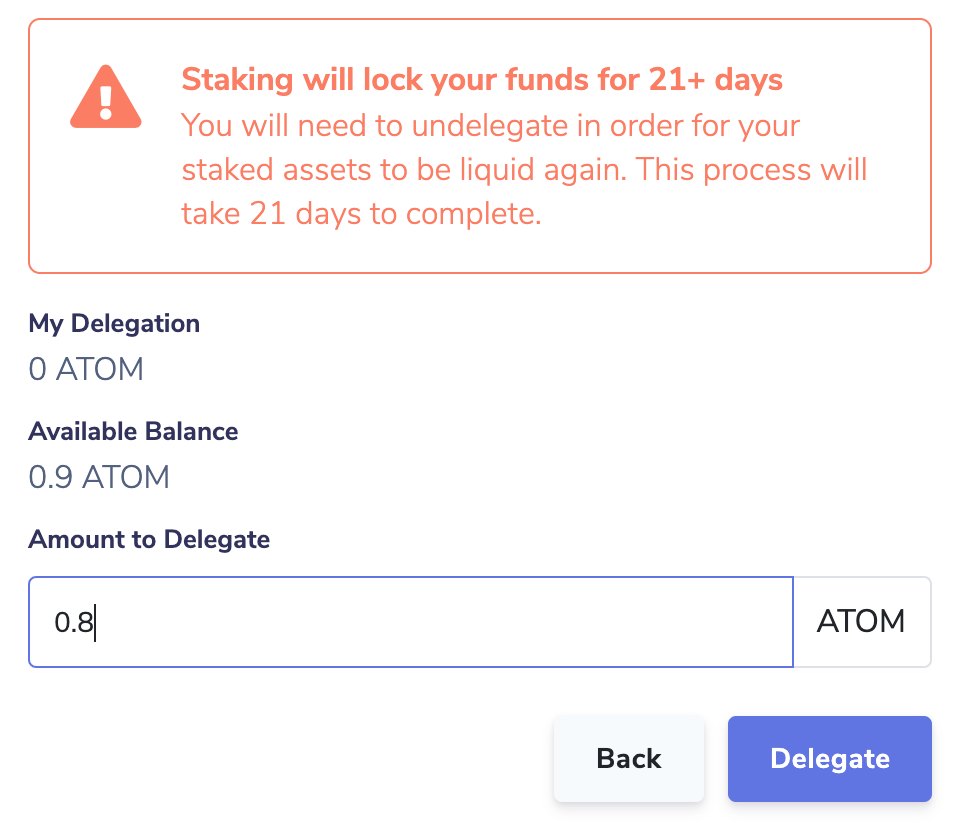
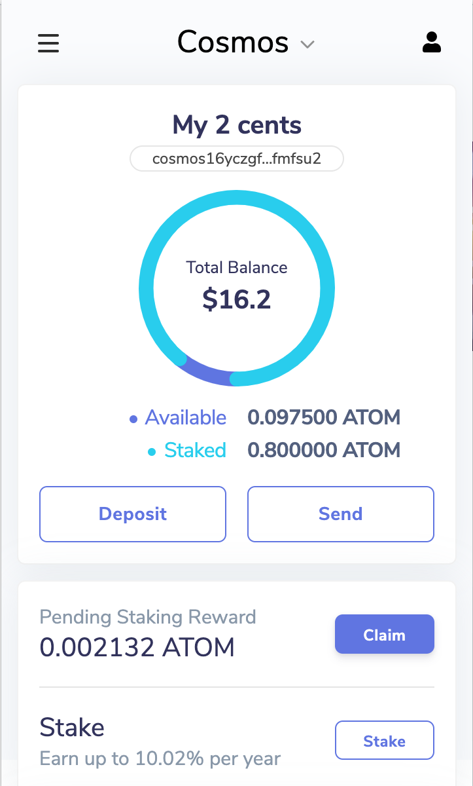

# Getting ATOM and Staking

<!-- This content could be linked to from https://cosmos.network/learn/get-atom as a step-by-step. -->

The [Cosmos Hub](https://hub.cosmos.network) is the first among equals of Cosmos blockchains. ATOM is the native token of the Cosmos Hub, also called the staking token. You need some ATOM to be able to transact on the Cosmos Hub or to participate in the proof-of-stake (PoS) consensus. Because of its usefulness, some markets determine the ATOM price in common currencies.

So let's get your feet wet. You are going to:

1. Get some ATOM.
2. Participate in the consensus, thereby earning yield on our ATOMs while sleeping, or studying further.

<HighlightBox type="info">

We cover all the main concepts in the next chapter. For now, you will get through with a surface-level understanding.

</HighlightBox>

The simple step of _get some ATOM_ hides multiple steps:

1. Install a wallet application, and configure it safely. You will use [Keplr](https://keplr.app/).
2. Buy some ATOM on an exchange, and transfer them to your wallet.

Let's get started.

## Setting up Keplr

First, the easiest part, open Google Chrome on your computer and go to the [Keplr extension page](https://chrome.google.com/webstore/detail/keplr/dmkamcknogkgcdfhhbddcghachkejeap). Alternatively, you can search by yourself for Keplr in the [Chrome extensions store](https://chrome.google.com/webstore/search/Keplr). Indeed, it is always good practice to be a bit suspicious of links to wallets as sometimes fraudulent ones are published to steal from you. Good thing, Keplr is mentioned, and linked, [here](https://cosmos.network/ecosystem/wallets), lending it some credibility.

When it is installed, it should be available in your list of extensions when you click on the icon in the top-right corner of Chrome:

You can go ahead and pin it if you want.

<HighlightBox type="warn">

When you own ATOM with Keplr, **you are in charge**. For real. There is no one you can call because _you forgot your password_, _your hard disk crashed_, or _you sent tokens to the wrong address_.

In the jargon, Keplr is a non-custodial wallet.

</HighlightBox>

Now, with the Keplr extension installed and the above warning in mind, let's create a new account. Click on your Keplr extension and the following page should open:

Click _Create new account_. The page that opens offers you a mnemonic, a secret list of words, and asks you for a password. Because **you are in charge**, it is important to understand the following points:

1. Whoever knows the **mnemonic seed**, the list of words, has access to **all** the assets in this wallet as easily as you do with your wallet. This means that:
    1. Nobody else should be looking at your screen right now. If that is not the case, click _Back_.
    2. You should share your mnemonic seed only with trusted partners, if at all. DO NOT share it with an exchange, a proof-of-stake validator, another blockchain service, or "someone from Cosmos" on the phone  - these are _not_ trusted partners.
    3. You should save the mnemonic seed in safe places, typically on paper, so that you can import it back in this or another wallet at a later date. MAKE SURE you write it down somewhere safe.
2. Keplr will save your seed on disk but encrypted.
3. Keplr is asking you for the **encryption password**, which will be used to encrypt your mnemonic on your computer. For the password, keep in mind:
    1. It should be a strong password.
    2. You should save it too.
    3. Keplr will ask you for it every first time you open it and for important actions.
4. If your computer or the encrypted mnemonic seed file is stolen, your wallet assets are as protected as your password is strong.

Forewarned is forearmed. When you are ready, click on _Next_.

If you saved your seed, you should be able to complete the next step, where you need to click on each word in the right order.

When done, it should look like this:

After clicking _Register_, you are all set:

You can click on the extension icon again and see that you hold zero ATOMs in Cosmos and that you have a first public address, in the form `cosmos1...`. You also have zero assets in the other supported networks, if you care to click on the drop-down labeled _Cosmos_ at the top:

<HighlightBox type="info">

A note on your **address**. Like with a street address, it is ok for others to know it, as it allows others to send you ATOM or other tokens of the Cosmos Hub.

</HighlightBox>

You can also open the [Keplr dashboard page](https://wallet.keplr.app/#/dashboard), which interfaces with the extension. Take note of how the dashboard at this address is a web page loaded from a website and as such is not a trusted partner. It will never ask you for your mnemonic or your password.

<HighlightBox type="tip">

Now would be a good time for you to save your mnemonic and password safely before you put valuables in your wallet.

</HighlightBox>

## Purchase one ATOM

How you do it is highly dependent on what your preferences are. But roughly, you need to get on an exchange and, for instance, purchase one ATOM. You can get any amount you wish, although it is recommendable to not get less than 0.3 ATOM so that it does not get all consumed in transaction fees before the end of this exercise.

<HighlightBox type="info">

As you can see in the [Get ATOM and stake page from Cosmos](https://cosmos.network/learn/get-atom), there is a [list of exchanges](https://messari.io/asset/cosmos/markets) that are known by Cosmos for offering ATOM token.

</HighlightBox>

When you are done, your account on the exchange should show you that you _own_ one ATOM:

Actually, you do not own it as you would if the token were in your Keplr wallet. It is the exchange that owns it and assures you that they will send it to you when you ask them to. In the jargon, the exchange acts like a custodial wallet.

## Withdraw your ATOM

Let's see if the exchange makes good on their promise to send the ATOM to you. Your exchange has a withdrawal function that allows you to send your ATOM anywhere, including to your Keplr wallet. Let's set this up.

You need your wallet address. Since it is very long, you should avoid typing it by hand and instead copy it in the clipboard by clicking on it in Keplr:

Now go back to your exchange, paste this address where asked, **confirm** that it looks identical to the original you copied, and, if necessary, proceed with the confirmation the exchange requires from you:

When it is set, you ask the exchange to withdraw properly. Take note of the transaction fee taken by the exchange. It is much higher than a realistic transaction fee would have been had you done it yourself within your wallet:

If all went well, you should see your new asset in Keplr after a couple of minutes:

Congratulations! You now own just short of one ATOM. And remember, **you** are really in charge, so check again that your mnemonic and password are saved properly.

You can see the same if you open the [wallet dashboard page](https://wallet.keplr.app/#/dashboard) - by the way, you can look at your address within a public explorer, like [mintscan.io](https://mintscan.io). On this wallet page, you can see a small link that leads you to your address page:

There, you can see the transaction that originated from the exchange's wallet:

Note in particular how the exchange charged you, say 0.1 ATOM, so way more than it actually cost, here 0.0003 ATOM.

## Stake your ATOM

Your 0.9 ATOM is available. It is sitting there in your wallet. And, it will stay there forever. It will also stay at 0.9 ATOM forever unless you use it for something.

_What about participating in the security of the Cosmos Hub blockchain?_

You can do this by delegating a stake, some of your ATOM, to a network validator. A validator consists of one or more cooperating computers that participate in the consensus by, among other things, creating blocks. In exchange for this service, they receive block rewards and share the rewards with their delegators too, minus their commission. Your modest delegated stake could award you a modest share of a validator's rewards.

When considering staking, keep in mind:

* The benefit of it is that, unlike a bank, which holds your assets in a custodial wallet, when you delegate your ATOM, **you remain in charge of your ATOM**, so the validator does not have access to your assets. Think of your stake as a weighted vote of confidence.
* A non-zero risk is that the validator you chose behaves incorrectly, or even maliciously, which exposes you proportionally to the same **protocol penalties** as the faulty validator.
* Also keep in mind that the amount you delegate **is locked** away, and you would need 3 weeks to have access to it again, should you decide to do so.

Let's find a validator and delegate your ATOM to it. Past performance is no indicator of future performance, but in our case, we are going to believe it is. So, click the _Stake_ button in Keplr. You are presented with a list of validators:

Right away you can discard the validators that keep 100% of the rewards for themselves as they work for the custodial wallets they keep on behalf of their customers. Pick one validator that you like and click _Manage_. Then you should see a link directing you to where you can learn more about this validator. Additionally, you can see more information about each validator on [Mintscan's validator list for Cosmos](https://www.mintscan.io/cosmos/validators).

Pay attention to the uptime, as a missed block would cost you penalties. A validator can have a small or large voting power. The larger the voting power, the more often the validator is tasked with issuing a block. The effect that voting power has on you is that:

* If your chosen validator has large voting power, your rewards come in frequently (for example, every minute) but in small numbers.
* If your chosen validator has small voting power, your rewards come in not frequently (for example, every hour) but in large numbers.

However, over the long run, you should get the same amount. What matters is the size of your stake. If you like what you see, it is time to click _Delegate_ and add the sum here you want to delegate.

Do not delegate all that you own because you still need a fraction of ATOM to send the delegate transaction, and further fractions in the future to either undelegate or claim your rewards. Let's pick 0.8 ATOM and click _Delegate_:

This delegation is an important action. It is the first action you take with your private key. It is therefore natural and welcome that a window pops up to confirm with you that it is indeed what you intended. Every time an application asks Keplr to do an important action, Keplr will ask you to confirm it.

You do not need this delegate transaction to be confirmed quickly, so go and choose the low end of transaction fees. Once you click _Approve_, the transaction should not take longer than a couple of minutes to be confirmed.

When it is confirmed, your pending staking rewards start accruing. Not that fast because you delegated only 0.8 ATOM, and they only accrue when your chosen validator issues a block. After perhaps 20 minutes, you should see something like this:

Your rewards are said to be pending because you need to claim them before you get them for real. Of course, the claim transaction has its fees, so it is best to wait that your rewards exceed the transaction fees before submitting any claim transaction. And with only 0.8 ATOM staked, you need to wait about 10 days to get something barely worth the claim transaction.

## Claim your ATOM

You did it. You waited 10 days, and there you are, accruing rewards:

That is enough to cover the claim transaction, so let's go ahead and claim it. Again, choose low fees to make it worth it:

Now you can see how your rewards went straight to your available part of the wallet.

If you want to re-stake this amount and benefit from the compound effect, go ahead, but make sure you are not losing too much in transaction costs.

This completes this exercise. You got yourself set up to participate in the Cosmos Hub network, and even participate in its security. Your stake is working for you as you continue your Cosmos training journey.
