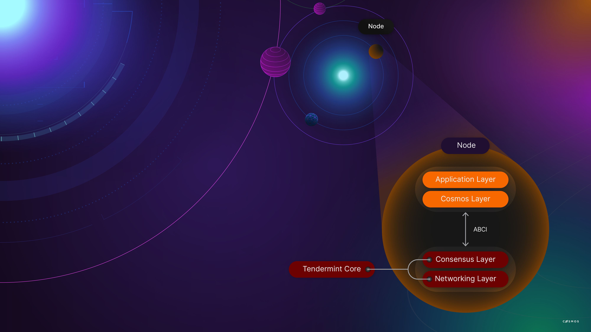
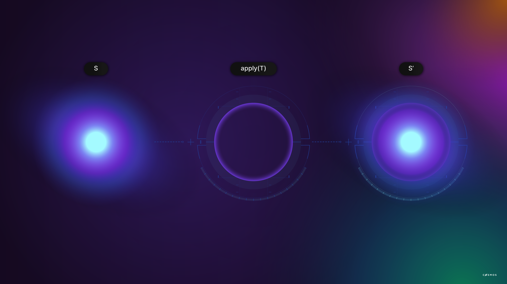
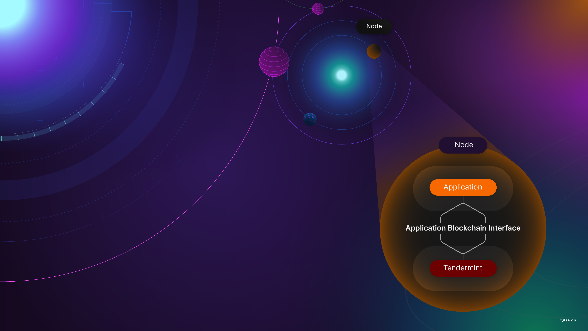

# A Blockchain App Architecture

## What is Tendermint

Created in 2014, Tendermint accelerates the development of distinct blockchains by providing a ready-made networking and consensus solution so that these don’t have to be recreated by developers in each case. You may already be using Tendermint without awareness of this since blockchains including [Hyperledger Burrow](https://hyperledger.github.io/burrow/#/) and [Binance Chain](https://www.binance.org/en/smartChain)  use Tendermint.

More specifically, Tendermint modules attend to consensus and networking, two important components of any blockchain. This frees developers to consider what the blockchain should do at an application level without descending into lower-level blockchain concerns such as peer discovery, block propagation, consensus and transaction finalization. Without Tendermint, developers would be forced to build software to address those concerns which would add additional time, complexity and cost to the blockchain applications they have in mind.


A blockchain node for an application-focused Cosmos blockchain consists of a state-machine built with the Cosmos SDK and consensus and networking which is handled by Tendermint Core.

As you might expect, Tendermint itself is modular and flexible. We will concentrate on the Tendermint Core used in Cosmos.

## Consensus in Tendermint Core and Cosmos

In summary, Tendermint Core is a high-performance, consistent, and secure **consensus** module with strict fork accountability. It relies on Proof-of-Stake (PoS) with delegation and [Practical Byzantine Fault Tolerance](https://github.com/tendermint/tendermint). Participants signal support for well-behaved, reliable nodes that create and confirm blocks. Users signal support by staking ATOM with the possibility of acquiring a share of network transaction fees but also sharing in the risk of reduced returns or even losses should the node become unreliable.

Network participants are incentivized to stake ATOM in the fittest nodes that they deem most likely to provide a dependable service and to withdraw their support should conditions change. In this way, a Cosmos blockchain is expected to adjust the validator configuration and continue even in adverse conditions.

In more detail, only the top 150 nodes by staked ATOM, the **validators**, participate in the transaction finalization process. The privilege of creating a block is awarded in proportion to the voting power a validator has. Voting power is calculated as all ATOM tokens staked by a validator and its delegates. For example, if a given validator's voting power would be 15% of the total voting power of all validators, then it can expect to receive the block creation privilege 15% of the time. The block is broadcasted to the other validators, who are expected to respond promptly and correctly. They will absorb penalties for failing to do so.

Validators confirm candidate blocks. They can and must, of course, reject invalid blocks. They accept the block by returning their signature. When sufficient signatures have been collected by the block creator then the block is finalized and broadcasted to the wider network.

Interestingly, there is no ambiguity in this process. Either a block has the necessary signatures or it does not. If it does, insufficient signatories exist to overturn the block and the block can be described as **finalized** because there is no process in which the blockchain would be reorganized. This provides a level of certainty about transaction finalization that a probabilistic system like Proof-of-Work (PoW) cannot match.

Aggressive block times are feasible because the process is aimed at high performance, dedicated validators with good network connectivity. This is quite different from PoW, which favors inclusion and must accommodate slower nodes with greater latency and less reliability. A Cosmos blockchain can handle thousands of transactions per second with confirmations in the order of seven seconds.

Even though validation is delegated to a subset of all network nodes, the validators, the process avoids concentration of power. The community of users elect the validators, in a manner of speaking, by staking ATOM, participating in both the rewards and the risks of committing to provide a reliable, responsible block validation service.

## Upgradeability

In any known blockchain, a change in the implementation requires an upgrade to the node software running in each node. In a disorderly process with voluntary participation this can result in a hard fork - a situation in which one constituency forges ahead with the old rules and another adopts new rules. While this arrangement has positive aspects and proponents, it also has clear disadvantages in settings where **certainty** is a strict requirementt. For example, uncertainty about transaction finalization (regardless of how miniscule the uncertainty might be) may be unacceptable in settings that are concerned with registries and large assets.

In a Tendermint blockchain, transactions are irreversibly finalized upon block creation and upgrades are themselves governed by the block creation and validation process, which leaves no room for uncertainty. Either the nodes agree to simultaneously upgrade their protocol, or the upgrade proposal fails.

## Tendermint BFT

[Tendermint BFT](https://tendermint.com/core/) packages the **networking and consensus** layers of a blockchain and presents an interface, the Application Blockchain Interface (**ABCI**) to the application layer. Developers focus on higher-order concerns while delegating peer-discovery, validator selection, staking, upgrades, and consensus to the Tendermint BFT. The consensus engine running in one process controls the state machine, the application, running in another process. ABCI presents a socket for use by applications written in other languages. When the application is written in the same language as the Tendermint implementation, the socket is not used.

The architecture is equally appropriate for **private or public** blockchains.

Tendermint BFT provides security guarantees including:

* **Forks** are never created provided that half or more validators are honest;
* There is **strict accountability** for fork creation. Liability can be determined;
* Transactions are finalized as soon as a block is created.

Tendermint BFT is not concerned with the interpretation of transactions. That would be the application layer (see below). Tendermint presents confirmed, well-formed transactions and blocks of transactions agnostically and facilitates the reverse - sending a transaction. Tendermint is un-opinionated about the meaning of the transactions.

*Block time* is approximately seven seconds and blocks may contain thousands of transactions. Transactions are finalized and cannot be overturned as soon as they appear in a block.

<HighlightBox type="info">

For a deeper dive, visit:

Podcast on consensus systems with Ethan Buchman: https://softwareengineeringdaily.com/2018/03/26/consensus-systems-with-ethan-buchman/
Tendermint BFT engine is connected to the application by a socket protocol called the Application Blockchain Interface (ABCI).
Tendermint ecosystem: https://tendermint.com/core/#ecosystem

</HighlightBox>

## Application Blockchain Interface

There are at least two broad **approaches to application-level concerns** using blockchains. One way is to create a purpose-built blockchain where everything that can be done is defined in the protocol. The other method is to create a programmable state machine and push application concerns to a higher level, such as bytecode created by compilers interpreting higher-level languages. Ethereum-like blockchains are part of the second category. Only the state machine is defined in the on-chain protocol, which defines the rules of contract creation, interaction, and execution and little else.

This method is not without its limitations. First, very little is universally defined. Standards for basic concerns such as tokens emerge organically through voluntary participation. Second, contracts can and do contain repetitive code that may or may not correctly implement the developer’s intentions. Third, the inherent flexibility of it makes it challenging to reason about what is correct or even what is friendly. Finally, there are practical limits to the complexity of operations that are very low as compared to what is possible in other settings. Those limits make it especially difficult to perform analysis or reorganize data, and developers are forced to adapt to the constraints.

A **purpose-built blockchain** is different. There are no hard limits the application developers themselves don’t believe are reasonable and necessary. There is no need to present a “Turing-complete” language or general-purpose, programmable state machine because application concerns are addressed by the protocol the developers create.

Developers who have worked with blockchains based on the Ethereum Virtual Machine (EVM) will recognize a shift in the way concerns are addressed. Authorization and access control, the layout of storage (also known as the state), application governance - application logic, generally - are not implemented as contracts on a state machine. They become properties of a unique blockchain that is built for a singular purpose.

Developers create the Application Layer using the **Cosmos SDK**. The Cosmos SDK provides both a scaffold to get started and a rich set of modules that address common concerns. The Cosmos SDK provides a head start and a framework for getting started as well as a rich set of modules that address common concerns such as governance, tokens, other standards, and interactions with other blockchains through the Inter-Blockchain Protocol (IBC). Creation of a purpose-built blockchain with Cosmos SDK is largely a process of selecting, configuring, and integrating well-solved modules, also known as composing modules. This greatly reduces the scope of original development required since development is focused mostly on the truly novel aspects of the application.

<HighlightBox type="info">

Later, we will dive into the Inter-Blockchain Protocol (IBC). **IBC** is a common framework for exchanging information between blockchains. For now, it is enough to know that it exists and it enables seamless interaction between blockchains that want to exchange information, such as tokens. In summary, this enables communication between applications that run on separate purpose-built blockchains.

</HighlightBox>

Importantly, application, consensus and network layers are contained within the custom blockchain node that forms the foundation of the custom blockchain.



Tendermint passes confirmed transactions to the application layer through the Application Blockchain Interface. The application layer must implement the ABCI, which is a socket protocol. In this way, Tendermint is unconcerned with the interpretation of transactions and the application layer can be unconcerned with propagation, broadcast, confirmation, network formation, and other lower-level concerns that Tendermint attends to, unless it wants to inspect such properties.  

Since the ABCI is a sockets protocol, developers are free to create blockchains in any language that supports sockets, provided their application implements the ABCIe. The ABCI defines the boundary between replication concerns and the application, which is a state machine.

This is, itself, a considerable step forward that simplifies the creation of unique blockchains.

<HighlightBox type="info">

More detailed information the ABCI can be found here:

* A prose specification [https://github.com/tendermint/abci/blob/master/specification.md]
* A protobuf file [https://github.com/tendermint/abci/blob/master/types/types.proto]
* A Go interface [https://github.com/tendermint/abci/blob/master/types/application.go]
* Documentation [http://tendermint.readthedocs.io/en/master/]:

</HighlightBox>

## State Machines

At its core, a blockchain is a replicated state machine. A state machine is a computer science concept, in which a machine can have multiple states but only one state at a time. And, there is a state transition process, or a set of defined processes which are the only way the state changes from the old state to a new state.



The state transition function in a blockchain is virtually synonymous with a transaction. Given an initial state, a confirmed transaction and a set of rules for interpreting that transaction, the machine transitions to a new state. The rules of interpretation are defined at the application layer.

Blockchains are deterministic, so the only correct interpretation of the transaction is the new state, shown as S-prime in the illustration above.

Blockchains are distributed and, in practice, transactions arrive in batches called blocks. There is a state machine that exists after the correct interpretation of each transaction in the block. Each transaction executes in the context of the state machine that resulted from every transaction that preceded it. The state machine that exists after all transactions in the block have been executed is a useful checkpoint, especially when one is interested in historic states.


Developers create the state machine using the Cosmos SDK. This includes storage organization, also known as the state, and the state transaction functions which determine what is permissible and what, if any, adjustments to the state result from each kind of transaction.

In this context, “consensus” establishes a canonical set of well-ordered blocks that contain well-ordered transactions. The chain of blocks is therefore a well-ordered set of all finalized transactions and all nodes agree that the canonical set is the only relevant set. Since the state machine defined by the developers is deterministic, there is only one correct interpretation of the canonical transaction set and, by extension, only one correct determination of the state machine when any given transaction is executed or at any block height.

This state machine definition is silent on the processes that confirm and propagate transactions, and Tendermint is agnostic about the meaning of the blocks it organizes.The Tendermint consensus establishes the ordered set of transactions. By extension, the nodes reach consensus about the state of the application.



## Additional Details

Many transactions that could be broadcast should not be broadcast. Examples include malformed transactions and spam-like artifacts. Since Tendermint is agnostic about transaction interpretation it cannot make this determination on its own. Therefore, the Application Blockchain Interface includes a `CheckTx` method that Tendermint uses to ask the application layer if the transaction meets minimum acceptability criteria. Applications implement this function.

When blocks are received, Tendermint calls the `DeliverTx` method to pass the information to the application layer for interpretation and possible state machine transition.

Additionally, `BeginBlock` and `EndBlock` messages are broadcast even if blocks contain no transactions. This provides positive confirmation of basic connectivity and no operation time periods. These methods facilitate the execution of scheduled processes that should run in any case because they call methods at the application level where developers can define processes. It is wise to be cautious about adding too much computational weight at the start or completion of each block since the blocks arrive at approximately seven-second intervals and too much work could slow down your blockchain.

Any application that uses Tendermint for consensus must implement the Application Blockchain Interface. Fortunately, you do not have to do this manually because the Cosmos SDK provides a boilerplate known as the BaseApp to get you started.

In the following exercise, you will create a minimal distributed state machine with the Cosmos SDK. Your state machine will rely on Tendermint for consensus.

## Long-running exercise

Here, we introduce an exercise, a project, that you will bring forward as you learn more. In so doing, you will see how the Cosmos SDK improves your productivity by taking care of the boilerplate. It is still interesting to know about what the boilerplate is, in order to get a better overall picture.

### The setup

We are going to create a blockchain that lets interested people play checkers against each other. There are many versions of the rules. We choose [those](https://www.ducksters.com/games/checkers_rules.php). Also, the object of the exercise is to learn ABCI and Cosmos SDK, not to get lost in the proper implementation of the board state or of the rules of checkers. So we are going to use, and adapt, [this ready-made implementation](https://github.com/batkinson/checkers-go/blob/a09daeb/checkers/checkers.go), with the additional rule that the board is 8x8 and played on black cells. The code will likely require adaptations as we go along. Also, we are not going to be overly concerned with a marketable GUI since, again, that would be a separate project in itself. Of course, we still need to concern ourselves with creating the groundwork for a GUI to be possible in the first place.

When we return to this long running exercise, in the next chapters, the goal is to improve it and use the Cosmos SDK as we learn elements.

As you can imagine, beyond the rules of the game, there is a lot we need to take care of. Therefore, as a start we ought to simplify to the maximum. Have a look at these [specs](https://github.com/tendermint/spec/blob/c939e15/spec/abci/abci.md) to see what the application needs to do to comply with ABCI, and try to figure out how barebones you would make your first, imperfect, checkers game blockchain.

### “Make” the state machine

Here is how we would do it. We _would_ do it, because we are here to learn the Cosmos SDK primarily, not to become proficient at implementing ABCI.

<-- TODO: Perhaps we can kick this off with a flow-diagram to give an overview to a relatively heavy section? -->

We want to show the minimum viable ABCI state machine. Tendermint does not concern itself with whether proposed transactions are valid, and about how the state changes after such a transaction. It delegates those to the state machine, which will _transform_ transactions into game moves and states.

#### Start the application

This state machine is an application that needs to start before it can receive any requests from Tendermint. We take this opportunity to load in memory the acceptable general moves. Fortunately, this code [exists already](https://github.com/batkinson/checkers-go/blob/a09daeb/checkers/checkers.go#L75):

> `func init()`

#### `Query`: _the_ game state

Yes, there will be a single game, a single board, in the whole blockchain. This is our way of simplifying. We can decide right away how to serialize the board without effort because we have [this function](https://github.com/batkinson/checkers-go/blob/a09daeb/checkers/checkers.go#L303):

> `func (game *Game) String() string`

And we store the board at `/store/board`, and return it in the response's `Value`, when requested via the [`Query`](https://github.com/tendermint/spec/blob/c939e15/spec/abci/abci.md#query) command at `path = "/store/board"`. If and when we need to reinstantiate the board state out of its serialized form, we [can call](https://github.com/batkinson/checkers-go/blob/a09daeb/checkers/checkers.go#L331):

> `func Parse(s string) (*Game, error)`

Sadly, the `String()` function does not save the `.Turn` field, so we need to store whose turn it is to play on our own. We choose to have a `string` at `/store/turn` with the color of the player.

To store this state, our application needs its own database. It needs to store a state at a certain Merkle root value, too, so that it can be recalled at a later date. This is another implementation _detail_ that we need to address when creating our application.

#### `InitChain`: the initial chain state

[That's](https://github.com/tendermint/spec/blob/c939e15/spec/abci/abci.md#initchain) where our only game is initialized. Tendermint sends `app_state_bytes: bytes` to our application, with the initial (genesis) state of the blockchain. In our case, we already know what it would look like, i.e. represent a single game. But our application is a good sport and:

* Take this initial state in;
* Saves it in its database;
* Returns, in `app_hash: bytes`, the Merkle root hash corresponding to this genesis state.

Notice how our application also has to handle the list of validators sent by Tendermint. Let's gloss over this _detail_.

#### A serialized transaction.

We need to decide how to represent a move. In our ready-made implementation, a position `Pos` is represented by [2 `int`](https://github.com/batkinson/checkers-go/blob/a09daeb/checkers/checkers.go#L42-L45), and a move by [2 `Pos`](https://github.com/batkinson/checkers-go/blob/a09daeb/checkers/checkers.go#L168). We can decide to represent a serialized move as 4 `int`, the first 2 for the original position `src`, and the next 2 for the destination position `dst`.

#### `BeginBlock`: a new block is about to be created

[This command](https://github.com/tendermint/spec/blob/c939e15/spec/abci/abci.md#beginblock) instructs the application to load its state at the right place. More precisely, inside `header: Header`, as per its [detailed definition](https://github.com/tendermint/spec/blob/c939e15/spec/core/data_structures.md#header), we find:

> `AppHash: []byte`: Arbitrary byte array returned by the application after executing and commiting the previous block. It serves as the basis for validating any merkle proofs that comes from the ABCI application and represents the state of the actual application rather than the state of the blockchain itself. The first block's `block.Header.AppHash` is given by `ResponseInitChain.app_hash`.

This instructs the application to load, from its database, the right state of the blockchain, which includes the correct `/store/board`. It is important to insist on the fact that the application needs to be able to load a known state at any _point in time_. Indeed, there could have been a crash or a restore of some sort that has desynchronized Tendermint and the application.

In case the header has omitted the `AppHash`, which should never happen, the application should work off the last state it has arrived at.

With this state loaded, the application is ready to respond to the upcoming `CheckTx` and `DeliverTx`.

#### `CheckTx`: a new transaction appears in the transaction pool

That's where Tendermint [asks](https://github.com/tendermint/spec/blob/c939e15/spec/abci/abci.md#checktx) our application whether the transaction is worth keeping at all. Because we want to simplify to the maximum, we only concern ourselves with whether there is a valid move in the transaction.

For that, we check whether there are 4 `int` in the serialized information. We can also check that the `int` themselves are within the boundaries of the board, i.e. between `0` and `7`.

It is better _not_ to check whether we have a [valid move](https://github.com/batkinson/checkers-go/blob/a09daeb/checkers/checkers.go#L168):

> `func (game *Game) ValidMove(src, dst Pos) bool`

Checking whether a move is valid with regards to the board, needs the board to have been updated beforehand. Alas, the board is updated only up to the point where the transactions have been delivered. And you may have a situation where 2 transactions have been sent one after the other, both in fact valid. In this rare situation, if you tested the move in the second transaction against the board, it would appear invalid because the first transaction had been checked but not delivered yet. Therefore, testing a move on the board at CheckTx time is better avoided.

#### `DeliverTx`: a transaction is added and needs to be processed

Now, a pre-checked transaction [is delivered](https://github.com/tendermint/spec/blob/c939e15/spec/abci/abci.md#delivertx). It is a matter of applying it to the latest board state. Conveniently, we can [call](https://github.com/batkinson/checkers-go/blob/a09daeb/checkers/checkers.go#L274):

> `func (game *Game) Move(src, dst Pos) (captured Pos, err error)`

And handle the error if necessary. If it went ok, then we keep the new board state in memory, ready for the next delivered transaction. We do not save to storage at this point.

We can also choose to let it know what interesting information should be indexed via `events: repeated Event` in the response. The intent of these returned values is to return information that could be tedious to collect otherwise, and, if indexed, to allow a fast search across blocks for values of relevance. See [here](https://github.com/tendermint/spec/blob/c939e15/spec/abci/abci.md#events) for what goes into an `Event`.

For the sake of the exercise, let's imagine that we emit some information in two events, one about the move itself, the other about the resulting board state. In pseudo-code form it looks like:

```
[
    { key: "name", value: "moveMetadata", index: true },
    { key: "whoPlayer", value: bool, index: true },
    { key: "isJump", value: bool, index: false},
    { key: "madeKing", value: bool, index: false},
    { key: "hasCaptured", value: bool, index: false},
    { key: "hasCapturedKing", value: bool, index: false},
    { key: "isWinning", value: bool, index: true}
],
[
    { key: "name", value: "boardState", index: true },
    { key: "blackCount", value: uint32, index: false },
    { key: "blackKingCount", value: uint32, index: false },
    { key: "redCount", value: uint32, index: false },
    { key: "redKingCount", value: uint32, index: false }
]
```

If you come from the Ethereum world, you will recognize these as _events_, a.k.a. indexed Solidity events, where the indexed fields are _topics_ in the transaction receipt logs.

Finally, it would be judicious to inform Tendermint about the `GasUsed (int64)`. Presumably each move costs the same so we can return `1`.

#### `EndBlock`: the block is being wrapped up

Now is [the time](https://github.com/tendermint/spec/blob/c939e15/spec/abci/abci.md#endblock) to let Tendermint know about some things. Setting aside once more the validator thing, we need to let it know what events should be emitted, similarly to what happened on `DeliverTx`. In our case, we have only checkers moves, so it is not very clear what could be interesting to be searched at a later date.

For the sake of the argument, let's assume that we want to tally what happened in the block. So we return this aggregate event, in pseudo-code:

```
[
    { key: "name", value: "aggregateAction", index: true },
    { key: "blackCapturedCount", value: uint32, index: false },
    { key: "blackKingCapturedCount", value: uint32, index: false },
    { key: "redCapturedCount", value: uint32, index: false },
    { key: "redKingCapturedCount", value: uint32, index: false }
]
```

#### `Commit`: our work here is done

The block that has previously ended has now been [confirmed](https://github.com/tendermint/spec/blob/c939e15/spec/abci/abci.md#commit), and the application needs to save its state to storage, to its database. And return, as `data: []byte`, the Merkle root hash of the blockchain's state, which, as you recall, includes `/store/board`. As mentioned in [the docs](https://github.com/tendermint/spec/blob/c939e15/spec/abci/abci.md#determinism), this hash needs to be deterministic after the sequence of the same `BeginBlock`, the same `DeliverTx`'s in the same order, and the same `EndBlock`.

After having returned and saved, the application may also keep a pointer in its database as to which state is the latest, so it can purge the board from its memory. Indeed, the next `BeginBlock` will inform it which state to load; probably the same. In practice, the application ought to keep the state in memory so as to quickly build on it if the next `BeginBlock` fails to mention `AppHash`, or mentions the same.

<ExpansionPanel title="What if I like extreme serialization?">

As a hacky side-note, this `data` need not be strictly a Merkle root hash. It could well be any bytes as long as the result is deterministic, as mentioned earlier, and collision-resistant, and that the application can recover the state out of it. For instance, if we took our only board and serialized it differently, we could return the board state as such.

Namely, we have 64 cells, out of which only 32 are being used. Each cell has either nothing, a black pawn, a black king, a red pawn, or a red king. That's 5 possibilities, which can easily fit in a byte. So we need 32 bytes to describe the board. Since the first bit of a byte is never used when counting to 5, perhaps we can use the very first bit to indicate whose turn it is to play.

So here we go, we have a deterministic blockchain state, collision-resistant since the same value indicates an identical state, no external database to handle, and the full state is always stored in the block header.

</ExpansionPanel>

### Closing remarks:

We have waved our hands as to how we would create a state machine for the checkers game. You surely have already spotted a good number of shortcomings of our game blockchain. Let's see:

* Anyone, including the opponent, can post an anonymous transaction and play, instead of the intended player. This makes it impossible to know who did what. We need to find a way to identify the right player. Cosmos -> Accounts and signatures.
* Instead of a single game, we would prefer multiple games running in parallel, all in a store with an elaborate data model. We need a well-defined store. Cosmos -> Key store.
* It would be good if we had an elegant way to serialize our data objects of interest and our transactions. -> Protobuf.
* We want to penalize spam and bad transactions, and also to be able to play for money. Cosmos -> tokens.
* We want to tailor gas costs according to the transaction type. After all, there is a new transaction type of _create a game_. Cosmos -> tokens and gas.
* We need to handle the validators lists in the communication. Cosmos can do this for us.
* We want the player's GUI to easily reload its pending game(s). Cosmos -> Queries.
* We want to have an elegant facility to notify players when it’s their turn. Cosmos -> Events.
* We want to be able to easily add changes to our system in the future. Cosmos -> Migrations.
* We want to open up so that players can decide to play for money with different tokens. Cosmos -> IBC.

The Cosmos SDK will assist us in attending all these concerns without having to reinvent the wheel.
