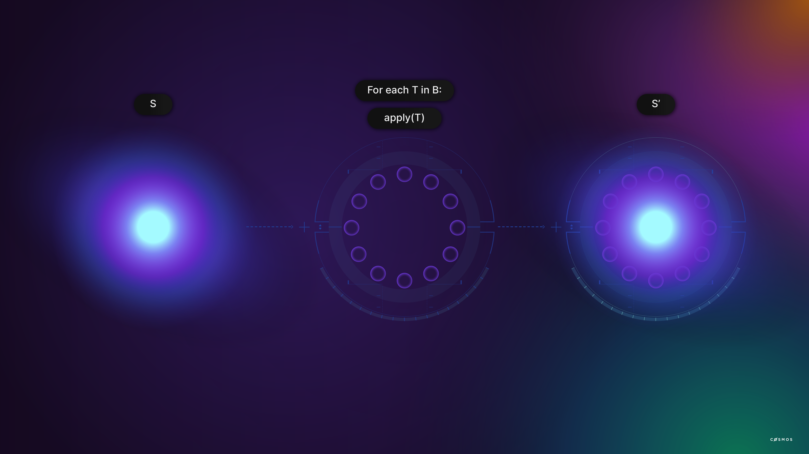

# A Blockchain App Architecture

## What is Tendermint

Created in 2014, Tendermint accelerates the development of distinct blockchains by attending to general concerns so that those concerns don’t need to be recreated by developers in each case. You may already be using Tendermint without awareness of this since blockchains including [Hyperledger Burrow](https://hyperledger.github.io/burrow/#/) and [Binance Chain](https://www.binance.org/en/smartChain)  use Tendermint. 

More specifically, Tendermint modules attend to consensus and networking, two important components of any blockchain. This frees developers to consider what the blockchain should do at an application level without descending into lower-level blockchain concerns such as peer discovery, block propagation, consensus and transaction finalization. Without Tendermint, developers would be forced to build software to address those concerns which would add additional time, complexity and cost to the blockchain applications they have in mind.

A blockchain node for an application-focused Cosmos blockchain consists of a state-machine built with the Cosmos SDK and consensus and networking which is handled by Tendermint Core. 

As you might expect, Tendermint itself is modular and flexible. We will concentrate on the Tendermint Core used in Cosmos. 

## Consensus in Tendermint Core and Cosmos

In summary, Tendermint Core is a high-performance, consistent, and secure **consensus** module with strict fork accountability. It relies on Proof-of-Stake (PoS) with delegation and [Practical Byzantine Fault Tolerance](https://github.com/tendermint/tendermint). Participants signal support for well-behaved, reliable nodes that create and confirm blocks. Users signal support by staking ATOM with the possibility of acquiring a share of network transaction fees but also sharing in the risk of reduced returns or even losses should the node become unreliable. 

Network participants are incentivized to stake ATOM in the fittest nodes that they deem most likely to provide a dependable service and to withdraw their support should conditions change. In this way, a Cosmos blockchain is expected to adjust the validator configuration and continue even in adverse conditions. 

In more detail, only the top 100 nodes by staked ATOM, the **validators**, participate in the transaction finalization process. The privilege of creating a block is awarded in proportion to the ATOM tokens committed. For example, if a given validator has 15% of the ATOM staked to the top 100 nodes, then it can expect to receive the block creation privilege 15% of the time. The block is broadcasted to the other validators, who are expected to respond promptly and correctly. They will absorb penalties for failing to do so. 

Validators confirm candidate blocks. They can and must, of course, reject invalid blocks. They accept the block by returning their signature. When sufficient signatures have been collected by the block creator then the block is finalized and broadcasted to the wider network. 

Interestingly, there is no ambiguity in this process. Either a block has the necessary signatures or it does not. If it does, insufficient signatories exist to overturn the block and the block can be described as **finalized** because there is no process in which the blockchain would be reorganized. This provides a level of certainty about transaction finalization that a probabilistic system like Proof-of-Work (PoW) cannot match. 

Aggressive block times are feasible because the process is aimed at high performance, dedicated validators with good network connectivity. This is quite different from PoW, which favors inclusion and must accommodate slower nodes with greater latency and less reliability. A Cosmos blockchain can handle thousands of transactions per second with confirmations in the order of seven seconds. 

Even though validation is delegated to a subset of all network nodes, the validators, the process avoids concentration of power. The community of users elect the validators, in a manner of speaking, by staking ATOM, participating in both the rewards and the risks of committing to provide a reliable, responsible block validation service. 

## Upgradeability

In any known blockchain, a change in the implementation requires an upgrade to the node software running in each node. In a disorderly process with voluntary participation this can result in a hard fork - a situation in which one constituency forges ahead with the old rules and another adopts new rules. While this arrangement has positive aspects and proponents, it also has clear disadvantages in settings where **certainty** is a strict requirementt. For example, uncertainty about transaction finalization (regardless of how miniscule the uncertainty might be) may be unacceptable in settings that are concerned with registries and large assets.

In a Tendermint blockchain, transactions are irreversibly finalized upon block creation and upgrades are themselves governed by the block creation and validation process, which leaves no room for uncertainty. Either the nodes agree to simultaneously upgrade their protocol, or the upgrade proposal fails. 

## Tendermint BFT

[Tendermint BFT](https://tendermint.com/core/) packages the **networking and consensus** layers of a blockchain and presents a socket protocol, the Application Blockchain Interface (**ABCI**) to the application layer. Developers focus on higher-order concerns while delegating peer-discovery, validator selection, staking, upgrades, and consensus to the Tendermint BFT. The consensus engine running in one process controls the state machine, the application, running in another process. 

The architecture is equally appropriate for **private or public** blockchains. 

Tendermint BFT provides security guarantees including:

* **Forks** are never created provided that half or more validators are honest;
* There is **strict accountability** for fork creation. Liability can be determined;
* Transactions are finalized as soon as a block is created.

Tendermint BFT is not concerned with the interpretation of transactions. That would be the application layer (see below). Tendermint presents confirmed, well-formed transactions and blocks of transactions agnostically and facilitates the reverse - sending a transaction. Tendermint is un-opinionated about the meaning of the transactions. 

*Block time* is approximately seven seconds and blocks may contain thousands of transactions. Transactions are finalized and cannot be overturned as soon as they appear in a block. 

<HighlightBox type="info">
For a deeper dive, visit:

Podcast on consensus systems with Ethan Buchman: https://softwareengineeringdaily.com/2018/03/26/consensus-systems-with-ethan-buchman/
Tendermint BFT engine is connected to the application by a socket protocol called the Application Blockchain Interface (ABCI). 
Tendermint ecosystem: https://tendermint.com/core/#ecosystem 
</HighlightBox>

## Application Blockchain Interface

There are at least two broad **approaches to application-level concerns** using blockchains. One way is to create a purpose-built blockchain where everything that can be done is defined in the protocol. The other method is to create a programmable state machine and push application concerns to a higher level, such as bytecode created by compilers interpreting higher-level languages. Ethereum-like blockchains are part of the second category. Only the state machine is defined in the on-chain protocol, which defines the rules of contract creation, interaction, and execution and little else. 

This method is not without its limitations. First, very little is universally defined. Standards for basic concerns such as tokens emerge organically through voluntary participation. Second, contracts can and do contain repetitive code that may or may not correctly implement the developer’s intentions. Third, the inherent flexibility of it makes it challenging to reason about what is correct or even what is friendly. Finally, there are practical limits to the complexity of operations that are very low as compared to what is possible in other settings.Those limits make it especially difficult to perform analysis or reorganize data, and developers are forced to adapt to the constraints. 

A **purpose-built blockchain** is different. There are no hard limits the application developers themselves don’t believe are reasonable and necessary. There is no need to present a “Turing-complete” language or general-purpose, programmable state machine because application concerns are addressed by the protocol the developers create.

Developers who have worked with blockchains based on the Ethereum Virtual Machine (EVM) will recognize a shift in the way concerns are addressed. Authorization and access control, the layout of storage (also known as the state), application governance - application logic, generally - are not implemented as contracts on a state machine. They become properties of a unique blockchain that is built for a singular purpose. 

Developers create the Application Layer using the **Cosmos SDK**. The Cosmos SDK provides both a scaffold to get started and a rich set of modules that address common concerns. The Cosmos SDK provides a head start and a framework for getting started as well as a rich set of modules that address common concerns such as governance, tokens, other standards, and interactions with other blockchains through the Inter-Blockchain Protocol (IBC). Creation of a purpose-built blockchain with Cosmos SDK is largely a process of selecting, configuring, and integrating well-solved modules, also known as composing modules. This greatly reduces the scope of original development required since development is focused mostly on the truly novel aspects of the application.

<HighlightBox type="info">
Later, we will dive into the Inter-Blockchain Protocol (IBC). **IBC** is a common framework for exchanging information between blockchains built with Cosmos. For now, it is enough to know that it exists and it enables seamless interaction between blockchains that want to exchange information, such as tokens. In summary, this enables communication between applications that run on separate purpose-built blockchains.
</HighlightBox>

Importantly, application, consensus and network layers are contained within the custom blockchain node that forms the foundation of the custom blockchain. 

Tendermint passes confirmed transactions to the application layer through the Application Blockchain Interface. The application layer must implement the ABCI, which is a socket protocol. In this way, Tendermint is unconcerned with the interpretation of transactions and the application layer can be unconcerned with propagation, broadcast, confirmation, network formation, and other lower-level concerns that Tendermint attends to, unless it wants to inspect such properties.  

Since the ABCI is a sockets protocol, developers are free to create blockchains in any language that supports sockets, provided their application implements the ABCIe. The ABCI defines the boundary between replication concerns and the application, which is a state machine.

This is, itself, a considerable step forward that simplifies the creation of unique blockchains. 

<HighlightBox type="info">
More detailed information the ABCI can be found here:

* A prose specification [https://github.com/tendermint/abci/blob/master/specification.md] 
* A protobuf file [https://github.com/tendermint/abci/blob/master/types/types.proto] 
* A Go interface [https://github.com/tendermint/abci/blob/master/types/application.go] 
* Documentation [http://tendermint.readthedocs.io/en/master/]:
</HighlightBox>

## State Machines

At its core, a blockchain is a replicated state machine. A state machine is a computer science concept, in which a machine can have multiple states but only one state at a time. And, there is a state transition process, or a set of defined processes which are the only way the state changes from the old state to a new state. 

The state transition function in a blockchain is virtually synonymous with a transaction. Given an initial state, a confirmed transaction and a set of rules for interpreting that transaction, the machine transitions to a new state. The rules of interpretation are defined at the application layer. 

Blockchains are deterministic, so the only correct interpretation of the transaction is the new state, shown as S-prime in the illustration above. 

Blockchains are distributed and, in practice, transactions arrive in batches called blocks. There is a state machine that exists after the correct interpretation of each transaction in the block. Each transaction executes in the context of the state machine that resulted from every transaction that preceded it. The state machine that exists after all transactions in the block have been executed is a useful checkpoint, especially when one is interested in historic states. 

Developers create the state machine using the Cosmos SDK. This includes storage organization, also known as the state, and the state transaction functions which determine what is permissible and what, if any, adjustments to the state result from each kind of transaction. 

In this context, “consensus” establishes a canonical set of well-ordered blocks that contain well-ordered transactions. The chain of blocks is therefore a well-ordered set of all finalized transactions and all nodes agree that the canonical set is the only relevant set. Since the state machine defined by the developers is deterministic, there is only one correct interpretation of the canonical transaction set and, by extension, only one correct determination of the state machine when any given transaction is executed or at any block height. 

This state machine definition is silent on the processes that confirm and propagate transactions, and Tendermint is agnostic about the meaning of the blocks it organizes.The Tendermint consensus establishes the ordered set of transactions. By extension, the nodes reach consensus about the state of the application. 

## Additional details

Many transactions that could be broadcast should not be broadcast. Examples include malformed transactions and spam-like artifacts. Since Tendermint is agnostic about transaction interpretation it cannot make this determination on its own. Therefore, the Application Blockchain Interface includes a `CheckTx` method that Tendermint uses to ask the application layer if the transaction meets minimum acceptability criteria. Applications implement this function. 

When blocks are received, Tendermint calls the `DeliverTx` method to pass the information to the application layer for interpretation and possible state machine transition. 

Additionally, `BeginBlock` and `EndBlock` messages are broadcast even if blocks contain no transactions. This provides positive confirmation of basic connectivity and no operation time periods. These methods facilitate the execution of scheduled processes that should run in any case because they call methods at the application level where developers can define processes. It is wise to be cautious about adding too much computational weight at the start or completion of each block since the blocks arrive at approximately one-second intervals and too much work could slow down your blockchain. 

Any application that uses Tendermint for consensus must implement the Application Blockchain Interface. Fortunately, you do not have to because the Cosmos SDK provides a boilerplate known as the BaseApp to get you started. 

In the following exercise, you will create a minimal distributed state machine with the Cosmos SDK. Your state machine will rely on Tendermint for consensus. 
