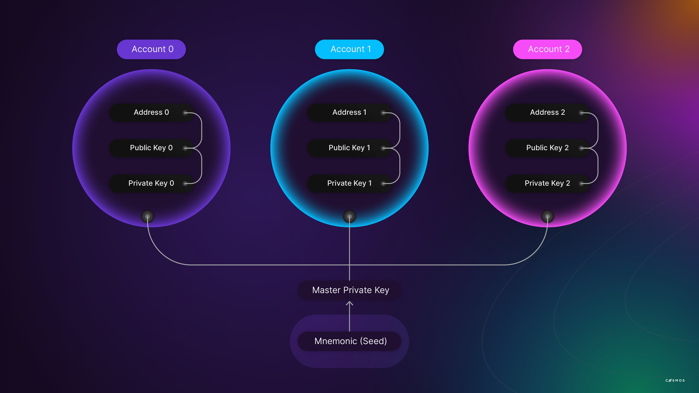
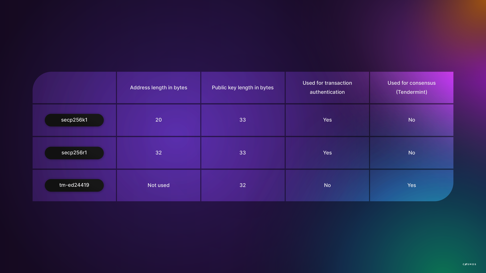

# Accounts

## What is an account?

An account is a pair of keys called PubKey (a public key) and PrivKey (a private key). A public key is a unique identifier for a user or entity that is safe to disclose. Private keys are sensitive information that users are required to manage confidentially. Private keys are used to sign information in a way that **proves** to others that the message was signed by someone using the private key that corresponds to a given public key. This is done without revealing the private key itself.

## Public key cryptography

Modern cryptographic systems leverage computer capabilities to make the power of certain mathematical functions accessible. Public key cryptography, also known as **asymmetric cryptography**, is a cryptographic system that employs pairs of keys. Every pair consists of a public and a private key. The public key can be shared publicly. The security of the system is not endangered as long as the private key is not disclosed. Compared to symmetric key algorithms, asymmetric ones do not require parties to use a secure channel to exchange the keys for encryption and decryption.

Asymmetric cryptography has two primary applications:

* **Authentication.** The public key serves as a verification instrument for the private key pair.
* **Encryption.** Only the private key can decrypt the information encrypted with the public key.

We will focus on the authentication aspect of asymmetric cryptography.

Public key cryptography assures confidentiality, authenticity, and non-reputability. Examples of applications include [S/MIME](https://en.wikipedia.org/wiki/S/MIME) and [GPG](https://en.wikipedia.org/wiki/GNU_Privacy_Guard), as well as the basis of several internet standards like [SSL](https://www.ssl.com/faqs/faq-what-is-ssl/) and [TLS](https://en.wikipedia.org/wiki/Transport_Layer_Security).

Due to its computational complexity, asymmetric cryptography is normally applied to small data blocks. In a hybrid system, symmetric and asymmetric cryptography are combined. For example, asymmetric encryption could be employed to transfer a symmetric encryption, which would then be used as an encryption key for the message. Examples of hybrid systems include [PGP](https://en.wikipedia.org/wiki/Pretty_Good_Privacy).

The **length of keys** is vital. Asymmetric cryptographic keys are usually very long. One can keep in mind a general principle: the longer the key, the more difficult it is to break the code. To break an asymmetric key with a brute force attack, the attacker would need to try every possible key.

## Public and private keys

Asymmetric keys always come in pairs and offer their owner various capabilities. Those capabilities are based on cryptographic mathematics. As their names suggest, the public key is meant to be distributed to whoever is relevant, while the private key is to be jealously guarded. This is akin to publicizing your house address, but keeping the key to your house private. Do not be Dilbert's CEO, a story in 2 parts.

### Sign and verify: An example

Alice wants to make sure that Bob's public announcement is indeed from Bob:

* Bob gives Alice his public key.
* Bob signs his announcement with his private key.
* Bob sends Alice his announcement and its signature.
* Alice verifies the signature with Bob's public key.

When Alice has verified the signature, she will see that the announcement was signed using the private key that corresponds to Bob’s public key which is already known to represent Bob.

In summary, private keys are used to **prove** that messages originate from the owners of accounts, known by their public keys. More precisely, signatures **prove** that messages were signed by someone that knows the private key that corresponds to a given public key. This is the basis of user authentication in a blockchain. For this reason, private keys are jealously guarded secrets.

## Hierarchical-deterministic wallets

Blockchains generally maintain ledgers of user accounts and rely on public key cryptography for user authentication. Implicitly, knowledge of one’s public and private keys is a requirement to execute transactions. Client software applications, known as wallets, provide methods to generate new key pairs and store them between sessions, as well as basic services such as creating transactions, signing messages, interacting with applications (for example, web pages), and communicating with the blockchain.

Although it is technically feasible to generate and store multiple key pairs in a wallet, key management is less than ideal for users in such a scenario. Given that all keys would exist in one place only, users would need to devise ways to recover their keys in adverse situations, such as the loss or destruction of the computer. To put it simply, the more accounts, the more keys to back them up.

A **hierarchical-deterministic (HD) wallet** uses a single seed phrase to generate many key pairs. Therefore, only the seed phrase needs to be backed up.

The Cosmos SDK uses [BIP32](https://en.bitcoin.it/wiki/BIP_0032), which allows users to generate a set of accounts from an initial secret that usually consists of 12 or 24 words known as the mnemonic. Importantly, key pairs can always be reproduced from the mnemonic.

<HighlightBox type="tip">

To see BIP32 in action, visit [https://www.bip32.net/](https://www.bip32.net/).

Click `Show entropy details` and enter random data in the `Entropy` field. This reveals an important aspect of the initial seed generation process. A source of randomness is essential. As you provide entropy, the `BIP39 Mnemonic` field will begin to populate with words. By scrolling down further and selecting the `BIP39` tab under `Derived Addresses`, you will see the `Public Key` and `Private Key` pairs.

</HighlightBox>

Like most blockchain implementations, Cosmos derives addresses from the public keys - more on this below.



When using BIP39, a user is required only to store their BIP39 mnemonic safely and confidentially. All key pairs can be reconstructed from the mnemonic because it is deterministic. There is no practical upper limit to the number of key pairs that can be generated from a single mnemonic, hence the name hyper-deterministic is used to describe this approach for key generation.

## Keyring, addresses, and address types

In the Cosmos SDK, keys are stored and managed in an object called a **keyring**.

Authentication is implemented as signature verification:

* Users generate transactions, sign transactions, and send the signed transaction to the blockchain.
* Transactions are formatted with the public key as part of the message. Signatures are verified by confirming that the signature's public key matches the public key associated with the sender. If the message is signed by anyone other than the purported sender, then the signature is invalid and the transaction is rejected.

In case the foregoing is unclear, consider the following pseudo message:

```
Message: {
  Payload: {
    Sender: “0x1234”,
    Data: “Hello World”
  },
  Signature: “0xabcd”
}
```

Passing `Payload` into the signature verification function will return a sender. The derived sender must match the sender in the `Payload` itself. This will confirm that the `Payload` could only originate from someone that knows the private key corresponding to `Sender: “0x1234”`.

## Signature schemes

As you might guess, there is more than one implementation of the public key signature process previously described. The Cosmos SDK supports the following digital key schemes for creating digital signatures:

* [secp256k1](https://www.secg.org/sec2-v2.pdf), as implemented in the SDK's crypto/keys/secp256k1 package. This is the most common and the same one used for Bitcoin;
* [secp256r1](https://www.secg.org/sec2-v2.pdf), as implemented in the SDK's crypto/keys/secp256r1 package;
* [tm-ed25519](https://ed25519.cr.yp.to/ed25519-20110926.pdf), as implemented in the SDK crypto/keys/ed25519 package. This scheme is supported only for consensus validation.



## Accounts

The `BaseAccount` object provides the basic account implementation that stores authentication information.

## Public keys

Public keys are generally not used to reference accounts (see Addresses, below). Public keys do exist and they are accessible through the `cryptoTypes.PubKey` interface. This facilitates operations developers may find useful, such as signing off-chain messages or using a public key for other out-of-band operations.

## Address

An address is a public information normally used to reference an account. Addresses are derived from public keys using [ADR-28](https://github.com/cosmos/cosmos-sdk/blob/master/docs/architecture/adr-028-public-key-addresses.md). Three types of addresses specify a context when an account is used:

* `AccAddress` identifies users (the sender of a message).
* `ValAddress` identifies validator operators.
* `ConsAddress` identifies validator nodes that are participating in consensus. Validator nodes are derived using the [ed25519](https://www.cryptopp.com/wiki/Ed25519) curve.

## Keyring

The keyring object stores and manages multiple accounts. In the SDK, the keyring object implements the keyring interface.

## Long-running exercise

Previously, your ABCI application accepted anonymous checkers moves. This can be a problem. By introducing accounts, you are going to restrict the moves to the right player.

If you planned on staying with a single game, you would do the following:

* In your `/store`, you would add:
    * `/store/players/black: Address`
    * `/store/players/red: Address`
* In your `DeliverTx` code, or whichever equivalent in the Cosmos SDK, before calling [`Move()`](https://github.com/batkinson/checkers-go/blob/a09daeb/checkers/checkers.go#L274), you would confirm that the move is coming from the right player.

But because you want to eventually handle multiple games, you need to define a `FullGame` type in storage and assign players there, in pseudo-code:

```
    struct FullGame {
        board: Game, // Which contains the Pieces and the Turn when in memory.
        players: {
            black: Address,
            red: Address
        }
    }
```

Then, we would have a `Move()` function on the `FullGame`, which confirms that the move comes from the right player. For now, we do not look at the serialization of this `FullGame`, and at what path(s) it would go, but we keep in mind that we will need to have all elements serialized.

TODO: in code.
