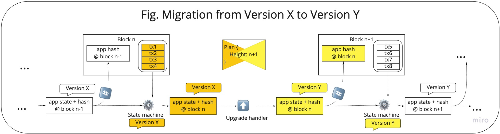

# Migrations: On-chain upgrades

A Cosmos SDK application running on a Cosmos blockchain can be upgraded in an orderly, on-chain fashion.

Upgrading blockchains and blockchain applications is notoriously difficult and risky. Cosmos SDK solves the common risks and challenges. _What are those challenges and risks that Cosmos SDK solves?_

Generally, when a blockchain is upgraded it is vital that all nodes upgrade simultaneously and at the same block height. In a disorderly setting, this is difficult to achieve. If the nodes do not do so then the blockchain will "fork" into two blockchains with common history - one chain that observes the new rules and one chain that observes the old rules. It is generally not possible for the two chains to reach a common consensus or merge in the future.

<HighlightBox type="info">

Without software support for upgrades, upgrading a live chain is risky because all the validators need to pause their state machines at exactly the same block height and apply the upgrade before resuming. If this is not done correctly, there can be state inconsistencies, which are hard to recover from.

</HighlightBox>

Smart contracts on EVM chains such as Ethereum are immutable software. By definition, they are difficult or impossible to change. Various strategies based on modularity can simulate the effects of upgrading the smart contracts but all known methods have inherent limitations. Chief among the limitations are the difficulties, impossibility, or prohibitive cost of re-organizing data at rest. This places a significant limitation on the types of upgrades that are feasible.

A Cosmos SDK blockchain built for a specific application can be upgraded without forks. In the case that a new version of the blockchain application uses a different data layout t han exists on chain, the existing data can be reorganized before the new version of the application comes online. The data migration is defined by the developer and runs in each node, quickly and cost-effectively before the node returns to service. 

## Process overview



### Plan

A "Plan" is an upgrade process to take place at a specific block height in the future. It includes a `SideCar` (see below) that executes when the upgrade process commences, a name of the plan, and block height at which to execute. Importantly, acceptance or rejection of the plan is managed through the normal governance process. A "cancel proposal" can be submitted and adopted preventing the plan from executing. Cancellation is contingent on knowing that a given plan is a poor idea before the upgrade happens.

The `Info` in a plan kicks off the SideCar process:

```shell
type Plan struct {
  Name   string
  Height int64
  Info   string
}
```

### Sidecar process

A "SideCar" is a binary the nodes can run to attend to processes outside of Cosmos binaries. This can include steps such as downloading and compiling software from a certain commit in a repo.

### `UpgradeHandler`

A `UpgradeHandler` may be executed after the SideCar process is finished and the binary has been upgraded. An upgrade handler attends to on-chain activities that may be necessary before normal processing resumes. An upgrade handler may trigger a store loader.

### `StoreLoader`

A `StoreLoader` prepares the on-chain state for use by the new binary. This can include reorganizing existing data. The node does not resume normal operation until the store loader has returned and the handler has completed its work.

### Proposal

Governance uses proposals that are voted on, adopted, or rejected. An upgrade proposal takes the form of accepting or rejecting a plan that is prepared and submitted through governance. Proposals can be withdrawn before execution with cancellation proposals.

## Advantages

Coordinated upgrades attend to the challenging process of upgrading blockchain applications and blockchain platforms.

The main advantages of this form of coordinated upgrades are:

* **Avoidance of forks:** all validators move together at a pre-determined block height.
* **Smooth upgrade of binaries:** the new software is adopted in an automated fashion.
* **Reorganizing data stores:** data at rest can be reorganized as needed by processes that are not limited by factors such as a block gas limit.

## Effect of upgrades

Blockchains are paused at the block height of an adopted plan. This initiates the upgrade process. The upgrade process itself may include switching to a new binary that is relatively small to download and install, or it may include an extensive data reorganization process. In either case, the validator stops processing blocks until it completes the process. When the handler is satisfied with the completeness degree of the upgrade, the validator resumes processing blocks. From a user perspective, this appears as a pause and resumes with the new version.

## Application-specific

The SideCar, handler, and store loader are application-specific. At each block, the Cosmos SDK checks for a plan that should be executed before processing block transactions. If none exists, then processing continues as usual. If a plan is scheduled to run, then the Cosmos SDK pauses normal processing and loads the SideCar. When the SideCar is finished it loads the handler and, optionally, the store loader.

Application developers build implementations of those components that are tailored to their application and use case.

<HighlightBox type="info">

For a more detailed explanation of the upgrade process, refer to the [Cosmos SDK documentation](https://docs.cosmos.network/master/modules/upgrade).

</HighlightBox>

## Long-running exercise

We want to introduce player stats and a leaderboard of players, which lists the number of games won, lost, and rejected, plus the wagers won and lost. So, we need:

* In terms of a new structure:
    * To store player stats:
        ```
        AllPlayersStats struct {
            [playerAddress]: PlayerStats struct {
                gamesWon: uint32,
                gamesLost: uint32,
                gamesRejected: uint32,
                wagers: PlayerWagerStats struct {
                    [tokenType]: PlayerPerTokenStats struct {
                        wagersWon: uint32,
                        wagersLost: uint32
                    }
                }
            }
        }
        ```


    * To store leaderboard information in the storage. The top 100 players ordered in descending order:
        ```
        Leaderboard struct {
            mostGamesWon: Address[100],
            mostGamesLost: Address[100],
            mostGamesRejected: Address[100],
            wagers: WagerLeaderboard struct {
                [tokenType]: WagerLeaderboardPerToken struct {
                    mostWagersWon: Address[100],
                    mostWagersLost: Address[100]
                }
            }
        }
        ```

    * Both these structures are to be updated after each transaction.
    * Question: How do we identify the token type?
    * Presumably we do not need to update the gas costs.
* In terms of the past, which is where migrations come in:
    * To populate with the result of previous games. Is it possible to achieve this with past events only, if past games were deleted from storage?

<!-- TODO write new code and the migration script. -->
