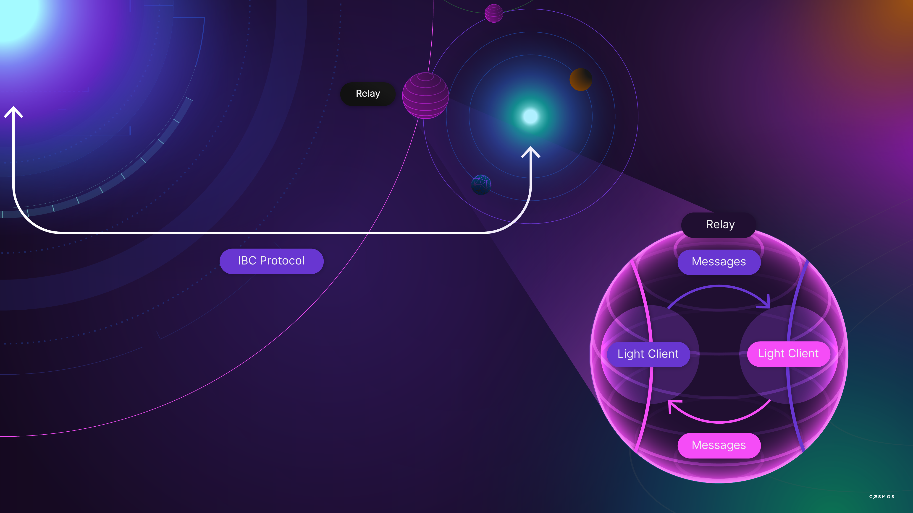

# Inter-Blockchain Communication

In Cosmos, most applications execute on their own purpose-built blockchain running their own validator set. Applications on one chain may need to communicate with applications on another blockchain. For example, an application could accept tokens from another blockchain as a form of payment. Interoperability at this level calls for a method of exchanging data about the state or the transactions on another blockchain.

While such bridges between blockchains can be built and do exist, they are generally constructed in an ad hoc manner. In contrast, Cosmos SDK applications use a common protocol and framework for implementing standardized inter-blockchain communication: the Inter-Blockchain Communication (IBC) protocol is a blockchain-agnostic protocol used to send data from one blockchain to another. It requires certain properties of the underlying blockchain, but its use is not limited to Cosmos SDK-based chains. For example, there is an implementation of IBC for the Substrate framework.

## Modular design and application requirements

IBC allows building a wide range of cross-chain applications, including token transfers, atomic swaps, multi-chain smart contracts (with or without mutually comprehensible VMs), and data and code sharding of various kinds. It is an end-to-end, connection-oriented, stateful protocol for reliable, ordered, and authenticated communication between heterogeneous blockchains arranged in an unknown and dynamic topology. It is possible by specifying a set of data structures, abstractions, and semantics that can be implemented by any distributed ledger provided they satisfy a small set of requirements. Using IBC does not require in-depth knowledge of the low-level details of clients, connections, and proof verification.

Let's take a closer look at the requirements for using IBC. Applications that use the IBC protocol for cross-chain communication must meet the following requirements:

* Bind to one or more ports.
* Define the packet data.
* Define optional acknowledgment structures and methods to encode and decode them.
* Implement the `IBCModule` interface.

<HighlightBox type=”info”>

If you want to begin using IBC, your first step should be to take a closer look at the [Cosmos SDK documentation on IBC components](https://github.com/cosmos/ibc-go/blob/main/docs/ibc/overview.md#components-overview).

</HighlightBox>

### Clients

IBC clients are **light clients** that are identified by a unique client ID. IBC clients track the consensus state of other blockchains and the proof specs of those blockchains, required to properly verify proofs against the client's consensus state. A client can be associated with any number of connections to the counterparty chain.

Supported IBC clients are:

* **`solomachine` light client:** devices such as phones, browsers, or laptops.
* **Tendermint light client:** the default for Cosmos SDK-based chains.
* **Localhost (loopback) client:** useful for testing, simulation, and relaying packets to modules on the same application.

<HighlightBox type="tip">

You can find documentation on the supported IBC clients here:

* [Cosmos SDK documentation: `solomachine` light client](https://github.com/cosmos/ibc-go/blob/main/modules/light-clients/06-solomachine)
* [Cosmos SDK documentation: Tendermint light client](https://github.com/cosmos/ibc-go/blob/main/modules/light-clients/07-tendermint)
* [Cosmos SDK documentation: Localhost client](https://github.com/cosmos/ibc-go/blob/main/modules/light-clients/09-localhost)

</HighlightBox>

### Connections

Connections are responsible for facilitating all cross-chain verification of the IBC state. A connection can be associated with any number of channels.

A connection encapsulates two `ConnectionEnd` objects on two separate blockchains. Each `ConnectionEnd` is associated with a client of the counterparty blockchain. The connection handshake is responsible for verifying that the light clients on each chain are the correct ones for their respective counterparties.

### Proofs and paths

In IBC, blockchains do not directly pass messages to each other over the network. To communicate, blockchains commit the state to a precisely defined path reserved for a specific message type and a specific counterparty. Relayers monitor for updates on these paths and relay messages by submitting the data stored under the path along with proof of that data to the counterparty chain.

The paths that all IBC implementations must support for committing IBC messages are defined in the [ICS-24 host state machine requirements](https://github.com/cosmos/ics/tree/master/spec/core/ics-024-host-requirements). The proof format that all implementations must produce and verify is defined in the [ICS-23 implementation documentation from Confio](https://github.com/confio/ics23).

### Capabilities

IBC is intended to work in execution environments where modules do not necessarily trust each other. IBC needs to authenticate module actions on ports and channels. Only modules with the appropriate permissions can use the channels, this is ensured with [dynamic capabilities](https://github.com/cosmos/cosmos-sdk/blob/master/docs/architecture/adr-003-dynamic-capability-store.md).

Upon binding to a port or creating a channel for a module, IBC returns a dynamic capability that the module must claim to use that port or channel. This binding strategy prevents other modules from using that port or channel since those modules do not own the appropriate capability.

IBC modules do not need to interact at all with these lower-level abstractions. The relevant abstraction layer for IBC application developers is that of channels and ports.

As self-contained modules, a module on one blockchain can communicate with other modules on other blockchains by sending, receiving, and acknowledging packets through channels that are uniquely identified by the `(channelID, portID)` tuple. IBC modules can bind to any number of ports. Each port is identified by a unique `portID`. IBC is designed to be secure with mutually-distrusted modules that operate on the same ledger. Binding a port returns the dynamic object capability.

To take action on a particular port, for example, to open a channel with its `portID`, a module must provide the dynamic object capability to the IBC handler. This prevents a malicious module from opening channels with ports it does not own. IBC modules are responsible for claiming the capability that is returned on `BindPort`.

An analogy to consider: IBC modules as internet apps on a computer. A channel can then be conceptualized as an IP connection with the IBC `portID` as an IP port and the IBC `channelID` as an IP address.

### Channels between IBC ports: Transferring data with packets

Channels can be established between two IBC ports. Each port is exclusively owned by a single module. IBC packets are sent over channels to allow modules to communicate with one another. To maintain interoperability, all IBC packets contain:

* The source `portID`
* The source `channelID`
* The destination `portID`
* The destination `channelID`
* Sequence to optionally enforce ordering
* `TimeoutTimestamp`
* `TimeoutHeight`

The port channels allow IBC to correctly route the packets to the destination module, while also allowing modules receiving packets to know from which module the packet has come. Modules send custom application data to each other inside the Data []byte field of the IBC packet - packet data is completely opaque to IBC handlers. The sender module encodes the application-specific packet information in the data field and the destination module decodes the data to get the original application data.

Modules may choose which channels they wish to communicate over. IBC expects modules to implement callbacks called during the channel handshake:

_How does a four-step handshake look like?_ A four-step handshake takes place in the following manner:

1. Chain A sends a `ChanOpenInit` message to signal a channel initialization attempt with chain B.
2. Chain B sends a `ChanOpenTry` message to try opening the channel on chain A.
3. Chain A sends a `ChanOpenAck` message to mark chain A's channel end status as open.
4. Chain B sends a `ChanOpenConfirm` message to mark chain B's channel end status as open.
5. Channel is open on both sides.

Just as ports came with dynamic capabilities, channel initialization returns a dynamic capability the module must claim, so that modules can pass in a capability to authenticate channel actions (for example, to send packets). Cannel capability is passed into the callback in the first part of the handshake.

### Receipts and timeouts

IBC works over a distributed network. Thus, it might be that IBC needs to rely on potentially faulty relayers to relay messages between ledgers. Additionally, cross-chain communication requires handling instances where a packet does not get sent to its destination on time or at all.

For this reason, packets must specify a `TimeoutHeight` and/or `TimeoutTimestamp` (as mentioned before), after which a packet is no longer successfully received on the destination chain. Once the timeout is reached, a proof-of-packet timeout can be submitted to the packet-sending chain to then timeout the packet. To timeout a packet, for example, the packet send changes could be rolled back.

IBC writes a packet receipt for each sequence it has received in the unordered channel. In **ordered** channels, a timeout of a single packet in the channel closes the channel. With **unordered** channels, packets can be received in any order.

### Acknowledgement

Modules also write application-specific acknowledgments when processing a packet. Acknowledgments can be performed in two ways:

* **Synchronously** on `OnRecvPacket`, if the module processes packets as soon as they are received from an IBC module.
* **Asynchronously**, if the module processes packets at some later point after receiving them.

This acknowledgment data is opaque to IBC, similar to the packet data. The acknowledgment data is treated by IBC as a simple byte string `[]byte`. Receiver modules have to encode acknowledgements, so that sender modules can decode them correctly. How the acknowledgment is encoded should be decided through version negotiation during the channel handshake.

After the acknowledgment has been written by the receiving chain, a relayer relays the acknowledgment back to the original sender module, which then executes the application-specific acknowledgment logic using the acknowledgement.

When the acknowledgment is received successfully on the original sender chain, the IBC module deletes the corresponding packet commitment as it is no longer needed.

## Non-Tendermint chains and IBC

Chains using the Tendermint consensus algorithm can easily bridge using IBC, but also non-Tendermint chains can use IBC. Two types of non-Tendermint chains are supported:

* **Fast-Finality chains:** any fast-finality consensus algorithms can connect with Cosmos chains by adapting the IBC protocol.
* **Probabilistic chains:** Things get a bit more complicated for blockchains that do not have fast finality, like Proof-of-Work (PoW) chains. In this case, IBC uses a special kind of proxy chain called a peg-zone.

A peg-zone is a blockchain that tracks the state of another blockchain. The peg-zone itself has fast-finality and is therefore compatible with IBC. Its role is to establish finality for the blockchain it bridges.

### Ethereum peg zone:

<HighlightBox type=”info”> 

If you want to know more about the Ethereum peg-zone, take a closer look at:

* [Chjango Unchained (2018): The Technicals of Interoperability—Introducing the Ethereum Peg Zone](https://blog.cosmos.network/the-internet-of-blockchains-how-cosmos-does-interoperability-starting-with-the-ethereum-peg-zone-8744d4d2bc3f)

Furthermore, the Tendermint team is working on a peg-zone implementation for the Ethereum chain called the Gravity bridge. For more information check out the next section on [bridges](./17-bridges.html).

</HighlightBox>

<!-- TODO 
Paradigms and implications
Interchain accounts
https://medium.com/chainapsis/why-interchain-accounts-change-everything-for-cosmos-interoperability-59c19032bf11

Relayers - What is a relayer? How are relayers used in Cosmos? How can one manage and deploy relayers? Hermes as an example
https://github.com/cosmos/cosmos-sdk/blob/master/docs/ibc/relayer.md 

Token transfers with IBC

## Long-running exercise

Now we want to let players choose to play with foreign tokens. So:

* The `CreateGameTx` transaction needs to be able to specify the token to use, on top of the amount.
* The _billing_ needs to be updated.
* The leaderboard does not need to be adjusted because it is already per token type. We don't want to do another migration example, that's why we had to be clever about the leaderboard structure.

TODO decide how it looks like. 
-->
