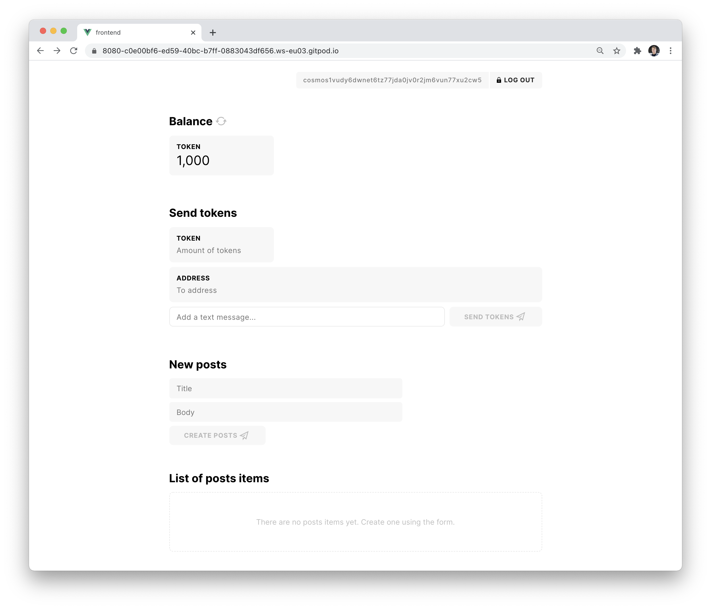

# User interface

Starport will help you to create a UI for your blockchain app.
Navigate into the `vue` directory and start it.

```bash
cd vue
npm install
npm run serve
```

The following `vue` UI is available at `localhost:8080`.



After using the mnemonic from the output of `starport chain serve`, you can use this UI to perform `create` and `list` operations for your blog application's `post` and `comment` types.

### Inspect the Frontend

Open the file at `vue/src/views/Types.vue`.

To see a form for creating `post` items in your app add a `<SpType ... />` component:

```vue
<template>
	<div>
		<div class="container">
			<!-- this line is used by starport scaffolding # 4 -->
		</div>
	</div>
</template>

...
```

Learn more about available components and Cosmos SDK logic that you can use on your `vue` frontend, visit the `@tendermint/vue` library at [github.com/tendermint/vue](https://github.com/tendermint/vue)

🎉 Congratulations, you have created a blockchain with a blog feature.

To continue, learn more about [Starport](https://docs.starport.network) or [Continue with another tutorial](https://tutorials.cosmos.network/).
