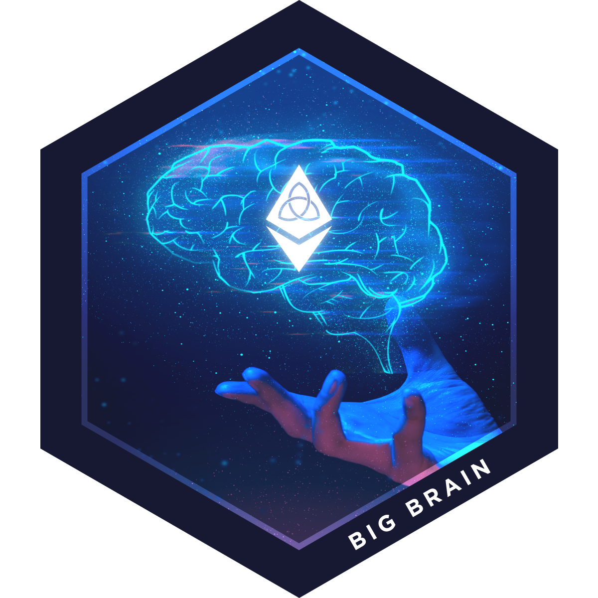
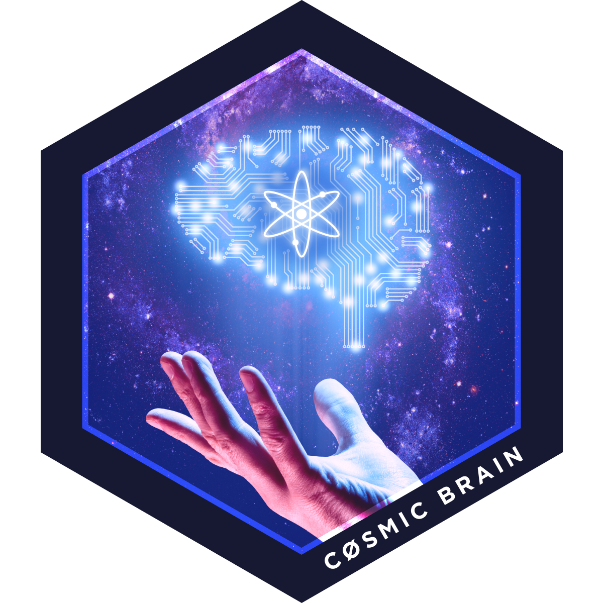

# Eth Denver Cosmos Burner Chain

**Welcome to the first official Cosmos Burner Chain!** Following in the tradition of the Burner Wallet project (and other temporary low-security chains) we've built and launched a game chain to be used for the duration of the Eth Denver Hackathon. The goal of this chain is to provide a blueprint for your own application specific blockchain that interacts with other EVM based networks like Ethereum and xDai.

The Eth Denver Cosmos Burner Chain consists of a few moving pieces. The first of which is the [Cosmos SDK](https://docs.cosmos.network/) itself. This is a framework, much like Ruby-on-Rails, for building application specific blockchains. It comes with a set of standard modules that handles a common set of features: [Bank](https://docs.cosmos.network/master/modules/bank/) (Fungible Tokens like ERC-20), [Auth](https://docs.cosmos.network/master/modules/auth/) (Accounts secured by public key cryptography), [Staking](https://docs.cosmos.network/master/modules/staking/) + [Slashing](https://docs.cosmos.network/master/modules/slashing/) (together these modules handle a proof of stake validator set utilizing Tendermint Consensus with slashing conditions for equivocation and downtime) as well as [Params](https://docs.cosmos.network/master/modules/params/) (live updates to the chain) and [Gov](https://docs.cosmos.network/master/modules/gov/) (a governance module that can be used for text proposals, param changes and directing a community pool of funds) and a few others for lower level tasks.

Out of the core SDK modules, our Burner Chain uses Bank, Auth, Staking and Slashing. Outside of the standard fare it also uses [Peggy](https://github.com/cosmos/peggy), a new Module that was developed by [Swish Labs](https://www.swishlabs.com/) with support from the [Intechain Foundation](https://interchain.io). This module is essentially a bridge between EVM chains like Ethereum and [xDai](https://www.xdaichain.com/). Peggy is used to transport Fungible Tokens but could be extended to transfer NFTs as well as arbitrary messages. The final piece of our chain is the [Scavenge Module](https://tutorials.cosmos.network/scavenge), which is part of the sdk-tutorials repo. This module allows you to post a riddle with a bounty for whoever can solve it.

In summary the pieces that are included are:
 * [Bank](https://docs.cosmos.network/master/modules/bank/)
 * [Auth](https://docs.cosmos.network/master/modules/auth/)
 * [Staking](https://docs.cosmos.network/master/modules/staking/)
 * [Slashing](https://docs.cosmos.network/master/modules/slashing/)
 * [Peggy](https://github.com/cosmos/peggy)
 * [Scavenge](https://tutorials.cosmos.network/scavenge)

# Peggy/Scavenge + BuffiDao

The purpose of the chain is to extend the Scavenger hunt game in order to interact with the Eth Denver [BuffiDao](https://buffidao.com) game. Cosmos has **1200 XP** to give out and **2 NFT badges** (Big Brain and Cosmos Brain). We have locked all of them up within a peggy bridge contract deployed to the xDai chain. This contract is controlled by the validators of our Burner Chain which relay transactions between the two chains. In order to claim `XP` on the Cosmos Burner Chain you must first have signed up for our survey. You should have done that already if you are here, but if not head over [here](https://survey.zohopublic.com/zs/lDB3Xp). Afterwards you can claim your `XP` on the Cosmos burner chain where you will be able to move the `XP` back to the BuffiDai contract on xDai using the Peggy ETH bridge.

To win MORE `XP` as well as the **Bronze** and **Silver** Badge NFTs you must play the Scavenge game! This is a series of riddles and scavenger hunts which result in secret answers that are submitted via commit-reveal to the Cosmos Chain. Correct results are rewarded with `XP` as well as a burner chain native token called `brain`. The top two owners of `brain` at the end of the hackathon will win the two NFT Badges--Big Brain & Cosmos Brain.
<div style="text-align: center;">
  
  
</div>

# Get your XP

To get the `XP` begin by signing up for our newsletter at our Sponsor Booth. To claim the `XP` you'll need to build the Command Line Client for interacting with the Eth Denver Cosmos Burner Chain and generate a wallet. First make sure that you have [installed golang v13.0 or newer](https://golang.org/doc/install) and that your `$GOPATH` and `$GOHOME` are correctly configured.
```sh
go version
echo $GOPATH
echo $GOHOME
```
Now you can get the repo by cloning it directly with the correct branch (`okwme/minimal-scavenge`):
```sh
git clone github.com/cosmos/peggy@okwme/minimal-scavenge
```
Afterwards you'll need to navigate into the newly downloaded directory and run `make install` like:
```sh
cd peggy
make install
```
> You may need to install `make` and `make-guile` before running `make install`

This should result in building three binaries:
```sh
make install
go install -mod=readonly ./cmd/ebd
go install -mod=readonly ./cmd/ebcli
go install -mod=readonly ./cmd/ebrelayer
```
The first binary (`ebd`) is used for running a node within the network (we're just going to be connecting to a node that's already running). The second binary (`ebrelayer`) is for running a relayer between the burner chain and xDai. You won't be allowed to do this unless you also run a validator so we won't look further into it at this point. The third binary (`ebcli`) is the one we want. Try running the help command to see what it can do:
```sh
ebcli --help
ethereum bridge client

Usage:
  ebcli [command]

Available Commands:
  status      Query remote node for status
  config      Create or query an application CLI configuration file
  query       Querying subcommands
  tx          Transactions subcommands
              
  rest-server Start LCD (light-client daemon), a local REST server
              
  keys        Add or view local private keys
              
  version     Print the app version
  help        Help about any command

Flags:
      --chain-id string   Chain ID of tendermint node
  -e, --encoding string   Binary encoding (hex|b64|btc) (default "hex")
  -h, --help              help for ebcli
      --home string       directory for config and data (default "/root/.ebcli")
  -o, --output string     Output format (text|json) (default "text")
      --trace             print out full stack trace on errors

Use "ebcli [command] --help" for more information about a command.
```
The first thing we'll want to do is add some values to the config of our CLI so you don't need to include them as flags with every other command. W'' add formatting the CLI results as well as point our CLI to the active burner node at http://167.99.167.78:26657 where it is running with the `chain-id` of `peggy`.
```sh
ebcli config indent true
ebcli config format JSON
ebcli config chain-id peggy
ebcli config trust-node true
ebcli config node tcp://167.99.167.78:26657
```
Next you'll want to generate a new account for this chain. You should come up with a nickname for this account that you can use to reference it while making other commands later on. This will also show you the mnemonic phrase that secures the account as well as the public key and your address as a bech32 encoded version of your public key with a cosmos prefix (the prefix can be modified per chain).
```sh
ebcli keys add new nickname
Enter keyring passphrase:
{
  "name": "nickname",
  "type": "local",
  "address": "cosmos15d0vljwtyxnrz9quuk2mj7mjfmjfg8wjfedm90",
  "pubkey": "cosmospub1addwnpepqwhkspe65ewjerceu5dckqcfpcku0znx3c6q0ll3whyngjzycx4awd8pn5p",
  "mnemonic": "** ** ** ** ** ** ** ** ** ** ** ** ** ** ** ** ** ** ** ** ** ** ** **"
}
```
This is your new account! Now that you know your account **address**, you need to send it to us so we can give you your `XP`! You can submit it via email to [billy@tendermint.com](mailto:billy@tendermint.com) with the email address you signed up for the survey with. I'll reply letting you know you've received the `XP`. Once you've received it you should be able to check your balance like this:
```sh
ebcli query account $(ebcli keys show nickname -a)
Enter keyring passphrase:
{
  "type": "cosmos-sdk/Account",
  "value": {
    "address": "cosmos15d0vljwtyxnrz9quuk2mj7mjfmjfg8wjfedm90",
    "coins": [
      {
        "denom": "XP",
        "amount": "10"
      }
    ],
    "public_key": "cosmospub1addwnpepqwhkspe65ewjerceu5dckqcfpcku0znx3c6q0ll3whyngjzycx4awd8pn5p",
    "account_number": 0,
    "sequence": 2
  }
}
```
This uses the `ebcli keys` as a sub-command to grab your account address and uses it as a parameter in the `ebcli query` command. 
> If you have not yet received your `XP` tokens, you will see an error that your account does not exist. That's because accounts are not registered within the chain's memory until they execute their first transaction or receive a balance in some token.

Once you have some `XP` you can send it back to your Ethereum address on the BuffiDai xDai chain. To do this use the following command:
```sh
ebcli tx ethbridge burn $(ebcli keys show nickname -a) <ethereum-recipient-address> 10XP --from nickname --chain-id peggy --ethereum-chain-id 100 --token-contract-address <XP-token-address>
```
You should be able to see the balance show up in your BuffiDao wallet!

# Scavenger Hunt

If you are ready to try earning more `XP` as well as `brain` in order to win the NFT Badges you should begin interacting with the Scavenge module. To get the first hint try printing out the questions being asked. These are stored by hashes of the answers. This means that once you think you know the answer, you can try hashing it to see if it matches the one recorded on the blockchain. To retrieve a list of all answer hashes use the following command:
```sh
ebcli query scavenge list
[
  "fcde2b2edba56bf408601fb721fe9b5c338d10ee429ea04fae5511b68fbf8fb9",
  "fcde2b2edba56bf408601fb721fe9b5c338d10ee429ea04fae5511b68fbf8fb9",
  "fcde2b2edba56bf408601fb721fe9b5c338d10ee429ea04fae5511b68fbf8fb9",
  "fcde2b2edba56bf408601fb721fe9b5c338d10ee429ea04fae5511b68fbf8fb9",
]
```
This will show you a list of hashes. Take each of the hashes and request more information about that specific question with the following command:
```sh
ebcli query scavenge get fcde2b2edba56bf408601fb721fe9b5c338d10ee429ea04fae5511b68fbf8fb9
{
  "creator": "cosmos17pl55kygvp3gnqf2xqwye9lysgp2mndufzaup6",
  "description": "foo",
  "solutionHash": "fcde2b2edba56bf408601fb721fe9b5c338d10ee429ea04fae5511b68fbf8fb9",
  "reward": [
    {
      "denom": "brain",
      "amount": "1"
    }
  ],
  "solution": "",
  "scavenger": ""
}

```
This will give you the description of the challenge and start you on your journey to solving the problem. It will also show you whether someone has already beat you to the punch and solved the riddle ahead of you. If you'd like to combine these two commands you can install `jq` and use some bash-jitsu as follows:
```sh
ebcli query scavenge list | jq ".[]" | xargs -I {} ebcli query scavenge get {}
```
This should get you ready to begin solving the riddles! Once you think you have the answer you can submit it with a commit reveal scheme. This means that you first submit your address and it is hashed together with your address. That way no one can see what you think the answer is. Following this is the plain text submssion of your answer. At this point the app will hash your submission with your address to make sure you have already commited it. This prevents someone else from submitting your answer by watching the mempool of pending transactions.

Your commit command should look like the following:
```sh
ebcli scavenge commit "your answer" --from nickname
```
This command will hash it on your behalf and submit the transaction after asking you to sign with the key you generated earlier. Once submitted you can confirm it was successful by taking the resulting <txhash> (looks like `9E869380BFD482DE05DD19B6DB00E3DB01B3E60F6422C12356D5F27459C8372C`) and querying the status of the tx as follows:
```sh
ebcli query tx <txhash>
```
You should be able to see a series of events which were triggered when this transaction was sent. If it was successful you can proceed to reveal your answer and claim your reward:
```sh
ebcli scavenge reveal "your answer" --from nickname
```
This command will build the transaction and submit it after you sign with your key. To check whether the transaction was successful you can run a similar command as we previously did to check the transaction status:
```sh
ebcli query tx <txhash>
```
You could also query the scavange directly to see if your name shows up as the solver:
```sh
ebcli query scavenge show <solutionHash>
```
If you see your name you should be able to confirm that you received the NFT reward by using the following command:
```sh
ebcli query account $(ebcli keys show nickname -a)
```
Now that you've earned the `XP` or `brain` you can transfer it to your Ethereum Address on the xDai chain. If it is `XP`, it originated on the xDai side so you will `burn` the peggy tokens like we saw before. The `brain` tokens are native to the burner chain so they would be locked and minted as wrapped `brain` on xDai. The following command demonstrated what that would look like:
```
ebcli tx ethbridge lock $(ebcli keys show nickname -a) <ethereum-recipient-address> 10brain --from nickname --chain-id peggy --ethereum-chain-id 100 --token-contract-address 0x164B88D11bD596956b6a7B1f662f11864EC1202e
```
> Notice: You don't have to move the `brain` token to win the NFT. We will see who has the most `brain` at the end of the weekend and reward the NFT to them, but this does not require the `brain` to be on the xDai chain.

Congratulations, you've just won `XP` and/or enough `brain` to get an NFT Badge on the Eth Denver Cosmos Burner Chain! This chain will shut down after it's purpose at this event but the assets you earned will live on to be used in the BuffiDAO community voting pool and stay with you on the much less ephemeral xDai and Ethereum blockchains!

If you enjoyed this Tutorial feel free to share to others who may also enjoy it! If you had any issues we'd love to hear about them! This tutorial is hosted on [github](https://github.com/cosmos/tutorials) where you can make a new issue and describe the difficulties you were experiencing. The repo for the actual burner chain is in the `okwme/minimal-scavenge` branch of the [peggy repo](https://github.com/cosmos/peggy/tree/okwme/minimal-scavenge). If you want any help during the hackathon just look for someone at the Cosmos booth!

If you want to stay up to date with me consider following my [twitter](https://twitter.com/billyrennekamp), [github](https://github.com/okwme) and/or [medium](https://medium.com/@billyrennekamp).
> Special thanks to Jazear, Marko, Denis, Dogemos, Nass, Sunny, Kelsey, Brent, Chjango and Peter!`