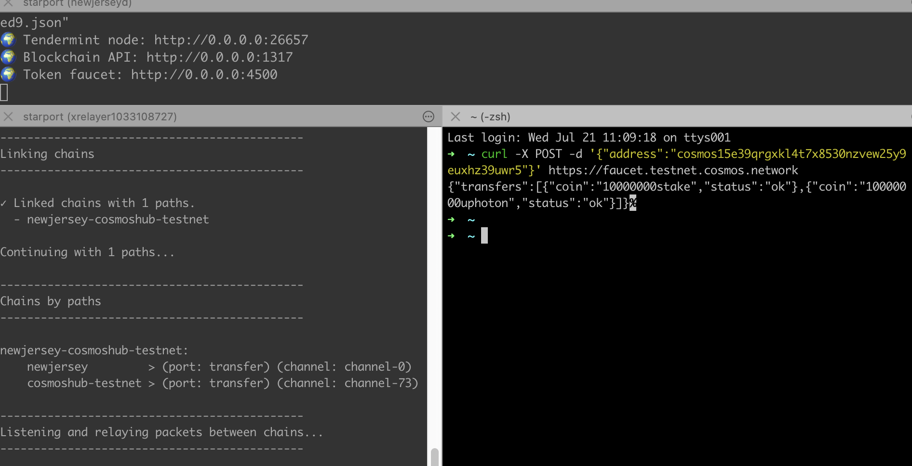

---
parent:
  title: Understanding the Liquidity Module
order: 0
description: Use the Tendermint liquidity module to create pools, deposit to pools, and withdraw from pools with tokens sent using IBC.
---

# Liquidity Module

The liquidity module, known on the Cosmos Hub as Gravity DEX, enables users to create liquidity pools and swap tokens. 

## Use Liquidity Pools to Trade Tokens

When using Cosmos SDK-based blockchains, you want to enable users to trade tokens. You can have multiple tokens on your blockchain or have tokens from external blockchains sent to your blockchain using the inter-blockchain communication protocol (IBC). 

The liquidity module uses liquidity pools to trade tokens on your blockchain. Each pool represents a token pair and allows the user to swap assets from one token to another token.

In this tutorial, you create your own blockchain, send tokens to another blockchain, create a pool, deposit to a pool, withdraw from a pool, and swap tokens.

You can follow the [code with us session](https://www.youtube.com/watch?v=GxaqpzMk0jk&t=978s) for hands-on experience.

**Important:** In the code examples throughout this tutorial, when you see username be sure to substitute your username. 

**You will learn how to:**

- Create a blockchain with Starport
- Create your own token on your blockchain
- Connect your blockchain to the testnet
- Send your own token with IBC to the testnet
- Create a liquidity pool with your token
- Use the liquidity pool with your token

## Requirements

Before you start the tutorial, install the prerequisite software. 

- [Install Starport](../starport/index.md) v0.16.2

    **Important:** This tutorial uses [Starport](https://github.com/tendermint/starport) v0.16.2. The tutorial is based on this specific version of Starport and is not supported for other versions.

- Install the Gravity DEX binary

    - Clone the repo:

    ```sh
    git clone https://github.com/cosmos/gaia.git
    ```
    
    - Move into the `gaia` directory and checkout the `v5.0.0` release. Gravity DEX (liquidity module) is available only in v5.0.0 and higher versions. 
    
    ```sh
    cd gaia && git checkout v5.0.0
    ```
    
    - Install the gaia software in that location:  

    ```sh
    make install
    ```

    - Verify the gaiad version:  

    ```sh
    gaiad version
    ```

    The output of `gaiad version` prints:
    
    ```sh
    v5.0.0
    ```

## Create the Blockchain

**Tip:** Remember to substitute your username in the following examples.

Scaffold a new blockchain called `myblockchain`:

```sh
starport app github.com/username/myblockchain
```
Change to the blockchain directory:

```sh
cd myblockchain
```

## Add Your Token in the Configuration

Before you start your myblockchain app, add your account. Your account includes your username and your new token. 

1. Navigate to the top-level folder of your app directory `myblockchain`.

1. Use any text editor to edit the `config.yml` file. 

1. For the `accounts` parameter, add your username and your new token. 

  In this example, create your new token with a self-describing name. For example, `myusernametoken` where `username` is your username:

  ```json
  accounts:
    - name: username
      coins: ["10000token", "50000000stake", "1000000000000myusernametoken"]
  ```

**Tip:** Use a comma-separated list of strings with denominations to add the initial coins. You can follow the `.yml` syntax for the auto-generated users `alice` and `bob`.

The minimum reserve coin amount for a pool in the liquidity module is 1,000,000. You must create enough tokens for your liquidity pools. This sample entry creates enough tokens (1000000000000) to create 10 liquidity pools (10*1000000=1000000000000).

## Start Your Blockchain

To start your blockchain, run this command in your local terminal:

```sh
starport serve
```

You see output similar to the following output, but with different account passphrases and addresses:

```sh
Cosmos SDK's version is: Stargate v0.40.0 (or later)

🔄 Resetting the app state...
🛠️  Building proto...
📦 Installing dependencies...
🛠️  Building the blockchain...
💿 Initializing the app...
🙂 Created account "alice" with address "cosmos1qur6tvu7p4khtr5zzcx0uk5fq06hfk5xflw83e" with mnemonic: "tank film icon helmet myth devote velvet rib behind exhaust move pass endless combine bag congress pool bean shoulder issue trouble banner best nice"
🙂 Created account "bob" with address "cosmos1w8w3t8rhv5zpvdscy9332wp4tugkg0ezskf95u" with mnemonic: "attract shoulder person upset dream category finish detect country track edge planet crack gloom soldier together hockey arena panel horn rapid zero common marriage"
🙂 Created account "username" with address "cosmos1mr3ss57xexzg7j377vfd24d3vv3vy0e3mpuj6y" with mnemonic: "parent butter piece picnic north thumb knife denial toy silk juice diary cruise idle pink repair radar brisk decide sugar gap joke palm day"
Genesis transaction written to "/Users/joy20/.myblockchaind/config/gentx/gentx-2e8a6a680b4f9adaecfafbc6ecad8b96ef8b9157.json"
🌍 Tendermint node: http://0.0.0.0:26657
🌍 Blockchain API: http://0.0.0.0:1317
🌍 Token faucet: http://0.0.0.0:4500
```

Be patient, using the `starport serve` command is powerful and takes a few minutes. You are starting your sovereign application-specific blockchain in development and this command is doing all the work for you. Everything you need is being scaffolded so you can focus on business logic.

Keep this terminal window open and available. You won't run any more commands in this terminal window, but you will return to this window throughout this tutorial to copy your account address and mnemonic passphrase.  

## Configure the Relayer

A relayer is software to connect two blockchains. Configure the relayer with your endpoints to create a connection between your blockchain and the Gravity DEX testnet. After the connection is established, you can send tokens from one blockchain to the other blockchain.

### Remove Existing Starport Configurations

In a new terminal window, remove your existing Starport configurations if you previously used Starport.

```sh
rm -r $HOME/.starport/*
```

If existing configurations do not exist, the command returns `no matches found` and no action is taken.

### Create a Connection to the Cosmos Hub testnet

In the same terminal window, configure the relayer to create a connection between your local chain and the chain you want to connect to. In this example, the chain you want to connect to is the Cosmos Hub testnet.

```sh
starport relayer configure
```

- For each local `source` chain argument, press Enter to use the default values.
- For the testnet `target` chain, use the following values:


- Target RPC: [https://rpc.testnet.cosmos.network:443](https://rpc.testnet.cosmos.network/)

- Target Token Faucet: [https://faucet.testnet.cosmos.network:443](https://faucet.testnet.cosmos.network/)

- Target Gas Price (0.025uatom): `0.025stake`

- Target Address Prefix (cosmos): `cosmos`

After you configure the relayer and everything runs successfully, you see the following output, but of course with a different account address. The account address is the same on source and target.

```code
🔐  Account on "source" is "cosmos174n26d8n223aje53dznlfahpv54np970wr3ae7"
 
 |· received coins from a faucet
 |· (balance: 100000stake,5token)

🔐  Account on "target" is "cosmos174n26d8n223aje53dznlfahpv54np970wr3ae7"
 
 |· received coins from a faucet
 |· (balance: 10000000stake,10000000uphoton)

⛓  Configured chains: myblockchain-cosmoshub-testnet

Note: Mnemonics for relayer accounts are stored unencrypted in the `/Users/username/.starport/relayer/config.yml` file.
This may change in the future. Until then, use them only for small amounts of tokens.
```

Connect the chains:

```markdown
starport relayer connect
```

While your two blockchains start to connect, you will see this message:

```bash
◣ Linking paths between chains... 
```

After your blockchain connection is successful, your output is something like:

```bash

---------------------------------------------
Linking chains
---------------------------------------------

✓ Linked chains with 1 paths.
  - myblockchain-cosmoshub-testnet

Continuing with 1 paths...

---------------------------------------------
Chains by paths
---------------------------------------------

myblockchain-cosmoshub-testnet:
    myblockchain      > (port: transfer) (channel: channel-0)
    cosmoshub-testnet > (port: transfer) (channel: channel-74)

---------------------------------------------
Listening and relaying packets between chains...
---------------------------------------------
```

The target channel number increments each time a blockchain connects to the testnet. The target channel number might be different for you. In this example:

- The name of the source port for `myblockchain` is `transfer` and the source channel is `channel-0`.
- The name of the target port for `cosmoshub-testnet` is also named `transfer` and the target channel is `channel-73`.

Leave this relayer terminal window open. You won't run any more commands in this terminal window, but the relayer process continues to runs here. You can view this window to confirm that  inter-blockchain transfers are successful.

## Get Tokens from the Faucet

To claim tokens from the faucet, use a new terminal window. Now you have three terminal windows open for this tutorial. 

**Tip:** To provide access to the different processes that run during the tutorial, you can divide a single terminal window into three terminal windows so you can: 

  1. See the `starport serve` output with your account address and mnemonic
  2. See the relayer process output to confirm your transactions
  3. Run the liquidity transaction commands

For example, use this 3-way split iTerm2 window:



To claim tokens from the testnet faucet, run this command and provide the cosmos address that was output to the terminal when you ran the `starport serve` command:

```curl
curl -X POST -d '{"address": "cosmosxxxxx"}' https://faucet.testnet.cosmos.network
```

A successful command run returns output like this:

```json
{"transfers":[{"coin":"10000000stake","status":"ok"},{"coin":"10000000uphoton","status":"ok"}]}%
```

### Check Your Balance 

Now that the token transfer is successful, you can check your balance. 

Make sure to replace `cosmosxxxxx` with your address from the previous step.

To see your balance, go to [https://api.testnet.cosmos.network/cosmos/bank/v1beta1/balances/cosmosxxxxx](https://api.testnet.cosmos.network/cosmos/bank/v1beta1/balances/cosmosxxxxx).

The balance returns something like:

```json
{
  "balances": [
    {
      "denom": "stake",
      "amount": "10000000"
    },
    {
      "denom": "uphoton",
      "amount": "10000000"
    }
  ],
  "pagination": {
    "next_key": null,
    "total": "2"
  }
}
```

## Send Your Own Tokens to the Testnet

Now that your account is funded with testnet tokens, you can send your own tokens to the testnet. 

At your local terminal, run the `tx ibc-transfer transfer` command to transfer your tokens to the testnet. 

The usage of the `tx ibc-transfer transfer` command is:

```bash
Usage:
  <appd> tx ibc-transfer transfer [src-port] [src-channel] [receiver] [amount] [--from username]
```

**Tip:** Per the command usage, make sure to provide the correct values. Replace: 

- `[src-port]` with `target`
- `[src-channel]` with `channel-0` 

    The port and channel were output to the terminal when you ran `starport relayer connect` and can be viewed on the terminal window that is running the relayer process:

    ```code
    Chains by paths
    ---------------------------------------------

    myblockchain-cosmoshub-testnet:
        myblockchain    > (port: transfer) (channel: channel-0)
    ```

- `[receiver]` with your `cosmosxxxxx` account address

    Your cosmos account address was output to the terminal where the `starport serve` command was run. 

- `[amount]` with `"15000000myusernametoken"`  

- `username` in the `[--from username]` flag with your username

For this example, the command to transfer your token to the testnet is:

```bash
myblockchaind tx ibc-transfer transfer transfer channel-0 cosmosxxxxx "15000000myusernametoken" --from username
```

When prompted to `confirm transaction before signing and broadcasting [y/N]:` make sure you review all of the parameters, especially the receiving cosmos address, type `y`, and then press Enter to confirm the transaction. 

When your command is run successfully, you receive a JSON response that starts with a non-zero block `{"height":...` and a `"txhash"` then you know the command was accepted and was run without errors. 

After your transaction is complete, check your balance on the  testnet to confirm your token transfer.

**Tip:** To confirm that the transfer is successful, you can check the terminal window that shows the relayer process. You know the transfer is successful when you see output similar to:

 ```sh
 Relay 1 packets from myblockchain => cosmoshub-testnet
 Relay 1 packets from myblockchain => cosmoshub-testnet
 Relay 1 acks from cosmoshub-testnet => myblockchain
 Relay 1 acks from cosmoshub-testnet => myblockchain
 ```

You can run the command again if needed. Sometimes transactions don't go through on the first try.

See your balance at [https://api.testnet.cosmos.network/cosmos/bank/v1beta1/balances/cosmosxxxxx](https://api.testnet.cosmos.network/cosmos/bank/v1beta1/balances/cosmosxxxxx).

You have a new token as a result of the IBC transfer. The denom of your new token starts with `ibc/` and then a denomhash. Your new denom will look something like this:

```json
    {
      "denom": "ibc/699CF694D09492BF9B8A49DE81C835C25A0B5DA8EC0D5EAAA591C2C52A4E36EE",
      "amount": "15000000"
    },
 
 ```

Take a closer look at the entry `ibc/` followed by a long hash. Learn more about the IBC denom, see [Understand IBC Denoms with Gaia](../understanding-ibc-denoms.md). 

When you create a liquidity pool, this `ibc/denomhash` is the denom you must provide to make a token pair with one of the existing native tokens. For the testnet, you can create a token pair with `uphoton`.

### Verify Your Token Supply 

You now have access to all the available tokens that you transferred to the testnet. Your new token from your blockchain is now listed at the `supply` API endpoint. 

Check the following resources for an overview of the activity on the testnet and find your token.

- https://api.testnet.cosmos.network/cosmos/bank/v1beta1/supply 

  This supply endpoint shows all of the tokens on the testnet. You can search for your token. 

- https://api.testnet.cosmos.network/ibc/applications/transfer/v1beta1/denom_traces

  To verify your denom is in testnet supply, search for your denom. If there is are duplicate denoms with the same name, look by denom and channel.  

## Add your Starport blockchain account to gaiad

To access Starport `username` account on `gaiad`, add your username to the keychain. In the same terminal window (the one you used to run the `ibc-transfer` command):

```bash
gaiad keys add username --recover
```

You are prompted to enter the mnemonic passphrase that was output to the terminal window where you ran the `starport serve` command on your `myblockchaind`:

```bash
> Enter your bip39 mnemonic
```

Add the `username` mnemonic passphrase and press Enter. You see output similar to:

```bash
- name: username
  type: local
  address: cosmos1780t4erzwrvr9x6jvqjxduwkuk3ex3fnhqzza5
  pubkey: cosmospub1addwnpepqfs05yqcjghqzct5y39r33r5ew47pjqkvcj7ezngufazy0eqsyx65vtut0h
  mnemonic: ""
  threshold: 0
  pubkeys: []
```

## Create a Liquidity Pool

Run the `liquidity create-pool` command to create a liquidity pool with two tokens: 1100000uphoton and 1500000ibc/denomhash. 

Make sure to replace `ibc/denomhash` with the hash denom you received on the previous step and that you can verify in the [testnet supply](https://api.testnet.cosmos.network/cosmos/bank/v1beta1/supply). 

Replace `username` with your account username.

```bash
gaiad tx liquidity create-pool 1 1100000uphoton,1500000ibc/denomhash --from username --chain-id cosmoshub-testnet --gas-prices "0.025stake" --node https://rpc.testnet.cosmos.network:443 --gas 2000000 -y
```

The optional `-y` flag specifies to bypass the confirmation prompt. 

Confirm the pool has been created. See the pools endpoint:

[https://api.testnet.cosmos.network/tendermint/liquidity/v1beta1/pools](https://api.testnet.cosmos.network/tendermint/liquidity/v1beta1/pools)


## Swap Token

You are ready to swap tokens! You now have uphoton token in your account and want to swap for the new IBC coin:

```bash
gaiad tx liquidity swap 1 1 100000uphoton ibc/longibchash 0.1 0.003 --from username --chain-id cosmoshub-testnet --gas-prices "0.025stake" --node https://rpc.testnet.cosmos.network:443 -y
```

The optional `-y` flag specifies to bypass the confirmation prompt. 

Check the balance on the new account that made the trade:

[https://api.testnet.cosmos.network/cosmos/bank/v1beta1/balances/cosmosxxx](https://api.testnet.cosmos.network/cosmos/bank/v1beta1/balances/cosmosxxx)

Make sure to replace `cosmosxxxxx` with your address.


## Deposit Token

You can Deposit tokens to the pool you have created.

```bash
gaiad tx liquidity deposit 1 100uphoton,100ibc/longibchash --from username --chain-id cosmoshub-testnet --gas-prices "0.025stake" --node https://rpc.testnet.cosmos.network:443 -y
```
**Optional:** Add -y flag to bypass confirmation prompt

**Note:** Deposits must be the same coin denoms as the reserve coins.

Check the balance on the new deposit that you have made:

[https://api.testnet.cosmos.network/cosmos/bank/v1beta1/balances/cosmosxxx](https://api.testnet.cosmos.network/cosmos/bank/v1beta1/balances/cosmosxxx)


## Withdraw Token

You can also withdraw tokens from the pool you have created.

```bash
gaiad tx liquidity withdraw 1 100pool-id --from username --chain-id cosmoshub-testnet --gas-prices "0.025stake" --node https://rpc.testnet.cosmos.network:443
```
**Note:** Make sure to replace pool-id found [here](https://api.testnet.cosmos.network/cosmos/bank/v1beta1/balances/cosmosxxx)

Check the balance on the new withdrawal that you have made:

[https://api.testnet.cosmos.network/cosmos/bank/v1beta1/balances/cosmosxxx](https://api.testnet.cosmos.network/cosmos/bank/v1beta1/balances/cosmosxxx)


## 🎉 Congratulations 🎉

By completing this tutorial you have learned how to use liquidity module.

Here’s what you accomplished in this tutorial:

- Creating a Blockchain with Starport and connecting to testnet
- Creating a new liquidity pool with IBC token
- Swap tokens within the pool
- Deposit tokens to the pool
- Withdraw tokens from the pool
