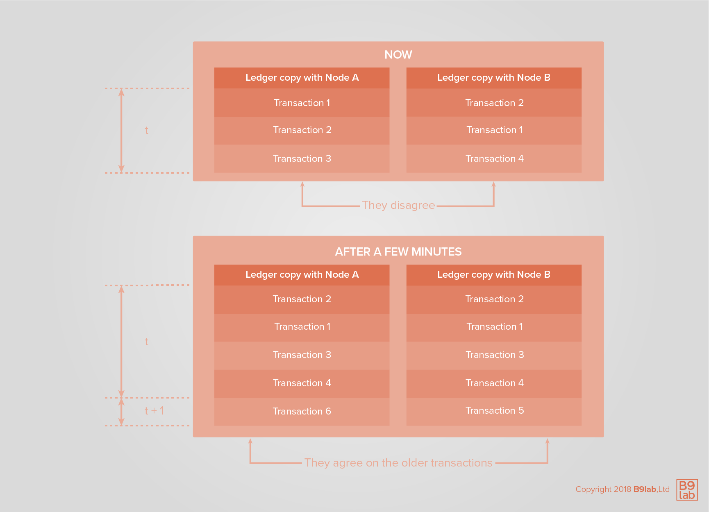
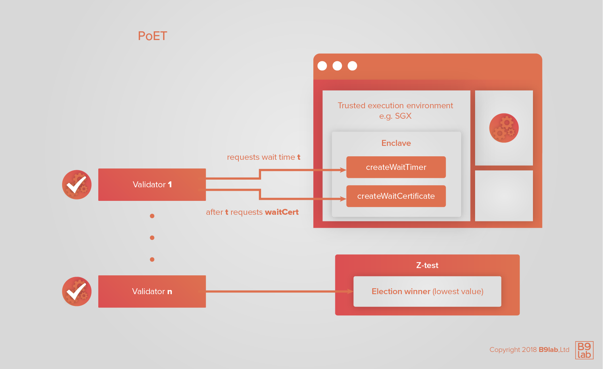
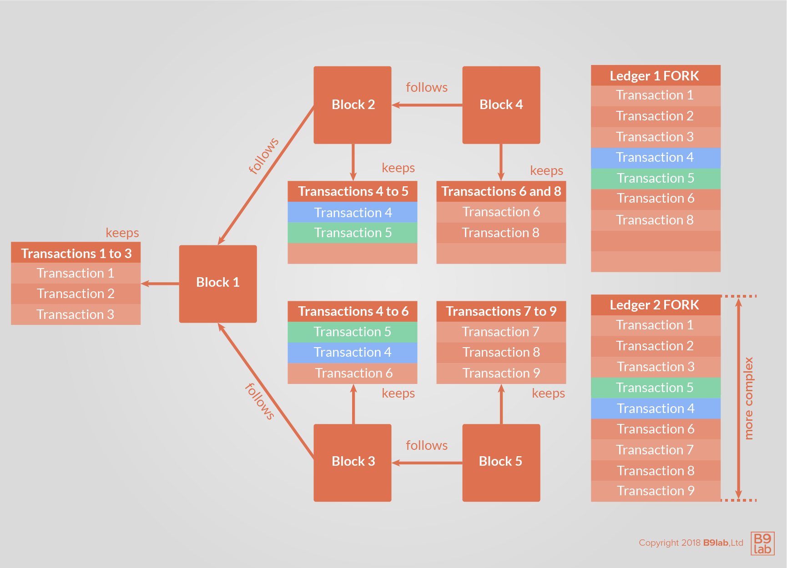
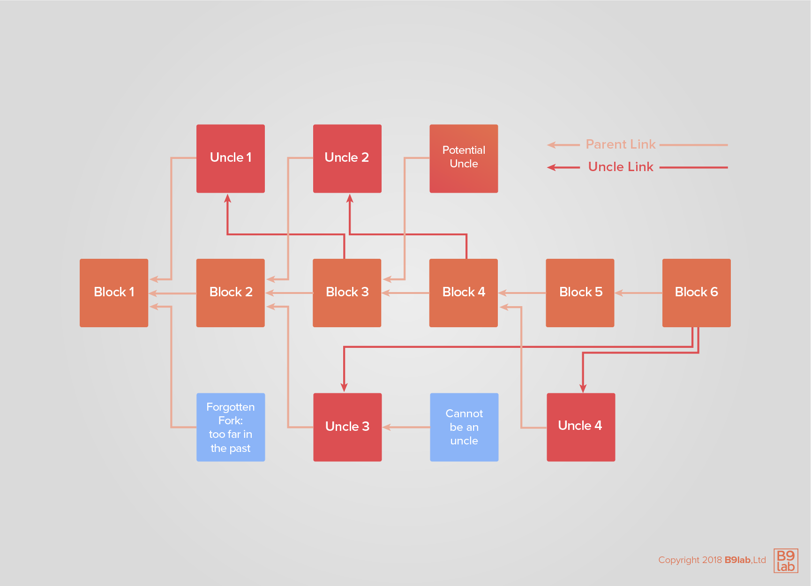

# Consensus

A blockchain is a well-ordered set of data on which all peers *eventually* agree. What they agree on is considered as the single truth. Reached by consensus, the **single truth** is the **_single true state of the distributed ledger_**. **Consensus has to be reached to guarantee data consistency.**

This section presents a closer look at consensus in blockchain technology by starting with the Byzantine Generals problem and how it can be resolved, then providing an overview of consensus mechanisms in blockchain, addressing immutability and also eventual consensus.

## The Byzantine Generals Problem

The **Byzantine Generals Problem** is a consensus-reaching problem scenario, which can be applied to hierarchy-free, permission-less, and failure-prone networks, therefore also to distributed computing. Mitigation strategies for it are known as **Byzantine Fault Tolerance (BFT)**.

What is the Byzantine Generals Problem?

Imagine a trio of generals whose armies surround a target city. The generals are physically far away from each other and can only communicate via messengers, who could fail to deliver messages and/or acknowledgments, or even forge false ones; the generals can only use **unsecured communication channels**. Even the generals themselves have questionable loyalty and do not necessarily trust one another. The siege can only be won if the generals work together. But how can the generals reach consensus on whether they want to attack or retreat, and if they want to attack when to exactly do it?

### How does the Byzantine Generals Problem relate to blockchain?

Similar to the generals who must decide when to attack, in a distributed ledger the agreed transaction list has to be identified and consensus on the correct order of transactions has to be reached.

As individual transactions are sent to the network from individual nodes, each node must pass, or fail to pass transactions to other nodes. Not all nodes will see the same transactions at the same time because of the time delay required for data to physically travel across the network (physical latencies). Each node must therefore build its order of transactions.

Since all nodes participate equally, there is **no authoritative order of transactions**. Still, the network must decide which node's version, or any version, of the truth will be the authoritative truth.

## A solution - consensus mechanisms

**Consensus** can be understood as _a process in which the network, constituted by nodes, reaches an agreement regarding the order of transactions and validates the proposed blocks_. Consensus mechanisms generate:

* Consensus on the global **state of the blockchain**
* Consensus on a **set of transactions** in a block

The main functions of such mechanisms are to:

* **Order transactions**;
* **Validate transactions**.

<HighlightBox type="info">

Consensus algorithms establish **safety** and **liveness** by generating consensus, ordering transactions, and validating them. Whereas, safety requires the algorithm to behave like a single node system executing each transaction atomically one at a time would; the same set of transactions should lead to the same changes in the state on each node. Liveness refers to the upholding of network synchronization: all non-faulty nodes will eventually receive every submitted transaction.

</HighlightBox>

<ExpansionPanel title="General types of consensus algorithms">

Consensus algorithms can be differentiated into **lottery-based** such as PoW and **voting-based algorithms**, like for example in the case of Delegated-Proof-of-Stake.

In lottery-based algorithms, nodes creating blocks are randomly selected in a mechanism strongly resembling a lottery. These algorithms are said to have **high scalability** but at the same time a tendency of producing **forks** and with it a **high-latency finality**. With increased block creation time the probability of another peer creating a new block before receiving the just created one can result in numerous forks. This leads to an instance that has to be solved to achieve finality.

<HighlightBox type="info">

Have you heard the term fork or forking before? If not, please do not worry. A closer look at forks will follow in this section.

</HighlightBox>

Voting-based algorithms bring the advantage of **low-latency finality**; finality is faster than in lottery-based algorithms. This type of algorithm also brings a **scalability/speed trade-off**: as all nodes have to be kept in the loop, the larger the network so the more nodes in a network, the longer it takes for consensus.

To summarize, lottery-based algorithms have good speed and scalability but are slower in achieving finality. Voting-based algorithms are fast and achieve finality faster but are not as well-suited when it comes to scalability. The suitability of algorithms depends strongly on the network requirements and different fault-tolerance models.

</ExpansionPanel>

Using PoW to obtain consensus was one of the innovations introduced by Bitcoin in addition to the chain of blocks. Since then, many other consensus algorithms have emerged. The academic community had introduced consensus algorithms even before Bitcoin.

Let us have a look at some of the most popular consensus algorithms.

### Practical Byzantine Fault Tolerance (pBFT)

pBFT was first introduced in 1999. This consensus algorithm is envisioned for asynchronous systems like the internet and was optimized to allow for high performance.

<HighlightBox type="info">

If you are curious, take a look at the [paper by Miguel Castro and Barbara Liskov](http://pmg.csail.mit.edu/papers/osdi99.pdf) here</a>, in which the Practical Byzantine Fault Tolerance algorithm was presented.

</HighlightBox>

pBFT focuses on providing a **practical Byzantine state machine replication**, which can tolerate malicious nodes by assuming independent node failures and manipulated messages. The main aim of the algorithm is to promote consensus of **all honest nodes**.

This assumption translates into a **practical requirement** for the network: the number of malicious nodes cannot simultaneously equal or exceed 1/3 of all nodes. This can be ensured the more nodes there are in the system: the more nodes, the more unlikely it is that malicious nodes can reach 1/3.

pBFT is a three-phase protocol where the client sends a request to a so-called primary. In the first phase, the primary broadcasts the request with a sequence number to the replicas. Then the replicas agree on the sequence number and create a message. If a certain number of the same message is reached, the message is verified and replicas agree on the order for requests within a view. In the end, the replicas send the reply to the client.

What does a pBFT system look like?

All nodes in the network are **ordered in sequence**. The leader is the **primary node** and the followers, or remaining nodes, are called **backup nodes**. The primary/leader node is usually selected in a type of [round-robin tournament](https://en.wikipedia.org/wiki/Round-robin_tournament) - a competition in which a contestant meets all other contestants in turns. In addition, there are **validating and non-validating peers**. The communication between the nodes is very intensive as they have to communicate on which peer node sends the message and also verify the message to be intact (i.e. that it has not been changed in transmission).

How does the algorithm proceed?

1. The client sends the request to the primary/leader node to invoke a service operation.
2. The leader/primary multicasts the request to the backup nodes/replicas with a sequence number.
3. The replicas agree on the sequence number, execute the request, and send a reply to the client.
4. The client has to wait until the replies reach the maximum amount of the sum of faulty/malicious nodes plus 1. The message is verified when a certain amount of repetitive messages is sent and then the replicas agree on the order of requests. The result of the operation is verified by waiting to see a specific amount of the same message.
5. The backup nodes/replicas agree on the order of requests; consensus on the order of record is achieved.
6. The nodes accept/reject the consensus order of record.

What happens in case of a bad request?

Imagine, a client sends a bad request to the primary. Now assume that the primary does not identify it as a bad request and recasts it to the replicas. The system should detect it as a "bad" message as soon as nodes start sending different messages as a response. Thus, the message would not pass the condition mentioned above.

<HighlightBox type="tip">

For a more detailed look at pBFT, take a look at the article from Brian Curran [What is Pracictcal Byzantine Fault Tolerance? Complete Beginner's Guide](https://blockonomi.com/practical-byzantine-fault-tolerance/) (2018).

</HighlightBox>

### Proof-of-Work (PoW)

Remember our generals? Byzantine Fault Tolerance can be achieved if the loyal (non-faulty) generals reach a majority agreement on their attack strategy (consensus). **Proof-of-Work (PoW)** is one way to achieve BFT.

PoW is a cryptographic puzzle first introduced with [Hashcash](http://www.hashcash.org/). This consensus algorithm was reused in Bitcoin and has been widely adopted since then.

<!-- Title: Proof-of-Work, URL: https://www.youtube.com/watch?v=iCYj6BfxxJE -->

A node, also known as a **miner**, completes a task of pre-defined, arbitrary **difficulty**. The task is usually a search for an unknown, random number, which is called a **nonce**. The version of the block accepted as the truth is the one that comes with a nonce - remember the winning lottery ticket? The nonce is a one-time-use unknown number/word and is arbitrary. It can only be used once.

When the miner combines this number with ordered transactions in a block, it results in a hash value that matches pre-defined criteria. A common criterion is a small enough value; a hash that starts with the right number of leading `0`s. In binary, for every nonce, you have:

* A `1/2` chance of getting a hash that starts with a `0`;
* A `1/4` chance of getting a hash that starts with `00`;
* A `1/1024` chance of getting a hash that starts with `0000000000`.

The only way to find a nonce that returns the desired value is to repeatedly try random values. The miner node that finds an answer has most probably tried a large number of times. Finding the number is considered as evidence of considerable effort, or proof that a lot of work must have been invested in the search. This is why the process is called *Proof-of-Work*.

<HighlightBox type="info">

The idea of substantiating a claim through an arbitrary amount of work was previously suggested as a way to combat spam in other contexts.

</HighlightBox>

Nodes conduct their searches independently. Each node or miner uses its computing power to be the first to solve the puzzle, thereby winning the right to be the latest block's authority. The node that announces a solution first also receives a reward, so there is an incentive to participate in the problem-solving process. This incentive structure baked into the consensus algorithm is essential since computing power is not free but consumes electrical power. The reward is determined in the protocol. In Bitcoin, the winning miner is rewarded with freshly minted Bitcoins.

<HighlightBox type="info">

According to the [Digiconomist's Bitcoin Energy Consumption Index](https://digiconomist.net/bitcoin-energy-consumption), Bitcoin currently consumes 204.50 TWh of electricity every year - about the same as Thailand.

</HighlightBox>

In a PoW network, a node must acquire an authoritative position if it wants to distort the ledger. Acquiring an authoritative position means overcoming the **combined problem-solving capacity of the entire network** and maintaining that lead over time. This known attack vector is called a **51%-attack**. As the name suggests, if a single party acquires more than 51% of the total problem-solving capacity of the network (mining power), the party is theoretically able to alter the consensus.

Why is that?

If a party holds more than 51% of the total mining power, that party in the long run always holds a probabilistic advantage over other miners and with it can dictate the true state of the blockchain by in the end mining the longest chain.

Here **difficulty** comes into play. Difficulty is the term used for the mechanism controlling the amount of work involved in mining. The probabilistic number of times a miner has to try is a measure of difficulty.

Difficulty guarantees a given average block creation time. PoW networks set a target average time for a solution to be found by **any** miner/node on the network. The difficulty of the task adjusts **according to the total problem-solving capacity of the network** to compensate for increasing/decreasing network capacity. That means PoW networks do not get faster even if more computing power is added. Rather they become more resilient by **increasing difficulty**, which raises the threshold a 51% attacker needs to overcome.

### Proof-of-Stake (PoS)

**Proof-of-Stake (PoS)** is another method of selecting the authoritative node for a given block. PoS is based on the assumption that those with the most to lose are the most incentivized to safeguard network integrity. PoS solves the energy problem in PoW as "work", the use of energy through computational power, is not the proof requested to create a block.

Validators place funds at risk as **the stake**. For any given block, a validator is selected in pseudo-random fashion with preference to validators with the largest stakes. While PoS systems generally do not reward validators with new coins, validators receive **transaction fees** in return for generating blocks the rest of the network accepts.

Validators face **economic penalties** when they generate blocks that are rejected by sizable numbers of other nodes. A validator is thus incentivized to generate blocks that are likely to be accepted by the network and face economic punishment when it fails to do so.

A successful Proof-of-Stake system must address the **problem of "nothing at stake"**. That is, randomly-selected validators must face:

* A disincentive for bad behavior with, for example, extracting a penalty from validators for emitting opinions that are ultimately rejected by the network;
* A high probability that bad behavior is detected - the burden of detection usually falls on the rest of the network that can either accept or reject the validator's opinion.

### Delegated-Proof-of-Stake (DPoS)

An extension of proof-of-stake algorithms is called **Delegated-Proof-of-Stake (DPoS)**. The algorithm is called DPoS because like in PoS the **value of a vote** is determined by the stake, the tokens held by a user.

<HighlightBox type="info">

Delegated-Proof-of-Stake (DPoS) is a consensus mechanism developed by Daniel Larimer as a reaction to Bitcoin's high energy consumption and potential centralization in mining. DPOS is much faster compared to other consensus algorithms like PoW.

</HighlightBox>

In this type of consensus mechanism, so-called **"witnesses"** are elected by the stakeholders of the network to secure the network. Afterward, several witnesses are chosen for the block creation to represent at least 50% of the stakeholders' votes.

Witnesses are paid fees for creating and validating blocks. This economic incentive and a limited number of witnesses lead to competition potentially increasing with each new member.

In case a witness misbehaves, the network's community can withdraw their votes for a single witness - kind of like firing the witness. Witnesses that do no longer hold enough votes lose their income basis.

Alongside ascribing the role of witnesses to some participants, DPoS networks also elect **"delegates"**. Delegates are a group of participants that supervise network governance and performance, and propose changes that are then voted on by the entire network.

Many consider DPoS algorithms superior to PoW and PoS because of their fast block creation, high degree of security, energy efficiency, level of integrity, and democratic structure.

<ExpansionPanel title="Want more consensus algorithms?">

**Proof-of-Burn (PoB)**

Burn in this context is very specific: miners must send coins to a **"burn" address**, a verifiably unspendable address. The coins on the "burn" address cannot then be spent due to the absence of a private key. To be considered for new block creation nodes can participate in a **lottery** and get rewarded when chosen.

Similar to how solving the guessing game with computing power in PoW establishes a necessary work input and with it the degree of difficulty, burning is how "difficulty" in the mining process is established in PoB. PoB is **expensive** from the miner's point of view because of the coins' worth. PoB uses the same underlying philosophy as in the case of PoW and PoS, but the energy consumption problem and the "nothing at stake problem" are solved. PoB networks often have depended on PoW coins, as the "burning" is often performed with them.

**Proof-of-Importance (PoI)**

The starting idea with **proof-of-importance (PoI)** is to solve the "rich man gets richer" problem that arises in PoS algorithms. PoI networks have a similar rationale like PoS but prevent hoarding as a means to increase prosperity and "nothing-at-stake" problems with the use of an "importance score".
The protocol rewards network activity based on an **"importance score"**.

Similar to PoS, nodes invest a stake in the network to be eligible for selection. In the case of PoI, the stake invested is calculated from a set of variables (amount of transactions to and from an address, whether a node is part of a cluster, etc.) included in the score. The probability to be chosen to build new blocks increases with the value of the importance score.

Proof-of-importance (PoI) is implemented in <a href="https://nem.io/">NEM</a>, a peer-to-peer cryptocurrency and blockchain platform. 

<HighlightBox type="info">

NEM is a blockchain platform that was launched in March 2015 and the name of the corresponding cryptocurrency. NEM has stood out as multiple ledgers can simultaneaosly coexist on one single blockchain, and faster transaction speed and scalability are promised. NEM offers a wide range of features and a commercial blockchain option called **Mijin**.

</HighlightBox>

**Proof-of-Activity (PoA)**

**Proof-of-activity (PoA)** is a combination of PoW and PoS. The miner creates a template with the nonce and deploys it to the network. Then the signers are chosen by the block hash of this template. If the template is signed by the signers, it becomes a block. In the end, the reward is shared between the miner and signers. The algorithm is called proof-of-activity because only participants with a **full online node** can get a reward.

The process split into its PoW and PoS components:

* Miners compete in a computer-power-driven guessing game to find the next block - just as in PoW.
* After a block is mined, it contains a header and the reward address of the miner - like in PoS.
* Nodes are selected as validators depending on the stake of coins they hold - second PoS component. The higher the stake, the more probable it is to be selected as a validator.
* The validated block becomes part of the blockchain, and the fees and rewards are transferred to the miners and validators.

As a combination of PoW and PoS, PoA networks can also suffer from high energy consumption, like PoW ones, and coin hoarding. PoA also inherits algorithms' benefits, like strong decentralization and security against 51%-attacks.

<HighlightBox type="tip">

For a more in-depth look at PoW, PoS, and PoA: [Proof of Activity: Extending Bitcoin's Proof of Work via Proof of Stake by Iddo Bentov et al.](https://eprint.iacr.org/2014/452.pdf).

</HighlightBox>

**Proof-of-Capacity (PoC)**

**Proof-of-capacity (PoC)** uses the memory or hard disk drive (HDD) of a user to reach consensus. It is often also referred to as Proof-of-Space (PoSpace). In PoC, the user signals its interest and stake by dedicating an amount of their HDDs to the mining process. First, it creates and stores hashes. Then it selects parts of the data considering the last block header in the blockchain. The selected data is hashed and must fulfill a given difficulty.

PoC is designed to be fairer because memory access times do not vary as much as the central processing unit's (CPU) power. PoC decentralizes mining even more than PoW algorithms. In addition, it has a lower energy consumption than PoW.

PoC has been applied in the case of [Burstcoin](https://www.burst-coin.org/), a cryptocurrency founded in 2014, and was proposed for [SpaceMint](https://dci.mit.edu/research/spacemint-cryptocurrency-mining), on which academic researchers have been working.

**Proof-of-Elapsed-Time (PoET)**

In **Proof-of-elapsed-time (PoET)** networks a leader is elected via a lottery algorithm. The key point is the lottery, which must be performed in a **trusted execution environment (TEE)**. For this purpose, Intel offers **Software Guard Extensions (SGX)** for applications developers.

<HighlightBox type="info">

A **trusted execution environment (TEE)** is a secure area of the processor that offers an isolated processing environment to load, execute, process, and store data and code in a way that maintains confidentiality and integrity by running applications in a safe space.

</HighlightBox>

The lottery provides every validator with a randomized wait time - **createWaitTimer** in the diagram. The fastest validator becomes the leader. The leader is eligible to create a block after the allotted time. The new block must be accepted by the rest of the network to ensure BFT. The leader is eligible to create a block after the allotted time. The new block must be accepted by the rest of the network.

<HighlightBox type="info">

Notice that there is a [Z-test](https://en.wikipedia.org/wiki/Z-test) to check if a node is generating blocks too fast.

</HighlightBox>

The underlying idea in PoET is the same as in Bitcoin in that the first node to announce a valid block wins. Rather than compute-intensive Proof-of-Work, SGX assumes the task of declaring a lottery winner. PoET is used in Intel's Hyperledger Project Sawtooth Lake.

<HighlightBox type="tip">

Looking for some general points on the advantages and disadvantages of different consensus algorithms?

* [Witherspoon, Z. (2013): A Hitchhiker’s Guide to Consensus Algorithms. A quick classification of cryptocurrency consensus types](https://hackernoon.com/a-hitchhikers-guide-to-consensus-algorithms-d81aae3eb0e3)
* []Vasa (2018): ConsensusPedia: An Encyclopedia of 30 Consensus Algorithms. A complete list of all consensus algorithms](https://hackernoon.com/consensuspedia-an-encyclopedia-of-29-consensus-algorithms-e9c4b4b7d08f)

</HighlightBox>

</ExpansionPanel>

## *Eventual* consensus

In colloquial understanding, consensus refers to a general agreement in a group. To understand consensus in blockchain technology, remember that the truth is the state all participants agree upon. Consensus is eventual in blockchain because blocks are created as transactions are performed. Thus, what is agreed upon depends on the operations taking place.

Take a look at why eventual consensus is important and how consensus is reached in case of competing claims.

### The CAP Theorem

Remember that blockchain is a distributed system that keeps track of a shared ledger of transactions.

The **CAP Theorem**, also known as *Brewer's theorem* after Eric Brewer, states that in a distributed system you can at most pick two out of the following three:

* **Consistency:** each node sees the same data all the time;
* **Availability:** data is always available, so any data request is answered with a response;
* **Partition tolerance:** the distributive system is always operational, even when a subset of nodes fails to operate.

When for example partition tolerance is given, you have to decide whether you want to promote consistency or availability. When choosing availability over consistency when partition is given (the distributed system is operational and requests receive a response), data could be out of date and the response could thus include outdated data. Choosing consistency over availability when partition is given (the distributed system is operational and data is up to date) could lead to the system failing to be available for the network's participants.

Blockchain aims for perfect availability and reaches eventual consistency by making partitions (unintentional forks) economically uninteresting. Partition is a necessity in distributed networks, thus only the trade-off between consistency and availability needs to be considered when designing a network.

**Partition tolerance** becomes a given as blockchains are decentralized and therefore, operational even when several nodes are no longer operational; blockchains have partition tolerance because of their decentralized nature. A key difference between a centralized system and a distributed one is that for the distributed *service* to be shut down, an attacker would need to take all its nodes down. **Availability** is essential for blockchains as the state has to be accessible to all nodes. Thus, blockchains offer availability as it is part of the foundations of the general architecture.

A blockchain node could be flooded in the same way, thereby forcing it off the network. A key difference between a centralized system and a distributed one is that for the distributed *service* to be shut down, an attacker would need to take all its nodes down. This is how blockchain ensures partition tolerance.

Just imagine a blockchain system would prioritize consistency over availability. In case of a connectivity issue and/or failing nodes, coins would no longer be transferred as there can be unanswered requests. For this reason, availability is chosen over consistency.

<HighlightBox type="tip">

For a good read on blockchain and the CAP Theorem, read [CryptoGraphics: CAP Theorem](https://cryptographics.info/cryptographics/blockchain/cap-theorem/). In case you want to read more about how Bitcoin solves the CAP Theorem take a look at [Kernfeld, P. (2016): How Bitcoin Loses to the CAP Theorem](https://paulkernfeld.com/2016/01/15/bitcoin-cap-theorem.html).

</HighlightBox>

Blockchain networks can reach all three properties of the CAP Theorem with time by focusing on availability and partition tolerance, and reaching consistency with the help of consensus algorithms. As is the case with consensus, consistency is eventual. It is reached over time by for example mining and block production in general.

### Forking

<ExpansionPanel title="Remember block creation">

A valid block is **a well-ordered set of transactions**. Every block contains the **hash of the previous block** and the **nonce** (the "winning lottery ticket"). After a valid block with the hash of the previous one and the nonce is proposed, it is validated by the network participants and becomes part of the blockchain. As such, it is part of the eventual consensus of the chain, the "true" state of the ledger.

</ExpansionPanel>

Imagine you have a chain of blocks. Now, two blocks are suggested for the next free position in the chain. 

Remember the lottery analogy: what happens when more than one person has a winning ticket?

In this case, other nodes would receive competing claims about the winner. However, individual nodes are unlikely to receive both claims simultaneously. The protocol selects the block with the most transactions or with the most complex puzzle solved.

<HighlightBox type="info">

In software engineering, **forking** describes a process in which a developer works on a copy of a source code to create a new, independent piece of software. In blockchain, the term **forking** has an added significance. The mechanism is analogous, but it is applied and intended for different purposes.

</HighlightBox>

If still undecided, you then have a **fork**, or two competing truths. The order of blocks continues on **two different paths**; the chain of blocks splits up into two strands. As further blocks are added to each side of the fork, the two chains can both continue building their respective chain. Nodes re-evaluate each chain for length and complexity and potentially decide which side of the fork to keep working with. Each blockchain protocol provides a mechanism to eventually choose a single branch of the fork. Forks are introduced as a **_mean to reach consensus even when the community is not of the same opinion_**. In the end, eventual consensus is reached and with it also **consistency** across the states each node has.

Forks are often a result of changes made to the blockchain protocol: as a blockchain network evolves, so does the protocol. The changes made to the protocol can be minor but also major. When a block introduces a protocol change, which is not supported unanimously, a fork can result. The network separates into two different groups. Both groups use a different version of the blockchain protocol.

When talking about forks, it is important to note that they can be differentiated in:

* **Accidental forks** 
* **Intentional forks**

**Accidental forks** occur when two or more miners find a block almost at the same time. Thus, both blocks have the same block height. This type of fork is a direct result of decentralization.

The fork is solved in many protocols with the rule: **the longest chain is the one selected**. The shorter chain, including **orphaned blocks**, is abandoned. When a chain of blocks contains an invalid transaction, it is also abandoned.

<ExpansionPanel title="Orphaned blocks - what is an uncle?">

An **uncle** is a block that was mined after someone found the correct block header. Uncles are called orphans in Bitcoin. It is a way to reward miners for almost being the first to solve the puzzle correctly. Mining an uncle does not lead to the same reward as mining a regular new block. In **Bitcoin** for example, mining an uncle/orphan does not lead to a reward at all.

Uncles fulfill an important **function**: they help **incentivize mining** and with it **decrease centralization** trends. On the Ethereum network, miners are incentivized to include uncles in the blocks they mine by rewarding such blocks. Uncle mining helps maintain a **larger number of miners**, preventing large mining pools by also incentivizing small mining pools and individual miners to continue participating in the consensus process. Uncles also help **compensate for network delays** since a miner can be rewarded even when a network delay made it come in second. In addition, uncles help **increase chain security**, as mining an uncle and mining the main chain block is conducted through the same mechanism.

Uncles can also create issues for a blockchain. Including uncles can bloat the network with blocks that have invalid or very little data - leading to **network distention**. Moreover, uncle rewards can incentivize miners to just **mine empty blocks**, as it is cheaper to include an uncle than create a valid-but-forgotten block. Empty uncle blocks do not fulfill any purpose, but they are still rewarded. This could become an issue in the future.

</ExpansionPanel>

An **intentional fork** is as the name suggests intentionally generated by either a developer or an attacker. Intentional forks are used to change the rules of a blockchain, the protocol.

**Intentional forks** are either:

* **Hard forks** or
* **Soft forks**

A **hard fork** represents _a change in the protocol of a blockchain that is not backward-compatible_. 
It is not backward-compatible because the *new rules* for validating are different to such an extent that the *old rules* would see *new-rule blocks* as invalid. Therefore, all nodes would have to accept the change and implement it by using the *new rules* to maintain a unified rule for validation. If a group of nodes objects to using the *new rules* and continue using the *old rules*, a fork occurs.

<ExpansionPanel title="A hard fork example - the story of the DAO">

**Hard forks** occurs when clients end up with different protocol implementations. When only part of the miners adopt an update to the client or when one of the protocol compliant clients introduces a change that makes the client incompatible with other types of clients a fork results.

An example of such a hard fork was the split into Ethereum and Ethereum Classic as a result of the DAO.

The DAO was described as the first instance of a **Decentralized Autonomous Organisation** (DAO). It was developed by the team around slock.it, an Ethereum hardware IoT startup. The DAO was designed to be a decentralized investment fund where investors voted on project proposals. It was a complex system of interlocking smart contracts deployed on the public Ethereum network.

The DAO started accepting deposits in exchange for so-called "DAO tokens" in April 2016 and raised $160 million worth of Ether in a very short time.

Unbeknown to the investors, the code contained a **vulnerability**: under certain circumstances, it was possible to re-enter a function in a smart contract and the function in question sends Ether to another address. This means that if a payout is made before the internal variable keeping track of the currency is updated, the smart contract can be drained.

The DAO was vulnerable to this sort of attack and in June 2016 an attacker exploited the vulnerability. Ether worth more than $60 million was drained from the faulty smart contract. It is important to note that this was not a vulnerability of the infrastructure but an exploit of an application operating on the Ethereum Virtual Machine (EVM).

The developer community, many of whom were investors in the DAO, responded to the attack by proposing an update to clients that would blacklist the addresses of the attacker. With it, the attacker would be unable to retrieve a bounty. It later turned out that this **soft-fork proposal** introduced vulnerabilities into the clients that allowed attackers to DDOS the clients.

A second fork was proposed, a **hard fork**. This fork introduced protocol changes and in practice re-wrote history. It established a state in which the attack never happened and allowed the investors to retrieve their funds. This update introduced a change that made the clients that adopted it incompatible with those that did not.

When the change was activated it turned out that a small group of miners had refused to install the update on purpose and the Ethereum network split into **Ethereum** and **Ethereum Classic**. The Ethereum Classic community called the changes a bailout and a compromise of the immutability of the network and refused to participate.

The story of the DAO evokes some questions to consider when assessing public blockchain networks:

* How will the community react to failures on the application layer? 
* Who is influential in the community and what are their interests? 
* What are the professed values of the community?

</ExpansionPanel>

If a hard fork is a change in the rules of a blockchain, what is a **soft fork**?

A **soft fork** is _a change of the protocol with which the rules enforced are restricted_. Thus, it is backward-compatible.

A soft fork can also result in the chain splitting up. This happens, when blocks are created under the *old rules* and then regarded invalid by the *new rules*. A valid block under the *old rules* can become invalid under the *new rules* by nodes that are implementing these rules. Soft forks are often used to update the blockchain's protocol.

### Immutability 

**Immutability** refers to the _unchangeability of objects over time and/or the inability to perform changes_. In the case of blockchains, once data has been included in the blockchain editing or deleting it is nearly impossible. In blockchain technology, the use of hashes creating a chain of blocks ensure a high degree of immutability and easy tampering detection. If a participant tries to remove or edit data, the block’s hash and chain would fail. In addition, the changes could only be introduced by using the consensus mechanism of the network.

<HighlightBox type="info">

In private databases, most end-users get read-only access. Full access is usually limited to system administrators. The organizational structure of a system is designed to prevent malicious behavior. Often, other than the organizational design, no control system ensures data immutability.

</HighlightBox>

When a new node connects to the network, or returns after being offline, it needs to download the existing blockchain state. The other peers of the network help by sending the latest block, the previous blocks, plus the list of past transactions. Among the peers, there may be one or more malicious nodes. These malicious nodes may decide to withhold certain transactions and, conversely, send transactions that do not appear in the blockchain on which honest nodes agreed.

How does this new node eventually reach the same consensus as the honest nodes?

<HighlightBox type="info">

Each block of the blockchain is identified by:

* The hash of its predecessor
* The root hash of its transaction's Merkle tree
* A nonce that solves the mining puzzle
* A hash of the above

</HighlightBox>

For a malicious node to remove or insert transactions, it would need to:

* Update the root hash of the containing the block's Merkle tree;
* Update the nonce of the containing block;
* Update the hash of the containing block;
* Do the same for all subsequent blocks.

This is theoretically possible in a PoW network, but in practice requires the malicious nodes to harness more processing power than the honest nodes. A node will almost certainly end up connecting to an honest node during its life. This honest node would tell the new node a different truth from that of the malicious nodes, after which the new node would need to make a decision. It will always decide to go with the **longest or more difficult fork**.

We say the blockchain is **immutable** because of the practical difficulty to include new or change old data.

## Block creation and finality

**Finality** in blockchain refers to the guarantee that transactions, blocks, and in the end, the state cannot be altered, reversed, or manipulated after a block is validated and becomes part of the chain. In practice, network latency influences finality. Therefore, finality is used to measure the amount of time you have to wait to consider a transaction final and then part of the immutable blockchain ledger.

Finality is an essential feature of blockchains. Without finality, a blockchain network cannot serve properly as a network for assets with value, payment, or immutable ledger. In blockchain, transactions are termed immutable due to blockchain's finality nature. However, most blockchain protocols only have **probabilistic (transaction) finality** — transactions are not automatically or instantly final but become more final over time as more blocks are confirmed.

The amount of time it takes a blockchain network to confirm a transaction (latency) determines the nature of the chain's finality rate.

There are different **types of finality** in blockchains, depending on the underlying consensus mechanism a protocol relies on:

* **Probabilistic finality:** describes the finality of a transaction dependent on how probable reverting a block is - the probability of removing a transaction. The more blocks come after the block containing a specific transaction, the less probable a transaction may be reverted, as _longest_ or _heaviest chain rules_ apply in the case of forks.
* **Absolute finality:** or deterministic finality, is a trait of protocols based on PoS. Finality comes as soon as a transaction and block are verified. There are no scenarios in which a transaction could be revoked after it has been finalized.

<ExpansionPanel title="The CAP Theorem and finality">

The CAP Theorem states that when partition is given as in blockchain networks, you can choose between consistency and availability. Whereas, a network with consistency rather halts inaccurate transactions than letting them through. A network preferring availability continues even with inaccurate transactions. Consistency-favoring systems provide BFT finality and availability-favoring systems provide probabilistic finality.

</ExpansionPanel>

While absolute finality can be more desirable than probabilistic finality, there are some **trade-offs** to consider: users making payments will most probably favor absolute finality, but decentralized applications (dApps) might require availability over consistency.

When it comes to payments, probabilistic finality opens up a network to transactions only being less or more probably final but not "final final". Blocks changing could lead to the loss of millions of dollars.
dApps might require transactions to always go through even when they include minor mistakes. Finality largely affects the user experience. Thinking about finality is essential to develop robust blockchain platforms and choose which platform to develop applications for.

<ExpansionPanel title="Finality in PoS consensus">

How does the consensus mechanism affect finality? Take a look at an example for PoS consensus and the finality it establishes: Tendermint.

Tendermint provides absolute finality. It relies on Proof-of-Stake (PoS) with delegation and [Practical Byzantine Fault Tolerance (BFT)](https://github.com/tendermint/tendermint). Participants signal support for well-behaved, reliable nodes that create and confirm blocks, and users signal support by staking the native token of a chain. Staking bears the possibility of acquiring a share of the network transaction fees, but also the risk of reduced returns or even losses should the node become unreliable.

Network participants are incentivized to provide/withdraw support for validators reflecting how dependable a node is. The number of tokens staked by a validator translates into its voting power, which is the basis to be awarded the right to create a block. Validators confirm candidate blocks. Blocks can then be considered **final**. 

Tendermint aims at high performance and is based on dedicated validators with good network connectivity. This is quite different from PoW, which favors inclusion and must accommodate slower nodes with greater latency and less reliability, resulting in probabilistic finality. Tendermint prefers consistency over availability.

<HighlightBox type="reading">

* [Bentov, I. et al.: Proof-of-Activity: Extending Bitcoin’s Proof of Work via Proof of Stake](https://eprint.iacr.org/2014/452.pdf)
* [Castro, M. & Liskov, B. (1999): Practical Byzantine Fault Tolerance](http://pmg.csail.mit.edu/papers/osdi99.pdf)
* [CryptoGraphics: CAP Theorem](https://cryptographics.info/cryptographics/blockchain/cap-theorem/)
* [Digiconomist: Bitcoin Energy Consumption Index](https://digiconomist.net/bitcoin-energy-consumption)
* [Ether supply and uncle rewards](http://etherscan.io/stat/supply)
* [Kernfeld, P. (2016): How Bitcoin Loses to the CAP Theorem](https://paulkernfeld.com/2016/01/15/bitcoin-cap-theorem.html)
* [Kwon, J. (2014): Tendermint: Consensus without Mining](http://tendermint.com/docs/tendermint.pdf)
* [Leussink, K. (2018): CAP Theorem](https://cryptographics.info/cryptographics/blockchain/cap-theorem/)
* [Practical Byzantine Fault Tolerance](https://www.comp.nus.edu.sg/~rahul/allfiles/cs6234-16-pbft.pdf)
* [Proof of Authority: consensus model with Identity at Stake](https://medium.com/oracles-network/proof-of-authority-consensus-model-with-identity-at-stake-d5bd15463256)
* [Uncle rate analysis](https://blog.ethereum.org/2016/10/31/uncle-rate-transaction-fee-analysis/)
* [Vasa (2018): ConsensusPedia: An Encyclopedia of 30 Consensus Algorithms. A complete list of all consensus algorithms](https://hackernoon.com/consensuspedia-an-encyclopedia-of-29-consensus-algorithms-e9c4b4b7d08f)
[Witherspoon, Z. (2013): A Hitchhiker’s Guide to Consensus Algorithms. A quick classification of cryptocurrency consensus types](https://hackernoon.com/a-hitchhikers-guide-to-consensus-algorithms-d81aae3eb0e3)

</HighlightBox>

## Next up
