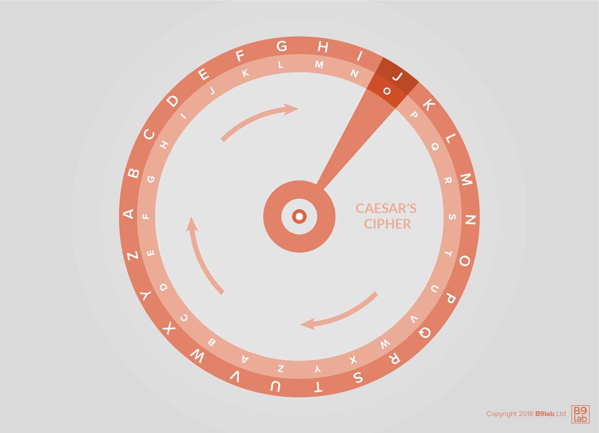
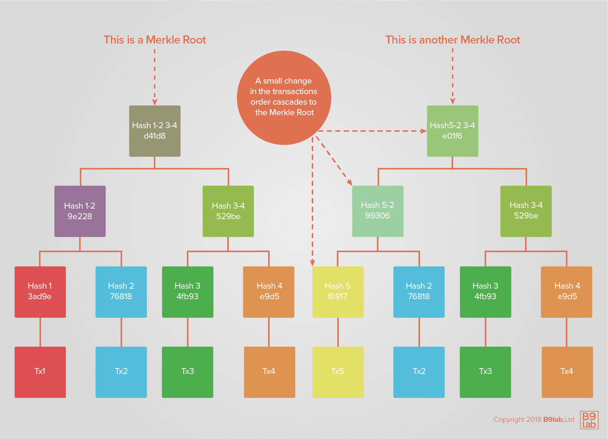

--> Curtail content

# Cryptographic Fundamentals

Cryptography is the use of codes and ciphers to secure communication, messages, and information.

In this section, we are going to take a specific look at how blockchain uses cryptographic techniques. Thus, we will take a look at: 

* the historic developments in cryptography,
* public-key or asymmetric cryptography,
* the use of public and private keys,
* cryptographic hash functions,
* Merkle trees,
* digital signatures and certificates.

We need to cover this few directly underlying technologies that are used in public and many managed blockchain systems to better understand the functioning of blockchain technology.

## History of cryptography

In laymen terms, cryptography is the use of codes and ciphers to secure communication, messages and information. 

Until some decades ago, cryptography constituted a method of encryption mainly based on simple methods, sometimes including mechanical aids. 

### Ancient times: Caesar’s cipher

In ancient times **simple mechanisms for encryption** were utilised. One example is the so-called **Caesar’s cipher or shift cipher**. 
This method was named after Julius Caesar, who would use it for private correspondence and is a type of substitution cipher but it was even used long before Caesar. 
The first technique to break simple substitution ciphers was developed in the 9th century by Al-Kindi, frequency analysis.

A Caesar’s cipher constitutes a substitution mechanism, in which each letter in a text/message is replaced by a certain letter some fixed number of positions in the alphabet later (shift value). 
Because it is a single-alphabet substitution cipher, it is easily deciphered/broken. 
Breaking Caesar’s cipher is also possible with two rotating disks.



The encryption step of a Caesar's cipher is often part of a more complex schemes and still is applied in modern times, for example in the ROT13 system. 
Caesar’s cipher was still used in the early 20th century by the Russian army as a simple-to-understand option for communication.

A further example of the application of shift ciphers is the Vigenère cipher, which uses a Caesar’s cipher where the value of the shift is defined with a repeating keyword. 
This specific cipher is unbreakable, if the following conditions are fulfilled:

* the length of keyword is the same as of the message, 
* the keyword is chosen randomly, 
* the keyword is not entrusted to anyone else,
* the keyword cannot be reused.

These conditions are met by the so-called one-time pad ciphers, but very hard to maintain. 

The simplicity of breaking a Caesar’s cipher becomes clear when observing two different settings: 

* the cipher type, simple substitution cipher, is known to the malicious party, 
* the malicious party knows the Caesar’s cipher is being used and only needs to determine the shift value.

If the cipher type is known, the encrypted message can be decrypted by using frequency analysis or pattern words. 
If it is known that the Caesar cipher is used, the malicious party would only have to check for all the number of possible shifts in a brute force attack. 
In English this would require 26 different options. 
The number of possible shifts is determined by the number of characters in an alphabet.


Encrypting messages multiple times with a simple substitution cipher does not increase security of encryption. 
Why is this? If you encrypt a message by a shift value X and then encrypt it by a shift value Y, it is as you would have encrypted it by the shift value X+Y. 
Thus, decrypting it is as difficult as it would be with a simple substation cipher. 

### Medieval times: Frequency analysis & homophonic substitution

Around AD 800 an Arab mathematician named Al-Kindi introduced a technique nowadays known as **frequency analysis** to break mono alphabetic substitution ciphers. 
This is often seen as the most significant development in cryptography until World War II. 
Among others, he analysed methods of enciphering and conducted statistical analysis of letters and letter combination in Arabic. 
The frequency of letters in an encrypted text and correlating it with the frequency of letters common in the original language, the value shift became easy to determine. 

To better illustrate this method, let’s take a closer look at the English language. 
English has 26 characters in its alphabet, whereby E and T are the most frequent and Q and Z the least frequent. 
Knowing the frequency of characters in a language makes it possible to probabilistically estimate the shift value. 
With computer availability it is even easier to determine the shift value, since one can measure the actual frequency distribution compared to the expected distribution by for example Chi-Squared statistics. 

Another cryptographically interesting development of the middle ages are homophonic substitution ciphers. In the early 1400s Duke of Mantua already used homophonic substitution ciphers. 
It is a substitution cipher, in which each letter is replaced by multiple symbols depending on letter frequency. 
In doing so, it combines mono-alphabetic and poly-alphabetic features. 
It is therefore more difficult to break than other techniques with substitution ciphers and its break difficulty depends on the number of homophones. 
To break them, one has to:

* find out which letter is substituted with which character,
* find out how many characters or symbols a letter can have.

Most of cryptographic techniques remained important during the middle ages due to their relevance in political and religious conflicts to ensure the secrecy of messages. 

### Modern times: From (electro-)mechanical machines to electronics & computing

Until the **19th century** most cryptographic methods were rather of an ad hoc nature and research was mainly concerned with encryption and/or methods of finding weaknesses in cryptographic techniques. 
In the **20th century** **complex mechanical and electromechanical machines** were used to decipher. One of the most prominent examples of such a machine is the Enigma rotor machine, which was used among others by the Germans for diplomatic and military communication, as well as to protect commercial information exchange. 
Its relevance during World War II should not be underestimated. 

During World War I one of the most prominent examples of the usage of cryptography can be observed in the case of the Zimmermann telegram; a cable sent from the German Foreign Office via Washington to the ambassador Heinrich von Eckardt in Mexico was decrypted. 
The content of the telegram is said to have contributed to the United States decision to enter the war. 
In addition, Gilbert Vernam proposed the idea of a teleprinter cipher in 1917, in which a key is kept on paper tape. 
The key is combined character by character with the text message and results in a cipher text. 
Thus, it established the benefit of electromechanical devices as cipher machines and let to the development of an unbreakable cipher, the one-time pad. 

During World War II, mechanical and electromechanical cipher machines were often used as a more secure option to manual systems. 
Some examples of cipher machines are: 

* the TypeX and Colossus utilised by Great Britain,
* the SIGABA used by the US,
* the Lacida used by the Polish,
* Enigma machine used by Nazi Germany.

The Soviets used the VIC cipher at least until 1957, which was the most complex hand cipher.

Until modern cryptography was developed in the 1970s, **encryption algorithms had always been symmetric key algorithms**. 
This type of algorithms can be found in the electromechanical machines of World War II, but also in the Caesar cipher and all other past cipher systems. 
Symmetric key algorithms use a **key**, usually a codebook, to encrypt a message. 
Both sender and recipient of a message have to know the key and keep it secret to ensure security of encryption. 
So that the algorithm could be useful, the key had to be exchanged through a "secure channel" prior to the start of communication and maintained secret. 
As the number of participants increases, the secret is harder to keep. 
Thus, this type of algorithms are not suitable for communication between large amounts of participants. 

In 1945, Claude E. Shannon, while working for Bell Telephone Labs, applied information theory to cryptography and with it laid the foundation for mathematical cryptography. 
He published his paper *Mathematical Theory of Cryptography*, in which **two main cryptographic goals** were defined: **secrecy and authenticity**. 
Shannon focused on secrecy. 
He concluded that there were two types of system design for secrecy:

* systems that are designed to protect against attackers with infinite resources, known as **theoretical secrecy**;
* systems that are designed to protect against attackers with finite resources at their disposal (**practical secrecy**).

One can understand theoretical secrecy as a characteristic of a system based on algorithms, which mathematically cannot be resolved independent of the computing power available for decryption. 
Practical secrecy refers to systems, in which the underlying algorithms could be broken, but computational power is not sufficient to do so. 

Shannon stated that the length of a key in binary digits had to be equal to or greater than the number of bits contained in the message encrypted. 

Later G.J. Simmons addressed the issues related to authenticity. 
As electronics and computers were developed, more elaborate schemes for encryption became possible. 

Before the 1970s, secure cryptography was often limited to the governmental realm. 
Cryptography became part of the public realm due to two events mainly: the public encryption standard (DES) and public-key cryptography. 

In 1970, a British cryptographer James H. Ellis advocated the possibility of a **non-secret encryption** but was not sure about the implementation. 
A colleague of his Clifford Cocks developed the RSA encryption algorithm in 1973, demonstrating implementation to be possible, and in 1974, Malcolm J. Williamson created a key exchange, later named Diffie-Hellman key exchange. 
Sadly, all these developments in cryptography were not made public but did not remain secret for long. 

In 1976, Whitfield Diffie and Martin Hellman, influenced by Ralph Merkle’s thinking in regard to public-key distribution, published a method of **asymmetric key cryptography**, nowadays known as **Diffie-Hellman key exchange** (See: [*New Directions in Cryptography*](https://www-ee.stanford.edu/~hellman/publications/24.pdf)).  
This became the start of public-key cryptography, since it was the first published practical technique for asymmetrical cryptography. 
Furthermore, Ron Rivest, Adi Shamir, and Leonard Adleman, all three at the Massachusetts Institute of Technology, created a generalisation of Cocks’ scheme, known as RSA. 
RSA is one of the first crypto systems, in which there is a public encryption key and a different from it private decryption key. 
It relies on the practical difficulty to factoring large integers, because it uses a module which operates with the product of two large prime numbers. 

Another important development in the beginning 1970s was the **Data Encryption Standard (DES)**. 
Developed by IBM, the algorithm was approved by the National Bureau of Standards (NBS) after consulting the NSA and amending the version, which was stronger against cryptanalysis, and in 1977 it became part of the official Federal Information Processing Standard (FIPS). 

Public-key cryptography will be addressed later on but let us say so much: This type of cryptography is also known as asymmetrical cryptography. 
A message is converted into a random-seeming sequence of characters with the help of a key for encryption and decryption. 
Whereas, two mathematically related keys are used and some permit the so-called public keys to be publicised, while the private key remains secret. 
This is only possible due to the practical difficulty of determining one key from knowing its pair.  

Neal Koblitz and Victor Miller both introduced **elliptic curve cryptography** in the mid-1980s. 
Because of their achievements, new public-key algorithms were developed which were based on the discrete logarithm problem. 
Elliptic curve cryptography is mathematically more complex, while at the same time allowing for smaller key sizes and faster operations. 

Beginning the era of Internet, a standard for encryption became vital to ensure its commercial use and the use for commercial transactions. 
Until the introduction of the **Advanced Encryption Standard (AES)**, DES continued to be used for encryption. 
After a public competition hosted by the National Institute of Standards and Technology (NIST, the successor agency of NBS), AES was selected as encryption standard. 
In addition, the Secure Socket Layer (SSL) was developed and introduced as a standard, which found application in web browsing, email, etc. 
The necessity for encryption became more evident with wireless Internet and the expansion of the use of devices, which rely on a secure communication. 

The developments after World War II and especially in the 1970s led cryptography to become part of the public realm again; Encryption became available for public use.

## Public-key crypto systems

We can all agree that assuring the integrity and authenticity of messages are fundamental to the working of the blockchain. Without a trusted third party, cryptographic proof is needed to ensure a direct and safe transaction between two parties.

Public-key cryptography, also known as asymmetrical cryptography, is a cryptographic system that is essential to cryptocurrencies like Bitcoin and Ethereum. It employs **pairs of keys**. 

Every pair consists of a **public** and a **private key**. 

The public key, as it names suggests, can be shared publicly. 
Its counterpart, the private key, should not be publicly shared.  
As long as the private key stays private, the security of the system is not endangered. 
These two keys work together to carry out the **two functions of asymmetrical cryptography**: 

* **authentication**, the process of confirming the identity and/or verifying the source, because the public key serves as a verification instrument for the private key pair. A message for example can be signed with the sender’s private key. In the system, the public key confirms the message is in fact signed by the owner with their private key;
* **encryption**, the process of encoding the message as it is meant for a specific authorized party, because only the private key can decrypt the information encrypted with the public key. The information is encrypted with a public key and only may be revealed or decrypted with a private key.

Compared to symmetric key algorithms, asymmetric ones do not require parties to use a secure channel to exchange the keys for encryption and decryption.

We will take a closer look at the different key types later on.

How does a cryptographic system actually work?

Modern cryptographic systems leverage computer capabilities to make the power of certain mathematical functions accessible. 

Asymmetric algorithms rely on one-way functions, for example the multiplication of large prime numbers, discrete logarithm problems, and elliptic curve relationships. It is essential for this type of algorithm to be based on computations that do not require much computational power to be executed but a large amount of computational power to be reversed. Which makes sense: Imagine it being more difficult to lock your front door than open it!

What makes asymmetric systems more secure than symmetric systems?

Asymmetric algorithms need to be able to output key pairs, as well as encrypt, and decrypt information. This requires a lot of computational power compared to symmetric algorithms. 

The need to invest large amounts of computational power into finding the keys, often referred as work factor, makes asymmetrical cryptography secure.

Public-key cryptography ensures confidentiality, authenticity, and non-repudiation. Examples of applications are S/MIME and GPG, as well as the basis of several Internet standards like TLS. Due to its computational complexity, asymmetric key cryptography is normally applied to small data blocks.

Does the length of the key matter? 

Yes, it does. One would think the longer the key the more secure. However, funnily enough very long asymmetrical cryptographic keys provide at least the same degree of security as a shorter symmetric key would provide. 
A general rule to keep in mind: The longer the key, the more difficult it is to break the code. 
To break an asymmetric algorithm with a brute force attack, the attacker would need to try out every possible key. 
The longer the key is, the more difficult it is to "guess" the right key.

Let us take a look at a simple example. 
Every binary entity of information can have the value 0 or 1. 
If one has an 8-bit key, 2^8 or 256 possible keys could be used. 
As the amount of bits per unit of information increases, so does the number of possible keys.

Modern asymmetric ciphers have been established as a secure option but are not free of faults and possible problems. 
Faulty design and/or implementation have been points of insecurity. 
Furthermore, public-key cryptography is susceptible to brute force attacks, as well as "man-in-the-middle" attacks. 
The later occur, when a third party intercepts, decrypts and re-encrypts a message. 
A trusted entity installed as certification authority can prevent such attacks.

Fun fact! These systems are not exclusive of one another. 
In hybrid systems, symmetrical and asymmetrical cryptography is combined. 
For example, asymmetric encryption could be employed to transfer a symmetric encryption, which would then be used as an encryption key for the message. 
Examples of this hybrid crypto systems are PGP and SSL/TLS.

### Public/private key

Cryptographic keys always come in pairs and offer their owner various capabilities. 
Those capabilities are based on cryptographic mathematics. 
As their name suggests, the public key is meant to be distributed to whoever is relevant, while the private key is to be jealously guarded. 
Compare them to having your house address public but keeping the key to your house private. 
We assume that you will not want to have any strangers in your home, therefore keep your private key safe!  

Let us have a look at examples, which you may know by the names:

* RSA,
* PGP, GnuPG.

Example:

```
// Create SECP256K1 private key with explicit parameters for backward compatibility
$ openssl ecparam -name secp256k1 -genkey -noout -out secp256k1-key.pem -param_enc explicit
// Create public key
$ openssl ec -in secp256k1-key.pem -pubout -out secp256k1-key-pub.pem
// Show public key
$ openssl ec -in secp256k1-key-pub.pem -pubin -text -noout

// Create RSA private key
$ openssl genrsa -des3 -out rsa-key.pem 2048
Generating RSA private key, 2048 bit long modulus
.....................................................+++
...........+++
e is 65537 (0x10001)
Enter pass phrase for rsa-key.pem:
Verifying - Enter pass phrase for rsa-key.pem:
// Create public key
$ openssl rsa -in rsa-key.pem -outform PEM -pubout -out rsa-key-pub.pem
Enter pass phrase for rsa-key.pem:
writing RSA key
```

This is like a password that is used to encrypt your private key on disk. 
If the private key was not encrypted, it would be at a greater risk of theft. 
Since you are just testing here, you can insert nothing or just a simple word. 
But remember that whenever you create keys in the future, you need to protect them with a proper password.

<div class="b9-tip">
	<p>Note that you may need openssl version 1.0 or newer.</p>
</div>

#### Encrypt & decrypt

While using an asymmetric key algorithm, each user needs to know their own pair of keys, public and private, as well as the other participants public key. 


Alice wants to send a message to Bob, which is intended for Bob's eyes only:

* Bob gives Alice his public key;
* Alice uses Bob's public key to encrypt the message;
* Alice sends Bob the encrypted message;
* Bob decrypts the message with his private key.

Example:

```bash
// Encrypt file
$ openssl pkeyutl -encrypt -pubin -inkey rsa-key-pub.pem -in helloworld.txt -out helloworld.enc
// Decrypt file
$ openssl pkeyutl -decrypt -inkey rsa-key.pem -in helloworld.enc -out helloworld2.txt
```

<div class="b9-tip">
	<p>If you receive an error, try with `openssl rsautl` instead.</p>
</div>

<!-- RSA has been pronounced dead [before](https://www.schneier.com/crypto-gram/archives/1998/0715.html). -->

#### Sign & verify

One can utilise private and public key to **sign and verify** a document.


Alice wants to make sure that Bob's public announcement is indeed from Bob:

* Bob gives Alice his public key;
* Bob signs his announcement with his private key;
* Bob sends Alice his announcement and its signature;
* Alice verifies the signature with Bob's public key.

Signing a message with a private key gives the other participant the opportunity to verify the message, as to who send it, by using the public key.

Example:

```bash
// Sign file hash
$ openssl dgst -sha256 -sign secp256k1-key.pem -out helloworld-bin.sha256 helloworld.txt
// Encode signature in Base64
$ openssl base64 -in helloworld-bin.sha256 -out helloworld.sha256

// Decode signature form Base64
$ openssl base64 -d -in helloworld.sha256 -out helloworld-bin-decoded.sha256
// Verify signature
$ openssl dgst -sha256 -verify secp256k1-key-pub.pem -signature helloworld-bin-decoded.sha256 helloworld.txt
Verified OK
```
<div class="b9-info">
	<p>We will take a closer look at digital signatures with keys later on when addressing digital certificates.</p>
</div>

#### Mix & match

It is possible to mix both ideas: Alice encrypts her message with Bob's public key, then signs the encrypted file with her private key. 
Upon reception, Bob verifies the signature with Alice's public key, then decrypts the file with his private key.


### Key management & PKI

If you look again at the Alice and Bob examples, you will notice that there is a vulnerability in "Bob gives Alice his public key". 
A malicious participant, Charlie, could intercept Bob's public key and pass his own public key on to Alice. 
To prevent fraudulent keys, as well as tampering of messages through interception, public key infrastructure (PKI) is utilised. 
Because of this, key management and PKI are an important part of cryptography.

## Cryptographic hash functions

We have just seen how cryptography is used to make transactions secure with the use of key pairs. 
Now we are going to discuss the **integrity of the blocks** and the logging of said transactions.

Hash functions are used in modern cryptography to make sure all participants have an undistorted history of everything.

Hash comes from the French "hacher" meaning to chop. -Gold star for all those who knew that! 

Taking this meaning, a hash function could be compared to a food processor. Instead of chopping, the hash function performs an operation on an input of data (i.e. the string) that results in an output of data that is a fixed size (called a hash value, a hash code, a digest, or sometimes just a hash). The fixed-length output remains the same no matter the size of the message.

Hash functions are widely used in modern cryptography. 
They main application is the fast encoding using classic algorithms to make digital signatures verifiable. 
The exact hash value is assigned to one individual and their signature can be verified with the string or input data. Another application area are computer system passwords. Hashing is important as a mean to ensure messages are not intercepted and altered.

Five main properties are of essence for a hash function: 

* it is **deterministic**: the hash function produces the same output (hash value) for the same input (message);
* it is **fast**: the hash value for any given message is computed quickly;
* it is **resistant**: it is infeasible to work backwards. Thus, it is impossible to generate the input (message) from the output (hash value) without trying **all** possible the possible inputs (this could be infinite);
* it exhibits an **avalanche effect**: any small change to the input (changing a "b" to "B" for example) results in a completely different hash value and has no resemblance to the old hash value;
* it is completely **unique**: it is infeasible to find two different inputs (messages) with the same hash value.

Be careful with confusing hashing and encrypting, they are two different concepts! Hashing is an operation, which transforms data into a **check sum** or **message digest**. It is a **one-way operation**; it cannot be reversed.  
While encryption describes a two-way operation. 
This transforms a message into cipher-text and can also transform it back into its original state, while ensuring the confidentiality of the message. 
Thus, both terms should not be used analogously.

Now, what does a cryptographic hash function do?

A cryptographic hash function:

* Converts an input, a.k.a. the message, into an output, a.k.a. the hash (or hash value);
* Converts the data in a reasonable amount of time;
* Operates one-way - It is practically impossible to re-generate the message out of the hash;
* Creates unique outputs - even the tiniest change in the message, changes the hash beyond recognition, i.e. it appears uncorrelated with the old hash value;
* Makes it practically impossible to find 2 different messages with the same hash value.

So, what can I do with a hash function?

Well, you can:

* prove that you have a message without disclosing the content of the message, for instance:
	* to prove you know your password,
	* to prove you previously wrote a message,
* make sure the message was not altered
* index your messages in a hash table.

MD5 is such a function:

```bash
$ echo "The quick brown fox jumps over the lazy dog" | md5
37c4b87edffc5d198ff5a185cee7ee09
```

On Linux, it is `md5sum`. 

Now let us introduce a typo:

```bash
$ echo "The quick brown fox jump over the lazy dog" | md5
4ba496f4eec6ca17253cf8b7129e43be
```

Notice how the 2 hashes have nothing in common.

`MD5` is no longer considered a hard-to-crack hash function. Bitcoin uses `SHA-256`. Ethereum uses `Keccak-256`and `Keccak-512`.

It is possible to index content by its hash, in essence creating a hash table. 
If you have used IPFS or BitTorrent's magnet links, among others, then you have already used a hash table.

Cryptographic hash functions are used for digital signature and file integrity verification, and find application in areas such as credit card transactions and software updates. 
Their reliability is of the utmost importance as they are so central to our digital security and verification. 
Reassessing them is of importance to early detect, if a cryptographic hash function can be re-generated. 
Testing a hash function’s robustness when creating unique hashes is done with **collision attacks**.


In 2017, google conducted a collision attack on [SHA-1](https://shattered.io/). 
In a collision attack, one tries to find two set of inputs that produce the same hash function.
It was considered a relatively insecure hash function but was still widely used and no one had actually proved it made duplicate hashes. Google managed to create a successful collision attack which cost roughly $110,000.

### Merkle trees

<!--Title: What is a Merkle Tree?, URL:https://youtu.be/DeektoaH7vE--> 

**Merkle or hash trees** were named after Ralph Merkle, who patented the concept in 1979. Merkle trees are useful because they allow the **efficient and secure verification of large amounts of data**.

The term Merkle tree describes a tree where:

* Each **"leaf node"** contains a hash of a block of data;
* The hashes of the leaf nodes are then hashed by further non-leaf nodes up the tree;
* The nodes further up the tree, the **parent nodes**, always keep the computed hash of its child nodes;
* Counterintuitively, at the top of the tree is the **Merkle root** (or master hash, root hash, or top hash). It is the final, single hash of the series of hashes of the leaves below it, i.e. its child nodes;
* Comparing this single parent or Merkle root with another Merkle root will tell you if all the data in the entire tree is the same;
* Any change to any of the data will create a new hash, which will filter up the tree to the root.



With this type of tree, one can:

* Verify the integrity of huge amounts of data very quickly;
	* Download and verify the integrity of data pieces as they come in random order, because each branch of a Merkle tree can be downloaded individually and verified immediately even though the whole tree is not yet available;
	* Identify quickly which piece of data has been corrupted by following the trail of "incorrect" hashes. Then this small block can be re-downloaded quickly and order restored;
* Keep data behind a single hash, just like a single-pass hash function would offer over the whole content.

In a blockchain environment, the ability to verify the integrity of huge amounts of data is what makes a Merkle tree attractive. In the blockchain, each block header keeps one or more hash(es) of the root, i.e. top leaf, of one or more Merkle tree(s).

## Digital signatures, certificate authority & digital certificates

The concept of **digital signatures** is simple. If a given message is first hashed and then encrypted by a private key, one can verify the signature by decryption with corresponding public key.

We need to hash the message to avoid the creation of signatures by mixing the messages and corresponding signatures. This way, we know, that the sender has the private key to the given public key. However, this is not truly an identification.

Here comes the **certificate authority (CA)**. The CA signs a certificate to prove the identity of the owner of a public key. The certificate includes as described above the subject name. This must be verified by the CA. So, the identity is given, if one can verify the CA’s signature and trust the CA.

**Digital certificates** are used (among other things) to prove an identity. They are given by a recognised Certification Authority(CA). 
A widespread procedure is the public-key certificate. It proves the ownership of a public key. We will describe below the standard X.509.

The standard X.509 is defined by the Telecommunication Standardization Sector(ITU-T) of the International Telecommunication Union(ITU).[[1]](https://en.wikipedia.org/wiki/X.509) 
It offers format and semantics for public-key certificates. [X.509](https://www.ietf.org/rfc/rfc5280.txt) is profiled in the formal language ASN.1. 
Common use cases are validation of documents and securing of communication. For an example, X.509 is used in TLS/SSL. 
Its origin is in the X.500 standard from year 1988. Since version 3, X.509 enables flexible topologies, like bridges and meshes. 
Invalid certificates are listed in certificate revocation lists. (CRLs) CRL is vulnerable against DOS attacks.

A X.509 certificate contains information such as version number, serial number, signature algorithm, validity period, subject name, public-key algorithm, subject public key, certificate signature algorithm, certificate signature and extensions. 
An extension has a type, a corresponding value and a critical flag. Non-critical extensions are only informational.
Here is a Hyperledger Fabric example certificate:


## Quick recap

<div class="b9-reading">
<ul>
	<li><a href="http://osxdaily.com/2012/01/30/encrypt-and-decrypt-files-with-openssl/"><i>Encrypt and Decrypt</i></a></li>
	<li><a href="https://gist.github.com/ezimuel/3cb601853db6ebc4ee49"><i>Sign and Verify</i></a></li>
	<li><a href="https://www-ee.stanford.edu/~hellman/publications/24.pdf">Diffie, W. &amp; Hellman, M. E. (1976): <i>New Directions in Cryptography</i></a></li>
	<li><a href="https://shattered.io/">Shattered.io: <i>We have broken SHA-1 in practice.</i></a></li>
	<li><a href="https://www.ietf.org/rfc/rfc5280.txt">Network Working Group (2008): <i>Internet X.509 Public Key Infrastructure Certificate and Certificate Revocation List (CRL) Profile</i></a></li>
</ul>
</div>

## Next up
