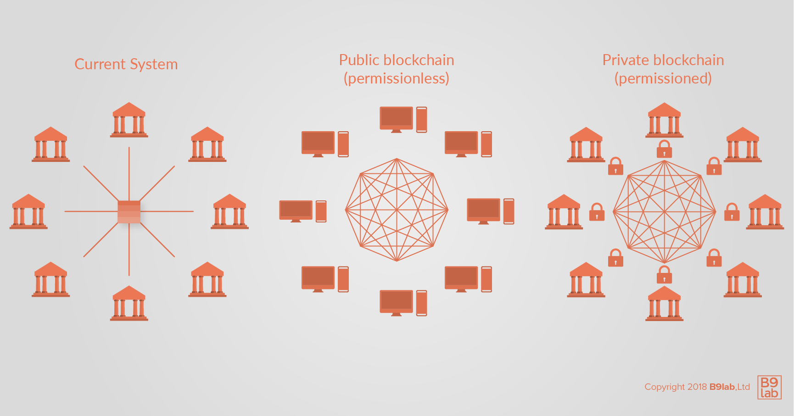

--> Curtail content, add more in direction to blockchain 1.0 and 2.0

# Introduction: Deployment Patterns - Public & Managed/Private Networks

Blockchain was developed as a **decentralised technology** that allows the operation of an infrastructure without hierarchy or authority.

	
It is important to keep the technical foundations discussed in the previous Module in mind to understand the different deployment patterns and protocols presented in this Module.

 

As discussed in the previous module, there are several mechanisms essential to ensure the working of a blockchain, one of these are consensus algorithms used to determine a well-ordered state of transactions and ensure network security.

Furthermore, attacks on the network are often prevented by using difficulty as a control mechanism. The degree of difficulty, which relates to the average block creation time, is utilised as a mean to adjust for increasing or decreasing total network problem-solving capacity and implement economic incentives for benevolent behaviour (See: the Module on **Technical Fundamentals**, *Consensus*). As computing power is directly linked to costs for electrical power and maintenance, a reward structure for winning miners was included in several blockchains. With it for example DoS attackers are deterred.

For example, it is entirely possible to attack the transaction integrity of the Ethereum network, but such an attack is estimated to cost the attacker between $300 million to $400 million in the cryptocurrency Ether. In addition, economic incentives such as transaction fees, which change depending on the amount of traffic and are collected by the winning miner, as well as measures such as Gas were introduced in Ethereum.

Blockchains cannot be only differentiated by the consensus mechanism included in their protocols but also the deployment pattern they follow.

Whereas, in this context **deployment patterns** are understood as *the general set-up of a blockchain network*. There are **three different deployment patterns** for blockchains are: 

* public,
* managed/private, and
* internal tagged.

**Public blockchains** represent the classic understanding of how a blockchain network is constituted: They are decentralised and allow for public access. **Managed blockchain networks**, as opposed to public networks, rely on the blockchain data structure. But unlike public blockchain networks, they do not have to mitigate the Byzantine Generals Problem, because they operate in a predictable environment with elements of authority and hierarchy. As their name suggests, they are private in a sense because most allow for authentication, authorisation, and permission of actions. Therefore, they are often more suitable for traditional businesses that want to make use of the technology for internal or collaborative purposes without operating on public networks. **Internal tagged blockchains** represent a combination of both.

Understanding the differences between all three types of deployment patterns will help clarify the characteristics of public networks and be of importance when taking a closer look at private/managed networks.

# Deployment Patterns

When thinking of using blockchain technology for your project or in your organisation it is important to differentiate between the ways a blockchain network can be set up. This is vital because the **deployment pattern has major implications on the functioning of the network**; What a network is supposed to do and how it is going to fulfil the envisioned tasks depends on its deployment pattern. 

To be able to systematically comprehend and analyse the different deployment patterns, it is important to clearly understand the difference between public and private, as well as permissioned and permission-less blockchains. 

What is a **permissioned/permissionless blockchain**?

In blockchain literature, one often stumbles across the term **permissioned**. The more one reads about it, the more confusing it becomes and the more difficult it is to grasp what the term actually refers to. 

For this reason, we will take a quick look at permissioned blockchains.

In **permissioned blockchains** *an individual or group of participants holds the authority to validate blocks of transactions or to participate in the consensus mechanism*. Permissioned blockchains restrict the actor's involvement regarding the consensus state. In addition, it is important to keep in mind that permissioned networks restrict participants' access to smart contract creation and/or transactions. Permissionless blockchains are the opposite. 
Block verification, smart contract creation, and transactions on permissionless blockchain networks are open to all members.

The terms permissioned and private, and permissionless (also referred to as non-permissioned) and public are often used synonymously, but it is essential to understand the difference between the terms and what they entail. 

The main way to differentiate between blockchains is to consider their **form of access**.
The form of access refers to:

* whether there is a distinction between users or not, and 
* whether the access to the blockchain is open/public or controlled/private. 

In this section, we will discuss different deployment patterns and the impact of each on network functionality and behaviour. 

Before we start looking at blockchain deployment patterns, let us briefly peek into a few more concepts: decentralised subsystems, multi-dimensional decentralisation, and the minimum Nakamoto coefficient. 
A closer look at decentralisation will help you understand why it is a main criterion to distinguish deployment patterns. 

## Decentralised subsystems & systems

The degree of decentralisation is one of the most important differentiating qualities of public and private blockchain networks. 

   

   	Measuring Decentralisation
   

   

   	
There are serval propositions and methods to measure decentralisation. The use of the <b><i>Gini coefficient</i></b> and <b><i>Lorenz curve</i></b> are often proposed as means to quantitatively measure decentralisation.

   	
Another useful tool is the <b><i>minimum Nakamoto coefficient</i></b>, as proposed by Balaji S. Srinivasan and Leland Lee (See: <a href="https://news.earn.com/quantifying-decentralization-e39db233c28e"><i>Quantifying Decentralisation</i></a>). The authors argue that quantifying decentralisation and utilising a coefficient to measure decentralisation are of importance to not only make measurement possible, but also improvement and optimisation.

   	
The <b><i>minimum Nakamoto coefficient</i></b> quantifies the number of entities that are required to be compromised to compromise the system as a whole, in other words it is:
 
   	
<i>the minimum number of entities in a given subsystem required to get the total capacity, aggregated by taking the minimum of the minimum across the subsystems</i> (<a href="https://news.earn.com/quantifying-decentralization-e39db233c28e">Srinivasan, B. S. (2017): <i>Quantifying Decentralization</i></a></li>).

      
The higher the coefficient, the higher the number of entities required to compromise the system is.

   

Srinivasan and Lee posit that **decentralised systems are constituted by decentralised subsystems**. 
To understand the degree of decentralisation, they argue, one must take a closer look at the **subsystem decentralisation**.

To better illustrate their concept of systems and subsystems, they use the example of **Bitcoin**. 
Srinivasan and Lee identify six Bitcoin subsystems:

* mining (by reward),
* client (by codebase),
* developers (by commits),
* exchanges (by volume),
* nodes (by country), and
* ownership (by addresses).

Subsystems can differ from the ones mentioned above and can be chosen freely as long as they fulfil the criterion of being **essential to the decentralisation of the whole system**. 

The underlying assumption is that subsystems of a decentralised system are essential to the decentralisation of the overall system. For this reason, decentralisation can also be seen as multi-dimensional instead of dichotomous. Multi-dimensionality also encourages us to broaden our view when analysing decentralisation and thinking of possible network vulnerabilities.

Let us start with the "traditional" deployment pattern of blockchain technology: public networks. 
After that, we will continue with private or managed networks and end with internal tagged blockchain networks to contrast them with public blockchains. 

## Public networks

The most obvious way to operate a blockchain protocol is in the form of a public network. This is what blockchain technology was originally invented for and arguably remains its most powerful form of implementation.

A public blockchain, compared to a private or managed one, is characterised by **open access**. 
Every participant has access to data and can validate as well as add blocks in public blockchains. 
Anyone, without needing the permission of another authority, can write and read data. 
Because network participants are not vetted and can add to the ledger without needing approval, public blockchains incorporate ways to arbitrate discrepancies and include defence mechanisms against attacks. 
Thus, guarding against malicious participants is not required, i.e. there is no barrier to entry, and no access control system needs to be in place. 
The beauty of the public network lies among others in its **self-defence** attribute. In addition, public blockchains benefit from demand-side economies of scale, also called **network effects**.

   

   	Network Effect
   

   

   	
Network effect is a term used in economic theory to describe a situation, in which every additional user of a good or service adds a positive value to the product or service for other users. A classic example of a good benefiting from network effects and therefore a network good is the telephone. To acquire a telephone, when they first started appearing as a consumer good, is only partially of value when no-one you know or want to chat with has a telephone. Each additional user increased the value of the product. Other goods and services which display this positive network effect are social networks such as Facebook and Twitter.

   

A proof-of-work based public blockchain network, such as Bitcoin or Ethereum, has a few specific attributes:

* **accessibility**: All you need to connect to Bitcoin or Ethereum is the client software and an internet connection. No AML, KYC, identity checks or subscription payment is required.
* **no hierarchy**: All nodes are equal, meaning no individual node has more authority than another. All miners are also equal;
* **crypto-economic incentives**: The lack of a central authority means there is no absolute defence against malicious behaviour. Instead, the network usually incentivises benevolent behaviour and dis-incentivises behaviour that endangers the network functioning to de facto implement prohibitive expenses to attack the network and others;
* **full decentralisation**: Most public networks are completely decentralised because they are non-hierarchical and fully accessible. The playing field for market participants is therefore relatively level, so traditional business models may not work as well.

The two most popular examples of functioning public networks are Bitcoin and Ethereum.

## Managed networks

A private or managed blockchain is different from a public network, because participants are known and trusted due to **access barriers**. 
Participants are vetted through an access control layer that governs network access. 
Thus, a private network does not have to rely on anonymous participants to validate transactions. 

Many mechanisms vital in public blockchains are not necessary for private blockchains. 
For example, there is no need to discourage 51% attackers, because a 100% of resources for block creation are controlled by the network. 
Still, the **risk of attacks** against the blockchain creation tools or the private corporate servers is high. 
An attacker could focus on tools or the corporate servers as an opportunity to control all the network's resources and alter transactions as they wish. 

Generally, these types of blockchains do not benefit from or rely on network effects. 

Public networks are based on [**Game Theory**](http://www.dklevine.com/general/whatis.htm) and **economic incentives**, which means that **every action is probabilistic**. 
There is no guarantee that my transaction is picked up and even the integrity of the network is merely very likely, not 100% guaranteed.

This is often unacceptable for many traditional financial institutions. 
One of the biggest expenses financial institutions have is the operation and maintenance of infrastructure, as well as the costs resulting from leaks, hacks, errors, and data incompatibilities. 
For this reason, many financial firms have been looking into managed blockchains to try to mitigate some of their very specific issue areas and investigate them as a viable alternative to existing siloed systems.

A **consortium blockchain network** is another option often preferred by private enterprises and especially financial market players. 
A consortium might use the same protocol or infrastructure as a public blockchain, but with a few differentiating attributes:

* **limited access**: unlike public networks, many consortium blockchain models limit access to vetted and approved participants;
* **different consensus approaches**: because the scope of participants can be limited, crypto-economic incentives might not be necessary in a consortium blockchain network. Alternatively, the creation and verification of blocks may be executed by a limited group of authorised nodes.

Let us look at an example often used for consortium blockchain networks: **interbank settlement**.
Currently each bank runs their own legacy infrastructure. 
When these banks try and settle trades between their customers, their systems need to interact with each other often through several layers of third-party software.

Now, consider that all these banks are operating a common blockchain network only they have access to. 
Rather than keeping their own versions of ledgers, they operate on the **same** ledger.

Unlike public networks, where interaction is governed by the protocol and crypto-economic incentives, managed networks use the blockchain protocol as a technical enforcement of an already existing and enforceable legal relationship.

Here are a few frameworks for managed networks, most of which are based on Ethereum:

* [Hyperledger Fabric](https://hyperledger-fabric.readthedocs.io/en/latest/)
* [Monax](https://monax.io/)
* [BlockApps](http://blockapps.net/)
* [MultiChain](http://www.multichain.com/)

## Tagged internal networks

A fully private blockchain network does not make sense in the overwhelming majority of use cases. Still, there is an interesting variation of private blockchain networks that is worth investigating called **tagged private blockchains**.

In a tagged private blockchain network, all nodes are operated within an organisation, i.e. with no external access at all. 
Without tagging, this would make for an expensive and slow database. 

**Tagging** is a method whereby every few blocks, the block hash (i.e. the signature that uniquely identifies a certain block) is pushed to a public network or other legally immutable place, say a notary.

One of the reasons why blockchain technology is used is for its ability to prove to users and regulators the chain of custody for events that led to a certain state. A private network could still be easily manipulated by the operator. Tagging prevents this.

If the organisation in question wanted to prove the integrity of their blockchain database to say a regulator, they could provide the block hashes on the public network along with access to their private network. 
By comparing the block hashes in the managed blockchain with the hashes pushed to the public network, validity and integrity could easily be proven.

Most examples of tagged networks are proprietary and not many companies have adopted this method. 
The ones that have implemented this type of network do not tend to publish a lot of technical information on their solution.

One company that has implemented a solution using this technology is [Everledger](http://www.wired.co.uk/article/blockchain-conflict-diamonds-everledger). 
Everledger is facilitating a ledger of diamonds and fine wine using a mix of a private and public networks.

## Public vs. private/managed networks

The difference between both deployment types becomes visible in direct comparison. It is of importance to understand the differences as well as the implications resulting from this difference to better assess what type of blockchain is useful for what situation and/or task.

The difference between both deployment types becomes apparent when we compare them visually:

Often private and public blockchain network differences are explained by using an analogy: the difference between intranet and internet in the 1990s. 
Whereas public blockchains are compared to the internet and private ones to the intranet.

Private blockchains are seen by many as contradictory to the existential notion of blockchain technology. 
Blockchains were introduced as a means to replace trusted third parties and create (procedural) trust-based relations between pseudonymous participants. 
Private blockchains are also criticised in regard to their degree of transparency, often said to be "only a database" or a traditional centralised system with some degree of cryptographic auditability, but not a "full" or "real" blockchain.

Different deployment patterns have their own benefits and drawbacks. They are also more or less suited to different intended network functions.

## Why managed networks?

There are good reasons to use a managed network within an organisation, even if it does not provide the same level of data integrity and transparency as a public blockchain network.

Both types are decentralised P2P networks, which share the distributed ledger with all network participants and synchronise it through the use of a protocol, often referred to as a **consensus mechanism**. Also, private and public blockchains guarantee **immutability** to a certain degree. 

It is often argued that managed blockchains are not that different from traditional database networks. 
Still, we can ascribe them a certain merit by pointing out the technical differences between traditional database networks and blockchain-based networks. 

Managed networks have several **advantages** compared to public blockchains, which often make them seem more fitting for private businesses.

First, all users/participants in managed networks are known. 
This is fundamentally different to public blockchains, in which the network is open to all participants as soon as they set up the software necessary to interact with the blockchain network. 
So public networks do not have **entry barriers**, whereas private ones do. 
Restricting entrance can be especially important to increase network privacy, especially when dealing with sensible information.

The way in which access to the network is granted can vary. 
Access can be decided by:

* a central authority, 
* all existing participants,
* a consortium, or
* by other means agreed upon by the owners of the network. 

Moreover, managed networks also allow for restricted access for verification, as the network’s owner can decide to only grant verification rights selectively.
  
Second, with network openness comes the problem of **increasing computational power** and with it high energy consumption. 
The amount of energy consumption and computational power required to maintain the consensus algorithm and a distributed ledger at large scale has skyrocketed. 
This is not only costly, but also a major drawback in terms of the environmental sustainability of blockchain technology.

Third, one of the most important aspects of managed blockchains concerns **privacy**. 
As public blockchain networks are open to all participants, the information stored on them is public too. 
On the one hand, this degree of "publicness" helps ensure the high degree of security attributed to blockchain networks. 
On the other hand, there is only a limited degree of privacy. 
This can be an issue for business activities that work with "sensitive" information. 
For this reason, private entities often favour managed blockchain networks over public ones. 

By being "private", managed blockchains face different implications for their security architecture, as they do not benefit from the same security mechanisms inherent in public blockchains. 
Security concerns of managed blockchains are comparable to those of traditional database networks. 

   
Interested in the security aspects of blockchain technology? Have a look at <a href="https://hbr.org/2017/03/how-safe-are-blockchains-it-depends">this short article</a>.

In the full Blockchain for Professionals course, we will take a closer look at what is important when setting up or participating in managed blockchain networks.

### Auditability & transparency

In cryptographically secured chains of data, as used in blockchain protocols, once data has been added it cannot be changed without re-computing all the following hashes in the chain. For this reason, we say that blockchain data is **immutable**.

This can be a valuable attribute for internal record-keeping, since records cannot be changed after sign-off, neither through error or through malice. 
If we combine this with smart contract execution and the implementation of critical business processes, internal process execution could become auditable.

As data and information are introduced via transactions, it would be easy to establish what was introduced into the network when and by whom. Thus, blockchain networks are highly transparent. 
This would be a more cost-efficient and reliable form of bookkeeping than the current one. It would also streamline compliance and auditing, as well as make reporting tasks easier.

For example, let us look at **auditing processes**.

In many private sectors, companies have to undertake regular auditing. Sometimes the audit is case-specific or task-specific and other times it happens on a regular basis. 
The audit can be requested by a governmental authority, such as a revenue authority, or by a private organisation and/or institution, like when companies want to demonstrate their adherence to certain standards and rules or when fraudulent bookkeeping is investigated. 
In case of an audit, a private business could give the auditor access to the information stored on the managed network and the auditor could check the transactions issued with the ones recorded in the official accounting reports.

The high degree of audibility and transparency is a result of the **immutability** of data in a blockchain. 
It makes managed blockchains especially appealing for business activities which are strongly regulated, and/or have to conduct regular audits.

### Governance

Managed blockchains allow for a more tailored governance structure than public blockchain networks. Not only can one limit access for participants and verification authorities, but all other aspects related to **user rights and network governance** can be limited as well. This can be very useful depending on the information you wish to store on a managed blockchain network. 

Furthermore, platforms that allow for **smart contract execution** enable organisations to further implement even more blockchain-based business operations. As we have seen, processes can be encoded and their execution can be guaranteed and enforced. 
This can be interesting for compliance-critical processes, or within subsidiaries with unreliable staff, or those operating in corrupt jurisdictions.

Especially in the two latter cases, managed networks offer the possibility to **enforce company guidelines and rules**, as well as ensure **reliable compliance control**. As information is shared and transactions are signed, it is easier to attribute an action to someone and thereby increase the overall transparency of activities. Companies can analyse processes in near real-time and check for worrisome behaviour.

### Automation

As part of the larger automation of business processes within digitalisation, managed networks can play a role in critical **core process automation**.

Until now, automation processes had to rely on general digitalisation and the **Internet of Things (IoT)**. 
Combining IoT with blockchain networks and the possibility of smart contracts offers immense automation possibilities, and with them efficiency increases and cost reductions.

Of course, automation always has to be implemented carefully, as quality assurance and social implications must be taken into consideration. 
In addition, not every business process needs automation or is even fit for it.

Tracking in supply chain management, production optimisation planning, contract self-execution, etc. are all areas in which further automation through blockchain networks could prove beneficial.

### Transaction & ledger integrity

In traditional financial infrastructures and even core banking systems, it is extremely difficult to guarantee **ledger integrity**. Most systems do not allow for comprehensive and guaranteed logging of user actions on the system. For this reason, it is difficult to determine whether a ledger has been **compromised** and even how or by whom it was breached.

Blockchain **ledger integrity** could make forensic accounting much easier for example, especially in cases of security breaches.

Ledger integrity is not only helpful in retracing steps after a ledger has been compromised. It also allows for **responsibility attribution**. For example, smart contract platforms provide detailed logging because each function execution is signed with a private key and every addition to the ledger constitutes a state change. 
This allows for precise responsibility attribution, as it is clear who “authorised” the function execution by signing it.

Transaction and ledger integrity are also highly relevant for process optimisation and can help minimise redundancies. 
Processes can only by efficiently optimised, if one can rely on the integrity of data being used as the foundation of our analysis.

### Collaboration

One of the most interesting potential use cases for managed blockchain protocols is their use in **consortium networks**. Here, managed protocols can cryptographically enforce existing legal relationships between organisations.

Collaborations offer the opportunity for organisations to engage in a **common managed blockchain**.

In addition, collaboration in regard to research and development of managed blockchains enables the participation of entities who might otherwise lack the financial resources or necessary expertise.

Like-minded organisations could further enhance their communication and overall collaboration by working on blockchain-based applications. 

Collaborations also offer the opportunity to include all relevant stakeholders in the network development, such as regulators, governmental agencies, private firms, and regional and/or international agencies.

	<ul>
   <li><a href="https://hbr.org/2017/03/how-safe-are-blockchains-it-depends">Berke, A. (2017): <i>How Safe Are Blockchains? It Depends.</i></a></li>
   <li><a href="http://blockapps.net/">BlockApps</a></li>
   <li><a href="https://www.anf.es/pdf/Haber_Stornetta.pdf">Haber, S. &amp; Stornetta, W. S. (1991): How to Time-Stamp a Digital Document</a></li>
   <li><a href="https://hyperledger-fabric.readthedocs.io/en/latest/">Hyperledger Fabric</a></li>
   <li><a href="http://www.dklevine.com/general/whatis.htm">Levine, D. K.: <i>What is Game Theory?</i></a></li>
   <li><a href="https://monax.io/">Monax</a></li>
   <li><a href="http://www.multichain.com/">MultiChain</a></li>
   <li><a href="https://monax.io/explainers/permissioned_blockchains/">Monax: <i>Permissioned Blockchains</i></a></li>
   <li><a href="https://www.multichain.com/blog/2017/11/three-non-pointless-blockchains-production/">Greenspan, G. (2017): <i>Three (non-pointless) permissioned blockchains in production</i></a></li>
   <li><a href="https://news.earn.com/quantifying-decentralization-e39db233c28e">Srinivasan, B. S. (2017): <i>Quantifying Decentralization</i></a></li>
   <li><a href="https://blog.ethereum.org/2015/08/07/on-public-and-private-blockchains/">Buterin, V.: <i>On Public and Private Blockchains</i></a></li>
   <li><a href="https://www.wired.co.uk/article/blockchain-conflict-diamonds-everledger">Volpicelli, G. (2017): <i>How the blockchain is helping stop the spread of conflict diamonds</i></a></li>
   <li><a href="https://blog.ethereum.org/2016/05/09/on-settlement-finality/">Buterin, V. (2016): <i>On Settlement Finality</i></a></li>
	</ul>

# Introduction to Bitcoin

Since 2009 the most successful and popular decentralised public blockchain network has been Bitcoin. 
Nowadays, Bitcoin is the cryptocurrency with the highest market capitalisation, approximately $150 billion dollars (at the time of writing).

	
For an estimate of the Bitcoin network size take a look at <a href="https://bitnodes.earn.com/"><i>Bitnodes</i></a>.

	
Also if you are more of a visual and statistics person, we could recommend these <a href="https://www.blockchain.com/en/charts">Bitcoin charts</a>.

Cryptocurrencies have been vastly publicly discussed and evaluated since Bitcoin’s introduction. 
The policy to handle this new type of currencies has been different in each country (See: [A World Map of Cryptocurrencies](https://blogs.thomsonreuters.com/answerson/wp-content/uploads/sites/3/2017/10/World-of-Cryptocurrencies-graphic.pdf)). 
The role cryptocurrencies will play in future economic activities and every-day life is difficult to envision as the spectrum of opinions goes from cryptocurrency integration supporters to complete dismissal advocates.

Bitcoin was first introduced with the publication of the original paper [*Bitcoin: A peer-to-peer electronic cash system*](https://bitcoin.org/bitcoin.pdf) (2008) by Satoshi Nakamoto. 
In this paper, Nakamoto describes Bitcoin as a **peer-to-peer (P2P)** version of electronic cash.

He suggested that **proof-of-work (PoW)** can be used to find the truth in a partially synchronous system without involving trusted parties. 
Using this method, the set of participants controlling the majority of the computing power determine the truth.

Let us look at this in more detail.

Nakamoto does not use the term blockchain in his paper but he describes the concept by explaining transactions in Bitcoin.

**Transactions** are sent directly from user to user without the need of an intermediary. 
They are verified by the nodes and then recorded on the blockchain, a distributed ledger. 
The transaction process requires the signing of the transaction with the **hash of the previous transaction**. 
This establishes a chain of ownership.

The **chain of ownership** goes back to the essence of blockchain technology. 
The main argument is that with complete transparency every user can recreate every transaction that has ever been verified back to the genesis block and the corresponding order of the transactions. 
As the term already implies the ownership of every single cryptocurrency unit can be traced back to each transaction in which ownership was transferred. 
Thus, every participant is able to verify a new payment and make sure no double-spending is taking place.

Each bitcoin is registered to a so-called **bitcoin address** by picking a random private key and then computing the corresponding address.

Computing the address is **practically secure** because computing it might be fast but computing the private key by using the address is *mathematically unfeasible*. 
It is comparable to the different forms of secrecy that were discussed in regard to public-key crypto systems.

In addition, the number of possible private keys which are valid is so high that *brute force attacks* are also seen as unfeasible.

Moreover, Bitcoins can only be spent, if the owner knows the *corresponding key* and *digitally signs* the transaction. 
The network can verify the signing with a public key.

In the end, one has a chain of ownership.

In Bitcoin, nodes optimise the concept of chain of ownership because they validate a chain once and all unspent transactions are stored. 
With this it is avoided that one would have to re-check the validity of the transaction by going back to genesis block every single time. 
Without a private key a bitcoin user does not have a mean to proof ownership. 
Therefore, losing the private key equals losing all your bitcoins.

Transactions can contain several **inputs**, a record of the bitcoin address from which the Bitcoins were initially received, and **outputs**, the public key or bitcoin address to where the Bitcoins are meant to be send.

Each block includes the hash from the previous block and a nonce -a random string of 1s and 0s. 
The protocol calls for a hash beginning with a specific number of 0-bits when hashing the block. 
An attacker trying to change a transaction in a block would have to mine the block at that point in the chain and the following blocks to reproduce the part of the blockchain that is going to be tampered with.

**Figure 1:** Reproduced from [Nakamoto, S. (2008): Bitcoin: A peer-to-peer electronic cash system](https://bitcoin.org/bitcoin.pdf).

To avoid double-spending Bitcoin uses a **timestamp server**. 
The miner is looking for a nonce, which results in a block hash beginning with the right number of 0-bits. 
It is difficult to find a nonce that fulfils this condition and it is easy to verify when one has. 
This becomes more difficult as other blocks are chained after this one, because a new nonce has to be found for each block.

Note that the **truth** is the longest chain in which the network is most invested.

There is a residual probability for a slower attacker to catch up, since getting nonces works by brute force. 
This decreases exponentially with the number of blocks. 
The higher the number of blocks, the lower the probability of an attacker catching up.

The protocol includes a **reward** for mining. 
This reward is the first special transaction in the block. 
It can be expected, that the nodes will use their CPU power honestly to get the reward.

Because of the fact that transactions are announced publicly, the public key of the parties is not anonymous.

# Introduction to Ethereum

Ethereum is a public, blockchain-based distributed computing platform and operating system with smart contract features. 
In the first module, you have discovered the Ethereum client Mist.

Ethereum emerged because a range of proposals were refused by the Bitcoin community.

It was described first by Vitalik Buterin in 2013. 
Buterin researched the Bitcoin community and based his proposition of Ethereum on this work by publishing the [*Ethereum White Paper*](https://ethereum.org/whitepaper/).

Then, Buterin started working with Dr. Gavin Wood on the technical design of Ethereum. 
Wood published the [*Yellow Paper*](http://gavwood.com/paper.pdf) to introduce further technical specifications for the Ethereum Virtual Machine (EVM).

In July 2014, Ethereum kicked off with a pre-sale of **Ether**, Ethereum’s currency unit, to finance further Ethereum development and include stakeholders like developers and investors.

After the token pre-sale, the development of Ethereum was tackled through the **ETH DEV** organisation. 
In 2014 and 2015, ETH DEV released a series of proof-of-concepts to be assessed by the development community. 
This led to the 9th POC open testnet, **Olympic**, in which the limits of the network were tested by developers.

In addition to open testing, the search for security vulnerabilities was encouraged by the **Ethereum Bounty Program**. 
Developers were offered BTC rewards, if they were able to discover issues with the software stack.

Software security firms also assessed the EVM, networking and PoW to ensure all protocol critical components were free of security issues.

This measures increased security, reliability, and confidence regarding Ethereum.

After the Ethereum Frontier launched in July 2015, smart contract and decentralised app development started to be deployed. 
At this point of time, mining began to secure the network and Ether from block mining was earned by the miners.

## Ethereum's consensus mechanism

Ethereum has a much shorter block time than Bitcoin due to its GHOST protocol, currently around 15s (See: [Vitalik Buterin on a 12-second Block Time](https://blog.ethereum.org/2014/07/11/toward-a-12-second-block-time/)).

It also utilises a consensus via transaction-based state transitions, like Nakamoto proposed. 
Although, the consensus mechanism was modified. 
It implements a variation of Bitcoin's proof-of-work (PoW) consensus algorithm called **Ethash**, which is more GPU friendly (See: [*Ethash Design Rationale*](https://eth.wiki/concepts/ethash/design-rationale)).

Core developers of the Ethereum project are planning to propose switching to a **proof-of-stake** consensus algorithm in the future due to inefficiencies among others regarding computing power and energy consumption (See: **Introduction to Bitcoin** and the section below on **PoW vs. PoS**).

## Ethereum's protocol

Let us now have a look at the Ethereum protocol to understand how Ethereum is different from Bitcoin.

Our reference to analyse the Ethereum protocol is the [*Yellow Paper*](http://gavwood.com/paper.pdf) by Wood.

The Ethereum network is a virtual state machine, the **Ethereum Virtual Machine** (EVM). 
The most important difference to Bitcoin is the implementation of distributed code execution through the EVM. 
The EVM enables the deployment of so-called **smart contracts** as part of the data of a transaction.

The code execution platform is Turing-complete. 
The implementation of such a state machine with blockchain is revolutionary in itself. 
As part of Turing-completeness frameworks must overcome the halting problem which is especially difficult in distributed, hierarchy-free computing platforms.

Ethereum’s solution is to introduce **Gas** as a fee for each computational step. 
Every block has a maximum Gas limit which limits the number of computational steps that can be executed per block. 
The user is free to specify any **GasPrice**. 
Ethereum requires this value to convert **Ether to Gas**, which is only existent during the execution of a transaction. 
The protocol defines the **Gas cost** for each operation in the EVM. 
We will take a closer look at Gas later on.

In Ethereum, **smart contracts** are stored on every single node; smart contracts are public. 
A smart contract in the EVM is practically an autonomous agent with an internal account. 
The most popular language for writing such a contract is **Solidity**.

As smart contracts are stored on the blockchain they are secure in the same sense that all stored information on the blockchain is secure.

Every node calculates all smart contracts. 
This can lead to performance issues in regard to the blockchain’s speed.

Ethereum employs a different kind of implementation to Bitcoin called **GHOST**. 
It includes **uncles** to decrease the average block time.

Uncles are validated blocks, that are propagated too late into the network. 
This increases the total difficulty of the chain and makes smaller block times possible.

	
The concept of uncles was introduced in the <i><b>Module on Technical Fundamentals</b></i> in the <i>Consensus</i> section under <i>Fast block solution</i>.

## Ethereum’s Gas

Ethereum transactions are code. 
Thus, it would be possible to include an infinite loop or a circular reference that never breaks, which can be seen as another type of attack. 
To protect against such an attack, the concept of Gas was introduced.

Gas is the name for a unit used in Ethereum to measure how much work is needed to perform an action. 
Thus, Gas is utilised to ensure an appropriate fee. 
It is convertible from Ether, it is provided by the transaction creator, and is consumed at each computational step.

Note, that:

* if the computation stops before all the Gas is consumed, the consumed Gas is collected by the winning miner and the remaining Gas returned to the transaction creator;
* if the Gas provided is fully consumed before the computations have been completed, the computation stops, all state changes are dropped, and all Gas goes to the winning miner.

Different computational steps have different Gas costs and pricing them is an art as much as it is science. 
The general rationale is: **The more an operation requires computational resources, the more Gas is needed to perform it**.

Case in point, the Ethereum blockchain experienced a [denial-of-service attack](https://blog.ethereum.org/2016/09/22/ethereum-network-currently-undergoing-dos-attack/). 
The fact that a couple of operations had a price in Gas that was too low compared to the degree of difficulty was exploited. 
The attacker, while paying a small Gas fee, managed to hold up a large portion of the nodes.

The protocol was amended in a way that required [a hard fork](https://blog.ethereum.org/2016/10/13/announcement-imminent-hard-fork-eip150-gas-cost-changes/) and the vulnerable operations were repriced, rendering the attack too expensive to carry on.

## Quick recap

## Next up