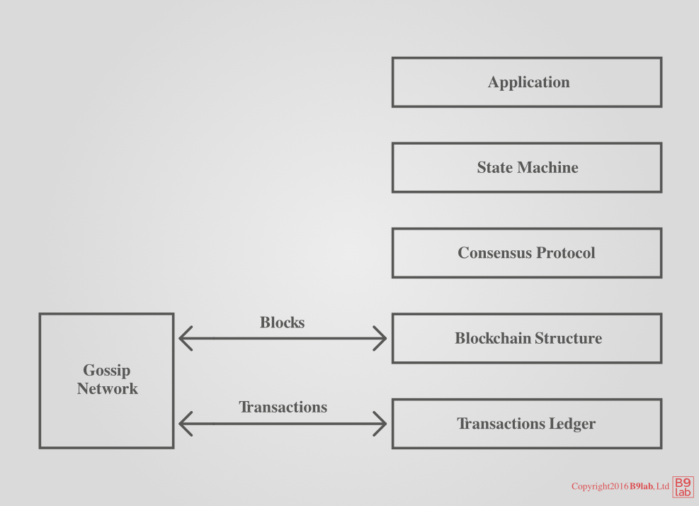
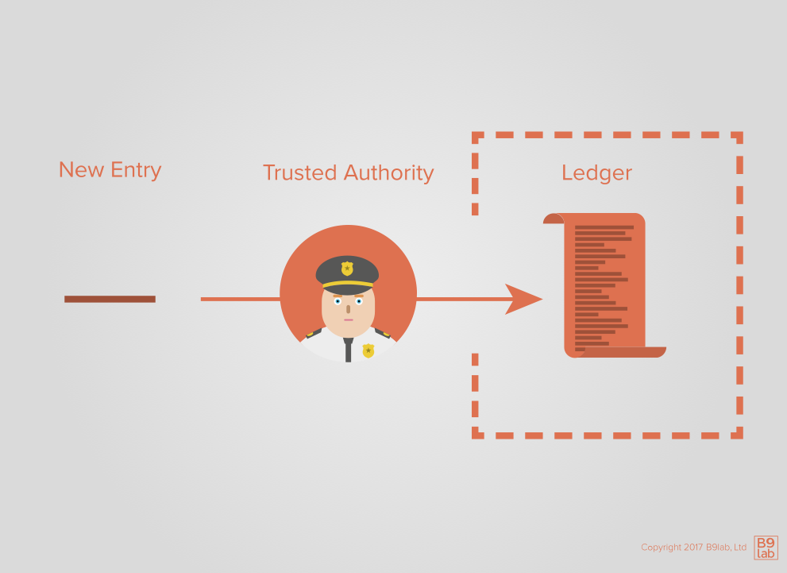
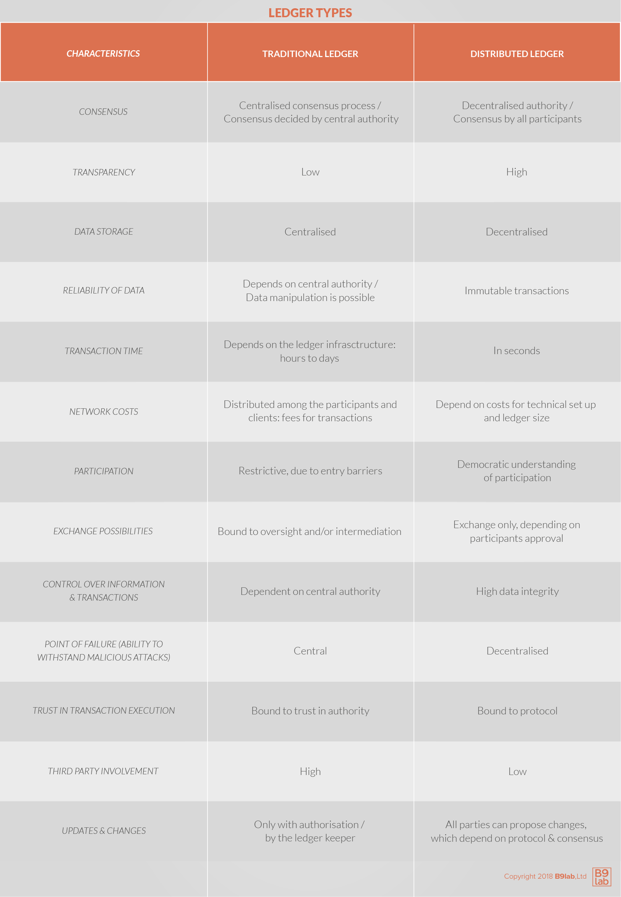

# Ledgers

There are many different ways to look at blockchain technology. In order to give you a thorough understanding and a complete view, do not restrict yourselve to one definition of blockchain but keep in mind the different conceptualizations of the technology.

Let's dive into how blockchain and the concept of a distributed ledger are linked.

<ExpansionPanel title="Open Systems Interconnection model">

The Open Systems Interconnection (OSI) model, developed by the International Organization for Standardization, is a generalized seven-layer architecture concept for communication in a telecommunication or computing system. Each layer represents a certain functionality:

* Layer 1: the physical layer, responsible for the physical connection between devices;
* Layer 2: dthe ata link layer, responsible for the message delivery between nodes;
* Layer 3: the network layer, responsible for data transmission between devices in different networksby dealing with packet routing to determine data routing paths and addressing to identify sender and receiver;
* Layer 4: the transport layer, repsonsible for end-to-end delivery of messages, acknowledgements if successful data transmissions, and re-transmissions of data in case of errors by relying on services from the network layer and providing services to the application layer;
* Layer 5: the session layer, responsible to establish a connection, maintain a session, and terminate it as well as to ensure synchronization with checkpoints;
* Layer 6: the presentation layer, responsible for translation, encryption and decryption, and compression of data;
* Layer 7: the application layer, implemented by the network's application and responsible for interacting directly with the application.

Whereas, layer 1 to 3 are hardware layers, the transport layer (layer 5) is the heart of the OSI, and layer 5 to 7 are software layers.

Want to take a look at the OSI model in more detail? Take a look at this [overview from GeeksforGeeks](https://www.geeksforgeeks.org/layers-of-osi-model/).

</ExpansionPanel>

In the OSI network model fashion, one can break down blockchain technology in the following manner:

As you can see transactions are recorded on the _transaction ledger_. A **ledger** is _a book or file that records and totals economic transactions_.

To better understand ledgers and their relevance for blockchain technology, first take a look at transactions and then at ledgers.

## Transactions

A **transaction** is _an **atomic event** which means its components make no sense in isolation_. If the word transaction conjures up a financial transaction in your mind, this is indeed appropriate.

A single transaction might look like this:

* Reduce account A by $10;
* Increase account B by $9;
* Increase account C by $1.

It is easy to understand that this transaction is a payment.

If you were told only "Reduce account A by $10", you would rightfully ask: "Where did those $10 go?". Here, you can see what is meant by transactions being atomic - comes from the Greek word for undividable. You need every component of the transaction to exist for it to make sense and therefore to take place. Otherwise you are left with the question: "Where did those $10 go?".

If the word transaction reminds you of database management systems, this too is appropriate. Transactions happen in databases too. For instance, technology permitting, a single transaction might look like:

* Charge customer for $10;
* Ship one widget;
* Add one en-route shipment for customer;
* Reduce widget stock by one.

In the context of blockchain, a transaction is any atomic event that is allowed by the underlying **protocol**. They are recorded as they are proposed by the lottery winner. The order of transactions is extremely important here and is one of the reasons why blockchain protocols are designed the way they are.

To better understand the significance of the ledger order, imagine:

* You have an account balance of "3";
* You transfer "3" to member A and "3" to member B in quick succession.

If the ledger is not **well-ordered**, both transactions could be issued even though your account balance would be insufficient. Well-order of execution prevents double-spending.

In order to get a picture of the state of accounts at any point, all transactions until that point in time have to be added up. One by one, each transaction record alters the state of the ledger.

Transactions contain an arbitrary set of data depending on the purpose and structure. For instance, financial ledgers usually contain the following data:

* Sender
* Recipient
* Amount
* Credit/debit
* Reference

Processing each transaction in the ledger enables us to derive all kinds of meta information such as the number of transactions, activity per account, and individual account balances. An account balance like the balance of your bank account is an abstract representation of a list of transactions.

Traditionally ledgers are maintained by a trusted authority called a **ledger keeper**. Ledger keepers include insurance companies, banks, tax collectors, and many other entities.

Carrying out a transaction in a system with trusted authorities entails the following steps:

1. Identify yourself to the ledger keeper.
2. Request data, like your account balance, from the ledger keeper.
3. Request the recording of a new transaction.
4. The ledger keeper checks the validity of the transaction - Do you have sufficient balance? Is your account active or inactive/frozen?
5. The ledger keeper enters the transaction into the ledger and informs other ledger keepers of the transaction if necessary, for example, in the case the transaction's recipient has an account with another bank.
6. The recipient can now identify themselves with their ledger keeper and ascertain their updated balance.

This system works well as long as ledger keepers can be trusted or mechanisms are in place to ensure the ledger keeper's compliance.

The advantages and disadvantages of traditional ledgers compared to decentralised ledgers like blockchains are highly dependent on the degree of centralization of authority.

In a highly centralized traditional ledger, data reliability, information control, execution of transactions, and consensus on transactions depend on the trustworthiness of the central authority. Participation and transaction execution are restricted by oversight and/or intermediation in centralized ledgers, usually requiring third party involvement.

Further, power asymmetries favouring the central authority can lead to deviant behaviour and/or unintended consequences. For example, an authority in charge of updating the ledger could alter it maliciously. Centralized, "traditional ledgers" are also more prone to be affected by malicious attacks due to their centralized point of failure and data storage compared to distributed ledgers.

On the other hand, distributed ledgers have a higher degree of transparency, security, lower transaction time, and lower transaction costs for participants.

<HighlightBox type="info">

There is reason to believe that the development of the Bitcoin protocol, the first successful implementation of blockchain technology, was in part motivated by the financial crisis in 2008.
The financial crisis shook overall trust in traditional financial institutions and mechanisms, including central authorities' functioning and thus raison d'être.
Blockchain's decentralisation can be seen as a mean to avoid unintended results due to moral hazards and asymmetric information.

</HighlightBox>

## Blockchain as a distributed ledger

To understand blockchain as a distributed ledger, remember:

* A **transaction** is an atomic event;
* The **blockchain** is the ordered list of all transactions since inception.

Banks, especially, are prone to identify blockchain as a distributed ledger, as it indeed dovetails with their world models. Traditional financial institutions have realized the utility of distributed ledgers both as a threat to their centralized authority and as an opportunity to lower costs, decrease transaction times, facilitate settlement processes, and cryptocurrencies as a new investment opportunity.

In this view, instead of each bank relying exclusively on their own table of accounts in their own siloed (SQL) databases, blockchain enables them to consolidate their tables of accounts to facilitate transactions between accounts. Without the shared nature of the blockchain, inter-bank transactions are done through netting and settlement via central bank or corresponding accounts. 
The non-blockchain process is more expensive and time-consuming, especially if the banks are located in different countries. 

In the elegant blockchain solution, a single transaction updates separate tables of accounts for the entire network, i.e. of all participating banks. For this reason, banks see blockchain as an opportunity to reduce operational costs by distributing a common ledger between their peers.

Let us now revisit the **double-spending problem**.

## Digital currency and the double-spending problem

Traditional currency systems rely on central authorities such as central banks or physical safeguards on banknotes to prevent double-spending and counterfeiting.

Things are different in the digital world. 
Consider the following:

* a malicious Alice sends digital coins to Bob in exchange for goods or services;
* Alice sends the same coins to Charlie in exchange for other goods or services;
* both Bob and Charlie deliver the goods or services, but only one of them will be able to spend the received coins.

In earlier digital cash systems, Alice could double-spend if Bob and Charlie were sufficiently unaware of Alice's overall transactions.

In Bitcoin, Alice could double-spend if Bob first delivered the goods, and the Bitcoin network then switches to a fork that does not contain the Alice-to-Bob transaction.

Traditional currency systems have relied in the past on central authorities, such as central banks or physical aspects of coins and banknotes to prevent double-spending problems and counterfeiting.

Double-spending is important for digital tokens because they could theoretically be spent more than once. 
Double-spending refers in the blockchain context to a situation in which **one** token is spent **twice or more** times.

The double-spending problem in blockchain technology should be clearly distinguished from double-spending problems related to duplication and/or falsification. 
These can lead to inflation, currency devaluation, and distrust among currency holders. 
These are more related to digital cash systems and solved with a trusted central authority.
