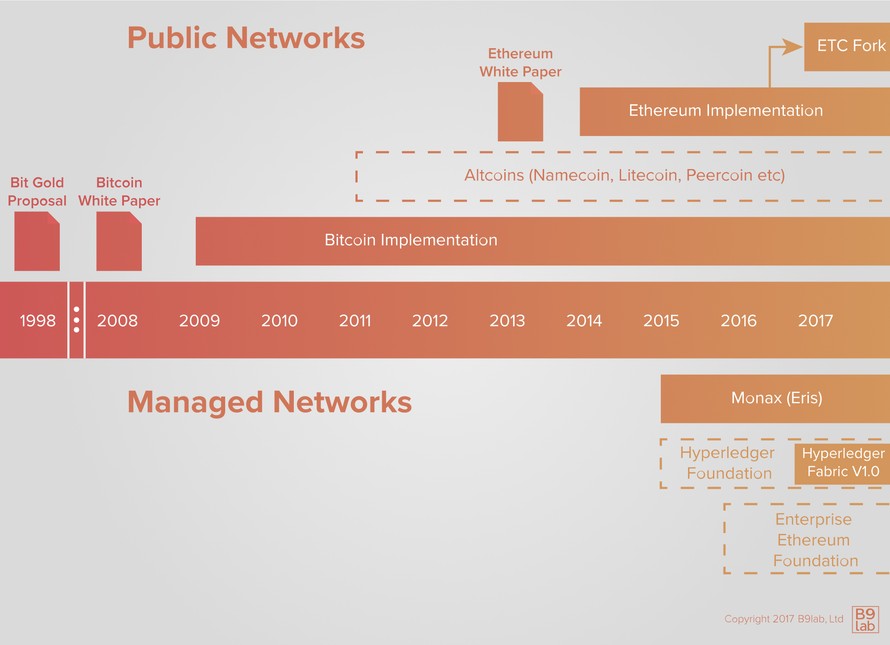

# A Brief History of Blockchain

Important groundwork was laid in the 1980's and 1990's for what will later be known as blockchain technology. Although the technology itself was not created until 2008, researchers from different fields in computer science and cryptography proposed solutions to many problems regarding security, transparency, and trust. All of them contributed in the development of the first large scale, successful public blockchain network, Bitcoin.

<ExpansionPanel title="The groundwork of the 1990s">

Sometimes a look in the past tells us a lot about the present.

In 1991, two research scientists, Stuart Haber and W. Scott Stornetta, identified a problem: how can it be ensured that digital documents are authentic and changes to them are tracked in an immutable time-stamped manner? In *How to time-stamp a digital document*, they worked on the concept of append-only, cryptographically secured logs. With their work, the foundations of what much later becomes blockchain technology were laid.

Haber and Stornetta's work was later followed and elaborated on by Ross J. Anderson in 1996 when he described the creation of [*The Eternity Service*](https://www.cl.cam.ac.uk/~rja14/Papers/eternity.pdf) - a storage medium resistant to DoS attacks by using redundancy and scattering techniques, as well as anonymity mechanisms.

In 1998, [Bruce Schneier](https://www.schneier.com/crypto-gram/) and [John Kelsey](https://www.nist.gov/people/john-m-kelsey) proposed a computationally cheap way to safeguard sensitive information and allow for computer forensics with secure audit logs by using hashing, authentication keys, and encryption keys (see: [Schneier, B. & Kelsey, J. (1998): *Secure Audit Logs to Support Computer Forensics*](https://www.schneier.com/academic/paperfiles/paper-auditlogs.pdf)).

Another significant work arose in 1994, when computer scientist Nick Szabo first described the concept of [smart contracts](http://www.fon.hum.uva.nl/rob/Courses/InformationInSpeech/CDROM/Literature/LOTwinterschool2006/szabo.best.vwh.net/smart.contracts.html). Although we will discuss smart contracts in depth later in the course, it is important to recognize Szabo's intent was to minimize the need for trusted intermediaries. In 1998 he proposed BitGold, a conceptual predecessor to Bitcoin as he argued for a decentralised digital currency. In both PoW is used as a consensus algorithm to solve cryptographic puzzles in a P2P network with BFT. The solutions are also linked together by a "hash chain" (See: [Moskoy, Phillip (2018): *What Is Bit Gold? The Brainchild of Blockchain Pioneer Nick Szabo*](https://coincentral.com/what-is-bit-gold-the-brainchild-of-blockchain-pioneer-nick-szabo/)). Although BitGold was never implemented, many perceive it as being the direct ancestor to BitCoin.

As we can see, these intellectual predecessors identified elements that are essential to blockchain technology.

</ExpansionPanel>

**2000s**

On October 31, 2008, Satoshi Nakamoto called for a peer-to-peer version of digital currency that would allow online payments to be sent directly from one party to another without going through a financial institution in the Bitcoin White Paper. This sounds familiar for a reason as Nick Szabo mentioned a currency that would depend minimally on third parties, BitGold. However, Satoshi's paper differed significantly -not in just changing the name from BitGold to Bitcoin. The Bitcoin White Paper also proposed a data structure for the Bitcoin blockchain and laid out the decentralised consensus mechanism. It became the first large scale, successful public blockchain network.

To this day, we do not know who is behind the White Paper or the first implementation of the client. Satoshi Nakamoto is the pseudonym used by the person or group that published the White Paper. As you might have seen in the news, the identity of Nakomoto has sparked plenty of conspiracy theories as several individuals have claimed to be the creator of Bitcoin. But to this date, none of the claims have been verified.

What is certain is that the community initially working on the network and the client can be characterised as generally pro-capitalist, anti-regulation, and monopoly, as well as pro-free-trade. Many of those developing and driving the technology have also heralded its potential to reduce corruption and perceived human failures by pushing processes out of human reach.

All this may not seem important but it is. Blockchain technology was built with disruption in mind. It was envisaged as the antithesis of the central control of banks, governments, and incumbent holders of monopolies. This has an influence on the direction of the technology and remains a strong influence on its development.

Given its anti-establishment roots, blockchain technology has been seized by other groups interested in circumventing government, law enforcement, or regulatory control, both on the radical right and left fringes, as well as among activists persecuted by their governments.

### 2010s

As soon as it became clear that the technology presents a very attractive base infrastructure for payments, other groups and organisations adapted the technology for their purposes or developed new approaches using the same basic principles but adapting them to more traditional use cases.

In 2014 Vitalik Buterin started what is now known as the second wave of blockchain technology by publishing the paper underlying the Ethereum blockchain protocol, [A Next Generation Smart Contract & Decentralised Application Platform (Vitalik Buterin, Ethereum's creator)](https://github.com/ethereum/wiki/wiki/White-Paper). Beyond being a distributed ledger, the Ethereum White Paper proposed the development of a distributed computation platform.

Have a closer look at the <a href="https://ethereum.org/whitepaper/">Ethereum White Paper.</a>

The Ethereum project raised roughly $20 million in one of the most successful crowdfunding up to that point. The first public network was up and running in 2015. In the same time, it spawned the first managed blockchain network approach when the company Eris forked a version of Ethereum and expanded it to implement a layer of permissions, as well as making it easier to deploy custom, access controlled networks.

Late 2015 saw the establishment of the [Hyperledger Foundation](https://www.hyperledger.org/), an industry consortium with a focus on enterprise blockchain technology for managed networks.

In 2017 the [Ethereum Enterprise Alliance](https://entethalliance.org/) was formed as an industry consortium to adapt Ethereum for enterprise use.

In August 2014, L.M. Goodman published the [Tezos position paper](https://tezos.com/static/position_paper-841a0a56b573afb28da16f6650152fb4.pdf) followed by the [Tezos white paper](https://tezos.com/static/white_paper-2dc8c02267a8fb86bd67a108199441bf.pdf) in September of the same year. By the Fall of 2014, a group of developers tasked with developing the protocol had produced a crude but functional network shell. Read more about the <a href="https://tezos.foundation/history">history of Tezos and the Tezos Foundation</a>.

Early in 2016, R3CEV, later renamed R3, announced it was working on a distributed ledger "that might otherwise be considered a blockchain, but which the company made perfectly clear was anything but." As we will see, in summary, Corda has many blockchain-like properties as well as distinctive properties.

Today we can see two broader trends in the development and adoption of blockchain technology - public blockchains and managed/private blockchains. We will have a closer look at both types in Module 2, dealing with [Deployment patterns](https://git.b9lab.com/course-content/bfp-fundamentals/blob/master/2-deployment-patterns/1-introduction.md)

<HighlightBox type="reading">

https://www.cl.cam.ac.uk/~rja14/Papers/eternity.pdf">Anderson, R. J. (1996): <i>The Eternity Service</i></a></li>
	<li><a href="https://www.schneier.com/crypto-gram/">Schneier, B.: <i>Schneier on Security</i></a></li>
	<li><a href="https://www.nist.gov/people/john-m-kelsey">NIST: <i>John M. Kelsey</i></a> -a short background description and list of publications</li>
	<li><a href="https://mikemabey.com/cse469s19/papers/04_Secure_Audit_Logs.pdf"> Schneier, B. &amp; Kelsey, J. (1998): <i>Secure Audit Logs to Support Computer Forensics</i></a></li>
	<li><a href="http://www.fon.hum.uva.nl/rob/Courses/InformationInSpeech/CDROM/Literature/LOTwinterschool2006/szabo.best.vwh.net/smart.contracts.html">Szabo, N. (1994): <i>Smart Contracts</i></a></li>
	<li><a href="https://coincentral.com/what-is-bit-gold-the-brainchild-of-blockchain-pioneer-nick-szabo/">Moskov, P. (2018): <i>What Is Bit Gold? The Brainchild of Blockchain Pioneer Nick Szabo</i></a></li>
	<li><a href="https://bitcoin.org/bitcoin.pdf">Nakamoto, S. (2008): <i>Bitcoin: A Peer-to-Peer Electronic Cash System</i></a></li>
	<li><a href="https://ethereum.org/whitepaper/"><i>A Next-Generation Smart Contract and Decentralized Application Platform</i></a> -The Ethereum White Paper</li>
	<li><a href="https://entethalliance.org/">The Ethereum Enterprise Alliance</a></li>
	<li><a href="https://www.hyperledger.org/">The Hyperledger Foundation</a></li>
</ul>

## Next up
