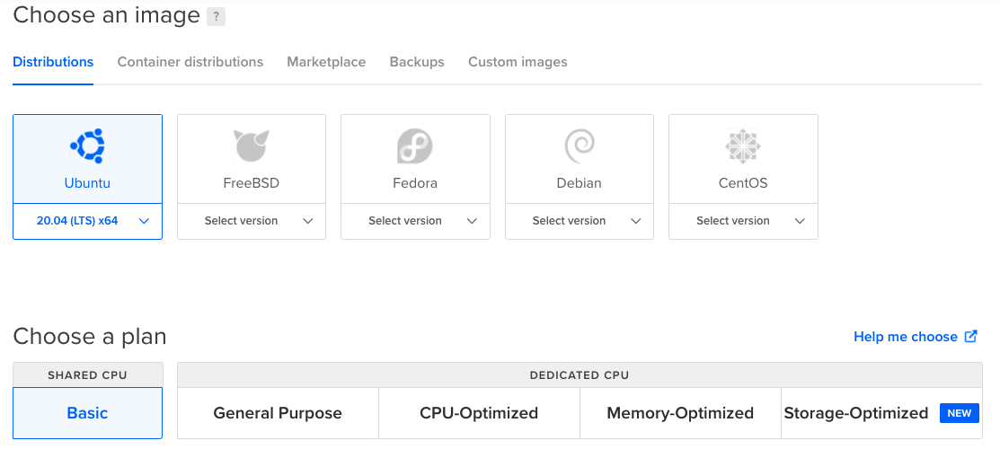
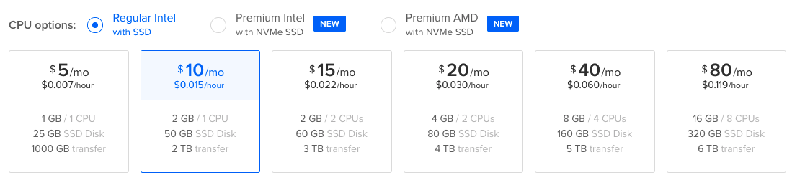

---
parent:
  title: Deploy your Starport Blockchain on DigitalOcean
order: 0
description: Publish a Starport blockchain application on an Ubuntu 20.04 droplet on DigitalOcean.
---

# Publish Your Starport Blockchain App on DigitalOcean

In this tutorial, you will publish your blockchain application an Ubuntu 20.04 droplet on DigitalOcean.

## Goals

You will follow step-by-step instructions to build and run your blockchain app with these high-level steps:

- Create a Cosmos SDK blockchain app with Starport
- Create a Droplet on DigitalOcean
- Upload your app to the Droplet
- Run the app on the Droplet

### Introduction 

This article is written for DigitalOcean. While this information can be helpful with other cloud services, the details apply only to DigitalOcean Droplets. Because DigitalOcean Droplets are Linux-based virtual machines (VMs), the operating system steps in this tutorial apply to MacOS and Linux operating systems. 

Steps might be significantly different for Windows operating systems.

For the best experience using this tutorial, we recommend using DigitalOcean.

**Important** Placeholder values are used in the code examples throughout this tutorial:

- When you see username be sure to substitute it with your username.
- Although you can use digitalocean as your directory and app name, you can replace it with your own app name. 

## Requirements

To complete this guide, you will need:

- A [DigitalOcean](https://cloud.digitalocean.com/) account. If you do not have an account, DigitalOcean may offer a free trial to let you build Basic Droplets. 
- A supported version of [Starport](https://docs.starport.network/). To install Starport, see [Install Starport](../starport/install.md). 
- Go (version 1.16 or higher). See [Download and install Go](https://golang.org/doc/install) documentation. Using brew to install Go is not recommended. 

## Step 1 — Create Your Starport App

In this step, you create your Starport application on your local computer. Later, you will upload the app to your DigitalOcean Droplet.

Create a directory and run Starport to create a Cosmos SDK blockchain app.

On your local computer, run these commands in a terminal window:

```bash
mkdir blockchain
cd blockchain
starport scaffold chain github.com/<username>/digitalocean
```

A blockchain app with backend and frontend is created. The default scaffold is a working blockchain app with the functionality that is similar to the Cosmos Hub ($ATOM). Learn about the [Cosmos Hub](https://hub.cosmos.network/main/hub-overview/overview.html) and [ATOM](https://cosmos.network/features).

To change any parameters of the blockchain, [learn how to configure](https://docs.starport.network/configure/) your blockchain app with Starport.

## Step 2 — Host Your App on DigitalOcean

DigitalOcean provides developers cloud services that help to deploy and scale applications that run simultaneously on multiple computers. 

Use the DigitalOcean infrastructure to publish a Cosmos SDK blockchain application to ensure the app is accessible on the web. Your app must be accessible on the web to allow other apps and new nodes to connect to your blockchain network.

### Create a Droplet on DigitalOcean

1. Log into your DigitalOcean account and access the [control panel](https://cloud.digitalocean.com/).

1. From the **Create** menu in the top right of the control panel, click **Droplets**.

1. Choose the Ubuntu 20.04 (LTS) x64 image and a Shared CPU Basic plan:

    

1. Choose your memory and compute resources. Virtual machines offer a mix of memory and compute resources. For a typical blockchain app that is not computing intense, 2 GB Ram/1 CPU are sufficient for your development and test environment.

    

1. Accept the default datacenter region and VPC network selections. 

1. We recommend SSH keys for your **Authentication** method to access your Droplet. [Learn how to setup your SSH key](https://www.digitalocean.com/community/tutorials/how-to-set-up-ssh-keys-2).

1. For **How many Droplets?** accept the default 1 Droplet selection. 

1. For **Choose a hostname** you can optionally add an identifying name. 

1. For **Tags** you can optionally add one or more tags.

1. For **Select Project** you can accept the default project.

1. Do not select **Add backups**.

1. Select **Create Droplet**.

You new Droplet is shown in the list of your Droplets. 

### Access Your New Node 

Congratulations, you are now ready to connect to your new node. 

1. In the list of Droplets in the DigitalOcean Control Panel, you can mouse over the IP address to copy it into your clipboard.

1. Open a terminal window and type `ssh root@<IP address>` to connect to your new node. See [How to Connect to your Droplet with OpenSSH](https://docs.digitalocean.com/products/droplets/how-to/connect-with-ssh/openssh/).

### Create a User to Run the Blockchain

First, create a user that to run the blockchain. For this example, you can use `appuser` as the username. Use the `adduser` command:

```bash
adduser appuser
```

When prompted, enter and confirm a password for `appuser`. 

After the password is successfully updated, you are prompted to change the user information for appuser. Press ENTER to use the default values. Type `Y` to confirm the information is correct.

To give appropriate permissions, add `appuser` to the `sudo` group:

```bash
usermod -aG sudo appuser
```

See [How To Create a New Sudo-enabled User on Ubuntu 18.04](https://www.digitalocean.com/community/tutorials/how-to-create-a-new-sudo-enabled-user-on-ubuntu-18-04-quickstart).

To be able to login as `appuser`, copy your ssh public key to the new home directory for `appuser`:

```bash
rsync --archive --chown=appuser:appuser ~/.ssh /home/appuser
```

Now, switch to your new user account:

```bash
su - appuser
```

### Set Up Your Droplet 

To set up your Droplet, you need to install a few tools to help us to publish your blockchain app.

1. Install [Go](https://golang.org/dl/).

    At the time of writing the tutorial, the latest version of Go is 1.16.5.

    ```bash
    cd ~
    wget https://golang.org/dl/go1.16.5.linux-amd64.tar.gz
    sha256sum go1.16.5.linux-amd64.tar.gz
    # b12c23023b68de22f74c0524f10b753e7b08b1504cb7e417eccebdd3fae49061  go1.16.5.linux-amd64.tar.gz
    ```

1. Extract the archive and keep it in `/usr/local`:

    ```bash
    sudo tar -xvf go1.16.5.linux-amd64.tar.gz -C /usr/local
    ```

    A directory named `go` is now in the `/usr/local` directory.
    
1. Next, recursively change this directory’s owner and group to `appuser`:

    ```bash
    sudo chown -R appuser:appuser /usr/local/go
    ```

1. Add the go paths to your profile:

    ```bash
    nano ~/.profile
    ```

    At the end of the file, add the following two lines:

    ```bash
    export GOPATH=$HOME/go
    export PATH=$PATH:$GOPATH/bin:/usr/local/go/bin
    ```

1. Update your profile:

    ```bash
    source ~/.profile
    ```

1. Verify your go installation:

    ```bash
    go version
    ```

    The results:

    ```bash
    go version go1.16.5 linux/amd64
    ```

1. To use Starport, install the Starport CLI:

    ```bash
    curl https://get.starport.network/starport! | sudo bash
    ``` 
    The latest stable version of Starport is installed. 

## Upload Your App to the Droplet

Several methods are available to upload your app to the Droplet.

One convenient method is to upload the app to GitHub and then download it on your Droplet. Starport creates a GitHub repository that makes it convenient to add your app to your repositories.

To upload the files, you can use `scp` to avoid a few extra steps. 

1. In a terminal window on your local machine, make sure you are in the parent directory of the Starport repo that you created earlier. For example, `/Users/username/blockchain` is the parent directory of your `digitalocean` app directory. From the `/Users/username/blockchain` directory, use the following command to upload the local app directory to your DigitalOcean server:

    `scp -r digitalocean appuser@<IP address>:/home/appuser/`

    This command uploads your local `digitalocean` app to your home directory on your DigitalOcean Droplet, `/home/appuser`. 

## Install your app

1. In a terminal window on the Droplet, you can change to the `/home/appuser/digitalocean` directory after the upload is completed:

    `cd digitalocean`
    
1. To install your app and configuration on the Droplet, use the Starport CLI:

```bash
starport chain serve
```

The `starport chain serve` command builds your Starport app, creates a genesis file, and creates your configuration.

You see an output similar to:

```bash
Cosmos SDK's version is: Stargate v0.40.0 (or later)

🛠️  Building proto...
📦 Installing dependencies...
🛠️  Building the blockchain...
💿 Initializing the app...
🙂 Created account "alice" with address "cosmos1sucepwrvgkud7fc6ftne8s2glzjpqx4zsl6zxa" with mnemonic: "expect goddess business detail loud know broom trial deliver board victory despair tackle ripple body weapon runway lawn roast cactus attitude midnight town fox"
🙂 Created account "bob" with address "cosmos15jayucugyfnlj4tu7xhutnufxr4qd8j6qjmekk" with mnemonic: "mouse lamp excuse young top century empower afford oven grass pass heavy evil sample lake trick leisure aisle bird dumb radio learn ecology stamp"
Genesis transaction written to "/home/appuser/.digitalocean/config/gentx/gentx-85ef06cb86aa501cceb9ed0a497a02503f5aa57f.json"
🌍 Tendermint node: http://0.0.0.0:26657
🌍 Blockchain API: http://0.0.0.0:1317
🌍 Token faucet: http://0.0.0.0:4500
```

Press Ctrl+C to stop the chain that you started with the `starport chain serve` command.

To confirm the installation (and celebrate your success), start the app:

```bash
digitaloceand
```

When all of these steps were successful, the output prints:

```bash
Stargate CosmosHub App

Usage:
  digitaloceand [command]

Available Commands:


  add-genesis-account Add a genesis account to genesis.json
  collect-gentxs      Collect genesis txs and output a genesis.json file
  debug               Tool for helping with debugging your application
  export              Export state to JSON
  gentx               Generate a genesis tx carrying a self delegation
  help                Help about any command
  init                Initialize private validator, p2p, genesis, and application configuration files
  keys                Manage your application's keys
  migrate             Migrate genesis to a specified target version
  query               Querying subcommands
  start               Run the full node
  status              Query remote node for status
  tendermint          Tendermint subcommands
  tx                  Transactions subcommands
  unsafe-reset-all    Resets the blockchain database, removes address book files, and resets data/priv_validator_state.json to the genesis state
  validate-genesis    validates the genesis file at the default location or at the location passed as an arg
  version             Print the application binary version information

Flags:
  -h, --help                help for digitaloceand
      --home string         directory for config and data (default "/home/appuser/.digitalocean")
      --log_format string   The logging format (json|plain) (default "plain")
      --log_level string    The logging level (trace|debug|info|warn|error|fatal|panic) (default "info")
      --trace               print out full stack trace on errors

Use "digitaloceand [command] --help" for more information about a command.
```

## Create a Systemd process

The `starport chain serve` command helps installing, building, and configuring your app for a new blockchain. You received tokens on newly created accounts.

This new app is useful only for development purposes and is not intended to be run for an extended time or in production. 

For the app to run for a longer time, you need a `systemd` process on your Droplet.

Create the log files and a `systemd` file to manage your process so that you can log off from the terminal and be confident the app keeps running even when the server restarts.

```bash
sudo mkdir -p /var/log/digitaloceand
sudo touch /var/log/digitaloceand/digitaloceand.log
sudo touch /var/log/digitaloceand/digitaloceand_error.log
sudo touch /etc/systemd/system/digitaloceand.service
```

Use nano to edit the systemd service file:

```bash
sudo nano /etc/systemd/system/digitaloceand.service
```

Add your application details to the file:

```bash
[Unit]
Description=digitalocean daemon
After=network-online.target
[Service]
User=appuser
ExecStart=/home/appuser/go/bin/digitaloceand start --home=/home/appuser/.digitalocean
WorkingDirectory=/home/appuser/go/bin
StandardOutput=file:/var/log/digitaloceand/digitaloceand.log
StandardError=file:/var/log/digitaloceand/digitaloceand_error.log
Restart=always
RestartSec=3
LimitNOFILE=4096
[Install]
WantedBy=multi-user.target
```

To close and save the file, press Ctrl+x. Then type `Y` and press Enter. 

The next step is to enable the file so the app is available even after a system start:

```bash
sudo systemctl enable digitaloceand.service
```

Now start the systemd process:

```bash
sudo systemctl start digitaloceand.service
```

Check the logs with:

```bash
sudo journalctl -u digitaloceand -f
```

Your app is now running on DigitalOcean.

## Connect your local running chain to the published chain

To connect your local running chain with the published app, you need to:

- Find the node you just created with the IP address
- Download the genesis file
- Configure your app to connect to the published node

On your DigitalOcean droplet, find the hash of the node by typing:

```bash
digitaloceand tendermint show-node-id
# For example, 85ef06cb86aa501cceb9ed0a497a02503f5aa57f
```

Each node has a different node id. 

At a terminal window back on your local machine, initialize your blockchain with:

```bash
digitaloceand init localnode
```

Next, download the `genesis.json` file from your node:

```bash
scp appuser@<IP address>:/home/appuser/.digitalocean/config/genesis.json ~/.digitalocean/config/
```

Then add the published node ID and IP into the configuration file on your local machine:

```bash
nano ~/.digitalocean/config/config.toml
```

Add a persistent connection. Use the node-id from the Droplet together with the IP address and default port:

```bash
# Comma separated list of nodes to keep persistent connections to
persistent_peers = "85ef06cb86aa501cceb9ed0a497a02503f5aa57f@<IP address>:26656"
```

Start the node:

```bash
digitaloceand start
```

You can use a tool like gex to see if you are connected to a node. You can install gex on your remote and local machine. Run this command at a terminal window on each machine:

```bash
go get -u github.com/cosmos/gex
```

Afterward gex is installed, start the gex tool with:

```bash
gex
```

When `1` shows in the `Connected Peers` box, then everything is setup successfully.

## Access API and RPC

Now, you can access the API. The Swagger documentation is available at:

`http://<IP address>:1317`

While the RPC is available on:

`http://<IP address>:26657`


## Optional: Set Up a Firewall on Your Droplet

To reduce load and attacks to your droplet, you can set up a firewall.

Although DigitalOcean provides a nice UI for creating a firewall, this tutorial uses a general approach with the `ufw` command. 

Use the `ufw` command to block everything that is not related to your blockchain app.

Setup the following rules for `ufw` to make it work with your blockchain app:

```bash
sudo ufw default deny incoming
sudo ufw default allow outgoing
sudo ufw allow OpenSSH
sudo ufw allow 80/tcp
sudo ufw allow 443/tcp
sudo ufw allow 60000:61000/udp
sudo ufw allow 26657/tcp
sudo ufw allow 1317/tcp
sudo ufw allow 8080/tcp
sudo ufw --force enable
```
