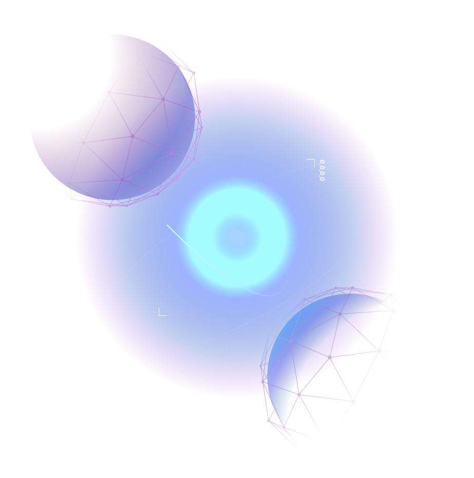

---
parent:
  title: Golang Introduction
  description: Know your way around Golang
  number: 
tag:
order: 0
title: Introduction to Go
---

Know your way around Golang

<h1 class="mt-4 mb-6">Golang Introduction</h1>

Working with Cosmos also often means working with Golang. If you have not worked much with Go, do not worry.

This introduction to Golang is meant as a useful overview of Go and as such, a starting point for your journey in the Cosmos Ecosystem and developing with the Cosmos SDK.

You can also use it as a refresher if you feel a bit rusty when it comes to Go.

## In this chapter

<HighlightBox type="learning">

In this chapter, you will:

* Get a high-level introduction to Golang.
* Discover basic types, string formatting, functions, and methods.
* Begin exploring interfaces in Go.
* Find an introduction to control structures in Go with a closer look at `if`, `switch`, and `for` statements.
* Learn more about arrays and slices, as well as standard packages Go offers.
* Take a look at Go#s built-in concurrency by exploring Goroutine and channels.

</HighlightBox>

<card-module/>

## Next up

Knowing your way around Golang is part of being a Cosmos SDK developer. If you feel like you need an **introduction to Golang or a refresher**, the next sections provide an [introduction to Golang and working with it](./1_install.md).

Feel free to skip this chapter if you do not need a refresher and start your journey with the Week 1 content, which will be available by September 15th at 4 pm UTC when the program officially starts.

## Developer resources

  <Resource
    :title="resource.title"
    :description="resource.description"
    :links="resource.links"
    :image="resource.image"
    :large="true"
  />
   

