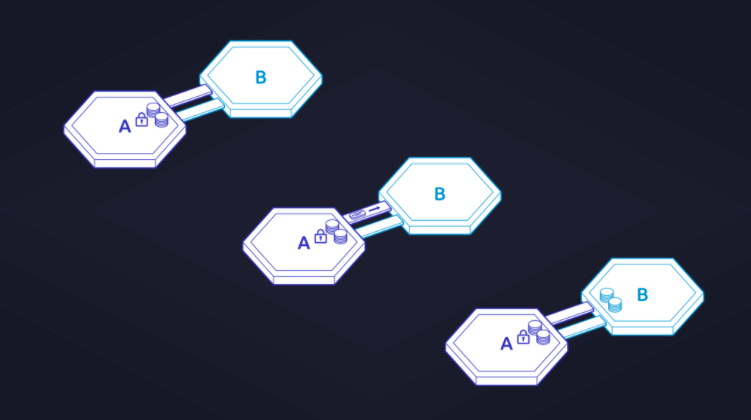

---
parent:
  title: Understanding IBC Denoms with Gaia
order: 0
description: Send tokens with IBC and trace your denom, understand how denoms work.
---

# Understanding IBC Denoms with Gaia

One of the most powerful technologies using the Cosmos SDK is the Interblockchain Communication Protocol (IBC). While with Cosmos every blockchain is intended to be soverign and application specific, with IBC every blockchain can connect to another blockchain using IBC. This will eventually create a system of soverign but connected blockchains.

## Introduction

The current most used feature is sending token from one blockchain to another. When sending a token from one blockchain to another, you will end up with a token `voucher` on the other blockchain.

Imagine two blockchains, blockchain A and blockchain B. In the beginning, you have your token on blockchain A.


*Sending token from blockchain A to blockchain B*

When sending the token with IBC to another blockchain, your token will be locked up on blockchain A and create a `voucher` replacement token on blockchain B. The only way to unlock the locked tokens on blockchain A is to "send back" the `voucher` token on blockchain B. The `voucher` token on blockchain B in result will be burned.

In this tutorial you will learn the format of the `voucher` token on blockchain B. What information they include, how they look like and how to make sense of them.

**You will learn how to:**

- Trace the IBC Denom
- Understand how Denoms work
- Explore the low-level details of what it means to identify a token received using IBC to your account
- Send tokens with IBC
- Find out which chain the token came from
- Contact that "source" chain, and verify that it exists and is still running.

## Requirements

Install the gaia binary:

```bash
git clone https://github.com/cosmos/gaia.git
cd gaia
git checkout v4.2.1
make install

gaiad version
```

The output of `gaiad version` should print

```bash
4.2.1
```

## What is this IBC denom

The `voucher` token that were introduced are called IBC Denominations (IBC denom). They are the result of a token transfer using IBC from one blockchain to another. The format of the token is

`ibc/DENOMHASH`.

Imagine that you've received a new `ibc/` token on blockchain B where you initially held `samoleans` and `stake` token.
Your balance now looks like:

`1000000ibc/27A6394C3F9FF9C9DCF5DFFADF9BB5FE9A37C7E92B006199894CF1824DF9AC7C,100000000000samoleans,99999977256stake`

Just like `samoleans` or `stake`, `ibc/27A639...` is the denomination (denom) of the token received from IBC, the latter part behind the slash `27A639...` is a hash of the denom, IBC port, and channel.

Why is `27A639...` a hash? Paths that track the token on multiple hops from other blockchains to your account would be unbearably long. The Cosmos SDK has a 64-character limit on the denomination of the token.

The tradeoff is that you must query the node to find out what the actual path and denomination is. This node query is called the `denomtrace`.

In Cosmos SDK, the Gaia daemon `gaiad` provides a gRPC interface. The default gRPC port is 9090. In this tutorial, you will learn to query this interface directly.

For now, follow along with the `gaiad` subcommands. Replace the hash with your IBC denom hash.

```bash
gaiad q ibc-transfer denom-trace 27A6394C3F9FF9C9DCF5DFFADF9BB5FE9A37C7E92B006199894CF1824DF9AC7C --node tcp://localhost:26557
```

Response:

```bash
denom_trace:
  base_denom: samoleans
  path: transfer/channel-0
```

From this command, you now know that there is an IBC port `transfer` and channel `channel-0`. But to know the IBC light client behind the port and channel, you need to perform another query.

Why is it called a light client? Because it is a light client of the _other_ chain, keeping track of its blockhashes. The `ibc channel client-state transfer` command  explains the details of the denom path.

```bash
gaiad q ibc channel client-state transfer channel-0 --node tcp://localhost:26557
```

Response

```bash
client_id: 07-tendermint-0
client_state:
  '@type': /ibc.lightclients.tendermint.v1.ClientState
  allow_update_after_expiry: false
  allow_update_after_misbehaviour: false
  chain_id: ibc-0
  frozen_height:
    revision_height: "0"
    revision_number: "0"
  latest_height:
    revision_height: "43"
    revision_number: "0"
  max_clock_drift: 600s
  proof_specs:
  - inner_spec:
      child_order:
      - 0
      - 1
      child_size: 33
      empty_child: null
      hash: SHA256
      max_prefix_length: 12
      min_prefix_length: 4
    leaf_spec:
      hash: SHA256
      length: VAR_PROTO
      prefix: AA==
      prehash_key: NO_HASH
      prehash_value: SHA256
    max_depth: 0
    min_depth: 0
  - inner_spec:
      child_order:
      - 0
      - 1
      child_size: 32
      empty_child: null
      hash: SHA256
      max_prefix_length: 1
      min_prefix_length: 1
    leaf_spec:
      hash: SHA256
      length: VAR_PROTO
      prefix: AA==
      prehash_key: NO_HASH
      prehash_value: SHA256
    max_depth: 0
    min_depth: 0
  trust_level:
    denomination: "3"
    numerator: "1"
  trusting_period: 1209600s
  unbonding_period: 1814400s
  upgrade_path:
  - upgrade
  - upgradedIBCState
```

That's a lot of information, but it doesn't answer the question: how do you know if this IBC client can be relied upon?

### The chain ID and The client ID

Anybody can start a chain with the same chain ID, but the IBC client ID is generated by the [Cosmos SDK IBC Keeper module](https://github.com/cosmos/ibc-go/blob/e012a4af5614f8774bcb595962012455667db2cf/modules/core/02-client/keeper/keeper.go#L56) (ICS-02 does not specify a standard for IBC client IDs). A Chain Name Service and the not-so-decentralized Github chain-registrar repo can verify the combination of the two. Both the Chain Name Service and the chain-registrar repo are under development.

### Ensure the IBC client isn't expired

In the event that Tendermint consensus fails (if >1/3 of validators produce a conflicting block), _and_ proof of this consensus failure is submitted on chain, the IBC client becomes frozen with a `frozen_height` that is nonzero. In future iterations, this consensus failure will become a simple true/false status.

The `latest_height.revision_height` is the block height when the IBC client was last updated. To ensure that the block height is still up to date, you would have to query the blockchain itself for the block height 43, and ensure that the timestamp of that block + the `trusting_period` of 1209600s/336h/14d is beyond the current time.

This information will be different if the blockchain does not use Tendermint consensus.

The good news is there is [an issue for a "Active/Expired/Frozen/" status](https://github.com/cosmos/ibc-go/issues/98) that will automatically check if the IBC client is within the trusting period.
