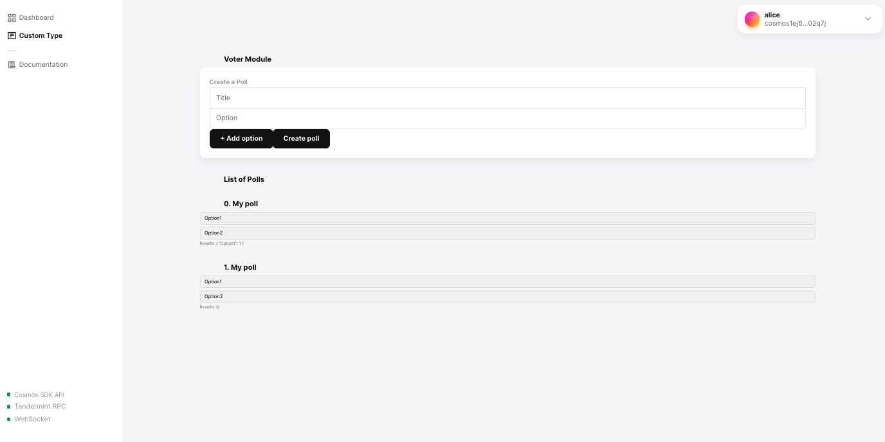
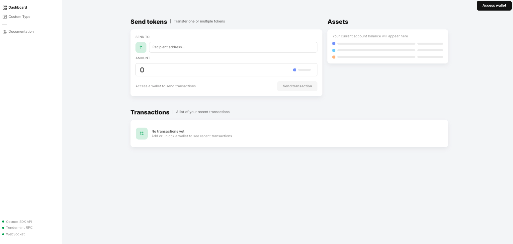

# Polling app

This tutorial creates a blockchain poll application.



This tutorial builds understanding as it walks you through creating a blockchain app, adding and modifying types for a transaction, editing messages, and designing the front-end app.

**You will learn how to**

- Create a simple blockchain poll application
- Design a front-end app that lets an end user sign in, create polls, cast votes, and see voting results
- Add logic to require funds to execute the create poll transaction
- Modify a REST endpoint
- Modify CLI transactions
- Add module components to the front-end app
- Add a bank keeper to the module
- Modify a message

## Requirements

This tutorial requires [Starport](https://docs.starport.network/) v0.17.0.

**Important** The tutorial is based on this specific version of Starport and is not supported for other versions.

The Starport tool is the easiest way to build a blockchain and accelerates chain development.

To install `starport` into `/usr/local/bin`, run the following command:

```bash
curl https://get.starport.network/starport@v0.17.0! | bash
```

When the installation succeeds, you see this message:

```bash
Installed at /usr/local/bin/starport
```

You can use Starport in a [browser-based IDE](http://gitpod.io/#https://github.com/tendermint/starport/tree/v0.17.0), but this tutorial assumes you are using a local Starport installation. See [Install Starport](https://docs.starport.network/guide/install.html).

## Voting App Goals

Create a blockchain poll app with a voting module. The app requires that the app end user can:

- Sign in
- Create polls
- Cast votes
- See voting results

Design the app so that you can:

- Collect transaction fees:

  - The create poll transaction fee is 200 tokens.
  - Voting is free.

- Restrict transactions only to signed in poll app end users.

## Build your Blockchain App

Use Starport to scaffold the blockchain app and the voting module.

**Important** In the code examples throughout this tutorial, when you see `cosmonaut` be sure to substitute it with _cosmonaut_. You need to do this in some of the Vue and REST API examples later. The app end user in this tutorial is alice. {synopsis}

### Build the new blockchain

To scaffold a new blockchain named voter:

```sh
starport scaffold chain github.com/cosmonaut/voter
```

A new directory named `voter` is created in your current directory.

The `voter` directory contains a working blockchain app and all of the code you need to build and launch a blockchain-based app, including these files and directories:

- `app` contains files that connect all of the moving parts of your application
- `cmd` is responsible for the `voterd` daemon that starts and interacts with the app
- `proto` contains the protobuf types
- `vue` contains the web user interface as shown at the top of this tutorial
- `x` contains the Cosmos SDK `voter` module

Cosmos SDK modules are the building blocks of apps. If you are new to Cosmos SDK modules, see [Introduction to SDK Modules](https://docs.cosmos.network/master/building-modules/intro.html).

### Launch the voter app

To launch the app from the `voter` project directory:

```bash
cd voter
starport chain serve
```

The following output is returned, along with any errors that might show up in your application. Two default users and their mnemonic pass phrases are created.

```bash
Cosmos SDK's version is: Stargate v0.40.0 (or later)

🛠️  Building proto...
📦 Installing dependencies...
🛠️  Building the blockchain...
💿 Initializing the app...
🙂 Created account "alice" with address "cosmos1yr3zdtx4n2zgg6068vgrff2lx6vnsntgk0ktpc" with mnemonic: "exercise apology brand accident fruit level magnet public minor candy deliver wet time sudden giggle believe banner pride number tooth space sand kitten pony"
🙂 Created account "bob" with address "cosmos1yp86g946npjhjs0cwaydph4r5ld2re9yjxvcc9" with mnemonic: "purse surprise olive bullet point shoulder matter allow unknown donor general nerve song any erase enhance thrive famous where loan soul hero help verb"
Genesis transaction written to "/Users/tobias/.voter/config/gentx/gentx-4fddef12cde41ecc42411ca52053ed3c3d348bd2.json"
🌍 Tendermint node: http://0.0.0.0:26657
🌍 Blockchain API: http://0.0.0.0:1317
🌍 Token faucet: http://0.0.0.0:4500
```

**Congratulations!** You successfully created and launched a blockchain application.

## Add a Poll Transaction

The voter app doesn't do anything yet, so the next step is to add some types. Adding types generates files that implement create, read, update, and delete (CRUD) functionality for a custom new type.

The voting applications has two types of entities: polls and votes.

### Add the poll type

A poll type has a `title` and a list of `options`.

In a new terminal window, run the following command in the `voter` directory:

```bash
starport scaffold list poll title options
```

After the poll type is successfully created, you see:

```bash
🎉 Created a type `poll`
```

With this command, you generated the code that handles the creation of `poll` items.

### View the Front-end User Interface

To see the front-end app form for creating polls, Starport includes a `vue` front-end.
While running your blockchain, change into the `vue` directory, install the dependencies and start your frontend.

```bash
cd vue
npm install
npm run serve
```

- Visit <http://localhost:8080>

It takes a few minutes to rebuild the app, so give it a couple of seconds. If your `localhost:8080` is already in use, your app can be viewed on the next available port.



### Sign in as Alice

On the front-end app, sign in as end user Alice. The mnemonic passphrases for Alice and Bob were printed in the console after you ran the `starport chain serve` command.

After you are signed in as Alice, you can import an existing wallet that was created with the app. The wallet in the voter app can handle multiple accounts, so give your wallet a descriptive name. Using a descriptive wallet name helps you recognize this wallet in future transactions. For this example, naming this wallet `voter` makes sense.

1. Click **Access Wallet** and then click **Import existing wallet**.
2. Enter the passphrase for Alice that was output to your console when you launched the voter app with the `starport serve` command and click **Next**
3. Name your wallet `voter` and enter a password.
4. Click **Done**.

Now you want to view the custom `poll` type you created earlier.

## View the Poll Type

To view the newly created `poll` transaction type, click the **Custom Type** navigation point on the web browser front-end app.

To see the workflow to create a poll, enter an example value for the title and poll options. A new object is created and displayed next to the new poll form. You have successfully created an object and stored it on the blockchain!

This object, however, does not look and work exactly like a poll. You need to be able to add option fields and store them as an array. You want the option fields to display as interactive buttons.

Take a look at some of the files modified by the `starport scaffold list` command.

## Modify the Protobuffer Types

To have multiple options in the poll, you must change the value `string options` in the Protobuffer definitions.

1. In the `proto/voter` directory, open the `poll.proto` file.
2. To allow passing an array of strings, add the keyword `repeated` before `string options`:

  ```proto
  message Poll {
  string creator = 1;
  uint64 id = 2;
  string title = 3;
  repeated string options = 4;
  }
  ```

In the `proto/voter/tx.proto` file, update the CRUD (Create, Read, Update and Delete) types for the poll transaction.

1. Add the keyword `repeated` before `string options` for the `MsgCreatePoll` message:

```proto
   message MsgCreatePoll {
   string creator = 1;
   string title = 2;
   repeated string options = 3;
   }
```

And the `MsgUpdatePoll` message:

```proto
  message MsgUpdatePoll {
  string creator = 1;
  uint64 id = 2;
  string title = 3;
  repeated string options = 4;
  }
```

## Modify the Poll Transaction Message

Navigate to the `message_poll.go` file at `x/voter/types/messages_poll.go` that defines a message that creates a poll.

1. To store the options as a list instead of a string, replace `options string` with `options []string` in the `NewMsgCreatePoll` function:

```go
// x/voter/types/messages_poll.go
func NewMsgCreatePoll(creator string, title string, options []string) *MsgCreatePoll {
    return &MsgCreatePoll{
        Creator: creator,
        Title:   title,
        Options: options,
    }
}
```

And also in the `NewMsgUpdatePoll` function:

```go
// x/voter/types/messages_poll.go
func NewMsgUpdatePoll(creator string, id uint64, title string, options []string) *MsgUpdatePoll {
    return &MsgUpdatePoll{
        Id:      id,
        Creator: creator,
        Title:   title,
        Options: options,
    }
}
```

## About the Poll Keeper

To write anything to a blockchain or perform any other state transition, a client makes an HTTP POST request. In our case, the voter web app is the client.

The handler creates an unsigned transaction that contains an array of messages. The client then signs the transaction and sends it to <http://localhost:1317/txs>. The application processes the transaction by sending each message to a corresponding handler, in our case `x/voter/handler.go`.

A handler then calls a `CreatePoll` function that is defined in `x/voter/keeper/poll.go` that writes the poll data into the store.

### Modify the CLI Transaction

A poll app end user can also interact with your application by using a command line interface.

The CLI definition is available at `x/voter/client/cli/tx_poll.go`.

For example:

```sh
voterd tx voter create-poll "Text editors" "Emacs" "Vim" --from alice
```

This command generates a transaction with a create poll message, signs the transaction using the private key of app end user `alice`, and broadcasts the transaction to the blockchain. Remember, `alice` is one of two users that this tutorial created by default.

The modification you need to make is to change a line that reads arguments from the console.

In the function `CmdCreatePoll` replace:

```go
Args:  cobra.ExactArgs(2),
```

with

```go
Args:  cobra.MinimumNArgs(2),
```

and replace:

```go
argsOptions, err := cast.ToStringE(args[1])
```

with

```go
argsOptions := args[1:len(args)]
```

You end up with the following function:

```go
func CmdCreatePoll() *cobra.Command {
	cmd := &cobra.Command{
		Use:   "create-poll [title] [options]",
		Short: "Create a new poll",
		Args:  cobra.MinimumNArgs(2),
		RunE: func(cmd *cobra.Command, args []string) error {
			argsTitle, err := cast.ToStringE(args[0])
			if err != nil {
				return err
			}
			argsOptions := args[1:len(args)]

			clientCtx, err := client.GetClientTxContext(cmd)
			if err != nil {
				return err
			}

			msg := types.NewMsgCreatePoll(clientCtx.GetFromAddress().String(), argsTitle, argsOptions)
			if err := msg.ValidateBasic(); err != nil {
				return err
			}
			return tx.GenerateOrBroadcastTxCLI(clientCtx, cmd.Flags(), msg)
		},
	}

	flags.AddTxFlagsToCmd(cmd)

	return cmd
}
```

Now make similar changes for the function `CmdUpdatePoll`:

```go
Args:  cobra.MinimumNArgs(3),
```

and

```go
argsOptions := args[2:len(args)]
```

These changes assume that all arguments after the first one represent a list of options.

You end up with the following function:

```go
func CmdUpdatePoll() *cobra.Command {
	cmd := &cobra.Command{
		Use:   "update-poll [id] [title] [options]",
		Short: "Update a poll",
		Args:  cobra.MinimumNArgs(3),
		RunE: func(cmd *cobra.Command, args []string) error {
			id, err := strconv.ParseUint(args[0], 10, 64)
			if err != nil {
				return err
			}

			argsTitle, err := cast.ToStringE(args[1])
			if err != nil {
				return err
			}

			argsOptions := args[2:len(args)]

			clientCtx, err := client.GetClientTxContext(cmd)
			if err != nil {
				return err
			}

			msg := types.NewMsgUpdatePoll(clientCtx.GetFromAddress().String(), id, argsTitle, argsOptions)
			if err := msg.ValidateBasic(); err != nil {
				return err
			}
			return tx.GenerateOrBroadcastTxCLI(clientCtx, cmd.Flags(), msg)
		},
	}

	flags.AddTxFlagsToCmd(cmd)

	return cmd
}
```

Run and reset the app state of your blockchain with:

```sh
starport chain serve --reset-once
```

## Add the Votes

At this point, you have created a blockchain that lets app end users create polls. Now it's time to enable the app end users to cast votes on an existing poll.

To create the vote type:

```bash
starport scaffold list vote pollID option
```

This command creates a vote type transaction with:

- A poll ID
- An option that is a string representation of the selected answer

Now, restart the application. Remember to use the `--reset-once` flag to recognize the code changes.

```bash
starport serve --reset-once
```

Each time you reset the application state, all of the data from your previously created state is not saved.

Each time the app restarts, the app end users alice and bob receive new passphrases and new tokens. Make sure to update the wallet accounts in the front-end app after you reset the state of the blockchain. {synopsis}

Now that you have made all the required changes to the app, take a look at the client-side application.

## Front-end Application

Starport automatically generated a basic front end for the app. For convenience, [Vue.js](https://vuejs.org) framework is used with [Vuex](https://vuex.vuejs.org/) for state management. Because all features of the app are exposed through an HTTP API, you can build clients using any language or framework.

For the front-end app, you can focus on the content of these directories:

- `vue/src/views`
- `vue/src/components`

  These directories contain the code for the page templates of your app.

- `vue/src/store/`

  Handles sending transactions and receiving data from your blockchain and the [`@tendermint/vue`](https://github.com/tendermint/vue/)directory that contains UI components, like buttons and forms. This directory contains the generated protobuffer file definitions that were defined in the `vue/src/store/generated/cosmonaut/voter/cosmonaut.voter.voter` directory.

- `vue/src/store/generated/cosmonaut/voter/cosmonaut.voter.voter/index.js` has the generated transactions `MsgCreatePoll`, `MsgUpdatePoll`, `MsgDeletePoll` that use the [CosmJS](https://github.com/cosmwasm/cosmjs) library for handling wallets, creating, signing and broadcasting transactions and defines a Vuex store.

## Add the Voter Module Component to the Front End

1. Navigate to the `views` directory in `vue/src/views`.

2. Since you don't need the default form component, replace these two lines in `vue/src/views/Types.vue`:

    ```javascript
    <SpType modulePath="cosmonaut.voter.voter" moduleType="Vote"  />
    <SpType modulePath="cosmonaut.voter.voter" moduleType="Poll"  />
    ```

    with two new components and the `Voter Module` title:

    ```javascript
    <h3>
      Voter Module
    </h3>
		<PollForm />
		<PollList />
    ```

3. To import the component, add the import statements in the `<script>` tag after the template code. The `<script>` tag contains JavaScript code.

    ```javascript
    <script>
    import PollForm from "../components/PollForm";
    import PollList from "../components/PollList";

    export default {
      name: 'Types',
      components: { PollForm, PollList },
    }
    </script>
    ```

Now you can start creating the PollForm and PollList components.

### Create the PollForm Component

**Note:** Some of the following steps depend on one another. If you look at your front-end app before you have updated all of the components that depend on one another, the front-end app might not load. Don't worry if the front-end app doesn't load at this point, this expected behavior happens because you have not yet completed code updates for all of the dependencies. Just complete the steps. Everything should work fine after the tutorial is completed and the pieces are wired up correctly. {synopsis}

1. For the PollForm, create a new file `PollForm.vue` in the `vue/src/components` directory.
2. Add this code to give the PollForm component a title and two buttons:

    ```vue
    <template>
      <div>
        <div class="sp-voter__main sp-box sp-shadow sp-form-group">
            <form class="sp-voter__main__form">
              <div class="sp-voter__main__rcpt__header sp-box-header">
                Create a Poll
              </div>

              <input class="sp-input" placeholder="Title" v-model="title" />
              <div v-for="(option, index) in options" v-bind:key="'option' + index">
                <input class="sp-input" placeholder="Option" v-model="option.title" />
              </div>
              <sp-button @click="add">+ Add option</sp-button>
              <sp-button @click="submit">Create poll</sp-button>
            </form>
        </div>
      </div>
    </template>
    <script>
    export default {
      name: "PollForm",
      data() {
        return {
          title: "",
          options: [{
            title: "",
          }],
        };
      },
      computed: {

        currentAccount() {
          if (this._depsLoaded) {
            if (this.loggedIn) {
              return this.$store.getters['common/wallet/address']
            } else {
              return null
            }
          } else {
            return null
          }
        },
        loggedIn() {
          if (this._depsLoaded) {
            return this.$store.getters['common/wallet/loggedIn']
          } else {
            return false
          }
        }
      },
      methods: {
        add() {
          this.options = [...this.options, { title: "" }];
        },
        async submit() {
          const value = {
            creator: this.currentAccount,
            title: this.title,
            options: this.options.map((o) => o.title),
          };
          await this.$store.dispatch("cosmonaut.voter.voter/sendMsgCreatePoll", {
            value,
            fee: [],
          });
        },
      },
    };
    </script>
    ```

3. Refresh the page.

4. Sign in as an app end user with a password.

5. Create a new poll. It takes a few seconds to process the transaction.

6. Now, visit <http://localhost:1317/voter/poll>. This endpoint is defined in `x/voter/client/rest/queryPoll.go`:

    ```json
    {
      "height": "0",
      "result": [
        {
          "creator": "cosmos19qqa7j73735w4pcx9mkkaxr00af7p432n62tv6",
          "id": "826477ab-0005-4e68-8031-19758d331681",
          "title": "A poll title",
          "options": ["First option", "The second option"]
        }
      ]
    }
    ```

### Create the Poll List Component

1. Create a new `PollList.vue` file for the component in `vue/src/components/`.

    ```javascript
    <template>
      <div>
        <h2> List of Polls </h2>
        <div v-for="poll in polls" v-bind:key="'poll' + poll.id">
          <b> {{poll.id}}. {{ poll.title }} </b>
          <AppRadioItem
            @click="submit(poll.id, option)"
            v-for="option in poll.options"
            v-bind:key="option"
            :value="option"
          />
          <AppText type="subtitle">Results: {{ results(poll.id) }}</AppText>
        </div>
      </div>
    </template>
    <style>
    .option-radio > .button {
      height: 40px;
      width: 50%;
    }
    </style>
    <script>
    import AppRadioItem from "./AppRadioItem";
    import AppText from "./AppText";
    import { countBy } from "lodash";

    export default {
      components: { AppText, AppRadioItem },
      data() {
        return {
          selected: "",
        };
      },
      computed: {

        currentAccount() {
          if (this._depsLoaded) {
            if (this.loggedIn) {
              return this.$store.getters['common/wallet/address']
            } else {
              return null
            }
          } else {
            return null
          }
        },
        loggedIn() {
          if (this._depsLoaded) {
            return this.$store.getters['common/wallet/loggedIn']
          } else {
            return false
          }
        },
        polls() {
          return (
            this.$store.getters["cosmonaut.voter.voter/getPollAll"]({
              params: {}
            })?.Poll ?? []
          );
        },
        votes() {
          return (
            this.$store.getters["cosmonaut.voter.voter/getVoteAll"]({
              params: {}
            })?.Vote ?? []
          );
        },
      },
      methods: {
        results(id) {
          const results = this.votes.filter((v) => v.pollID === id);
          return countBy(results, "option");
        },
        async submit(pollID, option) {
          
          const value = { creator: this.currentAccount, pollID, option };
          await this.$store.dispatch("cosmonaut.voter.voter/sendMsgCreateVote", {
            value,
            fee: [],
          });
          await this.$store.dispatch("cosmonaut.voter.voter/QueryPollAll", {
            options: { subscribe: true, all: true },
            params: {},
          });
        },
      },
    };
    </script>
    ```

The `PollList` component you just created lists every poll, including the options for that poll as buttons. Selecting an option triggers a `submit` method that broadcasts a transaction with a create vote message and fetches data back from your application.

Two components are still missing from your app to make look more like a voting poll. Now you can add the `AppRadioItem.vue` and `AppText.vue` UI options.

### Add the Options Component

In `vue/src/components/AppRadioItem.vue`, add:

```javascript
<template>
  <div>
    <button class="button">{{ value }}</button>
  </div>
</template>

<style scoped>
.button {
  box-shadow: inset 0 0 0 1px rgba(0, 0, 0, 0.1);
  padding: 0.75rem 1rem;
  margin-bottom: 0.5rem;
  border-radius: 6px;
  user-select: none;
  cursor: pointer;
  transition: all 0.1s;
  font-weight: 500;
  outline: none;
  border: none;
  background: rgba(0, 0, 0, 0.01);
  width: 100%;
  font-family: inherit;
  text-align: left;
  font-size: 1rem;
  font-weight: inherit;
}
.button:hover {
  box-shadow: inset 0 0 0 1px rgba(0, 0, 0, 0.1),
    0 1px 5px -1px rgba(0, 0, 0, 0.1);
}
.button:focus {
  box-shadow: inset 0 0 0 1px rgba(0, 0, 0, 0.2),
    0 1px 5px -1px rgba(0, 0, 0, 0.1);
}
.button:active {
  box-shadow: inset 0 0 0 1px rgba(0, 0, 0, 0.07);
  color: rgba(0, 0, 0, 0.7);
  transform: scale(0.998);
}
</style>
<script>
export default {
  props: {
    value: "",
  },
};
</script>
```

### Add the Poll List Text Component

Now you can add the text for the poll list in `vue/src/components/AppText.vue`:

```javascript
<template>
  <div>
    <div :class="[`${type}`]">
      <slot />
    </div>
  </div>
</template>

<style scoped>
.h1 {
  font-size: 2rem;
  font-weight: 800;
  letter-spacing: 0.03em;
  margin-bottom: 2rem;
}
.h2 {
  font-weight: 800;
  text-transform: uppercase;
  letter-spacing: 0.05em;
  margin-bottom: 0.5rem;
  margin-top: 2rem;
}
.subtitle {
  color: rgba(0, 0, 0, 0.5);
  font-size: 0.85rem;
}
</style>
<script>
export default {
  props: {
    type: {
      default: "p1",
    },
  },
};
</script>
```

### Update the Front-end App

Now, update the JavaScript in `vue/src/App.vue` to fetch the votes.

The `App.vue` file handles the transactions of the components. Modify the code in the `<script>` tag to look like:

```javascript
<script>
import './scss/app.scss'
import '@starport/vue/lib/starport-vue.css'
import Sidebar from './components/Sidebar'

export default {
    components: {
        Sidebar
    },
    data() {
        return {
            initialized: false
        }
    },
    computed: {
        hasWallet() {
            return this.$store.hasModule([ 'common', 'wallet'])
        }
    },
    async created() {
        await this.$store.dispatch('common/env/init')
        this.initialized = true
        await this.$store.dispatch("cosmonaut.voter.voter/QueryPollAll",{options:{subscribe:true, all:true},params:{}})
        await this.$store.dispatch("cosmonaut.voter.voter/QueryVoteAll",{options:{subscribe:true, all:true},params:{}})
    },
    errorCaptured(err) {
        console.log(err)
        return false
    }
}
</script>
```

By now you should be able to see the same front-end app UI that you saw in the first screenshot. Try creating polls and casting votes. You might notice that it's possible to cast multiple votes for one poll. This activity is not what you want, so you can fix that behavior.

## Access the API

To fix this issue, you first have to understand how data is stored in your application.

Think of the data storage as a lexicographically ordered key-value store. You can loop through the entries, filter by key prefix, add, update, and delete entries. It is easier to visualize the store as JSON.

When you create a poll and cast a vote, this is the resulting JSON:

```json
{
  "Poll": [
    {
      "creator": "cosmos1vedd97ku2n8qtsccrfna5gg0repdnk0a9cl7ze",
      "id": "0",
      "title": "Soft drinks",
      "options": ["Coca-Cola", "Pepsi"]
    }
  ],
  "pagination": {
    "next_key": null,
    "total": "1"
  }
}
```

See the API and JSON output of your created poll endpoint at <http://localhost:1317/cosmonaut/voter/voter/poll>.

To see the votes, go to the API endpoint at <http://localhost:1317/cosmonaut/voter/voter/vote>.

```json

{
  "Vote": [
    {
      "creator": "cosmos1vedd97ku2n8qtsccrfna5gg0repdnk0a9cl7ze",
      "id": "0",
      "pollID": "0",
      "option": "Pepsi"
    }
  ],
  "pagination": {
    "next_key": null,
    "total": "2"
  }
}
```

The endpoint paths are defined by the cosmonaut that you used when bootstrapping the application with Starport, together with the module name. So, if your GitHub user name is `cosmonaut`, then you can find:

- The poll endpoint at `http://localhost:1317/cosmonaut/voter/voter/poll`
- The API endpoint at `http://localhost:1317/cosmonaut/voter/voter/vote`

Looking into this data, you can see that the combination of `creator` and `pollID` is what you are looking for.

## Limit to One Vote per User

Each account should be allowed to have only 1 vote per pollID.

The logic for access to a certain transaction is in the `keeper` directory. For the votes transaction logic, open the `msg_server_vote.go` file at `x/voter/keeper/msg_server_vote.go`, and modify the `CreateVote` function to check if the account has already voted and to return an error when a subsequent vote is cast.

```go
func (k msgServer) CreateVote(goCtx context.Context, msg *types.MsgCreateVote) (*types.MsgCreateVoteResponse, error) {
	ctx := sdk.UnwrapSDKContext(goCtx)

	var vote = types.Vote{
		Creator: msg.Creator,
		PollID:  msg.PollID,
		Option:  msg.Option,
	}

	// Get all existing votes
	voteList := k.GetAllVote(ctx)
	for _, existingVote := range voteList {
		// Check if the account has already voted on this PollID
		if existingVote.Creator == msg.Creator && existingVote.PollID == msg.PollID {
			// Return an error when a vote has been cast by this account on this PollID
			return nil, sdkerrors.Wrap(sdkerrors.ErrUnauthorized, "Vote already casted.")
		}
	}

	id := k.AppendVote(
		ctx,
		vote,
	)

	return &types.MsgCreateVoteResponse{
		Id: id,
	}, nil
}
```

After you restart the app, a front-end app user can cast only 1 vote per poll.

## Introducing a Fee for Creating Polls

Add the logic for the transaction so that creating a poll costs 200 tokens.

You already require users to have accounts registered. Each app end user has tokens on balance. The only thing you need to do is to send coins from the app end user's account to a module account before you create a poll.

## Add the Bank Keeper to the Voter Module

First, load the `expected_keepers` in the `x/voter/types/expected_keepers.go` file to define all of the bank functions you want to make available in your module.

```go
package types

import sdk "github.com/cosmos/cosmos-sdk/types"

// BankKeeper defines the expected bank keeper
type BankKeeper interface {
    SendCoins(ctx sdk.Context, fromAddr sdk.AccAddress, toAddr sdk.AccAddress, amt sdk.Coins) error
    MintCoins(ctx sdk.Context, moduleName string, amt sdk.Coins) error
    BurnCoins(ctx sdk.Context, moduleName string, amt sdk.Coins) error
    SendCoinsFromModuleToAccount(ctx sdk.Context, senderModule string, recipientAddr sdk.AccAddress, amt sdk.Coins) error
    SendCoinsFromAccountToModule(ctx sdk.Context, senderAddr sdk.AccAddress, recipientModule string, amt sdk.Coins) error
}
```

Second, add the `bankKeeper` keeper to the `x/voter/keeper/keeper.go` file. Add it to the `type` and the `NewKeeper` function as follows:

```go
type (
    Keeper struct {
        cdc        codec.Marshaler
        storeKey   sdk.StoreKey
        memKey     sdk.StoreKey
        bankKeeper types.BankKeeper
    }
)

func NewKeeper(cdc codec.Marshaler, storeKey, memKey sdk.StoreKey, bankKeeper types.BankKeeper) *Keeper {
    return &Keeper{
        cdc:        cdc,
        storeKey:   storeKey,
        memKey:     memKey,
        bankKeeper: bankKeeper,
    }
}
```

Finally, add the bank module in the New function to the `voterKeeper` in the `app.go` file in `app/app.go`.

In the keeper loading section, replace:

```go
app.VoterKeeper = *votermodulekeeper.NewKeeper(
  appCodec,
  keys[votermoduletypes.StoreKey],
  keys[votermoduletypes.MemStoreKey],
)
```

with

```go
app.VoterKeeper = *votermodulekeeper.NewKeeper(
  appCodec,
  keys[votermoduletypes.StoreKey],
  keys[votermoduletypes.MemStoreKey],
  app.BankKeeper,
)
```

Now, you are ready to use all of the bank functions that you added to the expected keepers file. The next step is to define the transaction to require the funds to execute the create poll transaction.

## Modify the Create Poll Message with the Price

Modify the msg at `x/voter/keeper/msg_server_poll.go`:

```go
package keeper

import (
    "context"
    "fmt"

    sdk "github.com/cosmos/cosmos-sdk/types"
    sdkerrors "github.com/cosmos/cosmos-sdk/types/errors"
    "github.com/tendermint/tendermint/crypto"
    "github.com/cosmonaut/voter/x/voter/types"
)

func (k msgServer) CreatePoll(goCtx context.Context, msg *types.MsgCreatePoll) (*types.MsgCreatePollResponse, error) {
    ctx := sdk.UnwrapSDKContext(goCtx)

    moduleAcct := sdk.AccAddress(crypto.AddressHash([]byte(types.ModuleName)))
    feeCoins, err := sdk.ParseCoinsNormalized("200token")
    if err != nil {
        return nil, err
    }

    creatorAddress, err := sdk.AccAddressFromBech32(msg.Creator)
    if err != nil {
        return nil, err
    }
    if err := k.bankKeeper.SendCoins(ctx, creatorAddress, moduleAcct, feeCoins); err != nil {
        return nil, err
    }

    var poll = types.Poll{
    Creator: msg.Creator,
    Title:   msg.Title,
    Options: msg.Options,
  }

  id := k.AppendPoll(
    ctx,
    poll,
  )

  return &types.MsgCreatePollResponse{
    Id: id,
  }, nil
}
```

The fee payment occurs before `k.AppendPoll` so if an end user does not have enough tokens, the application raises an error and does not proceed with creating a poll.

The import statement requires `"github.com/tendermint/tendermint/crypto"`. Be sure to add this repo to the import statement if your text editor didn't do that for you.

Now, restart the app and try creating several polls to see how the transaction affects your token balance.

Congratulations, you have built a blockchain voting application.
