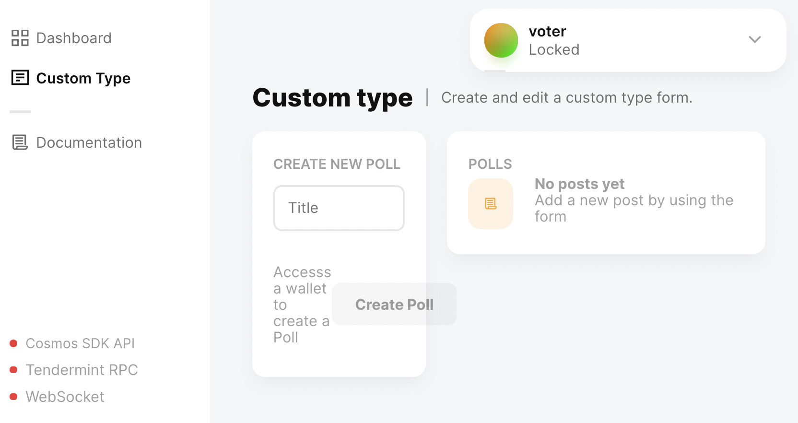

# Troubleshooting the Polling App

The polling app tutorial involves many steps. Use these troubleshooting tips to identify and correct issues.

## Your Blockchain App is Locked

**Problem** The voter front-end app in Vue is locked. 

**Cause** The front-end app automatically locks when the app is reset. The app is reset when you make changes to the code, for example, adding a type.

**Solution**

There are two parts to unlocking the voter app.

1. Click the **Locked** element on the front-end app to expose the lock icon, and then click the lock icon. Enter the password you created when you named your wallet `voter` in the [Sign in as Alice](./voter/#sign-in-as-alice) step.
2. Make sure that your blockchain app is running in the terminal window where you launched the voter app with the `starport chain serve` command. If the app is not running, launch it again. Run the `starport chain serve` command in the `voter` directory.

### Building proto... cannot build app errors

**Symptom** You might have introduced syntax errors or typos when you made the required updates to the code files.

Verify the syntax of the changes you made in the *.go files. You might see an error like this:

```
Waiting for a fix before retrying... 🛠️ Building proto... cannot build app:
```

**Solution**

1. Resolve any code errors.
2. Save the files.
3. Restart the app with the `starport chain serve` command.

### Front-end App Doesn't Load

Steps in the tutorial depend on one another. If your front-end app won't load before you have created all of the components that depend on one another, don't worry.

**Solution**

Complete all of the steps in order. After you have updated all of the code dependencies in all of the files, refresh your web browser to reload the front-end app.

### Cannot Create Poll or Cast Votes

If you can't create polls and votes, check the JavaScript console in your browser to see what errors are shown. If you see a problem with API routes, it is probably because you need to replace `username` from the code snippets in the tutorial with your GitHub username.

**Solution**

Verify the code snippets include your GitHub username:

- `"username.voter.voter/QueryPollAll"` becomes
- `"yoda.voter.voter/QueryPollAll"` if your GitHub username is `yoda`

### App Won't Compile

This tutorial requires Starport v0.15.1\. The tutorial is based on this specific version of Starport. Versions of Starport other than v0.15.1 are not supported.

**Solution**

Install the required version v0.15.1 on your local computer:

```sh
curl https://get.starport.network/starport@v0.15.1! | bash
```
